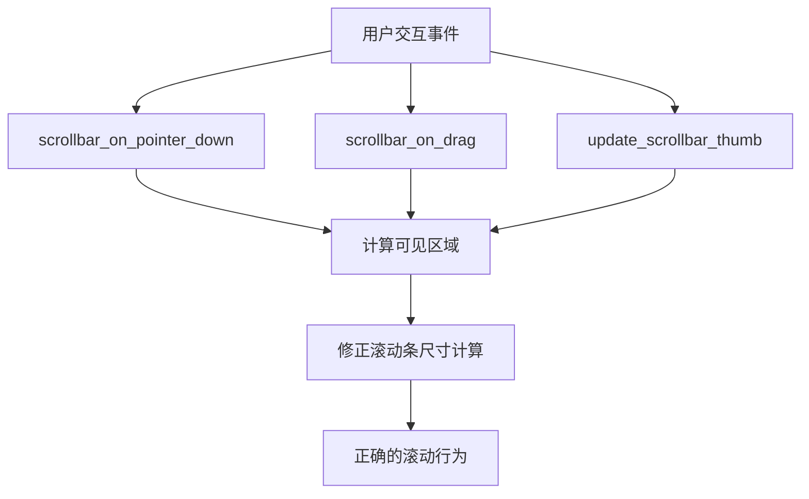

+++
title = "#21835 Fix bevy_ui_widgets scrollbar bug where scrollbar_size wasn't taken into account"
date = "2025-11-17T00:00:00"
draft = false
template = "pull_request_page.html"
in_search_index = false

[extra]
current_language = "zh-cn"
available_languages = {"en" = { name = "English", url = "/pull_request/bevy/2025-11/pr-21835-en-20251117" }, "zh-cn" = { name = "中文", url = "/pull_request/bevy/2025-11/pr-21835-zh-cn-20251117" }}
labels = ["C-Bug", "A-UI", "D-Straightforward"]
+++

# Title

## Basic Information
- **Title**: Fix bevy_ui_widgets scrollbar bug where scrollbar_size wasn't taken into account
- **PR Link**: https://github.com/bevyengine/bevy/pull/21835
- **Author**: PPakalns
- **Status**: MERGED
- **Labels**: C-Bug, A-UI, S-Ready-For-Final-Review, D-Straightforward
- **Created**: 2025-11-14T10:35:35Z
- **Merged**: 2025-11-17T00:12:36Z
- **Merged By**: alice-i-cecile

## Description Translation
# 目标

Bevy UI 小部件滚动条实现没有正确处理 taffy 插入的滚动条宽度。

## 解决方案

正确处理滚动条宽度，类似于在 bevy 引擎滚动位置计算中的做法：

https://github.com/bevyengine/bevy/blob/0d46518eb21df54ba951f503930501bc2639e2a2/crates/bevy_ui/src/layout/mod.rs#L334-L336

## 测试

- 在个人项目中添加了带有滚动条的滚动区域，这些滚动条会自动附加到 overflow: scroll 元素并利用 taffy scrollbar-width 提供的空间。

## The Story of This Pull Request

这个 PR 解决了一个在 bevy_ui_widgets 模块中的滚动条计算错误。问题出现在滚动条实现没有正确考虑 taffy 布局系统为滚动条预留的空间。

问题的核心在于，当 taffy 为滚动条分配了特定宽度时，滚动条相关的计算（包括点击轨道滚动和拖拽滚动条滑块）没有从可见区域尺寸中减去这个预留空间。这导致了滚动位置计算不准确，用户与滚动条的交互行为会出现偏差。

开发者 PPakalns 发现这个问题后，采用了与 bevy 引擎核心代码中相同的处理方式。在 `crates/bevy_ui/src/layout/mod.rs` 的第 334-336 行，bevy 已经在滚动位置计算中正确处理了滚动条尺寸，但这个小部件模块中的实现没有同步更新。

修复方案相当直接：在三个关键函数中，将原来的 `scroll_content.size()` 计算改为 `(scroll_content.size() - scroll_content.scrollbar_size)`。这个修改确保了在计算可见区域大小时，会减去为滚动条预留的空间，从而得到正确的可用内容区域尺寸。

从技术角度看，这个修复涉及三个不同的用户交互场景：

1. **点击滚动条轨道** (`scrollbar_on_pointer_down`) - 当用户点击滚动条轨道时，需要计算正确的滚动位置
2. **拖拽滚动条滑块** (`scrollbar_on_drag`) - 当用户拖拽滑块时，需要基于正确的可见区域计算滚动距离
3. **更新滑块尺寸和位置** (`update_scrollbar_thumb`) - 需要正确计算滑块相对于内容的比例

这个修复虽然代码改动量很小（只有 8 行新增，3 行删除），但解决了滚动条交互中的核心计算问题。它确保了滚动条小部件与布局系统的一致性，使得自动附加到 overflow: scroll 元素的滚动条能够正确利用 taffy 分配的滚动条宽度空间。

## Visual Representation



## Key Files Changed

### `crates/bevy_ui_widgets/src/scrollbar.rs` (+8/-3)

这个文件包含了滚动条小部件的核心实现。修改主要涉及三个函数的可见区域计算逻辑：

**修改前：**
```rust
// 在 scrollbar_on_pointer_down 函数中
let visible_size = scroll_content.size() * scroll_content.inverse_scale_factor;

// 在 scrollbar_on_drag 函数中  
let visible_size = scroll_content.size() * scroll_content.inverse_scale_factor;

// 在 update_scrollbar_thumb 函数中
let visible_size = scroll_area.1.size() * scroll_area.1.inverse_scale_factor;
```

**修改后：**
```rust
// 在 scrollbar_on_pointer_down 函数中
let visible_size = (scroll_content.size() - scroll_content.scrollbar_size)
    * scroll_content.inverse_scale_factor;

// 在 scrollbar_on_drag 函数中
let visible_size = (scroll_content.size() - scroll_content.scrollbar_size)
    * scroll_content.inverse_scale_factor;

// 在 update_scrollbar_thumb 函数中  
let visible_size = (scroll_area.1.size() - scroll_area.1.scrollbar_size)
    * scroll_area.1.inverse_scale_factor;
```

这些修改确保了在计算可见区域尺寸时，会减去为滚动条预留的空间 (`scrollbar_size`)，从而得到正确的可用内容区域尺寸。这与 bevy 引擎核心中的滚动位置计算保持了一致。

## Further Reading

- [Bevy UI 系统文档](https://docs.rs/bevy_ui/latest/bevy_ui/)
- [Taffy 布局算法](https://github.com/DioxusLabs/taffy)
- [滚动条交互设计模式](https://www.w3.org/WAI/ARIA/apg/patterns/scrollbar/)