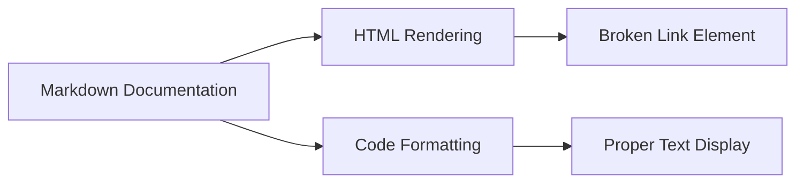

+++
title = "#21842 3d Shapes Example Doc Fix"
date = "2025-11-17T00:00:00"
draft = false
template = "pull_request_page.html"
in_search_index = true

[taxonomies]
list_display = ["show"]

[extra]
current_language = "en"
available_languages = {"en" = { name = "English", url = "/pull_request/bevy/2025-11/pr-21842-en-20251117" }, "zh-cn" = { name = "中文", url = "/pull_request/bevy/2025-11/pr-21842-zh-cn-20251117" }}
labels = ["D-Trivial", "C-Examples"]
+++

# 3d Shapes Example Doc Fix

## Basic Information
- **Title**: 3d Shapes Example Doc Fix
- **PR Link**: https://github.com/bevyengine/bevy/pull/21842
- **Author**: Rodhlann
- **Status**: MERGED
- **Labels**: D-Trivial, C-Examples, S-Ready-For-Final-Review
- **Created**: 2025-11-14T17:31:47Z
- **Merged**: 2025-11-16T23:48:57Z
- **Merged By**: alice-i-cecile

## Description Translation
# Objective

Resolve formatting issue in [3D Shapes Example](https://bevy.org/examples/3d-rendering/3d-shapes/) page on the Bevy Website, where an unwrapped `Assets<A>` is breaking the HTML rendering on the page. This fix follows the standard set forth by other `Assets<A>` instances on the page. 

Fixes bevy-website issue: https://github.com/bevyengine/bevy-website/issues/2302

## Solution

Wrap `Assets<A>` as a code snippet to resolve HTML rendering issues. Wrapping the code properly encodes the characters so they are not interpreted as an HTML `<a>` tag. 

## Testing

~~I am still working on setting up the bevy-website locally to render the Bevy examples, so I have been unable to test this directly, but I have set up a Zola demo project in my local environment where I was able to reproduce and fix the behavior using the same strategy.~~

I have been able to render the examples locally with the fix, see examples below

---

## Showcase

### Issue In Live Site


### Issue Resolve In Local Site


### Issue Reproduced In Local Zola Project


### Issue Resolved In Local Zola Project


## The Story of This Pull Request

This PR addresses a documentation rendering issue that was affecting the Bevy website's 3D Shapes example page. The problem was straightforward but had significant visual impact: an unwrapped `Assets<A>` reference in the documentation was being interpreted by the browser as an HTML anchor tag `<a>`, causing the page to render incorrectly.

The issue originated from how Markdown processors handle angle brackets in text. When the documentation contained `Assets<A>` without proper code formatting, the `<A>` portion was parsed as an HTML tag, creating a broken link element that disrupted the page layout. This was particularly problematic because it affected the visual presentation of an important educational resource - the 3D Shapes example documentation.

The author, Rodhlann, identified the root cause and implemented a simple but effective solution: wrapping the problematic text in backticks to format it as inline code. This approach follows the established pattern used elsewhere in the same documentation file, where other instances of `Assets<A>` were already properly formatted.

The implementation required only a single character change - adding a backtick - but the author took a thorough approach to validation. Initially unable to test directly on the bevy-website, Rodhlann created a local Zola project to reproduce the issue and verify the fix. This demonstrated good engineering practice by creating a controlled environment for testing before deploying the solution.

The fix works because Markdown processors treat code-formatted text differently from regular text. When wrapped in backticks, the angle brackets in `Assets<A>` are HTML-encoded during processing, preventing them from being interpreted as HTML tags. This ensures the text displays correctly as `Assets<A>` rather than creating a broken HTML element.

While this change appears minor, it highlights an important aspect of documentation maintenance: consistency in formatting conventions. The fix brings this instance in line with the existing standard used throughout the documentation, maintaining visual consistency and preventing rendering artifacts that could confuse users trying to learn from the examples.

## Visual Representation



## Key Files Changed

### `examples/3d/3d_shapes.rs` (+1/-1)

This file contains the documentation for the 3D Shapes example. The change fixes a Markdown formatting issue where `Assets<A>` was not properly wrapped as code, causing HTML rendering problems.

**Before:**
```rust
//! While a shape is not a mesh, turning it into one in Bevy is easy. In this example we call [`meshes.add(/* Shape here! */)`][Assets<A>::add] on the shape, which works because the [`Assets<A>::add`] method takes anything that can be turned into the asset type it stores. There's an implementation for [`From`] on shape primitives into [`Mesh`], so that will get called internally by [`Assets<A>::add`].
```

**After:**
```rust
//! While a shape is not a mesh, turning it into one in Bevy is easy. In this example we call [`meshes.add(/* Shape here! */)`][`Assets<A>::add`] on the shape, which works because the [`Assets<A>::add`] method takes anything that can be turned into the asset type it stores. There's an implementation for [`From`] on shape primitives into [`Mesh`], so that will get called internally by [`Assets<A>::add`].
```

The key change is wrapping `Assets<A>::add` in backticks within the link reference `[`Assets<A>::add`]`, which prevents the angle brackets from being interpreted as HTML tags during Markdown processing.

## Further Reading

- [CommonMark Spec - Code Spans](https://spec.commonmark.org/0.30/#code-spans)
- [Rustdoc Book - Linking to items by name](https://doc.rust-lang.org/rustdoc/linking-to-items-by-name.html)
- [Zola Documentation - Content](https://www.getzola.org/documentation/content/)
- [Bevy Examples Documentation](https://github.com/bevyengine/bevy/tree/main/examples#examples)

# Full Code Diff
```diff
diff --git a/examples/3d/3d_shapes.rs b/examples/3d/3d_shapes.rs
index e16ac45be5706..a256ae1ce8b32 100644
--- a/examples/3d/3d_shapes.rs
+++ b/examples/3d/3d_shapes.rs
@@ -2,7 +2,7 @@
 //!
 //! "Shape primitives" here are just the mathematical definition of certain shapes, they're not meshes on their own! A sphere with radius `1.0` can be defined with [`Sphere::new(1.0)`][Sphere::new] but all this does is store the radius. So we need to turn these descriptions of shapes into meshes.
 //!
-//! While a shape is not a mesh, turning it into one in Bevy is easy. In this example we call [`meshes.add(/* Shape here! */)`][Assets<A>::add] on the shape, which works because the [`Assets<A>::add`] method takes anything that can be turned into the asset type it stores. There's an implementation for [`From`] on shape primitives into [`Mesh`], so that will get called internally by [`Assets<A>::add`].
+//! While a shape is not a mesh, turning it into one in Bevy is easy. In this example we call [`meshes.add(/* Shape here! */)`][`Assets<A>::add`] on the shape, which works because the [`Assets<A>::add`] method takes anything that can be turned into the asset type it stores. There's an implementation for [`From`] on shape primitives into [`Mesh`], so that will get called internally by [`Assets<A>::add`].
 //!
 //! [`Extrusion`] lets us turn 2D shape primitives into versions of those shapes that have volume by extruding them. A 1x1 square that gets wrapped in this with an extrusion depth of 2 will give us a rectangular prism of size 1x1x2, but here we're just extruding these 2d shapes by depth 1.
 //!
```