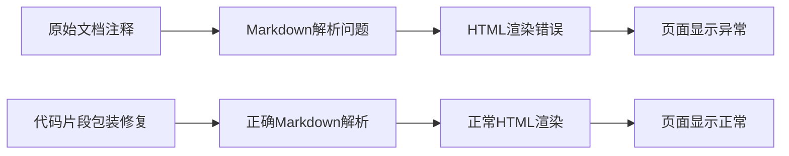

+++
title = "#21842 3d Shapes Example Doc Fix"
date = "2025-11-17T00:00:00"
draft = false
template = "pull_request_page.html"
in_search_index = false

[extra]
current_language = "zh-cn"
available_languages = {"en" = { name = "English", url = "/pull_request/bevy/2025-11/pr-21842-en-20251117" }, "zh-cn" = { name = "中文", url = "/pull_request/bevy/2025-11/pr-21842-zh-cn-20251117" }}
+++

# 3d Shapes Example Doc Fix

## 基本信息
- **标题**: 3d Shapes Example Doc Fix
- **PR 链接**: https://github.com/bevyengine/bevy/pull/21842
- **作者**: Rodhlann
- **状态**: 已合并
- **标签**: D-Trivial, C-Examples, S-Ready-For-Final-Review
- **创建时间**: 2025-11-14T17:31:47Z
- **合并时间**: 2025-11-16T23:48:57Z
- **合并者**: alice-i-cecile

## 描述翻译

# 目标

修复 [3D Shapes Example](https://bevy.org/examples/3d-rendering/3d-shapes/) 页面在 Bevy 网站上的格式化问题，其中一个未包装的 `Assets<A>` 破坏了页面的 HTML 渲染。此修复遵循页面上其他 `Assets<A>` 实例设定的标准。

修复 bevy-website 问题: https://github.com/bevyengine/bevy-website/issues/2302

## 解决方案

将 `Assets<A>` 包装为代码片段以解决 HTML 渲染问题。正确包装代码可以对字符进行编码，使其不会被解释为 HTML `<a>` 标签。

## 测试

~~我仍在设置本地 bevy-website 以渲染 Bevy 示例，因此无法直接测试此修复，但我在本地环境中设置了一个 Zola 演示项目，在那里我能够使用相同的策略重现并修复该行为。~~

我已在本地使用此修复成功渲染了示例，参见下面的示例。

---

## 展示

### 现场站点的问题


### 本地站点的问题已解决


### 在本地 Zola 项目中重现的问题


### 在本地 Zola 项目中解决的问题


## 这个 Pull Request 的故事

这个 PR 源于一个文档渲染问题。Bevy 网站的 3D Shapes 示例页面出现了 HTML 渲染错误，导致部分内容无法正常显示。问题的根源在于文档注释中的 `Assets<A>` 没有被正确包装为代码片段。

在 Markdown 渲染过程中，`Assets<A>` 中的 `<A>` 被错误地解析为 HTML 标签的开始，而不是作为代码显示。这破坏了页面的 HTML 结构，导致后续内容无法正确渲染。这是一个典型的 Markdown 渲染边缘案例，当文档中包含类似 HTML 标签的代码片段时经常发生。

开发者 Rodhlann 识别到这个问题并提出了一个直接有效的解决方案：将 `Assets<A>` 包装在反引号中，使其成为内联代码片段。这种处理方式确保了内容在 HTML 渲染时会被正确编码，避免被解析为标签。

```rust
// 修改前:
//! [`meshes.add(/* Shape here! */)`][Assets<A>::add]

// 修改后:
//! [`meshes.add(/* Shape here! */)`][`Assets<A>::add`]
```

这个修改虽然微小，但体现了对文档质量的重视。Rodhlann 不仅提出了修复，还进行了充分的测试验证。他首先在本地 Zola 项目中重现了问题，确认了修复的有效性，然后进一步在完整的 Bevy 网站环境中验证了修复结果。

从技术角度看，这个修复展示了文档维护中一个重要的细节：确保所有代码引用都正确格式化为代码片段。这不仅改善了视觉效果，更重要的是保证了内容的正确解析和显示。

这个 PR 的处理流程也体现了良好的工程实践：发现问题 → 分析根源 → 提出解决方案 → 本地验证 → 提交修复。整个过程清晰、系统，确保了修复的质量和可靠性。

## 可视化表示



## 关键文件变更

### `examples/3d/3d_shapes.rs`

这个文件包含了 3D 形状示例的代码和文档。修改涉及文档注释中的一个链接引用格式。

**修改内容:**
```rust
// 修改前:
//! While a shape is not a mesh, turning it into one in Bevy is easy. In this example we call [`meshes.add(/* Shape here! */)`][Assets<A>::add] on the shape, which works because the [`Assets<A>::add`] method takes anything that can be turned into the asset type it stores. There's an implementation for [`From`] on shape primitives into [`Mesh`], so that will get called internally by [`Assets<A>::add`].

// 修改后:
//! While a shape is not a mesh, turning it into one in Bevy is easy. In this example we call [`meshes.add(/* Shape here! */)`][`Assets<A>::add`] on the shape, which works because the [`Assets<A>::add`] method takes anything that can be turned into the asset type it stores. There's an implementation for [`From`] on shape primitives into [`Mesh`], so that will get called internally by [`Assets<A>::add`].
```

这个修改将 `[Assets<A>::add]` 改为 <code>[`Assets<A>::add`]</code>，确保在 Markdown 渲染时 `Assets<A>` 被正确识别为代码而不是 HTML 标签。

## 延伸阅读

- [Bevy 官方文档](https://bevyengine.org/learn/)
- [Markdown 语法指南](https://www.markdownguide.org/)
- [Rust 文档注释规范](https://doc.rust-lang.org/rustdoc/how-to-write-documentation.html)
- [CommonMark 规范](https://commonmark.org/) - Markdown 标准规范