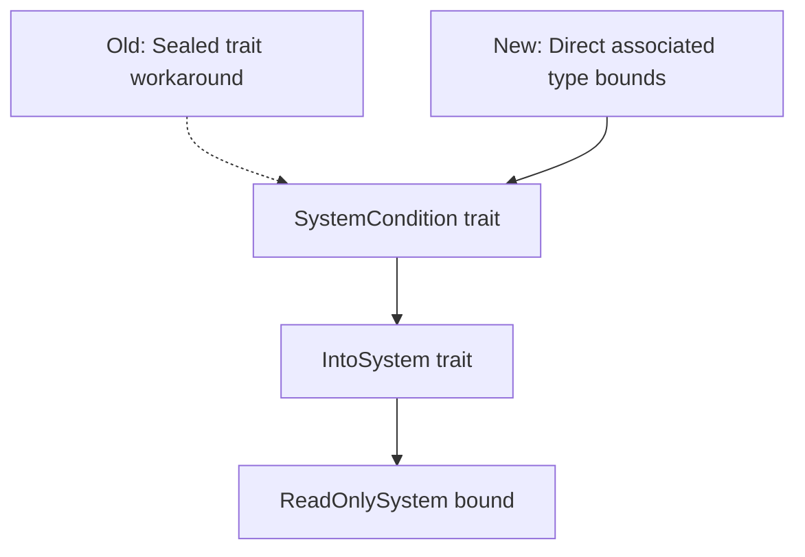

+++
title = "#21844 Tidy up old `SystemCondition` trait hierarchy"
date = "2025-11-29T00:00:00"
draft = false
template = "pull_request_page.html"
in_search_index = true

[taxonomies]
list_display = ["show"]

[extra]
current_language = "en"
available_languages = {"en" = { name = "English", url = "/pull_request/bevy/2025-11/pr-21844-en-20251129" }, "zh-cn" = { name = "中文", url = "/pull_request/bevy/2025-11/pr-21844-zh-cn-20251129" }}
labels = ["A-ECS", "C-Code-Quality", "D-Straightforward"]
+++

# Tidy up old `SystemCondition` trait hierarchy

## Basic Information
- **Title**: Tidy up old `SystemCondition` trait hierarchy
- **PR Link**: https://github.com/bevyengine/bevy/pull/21844
- **Author**: ItsDoot
- **Status**: MERGED
- **Labels**: A-ECS, C-Code-Quality, S-Ready-For-Final-Review, D-Straightforward
- **Created**: 2025-11-14T21:58:30Z
- **Merged**: 2025-11-29T21:39:10Z
- **Merged By**: alice-i-cecile

## Description Translation
# Objective

Cleanup code that was previously required in older rust versions but is no longer needed in newer versions.

## Solution

[As of rust 1.79.0, we can put bounds on associated types directly](https://blog.rust-lang.org/2024/06/13/Rust-1.79.0/#bounds-in-associated-type-position), so lets do that for `SystemCondition`.

## The Story of This Pull Request

This PR addresses a common pattern in Rust development: cleaning up workarounds that were necessary in older Rust versions but can now be replaced with more idiomatic language features. The specific issue revolves around the `SystemCondition` trait in Bevy's ECS system, which previously required a complex trait hierarchy to express constraints that Rust couldn't handle directly.

Before Rust 1.79.0, developers couldn't place bounds directly on associated types in trait definitions. This limitation forced the Bevy team to create a workaround using a sealed trait pattern. The sealed trait `SystemCondition` in the `sealed` module served as an intermediate layer to enforce that the system produced by `IntoSystem` must implement `ReadOnlySystem`.

The workaround looked like this:
```rust
mod sealed {
    pub trait SystemCondition<Marker, In: SystemInput>:
        IntoSystem<In, bool, Marker, System = Self::ReadOnlySystem>
    {
        type ReadOnlySystem: ReadOnlySystem<In = In, Out = bool>;
    }
}
```

This pattern was necessary because without direct associated type bounds, the compiler couldn't verify that the `System` associated type from `IntoSystem` implemented `ReadOnlySystem`. The sealed trait acted as a bridge, defining an intermediate associated type `ReadOnlySystem` that could be constrained.

With Rust 1.79.0, the language introduced the ability to place bounds directly on associated types. This feature eliminated the need for the complex sealed trait workaround. The new syntax allows developers to write:

```rust
IntoSystem<In, bool, Marker, System: ReadOnlySystem>
```

This directly expresses the constraint that the `System` associated type must implement `ReadOnlySystem`, making the intermediate sealed trait and its associated type unnecessary.

The implementation approach was straightforward: replace the sealed trait bound with the new associated type bound syntax and remove the now-redundant sealed module entirely. This change maintains the same type safety guarantees while significantly simplifying the code.

The technical impact is primarily code quality improvement. By removing 22 lines of code while adding only 2, the PR reduces complexity and makes the trait hierarchy easier to understand. The functionality remains identical - systems that implement `IntoSystem` with a `ReadOnlySystem` output continue to work exactly as before.

This change demonstrates a common pattern in evolving codebases: as language features mature, code that was once necessary can become technical debt. The PR shows good engineering practice by proactively identifying and removing such patterns when they're no longer needed.

## Visual Representation



## Key Files Changed

**File: `crates/bevy_ecs/src/schedule/condition.rs`** (+2/-22)

This file contains the core changes to the `SystemCondition` trait hierarchy:

**Before:**
```rust
pub trait SystemCondition<Marker, In: SystemInput = ()>:
    sealed::SystemCondition<Marker, In>
{
    // trait methods...
}

impl<Marker, In: SystemInput, F> SystemCondition<Marker, In> for F where
    F: sealed::SystemCondition<Marker, In>
{
}

mod sealed {
    use crate::system::{IntoSystem, ReadOnlySystem, SystemInput};

    pub trait SystemCondition<Marker, In: SystemInput>:
        IntoSystem<In, bool, Marker, System = Self::ReadOnlySystem>
    {
        type ReadOnlySystem: ReadOnlySystem<In = In, Out = bool>;
    }

    impl<Marker, In: SystemInput, F> SystemCondition<Marker, In> for F
    where
        F: IntoSystem<In, bool, Marker>,
        F::System: ReadOnlySystem,
    {
        type ReadOnlySystem = F::System;
    }
}
```

**After:**
```rust
pub trait SystemCondition<Marker, In: SystemInput = ()>:
    IntoSystem<In, bool, Marker, System: ReadOnlySystem>
{
    // trait methods...
}

impl<Marker, In: SystemInput, F> SystemCondition<Marker, In> for F where
    F: IntoSystem<In, bool, Marker, System: ReadOnlySystem>
{
}
```

The changes remove the entire sealed module and simplify the trait bounds to use Rust 1.79.0's associated type bounds feature directly.

## Further Reading

- [Rust 1.79.0 Release Notes - Bounds in Associated Type Position](https://blog.rust-lang.org/2024/06/13/Rust-1.79.0/#bounds-in-associated-type-position)
- [Rust Reference: Trait Bounds](https://doc.rust-lang.org/reference/trait-bounds.html)
- [Bevy ECS: Conditions Documentation](https://docs.rs/bevy_ecs/latest/bevy_ecs/schedule/condition/index.html)
- [The Sealed Trait Pattern in Rust](https://rust-lang.github.io/api-guidelines/future-proofing.html#sealed-traits-protect-against-downstream-implementations-c-sealed)