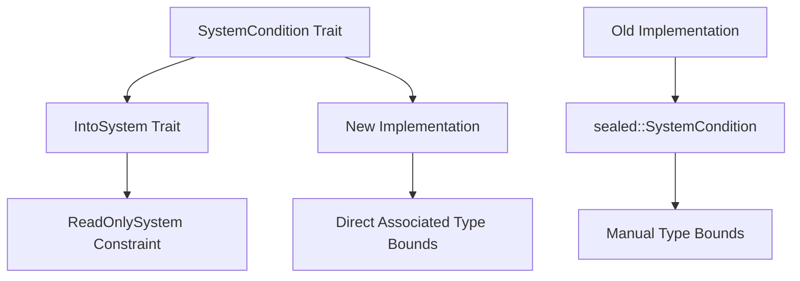

+++
title = "#21844 Tidy up old `SystemCondition` trait hierarchy"
date = "2025-11-29T00:00:00"
draft = false
template = "pull_request_page.html"
in_search_index = false

[extra]
current_language = "zh-cn"
available_languages = {"en" = { name = "English", url = "/pull_request/bevy/2025-11/pr-21844-en-20251129" }, "zh-cn" = { name = "中文", url = "/pull_request/bevy/2025-11/pr-21844-zh-cn-20251129" }}
labels = ["A-ECS", "C-Code-Quality", "D-Straightforward"]
+++

# Title
Tidy up old `SystemCondition` trait hierarchy

## Basic Information
- **Title**: Tidy up old `SystemCondition` trait hierarchy
- **PR Link**: https://github.com/bevyengine/bevy/pull/21844
- **Author**: ItsDoot
- **Status**: MERGED
- **Labels**: A-ECS, C-Code-Quality, S-Ready-For-Final-Review, D-Straightforward
- **Created**: 2025-11-14T21:58:30Z
- **Merged**: 2025-11-29T21:39:10Z
- **Merged By**: alice-i-cecile

## Description Translation
**目标**

清理旧版 Rust 版本中必需但新版本中不再需要的代码。

**解决方案**

[自 Rust 1.79.0 起，我们可以直接在关联类型上设置约束](https://blog.rust-lang.org/2024/06/13/Rust-1.79.0/#bounds-in-associated-type-position)，因此让我们对 `SystemCondition` 应用这一特性。

## The Story of This Pull Request

这个 PR 的核心是一个技术债务清理任务。在 Rust 1.79.0 之前，当我们需要在 trait 的关联类型上添加约束时，必须使用一种间接的方法。具体到 Bevy 的 ECS 系统中，`SystemCondition` trait 需要确保其关联的 `System` 类型实现了 `ReadOnlySystem` trait。

在旧版本的实现中，开发者不得不创建一个私有的 `sealed` 模块和一个内部 trait `sealed::SystemCondition` 来封装这个约束。这种方法虽然有效，但增加了代码的复杂性和间接性。代码需要额外的 trait 和关联类型来传达编译器需要的信息。

随着 Rust 1.79.0 的发布，语言现在支持直接在关联类型位置上添加约束。这意味着我们可以将 `System: ReadOnlySystem` 这样的约束直接写在 trait 定义中，不再需要额外的封装层。

这个 PR 的修改相当直接但影响深远。它移除了整个 `sealed` 模块（22 行代码），同时将 `SystemCondition` trait 的定义简化为：

```rust
pub trait SystemCondition<Marker, In: SystemInput = ()>:
    IntoSystem<In, bool, Marker, System: ReadOnlySystem>
{
    // ... 方法保持不变
}
```

新的 trait 边界 `IntoSystem<In, bool, Marker, System: ReadOnlySystem>` 直接表达了我们需要的约束：任何实现 `SystemCondition` 的类型必须能够转换为一个系统，且这个系统的输出是 `bool` 类型，同时该系统必须实现 `ReadOnlySystem`。

对于实现这个 trait 的泛型类型，相应的修改也很简洁：

```rust
impl<Marker, In: SystemInput, F> SystemCondition<Marker, In> for F where
    F: IntoSystem<In, bool, Marker, System: ReadOnlySystem>
{
}
```

这种简化带来了几个实际好处。首先，代码行数显著减少（净减少 20 行），这直接降低了维护成本。其次，类型系统的表达更加直接，减少了理解代码所需的认知负荷。开发者现在可以直接从 trait 定义中看到完整的约束，而不需要追踪到内部的 sealed trait。

从技术角度看，这个修改展示了如何利用 Rust 语言的新特性来简化现有的代码模式。它也是一个很好的例子，说明了如何在不改变外部 API 的情况下进行内部重构 - 所有现有的 `SystemCondition` 使用代码都能继续正常工作。

## Visual Representation



## Key Files Changed

### `crates/bevy_ecs/src/schedule/condition.rs` (+2/-22)

这个文件包含了所有的修改，主要涉及 `SystemCondition` trait 定义的现代化。

**主要修改：**

```rust
// 修改前：
pub trait SystemCondition<Marker, In: SystemInput = ()>:
    sealed::SystemCondition<Marker, In>
{
    // ... trait 方法
}

// 修改后：
pub trait SystemCondition<Marker, In: SystemInput = ()>:
    IntoSystem<In, bool, Marker, System: ReadOnlySystem>
{
    // ... trait 方法保持不变
}
```

```rust
// 修改前（整个 sealed 模块被移除）：
mod sealed {
    use crate::system::{IntoSystem, ReadOnlySystem, SystemInput};

    pub trait SystemCondition<Marker, In: SystemInput>:
        IntoSystem<In, bool, Marker, System = Self::ReadOnlySystem>
    {
        type ReadOnlySystem: ReadOnlySystem<In = In, Out = bool>;
    }

    impl<Marker, In: SystemInput, F> SystemCondition<Marker, In> for F
    where
        F: IntoSystem<In, bool, Marker>,
        F::System: ReadOnlySystem,
    {
        type ReadOnlySystem = F::System;
    }
}
```

```rust
// 修改前：
impl<Marker, In: SystemInput, F> SystemCondition<Marker, In> for F where
    F: sealed::SystemCondition<Marker, In>
{
}

// 修改后：
impl<Marker, In: SystemInput, F> SystemCondition<Marker, In> for F where
    F: IntoSystem<In, bool, Marker, System: ReadOnlySystem>
{
}
```

这些修改直接对应 PR 的目标：利用 Rust 1.79.0 的新特性简化 trait 层次结构，移除不再需要的间接层。

## Further Reading

- [Rust 1.79.0 Release Notes - Bounds in Associated Type Position](https://blog.rust-lang.org/2024/06/13/Rust-1.79.0/#bounds-in-associated-type-position)
- [Bevy Engine ECS Documentation](https://bevyengine.org/learn/book/ecs/)
- [Rust Trait System and Associated Types](https://doc.rust-lang.org/book/ch19-03-advanced-traits.html)
- [Sealed Trait Pattern in Rust](https://rust-lang.github.io/api-guidelines/future-proofing.html#sealed-traits-protect-against-downstream-implementations-c-sealed)