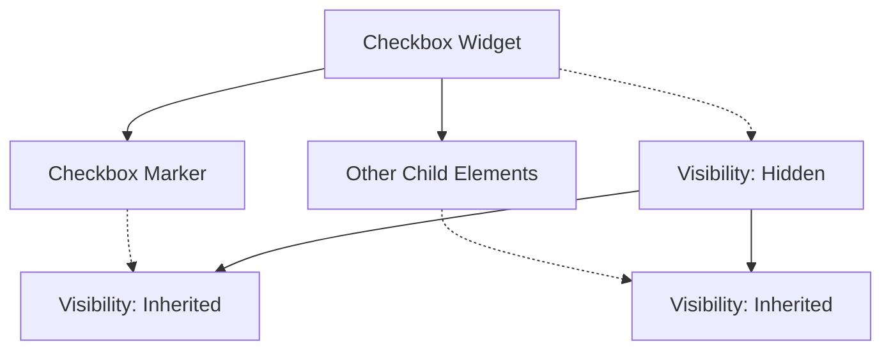

+++
title = "#21847 Feathers: set checkbox marker `Visibility::Inherited` when checked."
date = "2025-11-17T00:00:00"
draft = false
template = "pull_request_page.html"
in_search_index = true

[taxonomies]
list_display = ["show"]

[extra]
current_language = "en"
available_languages = {"en" = { name = "English", url = "/pull_request/bevy/2025-11/pr-21847-en-20251117" }, "zh-cn" = { name = "中文", url = "/pull_request/bevy/2025-11/pr-21847-zh-cn-20251117" }}
labels = ["C-Bug", "A-UI"]
+++

# Feathers: set checkbox marker `Visibility::Inherited` when checked.

## Basic Information
- **Title**: Feathers: set checkbox marker `Visibility::Inherited` when checked.
- **PR Link**: https://github.com/bevyengine/bevy/pull/21847
- **Author**: kaoet
- **Status**: MERGED
- **Labels**: C-Bug, A-UI, S-Ready-For-Final-Review
- **Created**: 2025-11-15T09:37:27Z
- **Merged**: 2025-11-16T23:48:14Z
- **Merged By**: alice-i-cecile

## Description Translation
# Objective

Seems the checkbox part is missing in PR #21789.

Make the checkbox marker invisible when the whole widget is `Visibility::Hidden`.

## Solution

Change the maker's visibility to `Inherited` rather than `Visible`.

## Testing

Manually added `Visibility::Hidden` to the root node of `examples/ui/feathers.rs`, and verified nothing is visible.

## The Story of This Pull Request

This PR addresses a specific UI visibility issue in Bevy's Feathers UI system. The problem was straightforward: when a checkbox widget was set to `Visibility::Hidden`, the checkbox marker (the checkmark itself) remained visible. This occurred because the marker's visibility was being set to `Visibility::Visible` when the checkbox was checked, which overrode the inherited hidden state from the parent widget.

The root cause traces back to how Bevy's visibility system works. In Bevy, `Visibility::Inherited` means an entity's visibility is determined by its parent, while `Visibility::Visible` and `Visibility::Hidden` force a specific state regardless of the parent. The checkbox marker was using `Visibility::Visible` when checked, which meant it would remain visible even if its parent checkbox widget was hidden.

The fix was minimal but precise: change the marker's visibility from `Visibility::Visible` to `Visibility::Inherited` when the checkbox is checked. This ensures the marker properly inherits the visibility state from its parent checkbox widget. When the parent is hidden, the marker will now also be hidden, maintaining consistent UI behavior.

This change aligns with the broader work in PR #21789, which likely addressed similar visibility inheritance issues across other UI components. The checkbox control was apparently missed in that previous work, making this a straightforward follow-up fix.

The testing approach was practical and direct: manually setting `Visibility::Hidden` on the root node in the feathers example and verifying that the entire UI, including checkbox markers, became properly hidden. This manual testing approach is appropriate for visual UI components where automated tests might not capture the visual correctness.

## Visual Representation



This diagram shows the parent-child relationship in the checkbox widget hierarchy. When the parent checkbox widget has `Visibility::Hidden`, all child elements with `Visibility::Inherited` will also be hidden.

## Key Files Changed

**File: `crates/bevy_feathers/src/controls/checkbox.rs`**

This file contains the checkbox control implementation for Bevy's Feathers UI system. The change modifies how the checkbox marker's visibility is handled when the checkbox is checked.

```rust
// File: crates/bevy_feathers/src/controls/checkbox.rs
// Before:
commands.entity(mark_ent).insert(match checked {
    true => Visibility::Visible,
    false => Visibility::Hidden,
});

// After:
commands.entity(mark_ent).insert(match checked {
    true => Visibility::Inherited,
    false => Visibility::Hidden,
});
```

The key change is replacing `Visibility::Visible` with `Visibility::Inherited` when the checkbox is checked (`true` case). This ensures the checkbox marker inherits its visibility from the parent checkbox widget rather than forcing itself to be visible.

## Further Reading

- [Bevy UI Visibility Documentation](https://docs.rs/bevy/latest/bevy/render/view/visibility/index.html) - Official documentation for Bevy's visibility system
- [PR #21789](https://github.com/bevyengine/bevy/pull/21789) - The previous PR that addressed similar visibility issues in other UI components
- [Bevy UI Examples](https://github.com/bevyengine/bevy/tree/main/examples/ui) - Collection of UI examples demonstrating various Bevy UI features

# Full Code Diff
```diff
diff --git a/crates/bevy_feathers/src/controls/checkbox.rs b/crates/bevy_feathers/src/controls/checkbox.rs
index eb12a928a9cd3..f14ab683b3b7f 100644
--- a/crates/bevy_feathers/src/controls/checkbox.rs
+++ b/crates/bevy_feathers/src/controls/checkbox.rs
@@ -289,7 +289,7 @@ fn set_checkbox_styles(
 
     // Change mark visibility
     commands.entity(mark_ent).insert(match checked {
-        true => Visibility::Visible,
+        true => Visibility::Inherited,
         false => Visibility::Hidden,
     });
 
```