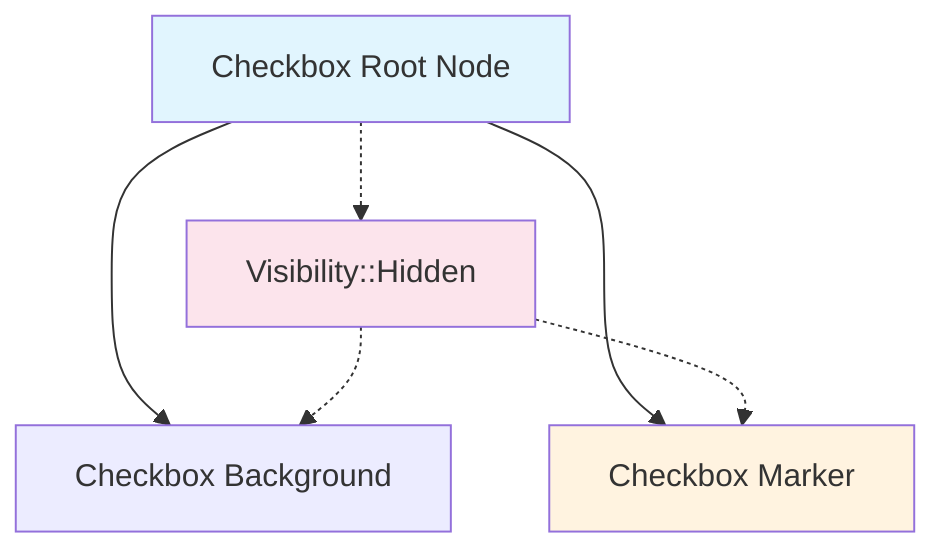

+++
title = "#21847 Feathers: set checkbox marker `Visibility::Inherited` when checked."
date = "2025-11-17T00:00:00"
draft = false
template = "pull_request_page.html"
in_search_index = false

[extra]
current_language = "zh-cn"
available_languages = {"en" = { name = "English", url = "/pull_request/bevy/2025-11/pr-21847-en-20251117" }, "zh-cn" = { name = "中文", url = "/pull_request/bevy/2025-11/pr-21847-zh-cn-20251117" }}
labels = ["C-Bug", "A-UI"]
+++

# Feathers: set checkbox marker `Visibility::Inherited` when checked.

## Basic Information
- **Title**: Feathers: set checkbox marker `Visibility::Inherited` when checked.
- **PR Link**: https://github.com/bevyengine/bevy/pull/21847
- **Author**: kaoet
- **Status**: MERGED
- **Labels**: C-Bug, A-UI, S-Ready-For-Final-Review
- **Created**: 2025-11-15T09:37:27Z
- **Merged**: 2025-11-16T23:48:14Z
- **Merged By**: alice-i-cecile

## Description Translation
**目标**

似乎在 PR #21789 中遗漏了复选框部分。

当整个小部件设置为 `Visibility::Hidden` 时，使复选框标记不可见。

**解决方案**

将标记的可见性更改为 `Inherited` 而不是 `Visible`。

**测试**

手动将 `Visibility::Hidden` 添加到 `examples/ui/feathers.rs` 的根节点，并验证没有任何内容可见。

## The Story of This Pull Request

这个 PR 解决了一个在 Bevy 的 Feathers UI 系统中关于复选框组件可见性继承的特定问题。问题的根源在于之前的 PR #21789 中，虽然处理了其他 UI 组件的可见性继承，但遗漏了复选框组件。

在 Bevy 的 UI 系统中，`Visibility` 组件有三个状态：`Inherited`、`Visible` 和 `Hidden`。`Inherited` 状态意味着组件会继承其父组件的可见性状态，而 `Visible` 和 `Hidden` 则是绝对状态，会覆盖继承链。

问题的具体表现是：当开发者将一个复选框组件的根节点设置为 `Visibility::Hidden` 时，期望整个复选框（包括背景和标记）都应该不可见。然而，由于复选框的标记（checkmark）被硬编码为 `Visibility::Visible`，即使父组件被隐藏，标记仍然会显示出来。

开发者通过分析代码发现，在 `set_checkbox_styles` 函数中，当复选框被选中时，标记的可见性被设置为 `Visibility::Visible`。这个设置破坏了 UI 组件的可见性继承机制。

解决方案非常直接：将标记的可见性从 `Visibility::Visible` 改为 `Visibility::Inherited`。这样，当复选框被选中时，标记会继承父组件的可见性状态。如果父组件被隐藏，标记也会被隐藏；如果父组件可见，标记也会正常显示。

这个修复体现了 UI 组件设计中一个重要原则：子组件应该尊重父组件的可见性状态，除非有明确的理由要覆盖它。通过使用 `Inherited` 而不是 `Visible`，复选框标记现在正确地参与到 UI 的可见性继承体系中。

测试方法也很实用：开发者直接修改了示例文件，在根节点添加 `Visibility::Hidden`，然后验证整个 UI 确实完全不可见。这种手动测试虽然简单，但对于验证可见性修复非常有效。

## Visual Representation



## Key Files Changed

### `crates/bevy_feathers/src/controls/checkbox.rs` (+1/-1)

这个文件包含了修复复选框标记可见性问题的关键更改。修改发生在 `set_checkbox_styles` 函数中，该函数负责根据复选框的状态更新其视觉样式。

```rust
// File: crates/bevy_feathers/src/controls/checkbox.rs
// Before:
commands.entity(mark_ent).insert(match checked {
    true => Visibility::Visible,
    false => Visibility::Hidden,
});

// After:
commands.entity(mark_ent).insert(match checked {
    true => Visibility::Inherited,
    false => Visibility::Hidden,
});
```

这个修改的核心在于将复选框标记在选中状态时的可见性从绝对可见 (`Visibility::Visible`) 改为继承可见性 (`Visibility::Inherited`)。这样，当复选框的父组件被隐藏时，标记也会正确地被隐藏，而不是继续保持可见状态。

## Further Reading

- [Bevy UI Visibility Documentation](https://docs.rs/bevy/latest/bevy/render/view/visibility/struct.Visibility.html) - Bevy 官方关于 Visibility 组件的文档
- [Bevy Feathers UI System](https://github.com/bevyengine/bevy/tree/main/crates/bevy_feathers) - Bevy Feathers UI 系统的源代码和文档
- [PR #21789](https://github.com/bevyengine/bevy/pull/21789) - 相关的先前 PR，可能包含类似的可见性修复

# Full Code Diff
```diff
diff --git a/crates/bevy_feathers/src/controls/checkbox.rs b/crates/bevy_feathers/src/controls/checkbox.rs
index eb12a928a9cd3..f14ab683b3b7f 100644
--- a/crates/bevy_feathers/src/controls/checkbox.rs
+++ b/crates/bevy_feathers/src/controls/checkbox.rs
@@ -289,7 +289,7 @@ fn set_checkbox_styles(
 
     // Change mark visibility
     commands.entity(mark_ent).insert(match checked {
-        true => Visibility::Visible,
+        true => Visibility::Inherited,
         false => Visibility::Hidden,
     });
 
```