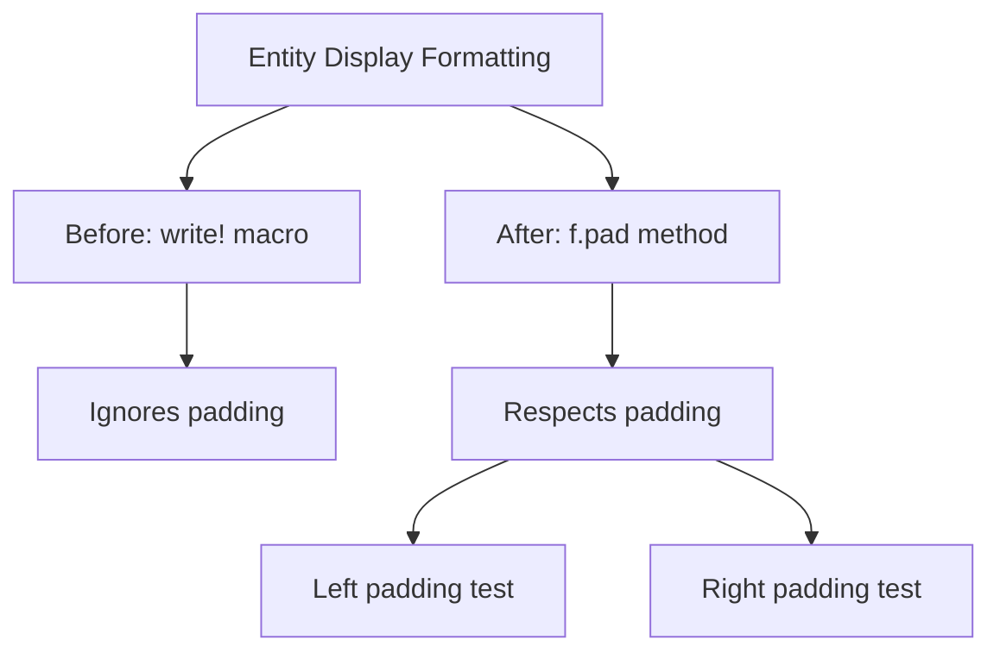

+++
title = "#21850 Fix entity display not working with padding."
date = "2025-11-28T00:00:00"
draft = false
template = "pull_request_page.html"
in_search_index = true

[taxonomies]
list_display = ["show"]

[extra]
current_language = "en"
available_languages = {"en" = { name = "English", url = "/pull_request/bevy/2025-11/pr-21850-en-20251128" }, "zh-cn" = { name = "中文", url = "/pull_request/bevy/2025-11/pr-21850-zh-cn-20251128" }}
labels = ["C-Bug", "D-Trivial", "A-ECS"]
+++

# Fix entity display not working with padding

## Basic Information
- **Title**: Fix entity display not working with padding.
- **PR Link**: https://github.com/bevyengine/bevy/pull/21850
- **Author**: PhantomMorrigan
- **Status**: MERGED
- **Labels**: C-Bug, D-Trivial, A-ECS, S-Ready-For-Final-Review
- **Created**: 2025-11-15T13:46:27Z
- **Merged**: 2025-11-28T08:36:02Z
- **Merged By**: mockersf

## Description Translation
# Objective

Attempting to display entities with padding does not work, no padding is added.

## Solution

Fix the `fmt::Display` implementation of `Entity` so that padding works.

## Testing

Added some unit tests for padding.

## The Story of This Pull Request

This PR addresses a straightforward but important issue in Bevy's ECS system: the `fmt::Display` implementation for `Entity` types wasn't properly handling formatting options like padding. When developers tried to format entities with padding specifications (like `{entity:<5}` or `{entity:>6}`), the padding was simply ignored, and the entity would display without any spacing adjustments.

The core problem was in the display trait implementation. The original code used `write!` macro calls directly, which don't automatically handle padding specifications from the formatter. This is a common Rust formatting pitfall - the `write!` macro doesn't propagate formatting options like width, alignment, and padding to the written content.

The solution demonstrates proper Rust formatting practices. Instead of using `write!`, the implementation now uses the formatter's `pad` method, which automatically handles all padding and alignment specifications. For the regular entity case, there's an additional step: the entity string needs to be formatted first using `alloc::fmt::format` before it can be passed to `f.pad()`. This is necessary because `f.pad()` expects a string slice, but we need to construct the formatted string first.

The fix is minimal but impactful. It ensures that entity display formatting behaves consistently with other Rust types and respects standard formatting specifications. This is particularly important for debugging, logging, and UI display scenarios where consistent formatting matters.

The testing approach is practical and thorough for the scope of the change. The added unit tests verify both left and right padding scenarios, ensuring that the formatting behaves as expected in different alignment contexts. This prevents regression and gives confidence that the fix works correctly.

## Visual Representation



## Key Files Changed

### `crates/bevy_ecs/src/entity/mod.rs` (+12/-2)

This file contains the core Entity type definition and implementations. The changes focus on fixing the Display trait implementation to properly handle formatting options.

**Key changes:**

```rust
// Before:
impl fmt::Display for Entity {
    fn fmt(&self, f: &mut fmt::Formatter<'_>) -> fmt::Result {
        if self == &Self::PLACEHOLDER {
            write!(f, "PLACEHOLDER")
        } else {
            write!(f, "{}v{}", self.index(), self.generation())
        }
    }
}

// After:
impl fmt::Display for Entity {
    fn fmt(&self, f: &mut fmt::Formatter<'_>) -> fmt::Result {
        if self == &Self::PLACEHOLDER {
            f.pad("PLACEHOLDER")
        } else {
            f.pad(&alloc::fmt::format(format_args!(
                "{}v{}",
                self.index(),
                self.generation()
            )))
        }
    }
}
```

**Test additions:**

```rust
// New test cases for padding
let padded_left = format!("{entity:<5}");
assert_eq!(padded_left, "42v0 ");

let padded_right = format!("{entity:>6}");
assert_eq!(padded_right, "  42v0");
```

The changes ensure that:
1. Placeholder entities now properly respect padding
2. Regular entities format their index and generation, then apply padding
3. Both left and right padding work correctly

## Further Reading

- [Rust std::fmt Documentation](https://doc.rust-lang.org/std/fmt/) - Comprehensive guide to Rust's formatting system
- [Rust Formatter.pad() method](https://doc.rust-lang.org/std/fmt/struct.Formatter.html#method.pad) - Official documentation for the pad method
- [Bevy ECS Entity Documentation](https://docs.rs/bevy_ecs/latest/bevy_ecs/entity/struct.Entity.html) - Bevy's Entity type documentation

# Full Code Diff
```diff
diff --git a/crates/bevy_ecs/src/entity/mod.rs b/crates/bevy_ecs/src/entity/mod.rs
index 82f8c7a64419e..62c1c3de94eb7 100644
--- a/crates/bevy_ecs/src/entity/mod.rs
+++ b/crates/bevy_ecs/src/entity/mod.rs
@@ -671,9 +671,13 @@ impl fmt::Debug for Entity {
 impl fmt::Display for Entity {
     fn fmt(&self, f: &mut fmt::Formatter<'_>) -> fmt::Result {
         if self == &Self::PLACEHOLDER {
-            write!(f, "PLACEHOLDER")
+            f.pad("PLACEHOLDER")
         } else {
-            write!(f, "{}v{}", self.index(), self.generation())
+            f.pad(&alloc::fmt::format(format_args!(
+                "{}v{}",
+                self.index(),
+                self.generation()
+            )))
         }
     }
 }
@@ -1514,6 +1518,12 @@ mod tests {
         let string = format!("{entity}");
         assert_eq!(string, "42v0");
 
+        let padded_left = format!("{entity:<5}");
+        assert_eq!(padded_left, "42v0 ");
+
+        let padded_right = format!("{entity:>6}");
+        assert_eq!(padded_right, "  42v0");
+
         let entity = Entity::PLACEHOLDER;
         let string = format!("{entity}");
         assert_eq!(string, "PLACEHOLDER");
```