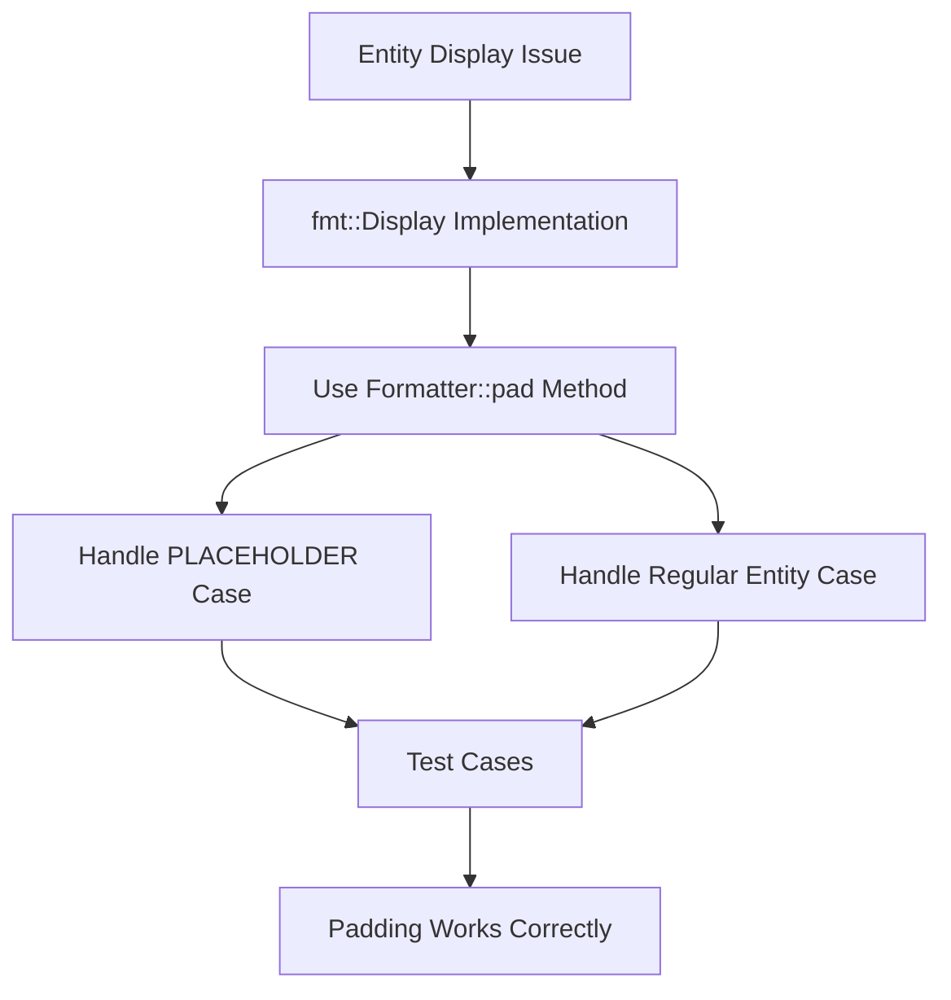

+++
title = "#21850 Fix entity display not working with padding."
date = "2025-11-28T00:00:00"
draft = false
template = "pull_request_page.html"
in_search_index = false

[extra]
current_language = "zh-cn"
available_languages = {"en" = { name = "English", url = "/pull_request/bevy/2025-11/pr-21850-en-20251128" }, "zh-cn" = { name = "中文", url = "/pull_request/bevy/2025-11/pr-21850-zh-cn-20251128" }}
labels = ["C-Bug", "D-Trivial", "A-ECS"]
+++

# Title
Fix entity display not working with padding

## Basic Information
- **Title**: Fix entity display not working with padding.
- **PR Link**: https://github.com/bevyengine/bevy/pull/21850
- **Author**: PhantomMorrigan
- **Status**: MERGED
- **Labels**: C-Bug, D-Trivial, A-ECS, S-Ready-For-Final-Review
- **Created**: 2025-11-15T13:46:27Z
- **Merged**: 2025-11-28T08:36:02Z
- **Merged By**: mockersf

## Description Translation
**目标**

尝试显示带有填充(padding)的实体不起作用，没有添加任何填充。

**解决方案**

修复 `Entity` 的 `fmt::Display` 实现，使填充能够正常工作。

**测试**

添加了一些用于测试填充功能的单元测试。

## The Story of This Pull Request

这个PR解决了一个在Bevy ECS中关于实体显示格式化的具体问题。问题的核心是当开发者尝试使用Rust标准库的格式化填充功能来显示`Entity`时，填充参数被忽略了。

**问题根源**

在Rust的格式化系统中，`fmt::Display` trait的实现需要正确处理格式化器(Formatter)的各种选项，包括填充(padding)、对齐(alignment)和宽度(width)。原来的实现直接使用`write!`宏，这不会自动处理填充选项。填充功能需要通过格式化器的`pad`方法来显式处理。

原代码的问题在于：
```rust
// 原来的实现 - 忽略了填充
write!(f, "PLACEHOLDER")  // 或者
write!(f, "{}v{}", self.index(), self.generation())
```

**解决方案实现**

开发者采用了标准的方法来处理格式化填充：使用`Formatter::pad`方法。这个方法专门设计来处理格式化字符串时的填充需求，它会根据格式化器中的宽度和对齐设置自动添加适当的填充字符。

关键修改包括：
1. 对于占位符实体(`Entity::PLACEHOLDER`)，直接使用`f.pad("PLACEHOLDER")`
2. 对于常规实体，先通过`format_args!`和`alloc::fmt::format`构建格式化后的字符串，然后使用`f.pad`来处理填充

这种方法的优势在于它完全遵循了Rust格式化系统的最佳实践，确保所有格式化选项都能被正确处理。

**测试验证**

为了确保修复的有效性，开发者添加了具体的单元测试来验证填充功能：
- 测试左对齐填充：`{entity:<5}` 应该产生 `"42v0 "`
- 测试右对齐填充：`{entity:>6}` 应该产生 `"  42v0"`

这些测试覆盖了常见的填充场景，确保修复不会在未来被意外破坏。

**技术考量**

这里有一个值得注意的实现细节：对于常规实体的显示，代码使用了`alloc::fmt::format`来先将格式化参数转换为字符串，然后再传递给`f.pad`。这是因为`f.pad`需要一个字符串切片(`&str`)作为参数，而直接使用`format_args!`宏产生的值不能直接转换为字符串切片。

这种实现虽然多了一次字符串分配，但在实际使用中，实体显示通常不会在性能关键路径上，而且这种实现的简洁性和正确性更重要。

## Visual Representation



## Key Files Changed

### `crates/bevy_ecs/src/entity/mod.rs` (+12/-2)

这个文件包含了`Entity`类型的核心定义和实现。修改主要集中在`fmt::Display` trait的实现上。

**关键修改：**

```rust
// Before:
impl fmt::Display for Entity {
    fn fmt(&self, f: &mut fmt::Formatter<'_>) -> fmt::Result {
        if self == &Self::PLACEHOLDER {
            write!(f, "PLACEHOLDER")
        } else {
            write!(f, "{}v{}", self.index(), self.generation())
        }
    }
}

// After:
impl fmt::Display for Entity {
    fn fmt(&self, f: &mut fmt::Formatter<'_>) -> fmt::Result {
        if self == &Self::PLACEHOLDER {
            f.pad("PLACEHOLDER")
        } else {
            f.pad(&alloc::fmt::format(format_args!(
                "{}v{}",
                self.index(),
                self.generation()
            )))
        }
    }
}
```

**测试代码添加：**

```rust
// 新增的测试用例
let padded_left = format!("{entity:<5}");
assert_eq!(padded_left, "42v0 ");

let padded_right = format!("{entity:>6}");
assert_eq!(padded_right, "  42v0");
```

这些修改确保了：
1. 实体显示现在正确处理填充格式化选项
2. 占位符实体和常规实体的显示都支持填充
3. 通过单元测试验证了修复的有效性

## Further Reading

- [Rust std::fmt 模块文档](https://doc.rust-lang.org/std/fmt/) - Rust格式化系统的完整参考
- [Formatter::pad 方法文档](https://doc.rust-lang.org/std/fmt/struct.Formatter.html#method.pad) - 了解如何处理格式化填充
- [Bevy ECS Entity 文档](https://docs.rs/bevy_ecs/latest/bevy_ecs/entity/struct.Entity.html) - Bevy实体系统的详细说明