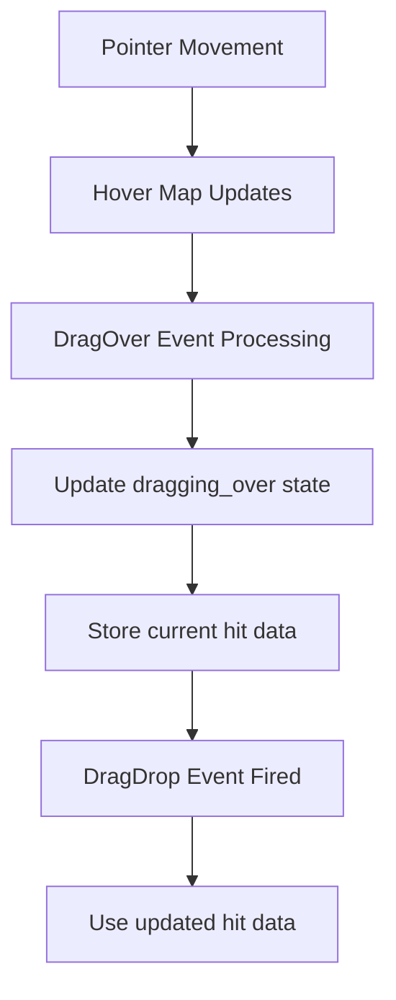

+++
title = "#21853 fix: return current hit for DragDrop event"
date = "2025-11-25T00:00:00"
draft = false
template = "pull_request_page.html"
in_search_index = true

[taxonomies]
list_display = ["show"]

[extra]
current_language = "en"
available_languages = {"en" = { name = "English", url = "/pull_request/bevy/2025-11/pr-21853-en-20251125" }, "zh-cn" = { name = "中文", url = "/pull_request/bevy/2025-11/pr-21853-zh-cn-20251125" }}
labels = ["C-Bug", "D-Straightforward", "A-Picking"]
+++

# Title
fix: return current hit for DragDrop event

## Basic Information
- **Title**: fix: return current hit for DragDrop event
- **PR Link**: https://github.com/bevyengine/bevy/pull/21853
- **Author**: moe-moe-pupil
- **Status**: MERGED
- **Labels**: C-Bug, D-Straightforward, S-Needs-Review, A-Picking
- **Created**: 2025-11-15T23:29:28Z
- **Merged**: 2025-11-25T02:26:39Z
- **Merged By**: alice-i-cecile

## Description Translation

# Objective

- previously, the hit field in DragDrop event is the clone of the DragEnter one.
- Fixes #21849.

## Solution

- Describe the solution used to achieve the objective above.
  - use the hit from hover_map rather than the hit in state.dragging_over

## Testing

- Did you test these changes? If so, how?
  - yes, tested this simple demo and examples/picking/debug_picking.rs and ui_drag_and_drop.rs on my mac.
- Are there any parts that need more testing?
  - no, i think it's enough.
- How can other people (reviewers) test your changes? Is there anything specific they need to know?
  - i pasted the code for testing at the bottom 
- If relevant, what platforms did you test these changes on, and are there any important ones you can't test?
  - mac, but it doesnt matter
---

## Showcase

https://github.com/user-attachments/assets/ff35a03d-00a0-41b8-952f-3f2e77530d5a

https://github.com/user-attachments/assets/a7aa5172-f89c-4010-a153-b90171621204

<details>
  <summary>Click to view showcase</summary>

```rust
use bevy::{
    prelude::*,
    window::WindowMode,
};

#[derive(Component)]
struct Area;

#[derive(Component)]
struct ExampleButton;

#[derive(Component)]
struct GhostElement;

#[derive(Component)]
struct Element;


const AREA_SIZE: f32 = 500.0;
const BUTTON_SIZE: i32 = 50;
const ELEMENT_SIZE: f32 = 25.0;

#[bevy_main]
pub fn main() -> AppExit {
    App::new()
        .add_plugins((
            DefaultPlugins
                .set(WindowPlugin {
                    primary_window: Some(Window {
                        mode: WindowMode::BorderlessFullscreen(MonitorSelection::Primary),
                        ..default()
                    }),
                    ..default()
                }),
            MeshPickingPlugin,
        ))
        .add_systems(Startup, setup)
        .run()
}

fn setup(
    mut commands: Commands,
    mut meshes: ResMut<Assets<Mesh>>,
    mut materials: ResMut<Assets<ColorMaterial>>,
) {
    commands.spawn(Camera2d);

    commands.spawn((
        Node {
            width: percent(100),
            height: percent(100),
            align_items: AlignItems::Center,
            justify_content: JustifyContent::Start,
            ..default()
        },
        Pickable::IGNORE,
    ))
        .with_children(|parent| {
            parent.spawn((
                ExampleButton,
                Button,
                Node {
                    width: px(BUTTON_SIZE),
                    height: px(BUTTON_SIZE),
                    margin: UiRect::all(px(10)),
                    border_radius: BorderRadius::MAX,
                    ..default()
                },
                BackgroundColor(Color::srgb(1.0, 0.0, 0.0)),
            ))
                .observe(|mut event: On<Pointer<DragStart>>, mut button_color: Single<&mut BackgroundColor, With<ExampleButton>>| {
                    button_color.0 = Color::srgb(1.0, 0.5, 0.0);
                    event.propagate(false);
                })
                .observe(|mut event: On<Pointer<DragEnd>>, mut button_color: Single<&mut BackgroundColor, With<ExampleButton>>| {
                    button_color.0 = Color::srgb(1.0, 0.0, 0.0);
                    event.propagate(false);
                });
        });


    commands.spawn((
        Area,
        Mesh2d(meshes.add(Rectangle::new(AREA_SIZE, AREA_SIZE))),
        MeshMaterial2d(materials.add(Color::srgb(0.1, 0.4, 0.1))),
        Transform::IDENTITY,
    ))
        .observe(on_enter)
        .observe(on_over)
        .observe(on_drop)
        .observe(on_leave);
}


fn on_enter(
    mut event: On<Pointer<DragEnter>>,
    button: Single<Entity, With<ExampleButton>>,
    mut commands: Commands,
    mut meshes: ResMut<Assets<Mesh>>,
    mut materials: ResMut<Assets<ColorMaterial>>,
) {
    if event.dragged == *button {
        let Some(position) = event.hit.position else { return; };
        commands.spawn((
            GhostElement,
            Mesh2d(meshes.add(Circle::new(ELEMENT_SIZE))),
            MeshMaterial2d(materials.add(Color::srgba(1.0, 1.0, 0.6, 0.5))),
            Transform::from_translation(position),
            Pickable::IGNORE,
        ));
        event.propagate(false);
    }
}


fn on_over(
    mut event: On<Pointer<DragOver>>,
    button: Single<Entity, With<ExampleButton>>,
    mut ghost_element_transform: Single<&mut Transform, With<GhostElement>>,
) {
    if event.dragged == *button {
        let Some(position) = event.hit.position else { return; };
        ghost_element_transform.translation = position;
        event.propagate(false);
    }
}

 fn on_drop(
    mut event: On<Pointer<DragDrop>>,
    button: Single<Entity, With<ExampleButton>>,
    mut commands: Commands,
    ghost_element: Single<Entity, With<GhostElement>>,
    mut meshes: ResMut<Assets<Mesh>>,
    mut materials: ResMut<Assets<ColorMaterial>>,
) {
    if event.dropped == *button {
        println!("{:?}", event);
        commands.entity(*ghost_element).despawn();
        let Some(position) = event.hit.position else { return; };
        commands.spawn((
            Element,
            Mesh2d(meshes.add(Circle::new(ELEMENT_SIZE))),
            MeshMaterial2d(materials.add(Color::srgb(1.0, 1.0, 0.6))),
            Transform::from_translation(position),
            Pickable::IGNORE,
        ));
        event.propagate(false);
    }
}

fn on_leave(
    mut event: On<Pointer<DragLeave>>,
    button: Single<Entity, With<ExampleButton>>,
    mut commands: Commands,
    ghost_element: Single<Entity, With<GhostElement>>,
) {
    if event.dragged == *button {
        commands.entity(*ghost_element).despawn();
        event.propagate(false);
    }
}
```

</details>

## The Story of This Pull Request

This pull request addresses a subtle but important bug in Bevy's drag-and-drop system. The issue was in how the `DragDrop` event handled hit position data - it was incorrectly using stale position information from when the drag operation first entered the target, rather than the current position when the drop actually occurred.

The problem manifested in drag-and-drop operations where developers needed precise positioning for dropped elements. When a user dragged an item over a drop target and then moved the cursor within that target before releasing, the drop position would be calculated based on the initial entry point rather than the final position. This created a jarring user experience where dropped items would appear in unexpected locations.

The root cause was in the event handling logic within the `pointer_events` system. When processing drag operations, the system maintained a `dragging_over` state that tracked which entities were being dragged over. However, this state wasn't being updated with current hit position data during drag movement - it only contained the initial hit data from when the drag first entered each target.

The solution was straightforward but crucial: during the `DragOver` event processing, the system now updates the stored hit data in the `dragging_over` state with the current hit information from the `hover_map`. This ensures that when a `DragDrop` event is eventually fired, it contains the most recent and accurate position data.

Here's the key change in context:

```rust
// In the DragOver event handling section
for (hovered_entity, hit) in hover_map
    .iter()
    .flat_map(|h| h.iter().map(|(entity, data)| (*entity, data.to_owned())))
    .filter(|(hovered_entity, _)| *hovered_entity != *drag_target)
{
    // This line was added to fix the bug:
    *state.dragging_over.get_mut(&hovered_entity).unwrap() = hit.clone();
    
    let drag_over_event = Pointer::new(
        pointer_id,
        location.clone(),
        hit.clone(),
        PointerButton::Primary,
        PointerEvent::DragOver {
            dragger: *drag_target,
        },
    );
    // ... rest of event processing
}
```

This single-line change ensures that the hit data stored in `state.dragging_over` is continuously updated during drag operations, making the final `DragDrop` event reflect the actual drop position rather than the initial entry position.

The fix is particularly elegant because it doesn't require changing the overall architecture or adding complex new systems. It simply ensures that existing state tracking is kept current throughout the drag operation. This approach minimizes the risk of introducing new bugs while solving the core positioning issue.

## Visual Representation



## Key Files Changed

- `crates/bevy_picking/src/events.rs` (+1/-0)

This file contains the core event handling logic for pointer interactions in Bevy's picking system. The change adds a single line that updates the `dragging_over` state with current hit data during drag operations.

**Key Modification:**
```rust
// Before: The dragging_over state retained initial hit data from DragEnter
// After: The dragging_over state is updated with current hit data during DragOver

// Added line in the DragOver event handling loop:
*state.dragging_over.get_mut(&hovered_entity).unwrap() = hit.clone();
```

This change ensures that when a `DragDrop` event is later processed, it uses the most recent hit position data rather than the initial position from when the drag operation first entered the target.

## Further Reading

- [Bevy Picking Documentation](https://docs.rs/bevy_picking/latest/bevy_picking/) - Official documentation for Bevy's picking system
- [Drag and Drop Events in Bevy](https://bevy-cheatbook.github.io/programming/events.html) - General information about event handling in Bevy
- [Issue #21849](https://github.com/bevyengine/bevy/issues/21849) - The original bug report that this PR fixes

# Full Code Diff
```diff
diff --git a/crates/bevy_picking/src/events.rs b/crates/bevy_picking/src/events.rs
index 1e3ec18f38851..6e25bd235c891 100644
--- a/crates/bevy_picking/src/events.rs
+++ b/crates/bevy_picking/src/events.rs
@@ -766,6 +766,7 @@ pub fn pointer_events(
                             .flat_map(|h| h.iter().map(|(entity, data)| (*entity, data.to_owned())))
                             .filter(|(hovered_entity, _)| *hovered_entity != *drag_target)
                         {
+                            *state.dragging_over.get_mut(&hovered_entity).unwrap() = hit.clone();
                             let drag_over_event = Pointer::new(
                                 pointer_id,
                                 location.clone(),
```