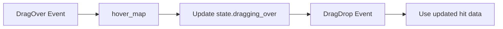

+++
title = "#21853 fix: return current hit for DragDrop event"
date = "2025-11-25T00:00:00"
draft = false
template = "pull_request_page.html"
in_search_index = false

[extra]
current_language = "zh-cn"
available_languages = {"en" = { name = "English", url = "/pull_request/bevy/2025-11/pr-21853-en-20251125" }, "zh-cn" = { name = "中文", url = "/pull_request/bevy/2025-11/pr-21853-zh-cn-20251125" }}
labels = ["C-Bug", "D-Straightforward", "A-Picking"]
+++

# Title
修复 DragDrop 事件返回当前命中的问题

## Basic Information
- **Title**: fix: return current hit for DragDrop event
- **PR Link**: https://github.com/bevyengine/bevy/pull/21853
- **Author**: moe-moe-pupil
- **Status**: MERGED
- **Labels**: C-Bug, D-Straightforward, S-Needs-Review, A-Picking
- **Created**: 2025-11-15T23:29:28Z
- **Merged**: 2025-11-25T02:26:39Z
- **Merged By**: alice-i-cecile

## Description Translation
# 目标

- 之前，DragDrop 事件中的 hit 字段是 DragEnter 事件的克隆。
- 修复 #21849。

## 解决方案

- 描述用于实现上述目标的解决方案。
  - 使用 hover_map 中的 hit 而不是 state.dragging_over 中的 hit

## 测试

- 你测试过这些更改吗？如果是，如何测试的？
  - 是的，在我的 Mac 上测试了这个简单的演示和 examples/picking/debug_picking.rs 以及 ui_drag_and_drop.rs。
- 是否有任何部分需要更多测试？
  - 不，我认为足够了。
- 其他人（审阅者）如何测试你的更改？他们需要了解什么具体内容吗？
  - 我在底部粘贴了用于测试的代码
- 如果相关，你在哪些平台上测试了这些更改，是否有任何重要平台你无法测试？
  - Mac，但这不重要
---

## 展示

https://github.com/user-attachments/assets/ff35a03d-00a0-41b8-952f-3f2e77530d5a

https://github.com/user-attachments/assets/a7aa5172-f89c-4010-a153-b90171621204

<details>
  <summary>点击查看展示</summary>

```rust
use bevy::{
    prelude::*,
    window::WindowMode,
};

#[derive(Component)]
struct Area;

#[derive(Component)]
struct ExampleButton;

#[derive(Component)]
struct GhostElement;

#[derive(Component)]
struct Element;


const AREA_SIZE: f32 = 500.0;
const BUTTON_SIZE: i32 = 50;
const ELEMENT_SIZE: f32 = 25.0;

#[bevy_main]
pub fn main() -> AppExit {
    App::new()
        .add_plugins((
            DefaultPlugins
                .set(WindowPlugin {
                    primary_window: Some(Window {
                        mode: WindowMode::BorderlessFullscreen(MonitorSelection::Primary),
                        ..default()
                    }),
                    ..default()
                }),
            MeshPickingPlugin,
        ))
        .add_systems(Startup, setup)
        .run()
}

fn setup(
    mut commands: Commands,
    mut meshes: ResMut<Assets<Mesh>>,
    mut materials: ResMut<Assets<ColorMaterial>>,
) {
    commands.spawn(Camera2d);

    commands.spawn((
        Node {
            width: percent(100),
            height: percent(100),
            align_items: AlignItems::Center,
            justify_content: JustifyContent::Start,
            ..default()
        },
        Pickable::IGNORE,
    ))
        .with_children(|parent| {
            parent.spawn((
                ExampleButton,
                Button,
                Node {
                    width: px(BUTTON_SIZE),
                    height: px(BUTTON_SIZE),
                    margin: UiRect::all(px(10)),
                    border_radius: BorderRadius::MAX,
                    ..default()
                },
                BackgroundColor(Color::srgb(1.0, 0.0, 0.0)),
            ))
                .observe(|mut event: On<Pointer<DragStart>>, mut button_color: Single<&mut BackgroundColor, With<ExampleButton>>| {
                    button_color.0 = Color::srgb(1.0, 0.5, 0.0);
                    event.propagate(false);
                })
                .observe(|mut event: On<Pointer<DragEnd>>, mut button_color: Single<&mut BackgroundColor, With<ExampleButton>>| {
                    button_color.0 = Color::srgb(1.0, 0.0, 0.0);
                    event.propagate(false);
                });
        });


    commands.spawn((
        Area,
        Mesh2d(meshes.add(Rectangle::new(AREA_SIZE, AREA_SIZE))),
        MeshMaterial2d(materials.add(Color::srgb(0.1, 0.4, 0.1))),
        Transform::IDENTITY,
    ))
        .observe(on_enter)
        .observe(on_over)
        .observe(on_drop)
        .observe(on_leave);
}


fn on_enter(
    mut event: On<Pointer<DragEnter>>,
    button: Single<Entity, With<ExampleButton>>,
    mut commands: Commands,
    mut meshes: ResMut<Assets<Mesh>>,
    mut materials: ResMut<Assets<ColorMaterial>>,
) {
    if event.dragged == *button {
        let Some(position) = event.hit.position else { return; };
        commands.spawn((
            GhostElement,
            Mesh2d(meshes.add(Circle::new(ELEMENT_SIZE))),
            MeshMaterial2d(materials.add(Color::srgba(1.0, 1.0, 0.6, 0.5))),
            Transform::from_translation(position),
            Pickable::IGNORE,
        ));
        event.propagate(false);
    }
}


fn on_over(
    mut event: On<Pointer<DragOver>>,
    button: Single<Entity, With<ExampleButton>>,
    mut ghost_element_transform: Single<&mut Transform, With<GhostElement>>,
) {
    if event.dragged == *button {
        let Some(position) = event.hit.position else { return; };
        ghost_element_transform.translation = position;
        event.propagate(false);
    }
}

 fn on_drop(
    mut event: On<Pointer<DragDrop>>,
    button: Single<Entity, With<ExampleButton>>,
    mut commands: Commands,
    ghost_element: Single<Entity, With<GhostElement>>,
    mut meshes: ResMut<Assets<Mesh>>,
    mut materials: ResMut<Assets<ColorMaterial>>,
) {
    if event.dropped == *button {
        println!("{:?}", event);
        commands.entity(*ghost_element).despawn();
        let Some(position) = event.hit.position else { return; };
        commands.spawn((
            Element,
            Mesh2d(meshes.add(Circle::new(ELEMENT_SIZE))),
            MeshMaterial2d(materials.add(Color::srgb(1.0, 1.0, 0.6))),
            Transform::from_translation(position),
            Pickable::IGNORE,
        ));
        event.propagate(false);
    }
}

fn on_leave(
    mut event: On<Pointer<DragLeave>>,
    button: Single<Entity, With<ExampleButton>>,
    mut commands: Commands,
    ghost_element: Single<Entity, With<GhostElement>>,
) {
    if event.dragged == *button {
        commands.entity(*ghost_element).despawn();
        event.propagate(false);
    }
}
```

</details>

## The Story of This Pull Request

这个 PR 解决了一个在 Bevy 引擎的拖放功能中的具体问题。问题的核心在于 DragDrop 事件中的 hit 数据没有正确反映拖放操作完成时的实际位置。

### 问题分析

在拖放交互中，当用户开始拖动一个元素时，系统会记录初始的命中位置。随着拖动的进行，指针会移动到不同的位置，但 DragDrop 事件仍然使用最初记录的命中数据，而不是当前的实际位置。这导致了拖放操作的位置不准确。

具体来说，问题出现在 `pointer_events` 系统中处理 DragOver 事件的部分。系统需要跟踪拖动过程中指针与目标元素的交互状态，但在 DragDrop 事件触发时，它使用的是初始的命中数据而不是实时更新的数据。

### 解决方案

修复方法是在每次处理 DragOver 事件时，更新 `state.dragging_over` 中的命中数据。这样当 DragDrop 事件最终触发时，就能使用最新的命中位置信息。

关键修改是在 `crates/bevy_picking/src/events.rs` 文件中添加了一行代码：

```rust
*state.dragging_over.get_mut(&hovered_entity).unwrap() = hit.clone();
```

这行代码的作用是：对于每个被悬停的实体，将其在 `dragging_over` 状态中的命中数据更新为当前帧中的最新命中数据。

### 技术实现细节

这个修改利用了 Bevy 的事件系统和状态管理机制。`hover_map` 包含了当前帧中所有悬停目标的实时命中数据，而 `state.dragging_over` 则跟踪拖动过程中的状态。通过将两者同步，确保了 DragDrop 事件能够使用准确的当前位置信息。

从工程角度看，这个修复遵循了最小化修改的原则，只添加了必要的一行代码来解决问题，没有引入不必要的复杂性或破坏现有功能。

### 影响和验证

这个修复对于需要精确拖放位置的应用特别重要，比如 UI 编辑器、游戏中的物品放置系统等。PR 作者提供了详细的测试用例和展示视频，验证了修复的有效性。

从代码质量的角度看，这个修改：
- 解决了具体的问题而没有引入副作用
- 保持了代码的简洁性和可读性
- 与现有的架构模式保持一致

## Visual Representation



## Key Files Changed

### `crates/bevy_picking/src/events.rs`

这个文件包含了指针事件处理的核心逻辑。修改发生在 `pointer_events` 函数中，具体是在处理 DragOver 事件的部分。

**关键修改：**
```rust
// 在 DragOver 事件处理循环中添加了这行代码
for (hovered_entity, hit) in hover_map
    .iter()
    .flat_map(|h| h.iter().map(|(entity, data)| (*entity, data.to_owned())))
    .filter(|(hovered_entity, _)| *hovered_entity != *drag_target)
{
    // 新增的代码行 - 更新 dragging_over 状态中的命中数据
    *state.dragging_over.get_mut(&hovered_entity).unwrap() = hit.clone();
    
    let drag_over_event = Pointer::new(
        pointer_id,
        location.clone(),
        drag_target_entity,
        Some(*drag_target),
        *hovered_entity,
        hit,
        event.dragged.clone(),
        event.button.clone(),
    );
    event_writer.send(drag_over_event);
}
```

这行修改确保了在 DragOver 事件处理期间，`state.dragging_over` 中的命中数据会与当前的 `hover_map` 保持同步，从而在后续的 DragDrop 事件中使用准确的位置信息。

## Further Reading

- [Bevy Picking 官方文档](https://github.com/bevyengine/bevy/tree/main/crates/bevy_picking)
- [Bevy 事件系统](https://bevy-cheatbook.github.io/programming/events.html)
- [UI 拖放交互设计模式](https://developer.mozilla.org/en-US/docs/Web/API/HTML_Drag_and_Drop_API)

# Full Code Diff
diff --git a/crates/bevy_picking/src/events.rs b/crates/bevy_picking/src/events.rs
index 1e3ec18f38851..6e25bd235c891 100644
--- a/crates/bevy_picking/src/events.rs
+++ b/crates/bevy_picking/src/events.rs
@@ -766,6 +766,7 @@ pub fn pointer_events(
                             .flat_map(|h| h.iter().map(|(entity, data)| (*entity, data.to_owned())))
                             .filter(|(hovered_entity, _)| *hovered_entity != *drag_target)
                         {
+                            *state.dragging_over.get_mut(&hovered_entity).unwrap() = hit.clone();
                             let drag_over_event = Pointer::new(
                                 pointer_id,
                                 location.clone(),