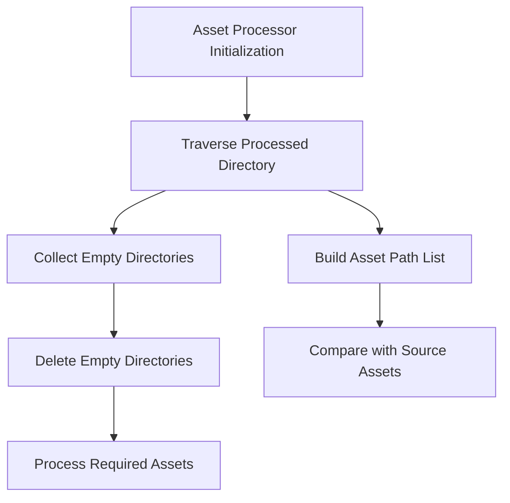

+++
title = "#21855 Add tests for processor initialization and fix a bug with initialization."
date = "2025-11-20T00:00:00"
draft = false
template = "pull_request_page.html"
in_search_index = true

[taxonomies]
list_display = ["show"]

[extra]
current_language = "en"
available_languages = {"en" = { name = "English", url = "/pull_request/bevy/2025-11/pr-21855-en-20251120" }, "zh-cn" = { name = "中文", url = "/pull_request/bevy/2025-11/pr-21855-zh-cn-20251120" }}
labels = ["A-Assets", "C-Testing", "D-Straightforward"]
+++

# Add tests for processor initialization and fix a bug with initialization.

## Basic Information
- **Title**: Add tests for processor initialization and fix a bug with initialization.
- **PR Link**: https://github.com/bevyengine/bevy/pull/21855
- **Author**: andriyDev
- **Status**: MERGED
- **Labels**: A-Assets, S-Ready-For-Final-Review, C-Testing, D-Straightforward
- **Created**: 2025-11-16T05:21:29Z
- **Merged**: 2025-11-20T01:00:48Z
- **Merged By**: alice-i-cecile

## Description Translation
# Objective

- We have no tests on the initialization process with an existing processing state.
- There was a bug (caught by these tests!) where we were deleting directories while we were iterating through them, resulting in us missing directories in some cases.

## Solution

- Add two tests to ensure processor init does what we expect with existing processed assets.
- Store all the empty directories in a Vec while iterating and then delete them all after we're done iterating.

## Testing

- Yup!

## The Story of This Pull Request

This PR addresses a gap in the Bevy asset processor's test coverage and fixes a subtle bug discovered during that testing effort. The core issue revolves around how the asset processor handles initialization when there are already processed assets present.

The problem emerged from the processor's directory cleanup logic. During initialization, the processor scans the processed asset directory to determine which assets need to be processed or re-processed. As part of this process, it removes empty directories to clean up after assets that may have been deleted. However, the original implementation was deleting these directories *while* iterating through the directory structure.

The bug occurred because modifying the directory structure during iteration can cause the directory iterator to skip over paths. This is similar to the common programming error of modifying a collection while iterating over it. In file system terms, when you remove a directory during traversal, the iterator's internal state may become invalid, potentially causing it to miss subsequent directories.

The solution implemented here takes a straightforward approach: instead of deleting empty directories immediately upon discovery, the code now collects them in a `Vec<PathBuf>` during iteration and then deletes them all after the iteration is complete. This ensures the directory structure remains stable during traversal.

The PR adds two comprehensive tests that validate the processor's behavior with existing processed assets:

1. **`clears_invalid_data_from_processed_dir`** - Tests that the processor correctly cleans up orphaned assets (assets present in processed directory but not in source) and removes empty directories.

2. **`only_reprocesses_wrong_hash_on_startup`** - Tests that the processor only reprocesses assets whose source has changed or whose dependencies have changed, avoiding unnecessary reprocessing of unchanged assets.

These tests revealed the directory deletion bug and now serve as regression tests to prevent similar issues in the future. The test scenarios are carefully constructed to simulate real-world conditions where processed assets might be present from previous runs, including assets with correct data but missing metadata, orphaned assets, and complex dependency chains.

The implementation demonstrates good software engineering practices by first writing tests that expose the problem, then fixing the bug, and finally using those same tests to validate the fix and prevent regressions.

## Visual Representation



## Key Files Changed

### `crates/bevy_asset/src/processor/mod.rs`

This file contains the core asset processor logic. The key change modifies how empty directories are handled during initialization.

**Key changes:**
- Modified `get_asset_paths` function signature to accept an optional `empty_dirs` vector
- Changed from immediate directory deletion to collection and batch deletion
- Added explicit comment explaining why deletion must happen after iteration

```rust
// Before:
if !contains_files
    && path.parent().is_some()
    && let Some(writer) = clean_empty_folders_writer
{
    // it is ok for this to fail as it is just a cleanup job.
    let _ = writer.remove_empty_directory(&path).await;
}

// After:
// Add the current directory after all its subdirectories so we delete any empty
// subdirectories before the current directory.
if !contains_files
    && path.parent().is_some()
    && let Some(empty_dirs) = empty_dirs
{
    empty_dirs.push(path);
}
```

### `crates/bevy_asset/src/processor/tests.rs`

This file received extensive additions with two new comprehensive tests and a helper function.

**Key additions:**
- Added `serialize_as_cool_text` helper function for test asset creation
- Added `clears_invalid_data_from_processed_dir` test
- Added `only_reprocesses_wrong_hash_on_startup` test

```rust
// New helper function for creating test assets
fn serialize_as_cool_text(text: &str) -> String {
    let cool_text_ron = CoolTextRon {
        text: text.into(),
        dependencies: vec![],
        embedded_dependencies: vec![],
        sub_texts: vec![],
    };
    ron::ser::to_string_pretty(&cool_text_ron, PrettyConfig::new().new_line("\n")).unwrap()
}

// Example test structure showing comprehensive scenario setup
#[test]
fn clears_invalid_data_from_processed_dir() {
    // Test setup creates various scenarios:
    // - Assets with correct data but no metadata (should be reprocessed)
    // - Orphaned assets not present in source (should be deleted)
    // - Empty directories (should be deleted)
    // Complex assertions verify the expected state after processing
}
```

## Further Reading

- [Rust Iterator Documentation](https://doc.rust-lang.org/std/iter/trait.Iterator.html) - Understanding iterator behavior and the risks of modifying during iteration
- [Bevy Asset System Documentation](https://bevyengine.org/learn/book/getting-started/assets/) - Context for how the asset processor fits into Bevy's architecture
- [Software Testing Principles](https://en.wikipedia.org/wiki/Software_testing) - Background on the testing methodology used in this PR