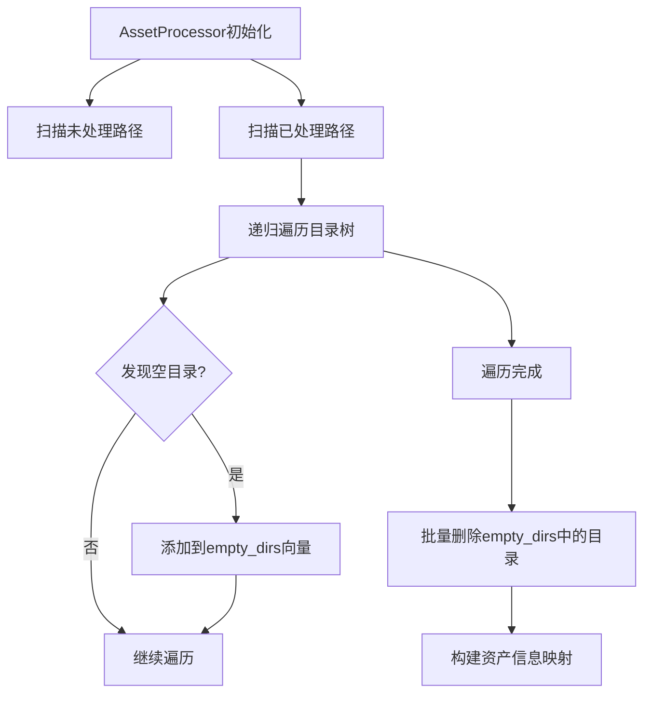

+++
title = "#21855 Add tests for processor initialization and fix a bug with initialization."
date = "2025-11-20T00:00:00"
draft = false
template = "pull_request_page.html"
in_search_index = false

[extra]
current_language = "zh-cn"
available_languages = {"en" = { name = "English", url = "/pull_request/bevy/2025-11/pr-21855-en-20251120" }, "zh-cn" = { name = "中文", url = "/pull_request/bevy/2025-11/pr-21855-zh-cn-20251120" }}
labels = ["A-Assets", "C-Testing", "D-Straightforward"]
+++

# Add tests for processor initialization and fix a bug with initialization.

## Basic Information
- **Title**: Add tests for processor initialization and fix a bug with initialization.
- **PR Link**: https://github.com/bevyengine/bevy/pull/21855
- **Author**: andriyDev
- **Status**: MERGED
- **Labels**: A-Assets, S-Ready-For-Final-Review, C-Testing, D-Straightforward
- **Created**: 2025-11-16T05:21:29Z
- **Merged**: 2025-11-20T01:00:48Z
- **Merged By**: alice-i-cecile

## Description Translation
**目标**

- 我们目前没有针对存在处理状态时的初始化过程的测试。
- 存在一个bug（由这些测试捕获！）：在迭代目录时删除目录，导致在某些情况下会遗漏目录。

**解决方案**

- 添加两个测试，确保处理器初始化在存在已处理资产时按预期进行。
- 在迭代过程中将所有空目录存储在一个Vec中，然后在迭代完成后一次性删除。

**测试**

- 是的！

## The Story of This Pull Request

这个PR主要解决Bevy资产处理器初始化过程中的一个潜在bug，并通过添加测试来确保初始化行为的正确性。

### 问题背景

在资产处理器的初始化过程中，代码需要扫描已处理资产目录并清理空目录。原来的实现存在一个问题：在递归遍历目录树时，一旦发现空目录就立即删除。这导致了在迭代过程中修改了正在遍历的目录结构，可能会使目录迭代器跳过后续的目录项，导致某些空目录没有被正确清理。

### 解决方案

开发者采用了直接的修复方法：不再在遍历过程中立即删除空目录，而是先收集所有需要删除的空目录路径，在遍历完成后统一删除。这种方法避免了在迭代过程中修改被迭代的集合，是一个经典的并发修改问题的解决方案。

### 实现细节

在`get_asset_paths`函数中，关键的修改包括：

- 移除了`clean_empty_folders_writer`参数
- 添加了`empty_dirs`参数来收集空目录路径
- 将空目录添加到收集器中而不是立即删除
- 在初始化函数中，遍历完成后统一删除收集到的空目录

代码修改的核心逻辑是：

```rust
// 修改前：立即删除空目录
if !contains_files && path.parent().is_some() && let Some(writer) = clean_empty_folders_writer {
    let _ = writer.remove_empty_directory(&path).await;
}

// 修改后：收集空目录路径
if !contains_files && path.parent().is_some() && let Some(empty_dirs) = empty_dirs {
    empty_dirs.push(path);
}
```

然后在初始化函数中添加了后续删除逻辑：

```rust
// 在获取所有路径后删除空目录
for empty_dir in empty_dirs {
    let _ = processed_writer.remove_empty_directory(&empty_dir).await;
}
```

### 测试验证

为了确保修复的有效性，PR添加了两个重要的测试：

1. **`clears_invalid_data_from_processed_dir`** - 测试处理器能够正确清理处理目录中的无效数据，包括：
   - 缺少对应源资产的已处理资产
   - 空目录
   - 缺少元数据的资产

2. **`only_reprocesses_wrong_hash_on_startup`** - 验证处理器只在哈希值改变时重新处理资产，确保初始化过程的正确性

测试使用了计数转换器来跟踪资产被处理的次数，验证了只有真正需要重新处理的资产才会被再次处理。

### 技术洞察

这个修复体现了在处理文件系统操作时的一个重要原则：避免在遍历过程中修改被遍历的集合。这在处理目录结构时尤其重要，因为文件系统操作可能会影响迭代器的行为。

同时，PR展示了良好的测试实践：先通过测试发现bug，然后修复bug，最后用测试验证修复的有效性。这种测试驱动的方法确保了代码质量。

## Visual Representation



## Key Files Changed

### `crates/bevy_asset/src/processor/mod.rs` (+18/-9)

这个文件包含了核心的bug修复：

**主要修改：**
- 重构了`get_asset_paths`函数，将立即删除空目录改为先收集后删除
- 在初始化过程中添加了批量删除空目录的逻辑

**关键代码片段：**
```rust
// 修改后的get_asset_paths函数签名
async fn get_asset_paths(
    reader: &dyn ErasedAssetReader,
    path: PathBuf,
    paths: &mut Vec<PathBuf>,
    mut empty_dirs: Option<&mut Vec<PathBuf>>,  // 新增参数：收集空目录
) -> Result<bool, AssetReaderError>

// 新增的批量删除逻辑
for empty_dir in empty_dirs {
    // We don't care if this succeeds, since it's just a cleanup task. It is best-effort
    let _ = processed_writer.remove_empty_directory(&empty_dir).await;
}
```

### `crates/bevy_asset/src/processor/tests.rs` (+271/-9)

这个文件添加了全面的测试用例：

**主要修改：**
- 添加了`serialize_as_cool_text`辅助函数
- 新增了两个测试函数验证初始化行为

**关键测试代码：**
```rust
#[test]
fn clears_invalid_data_from_processed_dir() {
    // 测试处理器清理无效数据的能力
    // 包括：缺少源资产的已处理资产、空目录等
}

#[test]  
fn only_reprocesses_wrong_hash_on_startup() {
    // 测试处理器只在哈希改变时重新处理资产
    // 使用计数转换器验证处理次数
}
```

## Further Reading

- [Rust文件系统操作最佳实践](https://doc.rust-lang.org/std/fs/index.html)
- [Bevy资产处理器文档](https://bevyengine.org/learn/books/assets/asset-processor/)
- [测试驱动开发(TDD)原则](https://en.wikipedia.org/wiki/Test-driven_development)