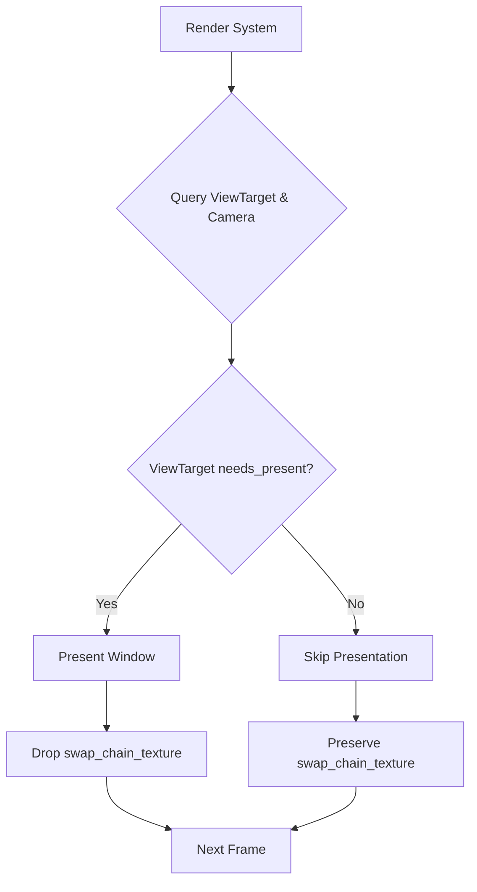

+++
title = "#21866 Only present when RenderTarget has been written to"
date = "2025-11-26T00:00:00"
draft = false
template = "pull_request_page.html"
in_search_index = true

[taxonomies]
list_display = ["show"]

[extra]
current_language = "en"
available_languages = {"en" = { name = "English", url = "/pull_request/bevy/2025-11/pr-21866-en-20251126" }, "zh-cn" = { name = "中文", url = "/pull_request/bevy/2025-11/pr-21866-zh-cn-20251126" }}
labels = ["C-Feature", "A-Rendering"]
+++

# Only present when RenderTarget has been written to

## Basic Information
- **Title**: Only present when RenderTarget has been written to
- **PR Link**: https://github.com/bevyengine/bevy/pull/21866
- **Author**: tychedelia
- **Status**: MERGED
- **Labels**: C-Feature, A-Rendering, S-Ready-For-Final-Review
- **Created**: 2025-11-17T01:21:56Z
- **Merged**: 2025-11-26T22:15:03Z
- **Merged By**: mockersf

## Description Translation
For Processing, we sometimes want to accumulate multiple render updates in the intermediate view texture prior to calling present. Right now, any time the render graph runs it will try to unconditionally present, regardless of whether any work has actually been written to the output target causing unnecessary churn and wasting battery. This is particularly problematic for us as we have a requirement that only a single camera can be active at a time, so to render 3 cameras we need to run app update 3 times at least.

NB: previous comments regarding `ViewTarget` may be misleading. You don't have to drop views when re-creating the swapchain, just the existing texture as far as I can tell.

To test:
<details>

```rust
//! A simple 3D scene with light shining over a cube sitting on a plane.

use bevy::camera::CameraOutputMode;
use bevy::prelude::*;

fn main() {
    App::new()
        .add_plugins(DefaultPlugins)
        .add_systems(Startup, setup)
        .add_systems(Update, update)
        .run();
}

/// set up a simple 3D scene
fn setup(
    mut commands: Commands,
    mut meshes: ResMut<Assets<Mesh>>,
    mut materials: ResMut<Assets<StandardMaterial>>,
) {
    // circular base
    commands.spawn((
        Mesh3d(meshes.add(Circle::new(4.0))),
        MeshMaterial3d(materials.add(Color::WHITE)),
        Transform::from_rotation(Quat::from_rotation_x(-std::f32::consts::FRAC_PI_2)),
    ));
    // cube
    commands.spawn((
        Mesh3d(meshes.add(Cuboid::new(1.0, 1.0, 1.0))),
        MeshMaterial3d(materials.add(Color::srgb_u8(124, 144, 255))),
        Transform::from_xyz(0.0, 0.5, 0.0),
    ));
    // light
    commands.spawn((
        PointLight {
            shadows_enabled: true,
            ..default()
        },
        Transform::from_xyz(4.0, 8.0, 4.0),
    ));
    // camera
    commands.spawn((
        Camera3d::default(),
        Transform::from_xyz(-2.5, 4.5, 9.0).looking_at(Vec3::ZERO, Vec3::Y),
    ));
}

fn update(buttons: Res<ButtonInput<KeyCode>>, mut cameras: Query<&mut Camera>) {
    if buttons.just_pressed(KeyCode::Space) {
        for mut camera in &mut cameras {
            match camera.output_mode {
                CameraOutputMode::Write { .. } => {
                    camera.output_mode = CameraOutputMode::Skip;
                }
                CameraOutputMode::Skip => {
                    camera.output_mode = CameraOutputMode::default();
                }
            }
        }
    }
}
```
</details>

## The Story of This Pull Request

This PR addresses a performance optimization problem in Bevy's rendering system where swap chain presentation was happening unconditionally every frame, regardless of whether any actual rendering work had been done to the output target. The issue was particularly problematic for applications that need to accumulate multiple render updates before presenting, or when using multiple cameras that don't all render every frame.

The core problem stemmed from Bevy's previous approach to handling swap chain textures. In the original implementation, the render system would always remove all `ViewTarget` components at the end of each frame and present every window's swap chain texture. This caused unnecessary GPU work and battery drain, especially in scenarios where cameras could be toggled between rendering modes.

The solution implemented in this PR introduces a conditional presentation mechanism that only presents windows when their associated render targets have actually been written to. The implementation follows a clear technical approach:

First, the PR adds tracking capability to determine if a render target has been used. In `texture_attachment.rs`, a new `needs_present()` method is added to `OutputColorAttachment` that leverages the existing `is_first_call` atomic flag to track whether the attachment has been written to by a render pass. This is a clever reuse of existing state that avoids adding new tracking overhead.

```rust
pub fn needs_present(&self) -> bool {
    !self.is_first_call.load(Ordering::SeqCst)
}
```

This capability is then exposed through the `ViewTarget` in `view/mod.rs`:

```rust
pub fn needs_present(&self) -> bool {
    self.out_texture.needs_present()
}
```

The main rendering logic in `renderer/mod.rs` undergoes significant changes. Instead of querying just for entities with `ViewTarget`, the system now queries for both `ViewTarget` and `ExtractedCamera` components. The presentation logic becomes conditional:

```rust
for (view_target, camera) in views.iter() {
    if let Some(NormalizedRenderTarget::Window(window)) = camera.target
        && view_target.needs_present()
    {
        let Some(window) = windows.get_mut(&window.entity()) else {
            continue;
        };
        window.present();
    }
}
```

This change eliminates the previous practice of unconditionally removing `ViewTarget` components, which was originally thought necessary for swap chain re-creation but proved to be overly aggressive.

The window management system in `view/window/mod.rs` gets enhanced with better swap chain texture lifecycle management. A new `present()` method is added to `ExtractedWindow` that handles the actual presentation:

```rust
pub fn present(&mut self) {
    if let Some(surface_texture) = self.swap_chain_texture.take() {
        surface_texture.present();
    }
}
```

The extraction and preparation logic is updated to preserve swap chain textures when they haven't been presented, reducing unnecessary re-creation:

```rust
if extracted_window.swap_chain_texture.is_none() {
    extracted_window.swap_chain_texture_view = None;
}
```

And in `prepare_windows`, the system now skips swap chain re-creation when the existing texture is still valid:

```rust
if window.has_swapchain_texture() && !window.size_changed && !window.present_mode_changed {
    continue;
}
```

The technical insight here is that swap chain textures don't need to be recreated every frame if they haven't been presented and the window configuration hasn't changed. This optimization reduces GPU overhead and improves battery life, especially for applications that render intermittently.

The impact of these changes is substantial for applications that use camera toggling or multi-pass rendering. The provided test case demonstrates this by allowing users to toggle camera output modes with the space bar, switching between `Write` and `Skip` modes. When cameras are in `Skip` mode, their associated windows won't be presented, saving significant computational resources.

This implementation maintains backward compatibility while providing meaningful performance improvements. The changes are particularly beneficial for mobile applications and other battery-constrained environments where unnecessary GPU work directly impacts user experience.

## Visual Representation



## Key Files Changed

### `crates/bevy_render/src/renderer/mod.rs`
This file contains the main rendering system logic. The changes transition from unconditional presentation to conditional presentation based on whether render targets have been written to.

```rust
// Before:
let view_entities = state.get(world).iter().collect::<Vec<_>>();
for view_entity in view_entities {
    world.entity_mut(view_entity).remove::<ViewTarget>();
}

let mut windows = world.resource_mut::<ExtractedWindows>();
for window in windows.values_mut() {
    if let Some(surface_texture) = window.swap_chain_texture.take() {
        surface_texture.present();
    }
}

// After:
world.resource_scope(|world, mut windows: Mut<ExtractedWindows>| {
    let views = state.get(world);
    for (view_target, camera) in views.iter() {
        if let Some(NormalizedRenderTarget::Window(window)) = camera.target
            && view_target.needs_present()
        {
            let Some(window) = windows.get_mut(&window.entity()) else {
                continue;
            };
            window.present();
        }
    }
});
```

### `crates/bevy_render/src/texture/texture_attachment.rs`
Added the core tracking mechanism to determine if an attachment has been written to.

```rust
pub fn needs_present(&self) -> bool {
    !self.is_first_call.load(Ordering::SeqCst)
}
```

### `crates/bevy_render/src/view/mod.rs`
Exposed the presentation tracking through the ViewTarget interface.

```rust
pub fn needs_present(&self) -> bool {
    self.out_texture.needs_present()
}
```

### `crates/bevy_render/src/view/window/mod.rs`
Enhanced window management with better swap chain lifecycle handling and conditional presentation.

```rust
pub fn present(&mut self) {
    if let Some(surface_texture) = self.swap_chain_texture.take() {
        surface_texture.present();
    }
}

// In extraction:
if extracted_window.swap_chain_texture.is_none() {
    extracted_window.swap_chain_texture_view = None;
}

// In preparation:
if window.has_swapchain_texture() && !window.size_changed && !window.present_mode_changed {
    continue;
}
```

## Further Reading

- [Bevy Render Graph Documentation](https://bevyengine.org/learn/quick-start/rendering/render-graph/)
- [wgpu Surface Presentation](https://docs.rs/wgpu/latest/wgpu/struct.Surface.html#method.get_current_texture)
- [Vulkan Swap Chain Management](https://vulkan-tutorial.com/Drawing_a_triangle/Presentation/Swap_chain)