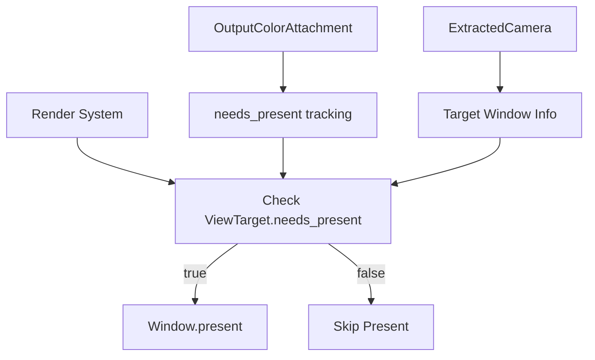

+++
title = "#21866 Only present when RenderTarget has been written to"
date = "2025-11-26T00:00:00"
draft = false
template = "pull_request_page.html"
in_search_index = false

[extra]
current_language = "zh-cn"
available_languages = {"en" = { name = "English", url = "/pull_request/bevy/2025-11/pr-21866-en-20251126" }, "zh-cn" = { name = "中文", url = "/pull_request/bevy/2025-11/pr-21866-zh-cn-20251126" }}
+++

# Only present when RenderTarget has been written to

## 基本信息
- **标题**: Only present when RenderTarget has been written to
- **PR链接**: https://github.com/bevyengine/bevy/pull/21866
- **作者**: tychedelia
- **状态**: 已合并
- **标签**: C-Feature, A-Rendering, S-Ready-For-Final-Review
- **创建时间**: 2025-11-17T01:21:56Z
- **合并时间**: 2025-11-26T22:15:03Z
- **合并者**: mockersf

## 描述翻译
在处理渲染时，我们有时希望在调用呈现(present)之前在中间视图纹理中累积多个渲染更新。目前，每当渲染图运行时，它都会无条件地尝试呈现，而不管是否有任何工作实际写入到输出目标，这会导致不必要的性能损耗和电池浪费。这对我们来说尤其成问题，因为我们有一个要求，即一次只能有一个相机处于活动状态，因此要渲染3个相机，我们至少需要运行应用更新3次。

注意：之前关于`ViewTarget`的评论可能有误导性。就我所知，在重新创建交换链时，你不必丢弃视图，只需要丢弃现有的纹理。

测试方法：
<details>

```rust
//! A simple 3D scene with light shining over a cube sitting on a plane.

use bevy::camera::CameraOutputMode;
use bevy::prelude::*;

fn main() {
    App::new()
        .add_plugins(DefaultPlugins)
        .add_systems(Startup, setup)
        .add_systems(Update, update)
        .run();
}

/// set up a simple 3D scene
fn setup(
    mut commands: Commands,
    mut meshes: ResMut<Assets<Mesh>>,
    mut materials: ResMut<Assets<StandardMaterial>>,
) {
    // circular base
    commands.spawn((
        Mesh3d(meshes.add(Circle::new(4.0))),
        MeshMaterial3d(materials.add(Color::WHITE)),
        Transform::from_rotation(Quat::from_rotation_x(-std::f32::consts::FRAC_PI_2)),
    ));
    // cube
    commands.spawn((
        Mesh3d(meshes.add(Cuboid::new(1.0, 1.0, 1.0))),
        MeshMaterial3d(materials.add(Color::srgb_u8(124, 144, 255))),
        Transform::from_xyz(0.0, 0.5, 0.0),
    ));
    // light
    commands.spawn((
        PointLight {
            shadows_enabled: true,
            ..default()
        },
        Transform::from_xyz(4.0, 8.0, 4.0),
    ));
    // camera
    commands.spawn((
        Camera3d::default(),
        Transform::from_xyz(-2.5, 4.5, 9.0).looking_at(Vec3::ZERO, Vec3::Y),
    ));
}

fn update(buttons: Res<ButtonInput<KeyCode>>, mut cameras: Query<&mut Camera>) {
    if buttons.just_pressed(KeyCode::Space) {
        for mut camera in &mut cameras {
            match camera.output_mode {
                CameraOutputMode::Write { .. } => {
                    camera.output_mode = CameraOutputMode::Skip;
                }
                CameraOutputMode::Skip => {
                    camera.output_mode = CameraOutputMode::default();
                }
            }
        }
    }
}
```
</details>

## 这个Pull Request的故事

这个PR解决了一个在渲染管线中的性能问题。问题的核心在于渲染系统总是无条件地调用present操作，即使没有实际的渲染内容需要显示。这在某些使用场景下会造成不必要的性能开销和电池消耗。

**问题背景**

在Bevy的渲染系统中，当需要渲染多个相机时，通常需要多次运行应用更新。然而，现有的实现每次渲染图运行时都会尝试呈现帧，无论是否真的有渲染内容写入到输出目标。这导致了两个主要问题：

1. 不必要的性能开销：即使没有渲染内容，系统仍然会执行present操作
2. 电池消耗增加：在移动设备上，不必要的GPU操作会显著增加功耗

**解决方案思路**

开发者采取了一个直接的解决方案：只在渲染目标确实被写入过时才执行present操作。这个方案的核心是引入了一个状态跟踪机制，用于判断渲染附件是否被实际使用过。

**实现细节**

实现分为几个关键部分：

首先，在`OutputColorAttachment`中添加了状态跟踪能力：

```rust
// crates/bevy_render/src/texture/texture_attachment.rs
/// Returns `true` if this attachment has been written to by a render pass.
// we re-use is_first_call atomic to track usage, which assumes that calls to get_attachment
// are always consumed by a render pass that writes to the attachment
pub fn needs_present(&self) -> bool {
    !self.is_first_call.load(Ordering::SeqCst)
}
```

这里巧妙地复用了现有的`is_first_call`原子变量来跟踪使用状态，避免了额外的内存开销。

接着，在`ViewTarget`中暴露了这个功能：

```rust
// crates/bevy_render/src/view/mod.rs
/// Whether the final texture this view will render to needs to be presented.
pub fn needs_present(&self) -> bool {
    self.out_texture.needs_present()
}
```

最重要的修改在渲染系统中，这里重构了整个present逻辑：

```rust
// crates/bevy_render/src/renderer/mod.rs
world.resource_scope(|world, mut windows: Mut<ExtractedWindows>| {
    let views = state.get(world);
    for (view_target, camera) in views.iter() {
        if let Some(NormalizedRenderTarget::Window(window)) = camera.target
            && view_target.needs_present()
        {
            let Some(window) = windows.get_mut(&window.entity()) else {
                continue;
            };
            window.present();
        }
    }
});
```

新的实现只对需要呈现的窗口执行present操作，并且移除了之前强制移除`ViewTarget`组件的逻辑，这解决了之前的一个技术限制。

**窗口管理优化**

为了支持这个新的优化，窗口管理逻辑也得到了改进：

```rust
// crates/bevy_render/src/view/window/mod.rs
pub fn present(&mut self) {
    if let Some(surface_texture) = self.swap_chain_texture.take() {
        // TODO(clean): winit docs recommends calling pre_present_notify before this.
        // though `present()` doesn't present the frame, it schedules it to be presented
        // by wgpu.
        // https://docs.rs/winit/0.29.9/wasm32-unknown-unknown/winit/window/struct.Window.html#method.pre_present_notify
        surface_texture.present();
    }
}
```

窗口现在有了自己的`present`方法，并且交换链纹理的管理更加智能，只在必要时才丢弃和重新创建。

**技术洞察**

这个实现的一个关键洞察是：通过复用现有的`is_first_call`状态，可以在不增加额外内存开销的情况下跟踪渲染附件的使用状态。这体现了良好的工程权衡 - 在保持简单性的同时解决了实际问题。

另一个重要的技术点是移除了之前强制移除`ViewTarget`组件的需求。正如PR描述中提到的，之前的理解有误 - 实际上只需要丢弃现有的纹理，而不需要完全丢弃视图。

**影响与改进**

这个优化带来了几个显著的改进：

1. **性能提升**：避免了不必要的present调用，减少了GPU工作负载
2. **电池寿命**：在移动设备上减少了不必要的功耗
3. **架构简化**：移除了强制组件移除的复杂逻辑
4. **更好的资源管理**：交换链纹理现在只在必要时才重新创建

这个PR展示了如何通过仔细分析渲染管线的实际需求，在不破坏现有API的情况下实现显著的性能优化。它也为将来更复杂的渲染场景管理奠定了基础。

## 视觉表示



## 关键文件变更

### `crates/bevy_render/src/renderer/mod.rs` (+19/-18)
这是最主要的修改文件，重构了渲染系统的present逻辑。

**关键变更：**
```rust
// 之前：无条件移除ViewTarget并present所有窗口
let view_entities = state.get(world).iter().collect::<Vec<_>>();
for view_entity in view_entities {
    world.entity_mut(view_entity).remove::<ViewTarget>();
}

let mut windows = world.resource_mut::<ExtractedWindows>();
for window in windows.values_mut() {
    if let Some(surface_texture) = window.swap_chain_texture.take() {
        surface_texture.present();
    }
}

// 之后：有条件地present，基于needs_present检查
world.resource_scope(|world, mut windows: Mut<ExtractedWindows>| {
    let views = state.get(world);
    for (view_target, camera) in views.iter() {
        if let Some(NormalizedRenderTarget::Window(window)) = camera.target
            && view_target.needs_present()
        {
            let Some(window) = windows.get_mut(&window.entity()) else {
                continue;
            };
            window.present();
        }
    }
});
```

### `crates/bevy_render/src/view/window/mod.rs` (+32/-4)
添加了窗口present方法和改进的交换链管理。

**关键变更：**
```rust
// 新增present方法
pub fn present(&mut self) {
    if let Some(surface_texture) = self.swap_chain_texture.take() {
        surface_texture.present();
    }
}

// 改进的纹理管理
if extracted_window.swap_chain_texture.is_none() {
    // 只有在之前调用了present时才丢弃交换链帧
    extracted_window.swap_chain_texture_view = None;
}
```

### `crates/bevy_render/src/texture/texture_attachment.rs` (+7/-0)
为输出颜色附件添加了使用状态跟踪。

**关键变更：**
```rust
/// Returns `true` if this attachment has been written to by a render pass.
pub fn needs_present(&self) -> bool {
    !self.is_first_call.load(Ordering::SeqCst)
}
```

### `crates/bevy_render/src/view/mod.rs` (+5/-0)
在ViewTarget中暴露needs_present方法。

**关键变更：**
```rust
/// Whether the final texture this view will render to needs to be presented.
pub fn needs_present(&self) -> bool {
    self.out_texture.needs_present()
}
```

## 进一步阅读

- [WebGPU Specification](https://www.w3.org/TR/webgpu/) - 了解现代图形API的工作原理
- [Bevy Render Graph Documentation](https://bevyengine.org/learn/quick-start/getting-started/systems/) - Bevy渲染图系统的基本概念
- [wgpu Present API](https://docs.rs/wgpu/latest/wgpu/struct.SurfaceTexture.html#method.present) - 了解present操作的具体实现