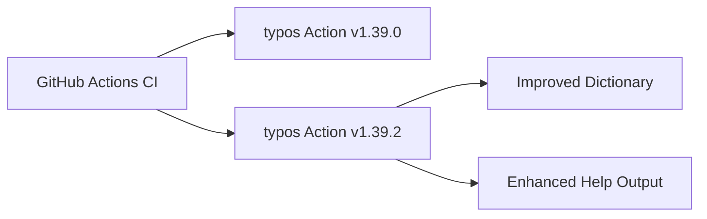

+++
title = "#21867 Bump crate-ci/typos from 1.39.0 to 1.39.2"
date = "2025-11-21T00:00:00"
draft = false
template = "pull_request_page.html"
in_search_index = true

[taxonomies]
list_display = ["show"]

[extra]
current_language = "en"
available_languages = {"en" = { name = "English", url = "/pull_request/bevy/2025-11/pr-21867-en-20251121" }, "zh-cn" = { name = "中文", url = "/pull_request/bevy/2025-11/pr-21867-zh-cn-20251121" }}
labels = ["D-Trivial", "A-Build-System", "C-Dependencies"]
+++

# Bump crate-ci/typos from 1.39.0 to 1.39.2

## Basic Information
- **Title**: Bump crate-ci/typos from 1.39.0 to 1.39.2
- **PR Link**: https://github.com/bevyengine/bevy/pull/21867
- **Author**: app/dependabot
- **Status**: MERGED
- **Labels**: D-Trivial, A-Build-System, C-Dependencies, S-Ready-For-Final-Review
- **Created**: 2025-11-17T06:01:06Z
- **Merged**: 2025-11-21T22:59:35Z
- **Merged By**: mockersf

## Description Translation
Bumps [crate-ci/typos](https://github.com/crate-ci/typos) from 1.39.0 to 1.39.2.
<details>
<summary>Release notes</summary>
<p><em>Sourced from <a href="https://github.com/crate-ci/typos/releases">crate-ci/typos's releases</a>.</em></p>
<blockquote>
<h2>v1.39.2</h2>
<h2>[1.39.2] - 2025-11-13</h2>
<h3>Fixes</h3>
<ul>
<li>Don't offer <code>entry</code> as a correction for <code>entrys</code></li>
</ul>
<h2>v1.39.1</h2>
<h2>[1.39.1] - 2025-11-12</h2>
<h3>Features</h3>
<ul>
<li>Make <code>--help</code> more vibrant</li>
</ul>
</blockquote>
</details>
<details>
<summary>Changelog</summary>
<p><em>Sourced from <a href="https://github.com/crate-ci/typos/blob/master/CHANGELOG.md">crate-ci/typos's changelog</a>.</em></p>
<blockquote>
<h2>[1.39.2] - 2025-11-13</h2>
<h3>Fixes</h3>
<ul>
<li>Don't offer <code>entry</code> as a correction for <code>entrys</code></li>
</ul>
<h2>[1.39.1] - 2025-11-12</h2>
<h3>Features</h3>
<ul>
<li>Make <code>--help</code> more vibrant</li>
</ul>
</blockquote>
</details>
<details>
<summary>Commits</summary>
<ul>
<li><a href="https://github.com/crate-ci/typos/commit/626c4bedb751ce0b7f03262ca97ddda9a076ae1c"><code>626c4be</code></a> chore: Release</li>
<li><a href="https://github.com/crate-ci/typos/commit/c6b458db05d00c3037bc9a1102b84febc9fff2f4"><code>c6b458d</code></a> docs: Update changelog</li>
<li><a href="https://github.com/crate-ci/typos/commit/eed04198a67af7f32b16141261aa8f911cba1f5f"><code>eed0419</code></a> Merge pull request <a href="https://redirect.github.com/crate-ci/typos/issues/1423">#1423</a> from epage/entrys</li>
<li><a href="https://github.com/crate-ci/typos/commit/40383f41a2f90743ef28b8c8b1c2d5a42b7651a0"><code>40383f4</code></a> fix(dict): Don't offer 'entry' as a correction for 'entrys'</li>
<li><a href="https://github.com/crate-ci/typos/commit/1af53e3774f068183ffd0c7193eb061a2b65a531"><code>1af53e3</code></a> chore: Release</li>
<li><a href="https://github.com/crate-ci/typos/commit/e5d291b81a9bd645c218da268c94df78b6e5e605"><code>e5d291b</code></a> docs: Update changelog</li>
<li><a href="https://github.com/crate-ci/typos/commit/55474f5ff9f9a923f4e1a218c9b39271517d847e"><code>55474f5</code></a> Merge pull request <a href="https://redirect.github.com/crate-ci/typos/issues/1417">#1417</a> from starsep/colorful_help</li>
<li><a href="https://github.com/crate-ci/typos/commit/78b93759507833a789853c44a1d9a767fcd15024"><code>78b9375</code></a> feat: Enable colors for typos --help</li>
<li><a href="https://github.com/crate-ci/typos/commit/308f8f5788c91e7d099279f046cdbc3662956dcd"><code>308f8f5</code></a> Merge pull request <a href="https://redirect.github.com/crate-ci/typos/issues/1409">#1409</a> from crate-ci/renovate/actions-download-artifact-6.x</li>
<li><a href="https://github.com/crate-ci/typos/commit/cf03418f507191943e33099ce6ba74c4c79b0257"><code>cf03418</code></a> Merge pull request <a href="https://redirect.github.com/crate-ci/typos/issues/1410">#1410</a> from crate-ci/renovate/actions-setup-python-6.x</li>
<li>Additional commits viewable in <a href="https://github.com/crate-ci/typos/compare/v1.39.0...v1.39.2">compare view</a></li>
</ul>
</details>
<br />


[](https://docs.github.com/en/github/managing-security-vulnerabilities/about-dependabot-security-updates#about-compatibility-scores)

Dependabot will resolve any conflicts with this PR as long as you don't alter it yourself. You can also trigger a rebase manually by commenting `@dependabot rebase`.

[//]: # (dependabot-automerge-start)
[//]: # (dependabot-automerge-end)

---

<details>
<summary>Dependabot commands and options</summary>
<br />

You can trigger Dependabot actions by commenting on this PR:
- `@dependabot rebase` will rebase this PR
- `@dependabot recreate` will recreate this PR, overwriting any edits that have been made to it
- `@dependabot merge` will merge this PR after your CI passes on it
- `@dependabot squash and merge` will squash and merge this PR after your CI passes on it
- `@dependabot cancel merge` will cancel a previously requested merge and block automerging
- `@dependabot reopen` will reopen this PR if it is closed
- `@dependabot close` will close this PR and stop Dependabot recreating it. You can achieve the same result by closing it manually
- `@dependabot show <dependency name> ignore conditions` will show all of the ignore conditions of the specified dependency
- `@dependabot ignore this major version` will close this PR and stop Dependabot creating any more for this major version (unless you reopen the PR or upgrade to it yourself)
- `@dependabot ignore this minor version` will close this PR and stop Dependabot creating any more for this minor version (unless you reopen the PR or upgrade to it yourself)
- `@dependabot ignore this dependency` will close this PR and stop Dependabot creating any more for this dependency (unless you reopen the PR or upgrade to it yourself)


</details>

## The Story of This Pull Request

This PR represents a straightforward dependency update in the Bevy engine's continuous integration pipeline. The change updates the `crate-ci/typos` GitHub Action from version 1.39.0 to 1.39.2, bringing in two minor releases that contain both functional improvements and cosmetic enhancements.

The typos tool is integrated into Bevy's CI workflow to automatically scan the codebase for spelling errors in code comments, documentation, and other text content. This helps maintain code quality and ensures that documentation remains professional and error-free. The tool runs as part of the CI pipeline, failing the build if any spelling errors are detected, which prevents typos from being introduced into the codebase.

The update from 1.39.0 to 1.39.2 includes two specific improvements. Version 1.39.1 introduced a cosmetic enhancement that makes the `--help` output more vibrant, improving the developer experience when using the tool locally. More importantly, version 1.39.2 fixed a dictionary issue where the tool was incorrectly suggesting "entry" as a correction for "entrys". This fix prevents false positives and reduces noise in the spell-checking process, making the tool more accurate and reliable.

From an engineering perspective, this update follows standard dependency management practices. The compatibility score of 100 indicates that the update should be fully backward compatible and not introduce any breaking changes to the CI workflow. The update was automatically generated by Dependabot, GitHub's automated dependency management service, which helps maintain security and keep dependencies current without requiring manual intervention from the development team.

The change was reviewed and merged quickly, taking less than five days from creation to merge, which is typical for straightforward dependency updates that don't affect core functionality. The labels applied to this PR (D-Trivial, A-Build-System, C-Dependencies) accurately reflect its nature as a minor build system dependency update.

## Visual Representation



## Key Files Changed

Only one file was modified in this PR:

- **`.github/workflows/ci.yml`** (+1/-1)

This file contains the GitHub Actions workflow configuration for Bevy's continuous integration pipeline. The change updates the version tag for the `crate-ci/typos` action used in the spell-checking step.

```yaml
# File: .github/workflows/ci.yml
# Before:
- name: Check for typos
  uses: crate-ci/typos@v1.39.0

# After:
- name: Check for typos
  uses: crate-ci/typos@v1.39.2
```

The update is minimal and follows the standard pattern for GitHub Actions dependency updates. The action is used in the "Check for typos" step of the CI workflow, where it scans the repository for spelling errors. The version bump ensures that Bevy benefits from the latest improvements and bug fixes in the typos tool without changing the core functionality of the CI pipeline.

## Further Reading

- [crate-ci/typos GitHub Repository](https://github.com/crate-ci/typos) - The official repository for the typos tool
- [GitHub Actions Documentation](https://docs.github.com/en/actions) - Official documentation for GitHub Actions workflows
- [Dependabot Documentation](https://docs.github.com/en/code-security/dependabot) - Guide to using Dependabot for automated dependency updates
- [Bevy Engine GitHub Repository](https://github.com/bevyengine/bevy) - The main Bevy engine repository

# Full Code Diff
```diff
diff --git a/.github/workflows/ci.yml b/.github/workflows/ci.yml
index 043da966e9c5f..0cd009817fa5f 100644
--- a/.github/workflows/ci.yml
+++ b/.github/workflows/ci.yml
@@ -336,7 +336,7 @@ jobs:
     steps:
       - uses: actions/checkout@v5
       - name: Check for typos
-        uses: crate-ci/typos@v1.39.0
+        uses: crate-ci/typos@v1.39.2
       - name: Typos info
         if: failure()
         run: |
```