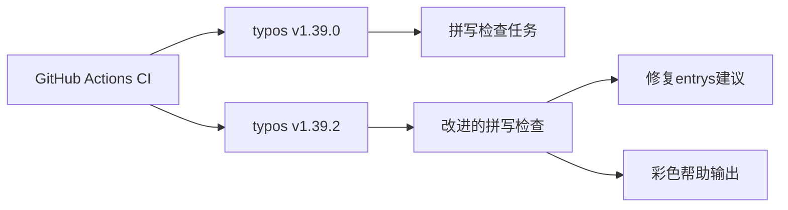

+++
title = "#21867 Bump crate-ci/typos from 1.39.0 to 1.39.2"
date = "2025-11-21T00:00:00"
draft = false
template = "pull_request_page.html"
in_search_index = false

[extra]
current_language = "zh-cn"
available_languages = {"en" = { name = "English", url = "/pull_request/bevy/2025-11/pr-21867-en-20251121" }, "zh-cn" = { name = "中文", url = "/pull_request/bevy/2025-11/pr-21867-zh-cn-20251121" }}
+++

# Bump crate-ci/typos from 1.39.0 to 1.39.2

## 基本信息
- **标题**: Bump crate-ci/typos from 1.39.0 to 1.39.2
- **PR链接**: https://github.com/bevyengine/bevy/pull/21867
- **作者**: app/dependabot
- **状态**: 已合并
- **标签**: D-Trivial, A-Build-System, C-Dependencies, S-Ready-For-Final-Review
- **创建时间**: 2025-11-17T06:01:06Z
- **合并时间**: 2025-11-21T22:59:35Z
- **合并者**: mockersf

## 描述翻译
将 [crate-ci/typos](https://github.com/crate-ci/typos) 从 1.39.0 升级到 1.39.2。
<details>
<summary>发布说明</summary>
<p><em>来源自 <a href="https://github.com/crate-ci/typos/releases">crate-ci/typos 的发布</a>。</em></p>
<blockquote>
<h2>v1.39.2</h2>
<h2>[1.39.2] - 2025-11-13</h2>
<h3>修复</h3>
<ul>
<li>不要为 <code>entrys</code> 提供 <code>entry</code> 作为修正建议</li>
</ul>
<h2>v1.39.1</h2>
<h2>[1.39.1] - 2025-11-12</h2>
<h3>功能</h3>
<ul>
<li>使 <code>--help</code> 输出更加生动</li>
</ul>
</blockquote>
</details>
<details>
<summary>变更日志</summary>
<p><em>来源自 <a href="https://github.com/crate-ci/typos/blob/master/CHANGELOG.md">crate-ci/typos 的变更日志</a>。</em></p>
<blockquote>
<h2>[1.39.2] - 2025-11-13</h2>
<h3>修复</h3>
<ul>
<li>不要为 <code>entrys</code> 提供 <code>entry</code> 作为修正建议</li>
</ul>
<h2>[1.39.1] - 2025-11-12</h2>
<h3>功能</h3>
<ul>
<li>使 <code>--help</code> 输出更加生动</li>
</ul>
</blockquote>
</details>
<details>
<summary>提交</summary>
<ul>
<li><a href="https://github.com/crate-ci/typos/commit/626c4bedb751ce0b7f03262ca97ddda9a076ae1c"><code>626c4be</code></a> chore: Release</li>
<li><a href="https://github.com/crate-ci/typos/commit/c6b458db05d00c3037bc9a1102b84febc9fff2f4"><code>c6b458d</code></a> docs: Update changelog</li>
<li><a href="https://github.com/crate-ci/typos/commit/eed04198a67af7f32b16141261aa8f911cba1f5f"><code>eed0419</code></a> Merge pull request <a href="https://redirect.github.com/crate-ci/typos/issues/1423">#1423</a> from epage/entrys</li>
<li><a href="https://github.com/crate-ci/typos/commit/40383f41a2f90743ef28b8c8b1c2d5a42b7651a0"><code>40383f4</code></a> fix(dict): Don't offer 'entry' as a correction for 'entrys'</li>
<li><a href="https://github.com/crate-ci/typos/commit/1af53e3774f068183ffd0c7193eb061a2b65a531"><code>1af53e3</code></a> chore: Release</li>
<li><a href="https://github.com/crate-ci/typos/commit/e5d291b81a9bd645c218da268c94df78b6e5e605"><code>e5d291b</code></a> docs: Update changelog</li>
<li><a href="https://github.com/crate-ci/typos/commit/55474f5ff9f9a923f4e1a218c9b39271517d847e"><code>55474f5</code></a> Merge pull request <a href="https://redirect.github.com/crate-ci/typos/issues/1417">#1417</a> from starsep/colorful_help</li>
<li><a href="https://github.com/crate-ci/typos/commit/78b93759507833a789853c44a1d9a767fcd15024"><code>78b9375</code></a> feat: Enable colors for typos --help</li>
<li><a href="https://github.com/crate-ci/typos/commit/308f8f5788c91e7d099279f046cdbc3662956dcd"><code>308f8f5</code></a> Merge pull request <a href="https://redirect.github.com/crate-ci/typos/issues/1409">#1409</a> from crate-ci/renovate/actions-download-artifact-6.x</li>
<li><a href="https://github.com/crate-ci/typos/commit/cf03418f507191943e33099ce6ba74c4c79b0257"><code>cf03418</code></a> Merge pull request <a href="https://redirect.github.com/crate-ci/typos/issues/1410">#1410</a> from crate-ci/renovate/actions-setup-python-6.x</li>
<li>更多提交可在 <a href="https://github.com/crate-ci/typos/compare/v1.39.0...v1.39.2">比较视图</a> 中查看</li>
</ul>
</details>
<br />


[](https://docs.github.com/en/github/managing-security-vulnerabilities/about-dependabot-security-updates#about-compatibility-scores)

只要你不自行修改，Dependabot 将解决此 PR 的任何冲突。你也可以通过评论 `@dependabot rebase` 手动触发变基。

[//]: # (dependabot-automerge-start)
[//]: # (dependabot-automerge-end)

---

<details>
<summary>Dependabot 命令和选项</summary>
<br />

你可以通过在此 PR 上评论来触发 Dependabot 操作：
- `@dependabot rebase` 将变基此 PR
- `@dependabot recreate` 将重新创建此 PR，覆盖对其进行的任何编辑
- `@dependabot merge` 将在 CI 通过后合并此 PR
- `@dependabot squash and merge` 将在 CI 通过后压缩并合并此 PR
- `@dependabot cancel merge` 将取消先前请求的合并并阻止自动合并
- `@dependabot reopen` 将重新打开此 PR（如果已关闭）
- `@dependabot close` 将关闭此 PR 并阻止 Dependabot 重新创建它。你可以通过手动关闭它来达到相同的结果
- `@dependabot show <dependency name> ignore conditions` 将显示指定依赖项的所有忽略条件
- `@dependabot ignore this major version` 将关闭此 PR 并阻止 Dependabot 为此主要版本创建更多 PR（除非你重新打开 PR 或自行升级到该版本）
- `@dependabot ignore this minor version` 将关闭此 PR 并阻止 Dependabot 为此次要版本创建更多 PR（除非你重新打开 PR 或自行升级到该版本）
- `@dependabot ignore this dependency` 将关闭此 PR 并阻止 Dependabot 为此依赖项创建更多 PR（除非你重新打开 PR 或自行升级到该版本）


</details>

## 这个拉取请求的故事

这个 PR 是一个典型的依赖管理更新，由 Dependabot 自动生成，用于维护 Bevy 项目开发工具链的现代化。故事的核心是关于保持拼写检查工具的最新状态，以获取改进的功能和修复的问题。

### 问题和背景

Bevy 项目使用 crate-ci/typos 作为其持续集成流水线中的一个拼写检查工具。这个工具在 CI 工作流中自动运行，检查代码库中的拼写错误。保持这类开发工具的最新版本很重要，因为它能确保团队从最新的错误修复和功能改进中受益。

在 typos 1.39.0 之后，该项目发布了两个次要版本更新：
- 1.39.1 版本为 `--help` 输出添加了颜色支持，改善了用户体验
- 1.39.2 版本修复了一个具体问题：不再为 `entrys` 错误地建议 `entry` 作为修正

### 解决方案方法

这个更新采用了最直接的方法：将 GitHub Actions 工作流中使用的 typos 版本从 1.39.0 升级到 1.39.2。由于这是一个依赖管理更新，不需要复杂的架构决策或替代方案评估。Dependabot 自动检测到新版本可用，并创建了这个更新 PR。

### 实施细节

实施非常简单，只涉及一个文件的单行修改。在 Bevy 的 CI 配置文件中，更新了使用的 typos Action 版本标签。

```yaml
# 文件: .github/workflows/ci.yml
# 之前:
      - name: Check for typos
        uses: crate-ci/typos@v1.39.0

# 之后:
      - name: Check for typos
        uses: crate-ci/typos@v1.39.2
```

这个修改确保了 CI 流水线使用最新版本的拼写检查工具，从而受益于新版本中的改进和修复。

### 技术洞察

这个 PR 展示了现代软件开发中依赖管理的最佳实践。虽然拼写检查工具看起来是一个次要的依赖项，但保持其更新有几个重要好处：

1. **错误修复**：1.39.2 版本修复了关于 `entrys` 的错误建议，这提高了拼写检查的准确性
2. **用户体验改进**：1.39.1 版本的彩色帮助输出虽然不影响核心功能，但改善了开发者的使用体验
3. **安全性和兼容性**：依赖更新通常包含安全补丁和与其他工具的兼容性改进

### 影响

这个更新的影响是直接的：
- **提高拼写检查准确性**：修复了 `entrys` 的错误修正建议
- **改善开发者体验**：彩色帮助输出使工具更易于使用
- **维护现代化**：确保开发工具链保持最新状态

这个 PR 展示了自动化依赖管理在大型开源项目中的价值，它确保开发工具能够持续获得改进，而无需手动干预。

## 视觉表示



## 关键文件更改

- `.github/workflows/ci.yml` (+1/-1)

这个文件包含了 Bevy 项目的 GitHub Actions 持续集成配置。修改的目的是更新拼写检查工具到最新版本。

```yaml
# 文件: .github/workflows/ci.yml
# 修改部分:
      - name: Check for typos
        uses: crate-ci/typos@v1.39.2  # 从 v1.39.0 更新
```

这个修改直接对应 PR 的主要目的：将 typos 工具从 1.39.0 版本升级到 1.39.2 版本。

## 进一步阅读

- [crate-ci/typos GitHub 仓库](https://github.com/crate-ci/typos) - 了解这个拼写检查工具的更多功能
- [GitHub Actions 文档](https://docs.github.com/en/actions) - 学习如何配置 CI/CD 工作流
- [Dependabot 文档](https://docs.github.com/en/code-security/dependabot) - 了解自动化依赖管理的最佳实践

# 完整代码差异
diff --git a/.github/workflows/ci.yml b/.github/workflows/ci.yml
index 043da966e9c5f..0cd009817fa5f 100644
--- a/.github/workflows/ci.yml
+++ b/.github/workflows/ci.yml
@@ -336,7 +336,7 @@ jobs:
     steps:
       - uses: actions/checkout@v5
       - name: Check for typos
-        uses: crate-ci/typos@v1.39.0
+        uses: crate-ci/typos@v1.39.2
       - name: Typos info
         if: failure()
         run: |