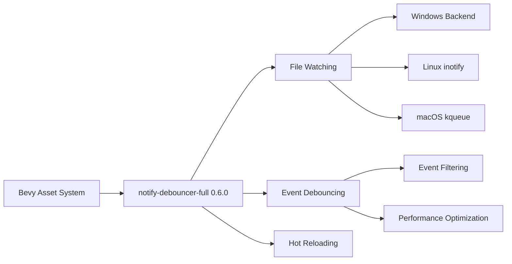

+++
title = "#21869 Update notify-debouncer-full requirement from 0.5.0 to 0.6.0"
date = "2025-11-28T00:00:00"
draft = false
template = "pull_request_page.html"
in_search_index = true

[taxonomies]
list_display = ["show"]

[extra]
current_language = "en"
available_languages = {"en" = { name = "English", url = "/pull_request/bevy/2025-11/pr-21869-en-20251128" }, "zh-cn" = { name = "中文", url = "/pull_request/bevy/2025-11/pr-21869-zh-cn-20251128" }}
labels = ["D-Trivial", "A-Assets", "C-Dependencies"]
+++

# Update notify-debouncer-full requirement from 0.5.0 to 0.6.0

## Basic Information
- **Title**: Update notify-debouncer-full requirement from 0.5.0 to 0.6.0
- **PR Link**: https://github.com/bevyengine/bevy/pull/21869
- **Author**: app/dependabot
- **Status**: MERGED
- **Labels**: D-Trivial, A-Assets, C-Dependencies, S-Ready-For-Final-Review
- **Created**: 2025-11-17T06:15:11Z
- **Merged**: 2025-11-28T08:38:07Z
- **Merged By**: mockersf

## Description Translation
Updates the requirements on [notify-debouncer-full](https://github.com/notify-rs/notify) to permit the latest version.
<details>
<summary>Changelog</summary>
<p><em>Sourced from <a href="https://github.com/notify-rs/notify/blob/main/CHANGELOG.md">notify-debouncer-full's changelog</a>.</em></p>
<blockquote>
<h2>debouncer-full 0.6.0 (2025-08-03)</h2>
<ul>
<li>FEATURE: allow <code>FileIdCache</code> trait implementations to choose ownership of the returned file-ids <a href="https://redirect.github.com/notify-rs/notify/issues/664">#664</a></li>
<li>FEATURE: added support for the <a href="https://docs.rs/flume"><code>flume</code></a> crate <a href="https://redirect.github.com/notify-rs/notify/issues/680">#680</a></li>
<li>FIX: skip all <code>Modify</code> events right after a <code>Create</code> event, unless it's a rename event <a href="https://redirect.github.com/notify-rs/notify/issues/701">#701</a></li>
</ul>
<p><a href="https://redirect.github.com/notify-rs/notify/issues/664">#664</a>: <a href="https://redirect.github.com/notify-rs/notify/pull/664">notify-rs/notify#664</a>
<a href="https://redirect.github.com/notify-rs/notify/issues/680">#680</a>: <a href="https://redirect.github.com/notify-rs/notify/pull/680">notify-rs/notify#680</a>
<a href="https://redirect.github.com/notify-rs/notify/issues/701">#701</a>: <a href="https://redirect.github.com/notify-rs/notify/pull/701">notify-rs/notify#701</a></p>
<h2>debouncer-mini 0.7.0 (2025-08-03)</h2>
<ul>
<li>FEATURE: added support for the <a href="https://docs.rs/flume"><code>flume</code></a> crate <a href="https://redirect.github.com/notify-rs/notify/issues/680">#680</a></li>
</ul>
<h2>file-id 0.2.3 (2025-08-03)</h2>
<ul>
<li>CHANGE: implement <code>AsRef&lt;FileId&gt;</code> for <code>FileId</code> <a href="https://redirect.github.com/notify-rs/notify/issues/664">#664</a></li>
</ul>
<h2>notify 8.1.0 (2025-07-03)</h2>
<ul>
<li>FEATURE: added support for the <a href="https://docs.rs/flume"><code>flume</code></a> crate</li>
<li>FIX: kqueue-backend: do not double unwatch top-level directory when recursively unwatching <a href="https://redirect.github.com/notify-rs/notify/issues/683">#683</a></li>
<li>FIX: Return the crate error <code>PathNotFound</code> instead bubbling up the std::io error <a href="https://redirect.github.com/notify-rs/notify/issues/685">#685</a></li>
<li>FIX: fix server hangs when trashing folders on Windows <a href="https://redirect.github.com/notify-rs/notify/issues/674">#674</a></li>
</ul>
<h2>notify 8.0.0 (2025-01-10)</h2>
<ul>
<li>CHANGE: update notify-types to version 2.0.0</li>
<li>CHANGE: raise MSRV to 1.77 <strong>breaking</strong></li>
<li>FEATURE: add config option to disable following symbolic links <a href="https://redirect.github.com/notify-rs/notify/issues/635">#635</a></li>
<li>FIX: unaligned access to FILE_NOTIFY_INFORMATION <a href="https://redirect.github.com/notify-rs/notify/issues/647">#647</a> <strong>breaking</strong></li>
</ul>
<p><a href="https://redirect.github.com/notify-rs/notify/issues/635">#635</a>: <a href="https://redirect.github.com/notify-rs/notify/pull/635">notify-rs/notify#635</a>
<a href="https://redirect.github.com/notify-rs/notify/issues/647">#647</a>: <a href="https://redirect.github.com/notify-rs/notify/pull/647">notify-rs/notify#647</a></p>
<h2>notify-types 2.0.0 (2025-01-10)</h2>
<ul>
<li>CHANGE: replace instant crate with web-time <a href="https://redirect.github.com/notify-rs/notify/issues/652">#652</a> <strong>breaking</strong></li>
<li>CHANGE: the web-time dependency is now behind the <code>web-time</code> feature <strong>breaking</strong></li>
</ul>
<p><a href="https://redirect.github.com/notify-rs/notify/issues/652">#652</a>: <a href="https://redirect.github.com/notify-rs/notify/pull/652">notify-rs/notify#652</a></p>
<h2>debouncer-mini 0.6.0 (2025-01-10)</h2>
<ul>
<li>CHANGE: update notify to version 8.0.0</li>
</ul>
<h2>debouncer-full 0.5.0 (2025-01-10)</h2>
<ul>
<li>CHANGE: update notify to version 8.0.0</li>
<li>CHANGE: pass <code>web-time</code> feature to notify-types</li>
</ul>
<h2>notify-types 1.0.1 (2024-12-17)</h2>
<ul>
<li>FIX: <code>Event::kind</code> serialization with <code>serialization-compat-6</code> feature <a href="https://redirect.github.com/notify-rs/notify/issues/660">#660</a></li>
</ul>
<!-- raw HTML omitted -->
</blockquote>
<p>... (truncated)</p>
</details>
<details>
<summary>Commits</summary>
<ul>
<li><a href="https://github.com/notify-rs/notify/commit/a1d7c2d8f80786679d58ec6d5986a1d4278bc8cf"><code>a1d7c2d</code></a> Prepare release (<a href="https://redirect.github.com/notify-rs/notify/issues/706">#706</a>)</li>
<li><a href="https://github.com/notify-rs/notify/commit/c685ea7d82b35b06bf81a824f68095e2bda6f0a7"><code>c685ea7</code></a> Skip all <code>Modify</code> events right after a <code>Create</code> event, unless it's a rename e...</li>
<li><a href="https://github.com/notify-rs/notify/commit/e36d54e94d2c364478f99f1d3b62245ed2ad2926"><code>e36d54e</code></a> fix: INotifyWatcher may raise events with no paths (<a href="https://redirect.github.com/notify-rs/notify/issues/700">#700</a>)</li>
<li><a href="https://github.com/notify-rs/notify/commit/394ef18bebf0063c717ff7ea7387d36dacaf2c1c"><code>394ef18</code></a> feat(inotify): notify a user if the <code>max_user_watches</code> has been reached impli...</li>
<li><a href="https://github.com/notify-rs/notify/commit/04473dea90a88c3444ff1a2876c4fbeda479441d"><code>04473de</code></a> chore: Prepare 8.1.0 release (<a href="https://redirect.github.com/notify-rs/notify/issues/697">#697</a>)</li>
<li><a href="https://github.com/notify-rs/notify/commit/12a026d18ac097e578b2c3c2885ee60ae664072c"><code>12a026d</code></a> fix: make <code>PathsMut::commit</code> consuming (<a href="https://redirect.github.com/notify-rs/notify/issues/695">#695</a>)</li>
<li><a href="https://github.com/notify-rs/notify/commit/d824023e483b24ceb398f08dec20f35ce575e7fa"><code>d824023</code></a> feat: introduce <code>Watcher::paths_mut</code> for adding/removing paths in batch (<a href="https://redirect.github.com/notify-rs/notify/issues/692">#692</a>)</li>
<li><a href="https://github.com/notify-rs/notify/commit/b98413446040fe47e13eb3de7c8acd77d18aea78"><code>b984134</code></a> Do not clone paths while walking dirs (<a href="https://redirect.github.com/notify-rs/notify/issues/693">#693</a>)</li>
<li><a href="https://github.com/notify-rs/notify/commit/416ba8248e25fc30b9503b1319933275c13e3576"><code>416ba82</code></a> chore: Use MSRV for Clippy and rustfmt (<a href="https://redirect.github.com/notify-rs/notify/issues/694">#694</a>)</li>
<li><a href="https://github.com/notify-rs/notify/commit/10ce3ef6b79555159fae8a02919a43b499d1c2c3"><code>10ce3ef</code></a> Update <code>windows-sys</code> to v0.60 (<a href="https://redirect.github.com/notify-rs/notify/issues/691">#691</a>)</li>
<li>Additional commits viewable in <a href="https://github.com/notify-rs/notify/compare/debouncer-full-0.5.0...debouncer-full-0.6.0">compare view</a></li>
</ul>
</details>
<br />


Dependabot will resolve any conflicts with this PR as long as you don't alter it yourself. You can also trigger a rebase manually by commenting `@dependabot rebase`.

[//]: # (dependabot-automerge-start)
[//]: # (dependabot-automerge-end)

---

<details>
<summary>Dependabot commands and options</summary>
<br />

You can trigger Dependabot actions by commenting on this PR:
- `@dependabot rebase` will rebase this PR
- `@dependabot recreate` will recreate this PR, overwriting any edits that have been made to it
- `@dependabot merge` will merge this PR after your CI passes on it
- `@dependabot squash and merge` will squash and merge this PR after your CI passes on it
- `@dependabot cancel merge` will cancel a previously requested merge and block automerging
- `@dependabot reopen` will reopen this PR if it is closed
- `@dependabot close` will close this PR and stop Dependabot recreating it. You can achieve the same result by closing it manually
- `@dependabot show <dependency name> ignore conditions` will show all of the ignore conditions of the specified dependency
- `@dependabot ignore this major version` will close this PR and stop Dependabot creating any more for this major version (unless you reopen the PR or upgrade to it yourself)
- `@dependabot ignore this minor version` will close this PR and stop Dependabot creating any more for this minor version (unless you reopen the PR or upgrade to it yourself)
- `@dependabot ignore this dependency` will close this PR and stop Dependabot creating any more for this dependency (unless you reopen the PR or upgrade to it yourself)


</details>

## The Story of This Pull Request

This pull request represents a routine but important dependency maintenance task in the Bevy engine. The change updates the `notify-debouncer-full` dependency from version 0.5.0 to 0.6.0, which is part of Bevy's asset system for file watching functionality.

The problem being addressed is straightforward: keeping dependencies current to benefit from bug fixes, performance improvements, and new features. In this case, the `notify-debouncer-full` crate provides file system monitoring capabilities that Bevy uses for hot-reloading assets during development. When developers modify asset files, this system detects the changes and automatically reloads the assets in the running application.

The solution approach is a simple version bump, which is the standard practice for dependency updates. This was an automated PR generated by Dependabot, GitHub's dependency management service, which monitors project dependencies and automatically creates PRs when newer versions become available.

Looking at the implementation, the change is minimal but significant. The update brings several improvements from the notify-rs ecosystem:

- **FileIdCache trait enhancements**: The new version allows `FileIdCache` implementations to choose ownership of returned file IDs, providing more flexibility in how file identifiers are managed
- **Flume support**: Added support for the `flume` crate, which offers high-performance multi-producer, multi-consumer channels
- **Event filtering fix**: The update includes a fix that skips unnecessary `Modify` events immediately after `Create` events, reducing noise in file change detection
- **Platform-specific improvements**: Various fixes for Windows, Linux (inotify), and macOS (kqueue) file watching backends

These changes improve the reliability and performance of Bevy's asset hot-reloading system. The event filtering fix is particularly valuable as it reduces false positives and unnecessary asset reloads when files are created or modified.

The technical impact of this update is primarily in the asset system's file monitoring capabilities. Bevy uses `notify-debouncer-full` to watch for file changes in development builds, enabling the hot-reloading feature that allows developers to see asset changes immediately without restarting the application. The improvements in version 0.6.0 make this system more efficient and reliable.

One important consideration with dependency updates is compatibility. The changelog shows that this update includes some breaking changes from earlier versions (notify 8.0.0 had breaking changes with MSRV bump to 1.77), but since Bevy was already on debouncer-full 0.5.0 which included those changes, the transition to 0.6.0 should be smooth.

## Visual Representation



## Key Files Changed

The PR modifies only one file:

**File**: `crates/bevy_asset/Cargo.toml`

This file contains the dependency specification for the Bevy asset system. The change updates the version constraint for the `notify-debouncer-full` dependency.

```toml
# Before:
notify-debouncer-full = { version = "0.5.0", default-features = false, optional = true }

# After:
notify-debouncer-full = { version = "0.6.0", default-features = false, optional = true }
```

The dependency is marked as `optional = true`, meaning it's only included when specific features are enabled (likely the `file_watcher` feature for development builds). The `default-features = false` configuration ensures that only the necessary components of the dependency are included, keeping the build minimal.

## Further Reading

- [notify-rs GitHub Repository](https://github.com/notify-rs/notify) - The official repository for the notify library
- [Bevy Asset System Documentation](https://bevyengine.org/learn/books/introduction/features/assets/) - Official Bevy documentation on the asset system
- [File Watching in Game Engines](https://gamedev.stackexchange.com/questions/140609/how-do-game-engines-handle-asset-hot-reloading) - Discussion of asset hot-reloading patterns in game engines
- [Rust Dependency Management](https://doc.rust-lang.org/cargo/reference/specifying-dependencies.html) - Cargo documentation on dependency specification

# Full Code Diff
```diff
diff --git a/crates/bevy_asset/Cargo.toml b/crates/bevy_asset/Cargo.toml
index 319fd3d370de6..39a363433dfbf 100644
--- a/crates/bevy_asset/Cargo.toml
+++ b/crates/bevy_asset/Cargo.toml
@@ -91,7 +91,7 @@ bevy_reflect = { path = "../bevy_reflect", version = "0.18.0-dev", default-featu
 ] }
 
 [target.'cfg(not(target_arch = "wasm32"))'.dependencies]
-notify-debouncer-full = { version = "0.5.0", default-features = false, optional = true }
+notify-debouncer-full = { version = "0.6.0", default-features = false, optional = true }
 # updating ureq: while ureq is semver stable, it depends on rustls which is not, meaning unlikely but possible breaking changes on minor releases. https://github.com/bevyengine/bevy/pull/16366#issuecomment-2572890794
 ureq = { version = "3", optional = true, default-features = false }
 blocking = { version = "1.6", optional = true }
```