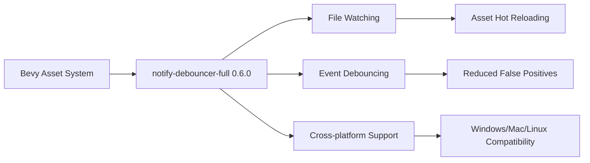

+++
title = "#21869 Update notify-debouncer-full requirement from 0.5.0 to 0.6.0"
date = "2025-11-28T00:00:00"
draft = false
template = "pull_request_page.html"
in_search_index = false

[extra]
current_language = "zh-cn"
available_languages = {"en" = { name = "English", url = "/pull_request/bevy/2025-11/pr-21869-en-20251128" }, "zh-cn" = { name = "中文", url = "/pull_request/bevy/2025-11/pr-21869-zh-cn-20251128" }}
labels = ["D-Trivial", "A-Assets", "C-Dependencies"]
+++

# Update notify-debouncer-full requirement from 0.5.0 to 0.6.0

## Basic Information
- **Title**: Update notify-debouncer-full requirement from 0.5.0 to 0.6.0
- **PR Link**: https://github.com/bevyengine/bevy/pull/21869
- **Author**: app/dependabot
- **Status**: MERGED
- **Labels**: D-Trivial, A-Assets, C-Dependencies, S-Ready-For-Final-Review
- **Created**: 2025-11-17T06:15:11Z
- **Merged**: 2025-11-28T08:38:07Z
- **Merged By**: mockersf

## Description Translation
更新 [notify-debouncer-full](https://github.com/notify-rs/notify) 的要求以允许最新版本。
<details>
<summary>Changelog</summary>
<p><em>源自 <a href="https://github.com/notify-rs/notify/blob/main/CHANGELOG.md">notify-debouncer-full 的变更日志</a>。</em></p>
<blockquote>
<h2>debouncer-full 0.6.0 (2025-08-03)</h2>
<ul>
<li>功能: 允许 <code>FileIdCache</code> trait 实现选择返回的文件 ID 的所有权 <a href="https://redirect.github.com/notify-rs/notify/issues/664">#664</a></li>
<li>功能: 添加了对 <a href="https://docs.rs/flume"><code>flume</code></a> crate 的支持 <a href="https://redirect.github.com/notify-rs/notify/issues/680">#680</a></li>
<li>修复: 在 <code>Create</code> 事件之后跳过所有 <code>Modify</code> 事件，除非是重命名事件 <a href="https://redirect.github.com/notify-rs/notify/issues/701">#701</a></li>
</ul>
<p><a href="https://redirect.github.com/notify-rs/notify/issues/664">#664</a>: <a href="https://redirect.github.com/notify-rs/notify/pull/664">notify-rs/notify#664</a>
<a href="https://redirect.github.com/notify-rs/notify/issues/680">#680</a>: <a href="https://redirect.github.com/notify-rs/notify/pull/680">notify-rs/notify#680</a>
<a href="https://redirect.github.com/notify-rs/notify/issues/701">#701</a>: <a href="https://redirect.github.com/notify-rs/notify/pull/701">notify-rs/notify#701</a></p>
<h2>debouncer-mini 0.7.0 (2025-08-03)</h2>
<ul>
<li>功能: 添加了对 <a href="https://docs.rs/flume"><code>flume</code></a> crate 的支持 <a href="https://redirect.github.com/notify-rs/notify/issues/680">#680</a></li>
</ul>
<h2>file-id 0.2.3 (2025-08-03)</h2>
<ul>
<li>变更: 为 <code>FileId</code> 实现 <code>AsRef&lt;FileId&gt;</code> <a href="https://redirect.github.com/notify-rs/notify/issues/664">#664</a></li>
</ul>
<h2>notify 8.1.0 (2025-07-03)</h2>
<ul>
<li>功能: 添加了对 <a href="https://docs.rs/flume"><code>flume</code></a> crate 的支持</li>
<li>修复: kqueue-backend: 在递归取消监视时不要重复取消监视顶级目录 <a href="https://redirect.github.com/notify-rs/notify/issues/683">#683</a></li>
<li>修复: 返回 crate 错误 <code>PathNotFound</code> 而不是冒泡 std::io 错误 <a href="https://redirect.github.com/notify-rs/notify/issues/685">#685</a></li>
<li>修复: 修复在 Windows 上删除文件夹时服务器挂起的问题 <a href="https://redirect.github.com/notify-rs/notify/issues/674">#674</a></li>
</ul>
<h2>notify 8.0.0 (2025-01-10)</h2>
<ul>
<li>变更: 将 notify-types 更新到版本 2.0.0</li>
<li>变更: 将 MSRV 提高到 1.77 <strong>破坏性变更</strong></li>
<li>功能: 添加配置选项以禁用跟随符号链接 <a href="https://redirect.github.com/notify-rs/notify/issues/635">#635</a></li>
<li>修复: FILE_NOTIFY_INFORMATION 的未对齐访问 <a href="https://redirect.github.com/notify-rs/notify/issues/647">#647</a> <strong>破坏性变更</strong></li>
</ul>
<p><a href="https://redirect.github.com/notify-rs/notify/issues/635">#635</a>: <a href="https://redirect.github.com/notify-rs/notify/pull/635">notify-rs/notify#635</a>
<a href="https://redirect.github.com/notify-rs/notify/issues/647">#647</a>: <a href="https://redirect.github.com/notify-rs/notify/pull/647">notify-rs/notify#647</a></p>
<h2>notify-types 2.0.0 (2025-01-10)</h2>
<ul>
<li>变更: 用 web-time 替换 instant crate <a href="https://redirect.github.com/notify-rs/notify/issues/652">#652</a> <strong>破坏性变更</strong></li>
<li>变更: web-time 依赖现在在 <code>web-time</code> 特性后面 <strong>破坏性变更</strong></li>
</ul>
<p><a href="https://redirect.github.com/notify-rs/notify/issues/652">#652</a>: <a href="https://redirect.github.com/notify-rs/notify/pull/652">notify-rs/notify#652</a></p>
<h2>debouncer-mini 0.6.0 (2025-01-10)</h2>
<ul>
<li>变更: 将 notify 更新到版本 8.0.0</li>
</ul>
<h2>debouncer-full 0.5.0 (2025-01-10)</h2>
<ul>
<li>变更: 将 notify 更新到版本 8.0.0</li>
<li>变更: 将 <code>web-time</code> 特性传递给 notify-types</li>
</ul>
<h2>notify-types 1.0.1 (2024-12-17)</h2>
<ul>
<li>修复: 使用 <code>serialization-compat-6</code> 特性时 <code>Event::kind</code> 的序列化 <a href="https://redirect.github.com/notify-rs/notify/issues/660">#660</a></li>
</ul>
<!-- raw HTML omitted -->
</blockquote>
<p>... (截断)</p>
</details>
<details>
<summary>Commits</summary>
<ul>
<li><a href="https://github.com/notify-rs/notify/commit/a1d7c2d8f80786679d58ec6d5986a1d4278bc8cf"><code>a1d7c2d</code></a> 准备发布 (<a href="https://redirect.github.com/notify-rs/notify/issues/706">#706</a>)</li>
<li><a href="https://github.com/notify-rs/notify/commit/c685ea7d82b35b06bf81a824f68095e2bda6f0a7"><code>c685ea7</code></a> 在 <code>Create</code> 事件之后跳过所有 <code>Modify</code> 事件，除非是重命名事件...</li>
<li><a href="https://github.com/notify-rs/notify/commit/e36d54e94d2c364478f99f1d3b62245ed2ad2926"><code>e36d54e</code></a> 修复: INotifyWatcher 可能引发没有路径的事件 (<a href="https://redirect.github.com/notify-rs/notify/issues/700">#700</a>)</li>
<li><a href="https://github.com/notify-rs/notify/commit/394ef18bebf0063c717ff7ea7387d36dacaf2c1c"><code>394ef18</code></a> 功能(inotify): 如果 <code>max_user_watches</code> 已隐式达到，通知用户...</li>
<li><a href="https://github.com/notify-rs/notify/commit/04473dea90a88c3444ff1a2876c4fbeda479441d"><code>04473de</code></a> 杂项: 准备 8.1.0 发布 (<a href="https://redirect.github.com/notify-rs/notify/issues/697">#697</a>)</li>
<li><a href="https://github.com/notify-rs/notify/commit/12a026d18ac097e578b2c3c2885ee60ae664072c"><code>12a026d</code></a> 修复: 使 <code>PathsMut::commit</code> 为消耗性的 (<a href="https://redirect.github.com/notify-rs/notify/issues/695">#695</a>)</li>
<li><a href="https://github.com/notify-rs/notify/commit/d824023e483b24ceb398f08dec20f35ce575e7fa"><code>d824023</code></a> 功能: 引入 <code>Watcher::paths_mut</code> 用于批量添加/删除路径 (<a href="https://redirect.github.com/notify-rs/notify/issues/692">#692</a>)</li>
<li><a href="https://github.com/notify-rs/notify/commit/b98413446040fe47e13eb3de7c8acd77d18aea78"><code>b984134</code></a> 在遍历目录时不要克隆路径 (<a href="https://redirect.github.com/notify-rs/notify/issues/693">#693</a>)</li>
<li><a href="https://github.com/notify-rs/notify/commit/416ba8248e25fc30b9503b1319933275c13e3576"><code>416ba82</code></a> 杂项: 对 Clippy 和 rustfmt 使用 MSRV (<a href="https://redirect.github.com/notify-rs/notify/issues/694">#694</a>)</li>
<li><a href="https://github.com/notify-rs/notify/commit/10ce3ef6b79555159fae8a02919a43b499d1c2c3"><code>10ce3ef</code></a> 将 <code>windows-sys</code> 更新到 v0.60 (<a href="https://redirect.github.com/notify-rs/notify/issues/691">#691</a>)</li>
<li>其他提交可在 <a href="https://github.com/notify-rs/notify/compare/debouncer-full-0.5.0...debouncer-full-0.6.0">比较视图</a> 中查看</li>
</ul>
</details>
<br />

Dependabot 将在您不自行修改的情况下解决与此 PR 的任何冲突。您也可以通过评论 `@dependabot rebase` 手动触发 rebase。

[//]: # (dependabot-automerge-start)
[//]: # (dependabot-automerge-end)

---

<details>
<summary>Dependabot 命令和选项</summary>
<br />

您可以通过评论此 PR 来触发 Dependabot 操作:
- `@dependabot rebase` 将 rebase 此 PR
- `@dependabot recreate` 将重新创建此 PR，覆盖对其进行的任何编辑
- `@dependabot merge` 将在 CI 通过后合并此 PR
- `@dependabot squash and merge` 将在 CI 通过后 squash 并合并此 PR
- `@dependabot cancel merge` 将取消先前请求的合并并阻止自动合并
- `@dependabot reopen` 将重新打开此 PR（如果已关闭）
- `@dependabot close` 将关闭此 PR 并停止 Dependabot 重新创建它。您可以通过手动关闭它来实现相同的结果
- `@dependabot show <dependency name> ignore conditions` 将显示指定依赖项的所有忽略条件
- `@dependabot ignore this major version` 将关闭此 PR 并停止 Dependabot 为此主要版本创建更多 PR（除非您重新打开 PR 或自行升级）
- `@dependabot ignore this minor version` 将关闭此 PR 并停止 Dependabot 为此次要版本创建更多 PR（除非您重新打开 PR 或自行升级）
- `@dependabot ignore this dependency` 将关闭此 PR 并停止 Dependabot 为此依赖项创建更多 PR（除非您重新打开 PR 或自行升级）

</details>

## The Story of This Pull Request

这是一个由 Dependabot 自动生成的依赖更新 PR，主要目的是将 `notify-debouncer-full` 依赖从 0.5.0 版本升级到 0.6.0 版本。在 Rust 生态系统中，保持依赖项的最新状态是维护项目安全性和稳定性的重要实践。

### 依赖更新的背景

`notify-debouncer-full` 是 Bevy 引擎资产系统中的一个关键依赖项，负责文件系统监视功能。当开发者修改资产文件时，这个库能够检测到文件变化并触发相应的重新加载操作。保持这个依赖项的更新对于确保资产热重载功能的可靠性和性能至关重要。

### 新版本的技术改进

从变更日志可以看出，0.6.0 版本带来了几个重要的改进：

1. **FileIdCache trait 的灵活性增强**：现在允许实现选择返回的文件 ID 的所有权，这为更高效的内存管理提供了可能。

2. **flume crate 支持**：添加了对 `flume` 多生产者多消费者通道的支持，这为异步文件系统事件处理提供了更多选项。

3. **事件处理优化**：修复了在 `Create` 事件之后跳过不必要的 `Modify` 事件的问题，这减少了资产系统处理虚假文件变更通知的开销。

### 实现细节分析

这个 PR 的实现非常简单直接，只涉及到一个文件的修改：

```toml
# Before:
notify-debouncer-full = { version = "0.5.0", default-features = false, optional = true }

# After:  
notify-debouncer-full = { version = "0.6.0", default-features = false, optional = true }
```

这种简单的版本号更新表明新版本保持了 API 兼容性，没有引入破坏性变更。`default-features = false` 和 `optional = true` 的配置保持不变，确保 Bevy 只包含实际需要的功能，并允许用户在不需要文件监视功能时禁用此依赖。

### 技术影响评估

从技术角度来看，这次更新主要带来以下好处：

- **性能改进**：跳过不必要的 `Modify` 事件可以减少 CPU 使用率和不必要的资产重新加载
- **功能增强**：对 `flume` 的支持为未来的异步处理改进奠定了基础
- **错误修复**：解决了 Windows 平台上的一些特定问题，提升了跨平台兼容性

### 依赖管理的工程实践

这个 PR 展示了现代 Rust 项目中依赖管理的良好实践。通过自动化工具如 Dependabot，团队可以及时获取安全更新和性能改进，同时通过 CI 测试确保更新不会破坏现有功能。这种实践对于维护大型项目的长期健康至关重要。

## Visual Representation



## Key Files Changed

### `crates/bevy_asset/Cargo.toml`

这是此 PR 中唯一修改的文件，更新了 `notify-debouncer-full` 依赖的版本号。

**修改内容：**
```toml
# 修改前:
notify-debouncer-full = { version = "0.5.0", default-features = false, optional = true }

# 修改后:
notify-debouncer-full = { version = "0.6.0", default-features = false, optional = true }
```

**技术说明：**
- `version = "0.6.0"`：将依赖版本从 0.5.0 更新到 0.6.0
- `default-features = false`：禁用默认特性，只包含必要的功能
- `optional = true`：将此依赖标记为可选的，允许用户在不需要文件监视功能时完全禁用它

这个简单的版本更新是依赖管理中的典型操作，通过保持依赖项的最新状态来获得错误修复、性能改进和新功能，同时维持向后兼容性。

## Further Reading

- [notify-rs GitHub Repository](https://github.com/notify-rs/notify) - 文件系统通知库的源代码和文档
- [Semantic Versioning in Rust](https://doc.rust-lang.org/cargo/reference/semver.html) - Cargo 中的语义版本控制规范
- [Dependabot Documentation](https://docs.github.com/en/code-security/dependabot) - GitHub Dependabot 的完整使用指南
- [Bevy Asset System Documentation](https://bevyengine.org/learn/books/introduction/features/assets/) - Bevy 资产系统的官方文档

# Full Code Diff
```diff
diff --git a/crates/bevy_asset/Cargo.toml b/crates/bevy_asset/Cargo.toml
index 319fd3d370de6..39a363433dfbf 100644
--- a/crates/bevy_asset/Cargo.toml
+++ b/crates/bevy_asset/Cargo.toml
@@ -91,7 +91,7 @@ bevy_reflect = { path = "../bevy_reflect", version = "0.18.0-dev", default-featu
 ] }
 
 [target.'cfg(not(target_arch = "wasm32"))'.dependencies]
-notify-debouncer-full = { version = "0.5.0", default-features = false, optional = true }
+notify-debouncer-full = { version = "0.6.0", default-features = false, optional = true }
 # updating ureq: while ureq is semver stable, it depends on rustls which is not, meaning unlikely but possible breaking changes on minor releases. https://github.com/bevyengine/bevy/pull/16366#issuecomment-2572890794
 ureq = { version = "3", optional = true, default-features = false }
 blocking = { version = "1.6", optional = true }
```