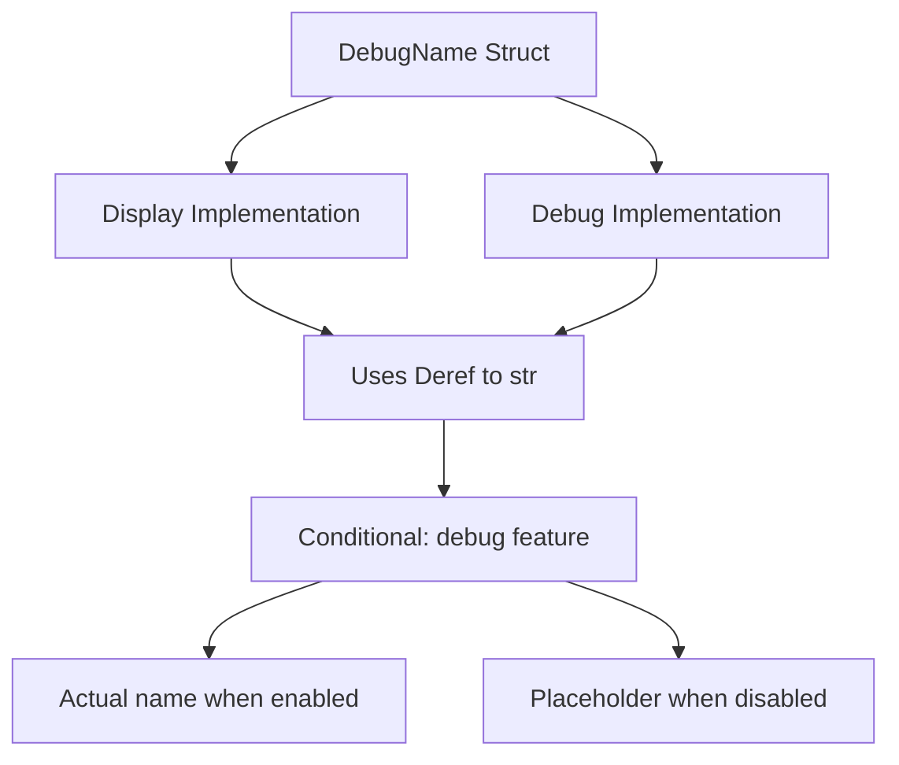

+++
title = "#21870 Simplify `Debug` display of `DebugName`"
date = "2025-11-26T00:00:00"
draft = false
template = "pull_request_page.html"
in_search_index = true

[taxonomies]
list_display = ["show"]

[extra]
current_language = "en"
available_languages = {"en" = { name = "English", url = "/pull_request/bevy/2025-11/pr-21870-en-20251126" }, "zh-cn" = { name = "中文", url = "/pull_request/bevy/2025-11/pr-21870-zh-cn-20251126" }}
labels = ["C-Usability", "A-Utils"]
+++

# Title
Simplify `Debug` display of `DebugName`

## Basic Information
- **Title**: Simplify `Debug` display of `DebugName`
- **PR Link**: https://github.com/bevyengine/bevy/pull/21870
- **Author**: chescock
- **Status**: MERGED
- **Labels**: C-Usability, S-Ready-For-Final-Review, A-Utils
- **Created**: 2025-11-17T15:29:59Z
- **Merged**: 2025-11-26T09:15:24Z
- **Merged By**: mockersf

## Description Translation
# Objective

As noted in #21856, the `Debug` output of `DebugName` is too verbose.  It is supposed to be a thin wrapper around a string, but it renders as a `struct`.  

## Solution

Manually `impl Debug for DebugName` and write the string directly.  

## Showcase

The following code

```rust
#[derive(Debug)]
struct TestStruct {
    debug_name: DebugName,
}
let test_struct = TestStruct {
    debug_name: DebugName::type_name::<TestStruct>(),
};
println!("{test_struct:#?}");
```

Prints the following before this change

```
TestStruct {
    debug_name: DebugName {
        name: "crate_name::TestStruct",
    },
}
```

And the following after it

```
TestStruct {
    debug_name: "crate_name::TestStruct",
}
```

When the `debug` feature is disabled, it prints the following both before and after the change

```
TestStruct {
    debug_name: DebugName,
}
```

## The Story of This Pull Request

The problem started with a usability issue in the Bevy engine's debugging output. The `DebugName` struct, designed as a thin wrapper around string data for type names, was producing overly verbose debug output. When developers used `DebugName` in their structs and printed them with `println!("{:#?}")`, they would see the full struct representation with field names, rather than just the clean string value.

This was particularly problematic because `DebugName` is intended to be a simple wrapper that should display as its underlying string content in most contexts. The verbose output made debug logs harder to read and added visual clutter where developers expected to see clean type names.

The solution approach was straightforward but effective: remove the automatic `Debug` derivation and implement a custom `Debug` trait that would display the string content directly. This required modifying the existing `Display` implementation to use a more concise approach and adding a parallel `Debug` implementation.

The implementation involved three key changes to the `DebugName` struct. First, the `Debug` trait was removed from the derive macro, since the automatic derivation was causing the verbose output. Second, the existing `Display` implementation was simplified to leverage the existing `Deref` implementation to `str`. Third, a new manual `Debug` implementation was added that also uses the deref mechanism to display the string content directly.

One important technical consideration was maintaining the conditional compilation behavior based on the `debug` feature. When the debug feature is disabled, `DebugName` should display a placeholder message rather than the actual type name. The solution preserves this behavior by relying on the existing `Deref` implementation, which already handles the conditional compilation logic correctly.

The impact of these changes is immediately visible in debug output. Instead of seeing nested struct representations, developers now see clean string values when debugging structs containing `DebugName` fields. This makes debug logs more readable and aligns with developer expectations for how a string wrapper should display.

## Visual Representation



## Key Files Changed

### `crates/bevy_utils/src/debug_info.rs` (+9/-6)

This file contains the core implementation changes for the `DebugName` struct. The modifications focus on improving the debug output format while maintaining existing functionality.

**Key changes:**

1. **Removed automatic Debug derivation:**
```rust
// Before:
#[derive(Clone, Debug, PartialEq, Eq)]
pub struct DebugName {
    // ...
}

// After:
#[derive(Clone, PartialEq, Eq)]
pub struct DebugName {
    // ...
}
```

2. **Simplified Display implementation:**
```rust
// Before:
impl fmt::Display for DebugName {
    fn fmt(&self, f: &mut core::fmt::Formatter<'_>) -> core::fmt::Result {
        #[cfg(feature = "debug")]
        f.write_str(self.name.as_ref())?;
        #[cfg(not(feature = "debug"))]
        f.write_str(FEATURE_DISABLED)?;

        Ok(())
    }
}

// After:
impl fmt::Display for DebugName {
    fn fmt(&self, f: &mut core::fmt::Formatter<'_>) -> core::fmt::Result {
        // Deref to `str`, which will use `FEATURE_DISABLED` if necessary
        write!(f, "{}", &**self)
    }
}
```

3. **Added custom Debug implementation:**
```rust
// New code:
impl fmt::Debug for DebugName {
    fn fmt(&self, f: &mut core::fmt::Formatter<'_>) -> core::fmt::Result {
        // Deref to `str`, which will use `FEATURE_DISABLED` if necessary
        write!(f, "{:?}", &**self)
    }
}
```

These changes work together to provide cleaner debug output by leveraging the existing `Deref` implementation and eliminating the verbose struct representation that was previously generated by the automatic `Debug` derivation.

## Further Reading

- [Rust Debug Trait Documentation](https://doc.rust-lang.org/std/fmt/trait.Debug.html)
- [Rust Display vs Debug formatting](https://doc.rust-lang.org/std/fmt/#formatting-traits)
- [Bevy Engine Utilities Documentation](https://docs.rs/bevy_utils/latest/bevy_utils/)
- [Conditional Compilation in Rust](https://doc.rust-lang.org/reference/conditional-compilation.html)

# Full Code Diff
```diff
diff --git a/crates/bevy_utils/src/debug_info.rs b/crates/bevy_utils/src/debug_info.rs
index 3aad20dfc2ed5..5f1f1aefd4391 100644
--- a/crates/bevy_utils/src/debug_info.rs
+++ b/crates/bevy_utils/src/debug_info.rs
@@ -14,7 +14,7 @@ const FEATURE_DISABLED: &str = "Enable the debug feature to see the name";
 ///
 /// * If the `debug` feature is enabled, the actual name will be used
 /// * If it is disabled, a string mentioning the disabled feature will be used
-#[derive(Clone, Debug, PartialEq, Eq)]
+#[derive(Clone, PartialEq, Eq)]
 pub struct DebugName {
     #[cfg(feature = "debug")]
     name: Cow<'static, str>,
@@ -23,12 +23,15 @@ pub struct DebugName {
 cfg::alloc! {
     impl fmt::Display for DebugName {
         fn fmt(&self, f: &mut core::fmt::Formatter<'_>) -> core::fmt::Result {
-            #[cfg(feature = "debug")]
-            f.write_str(self.name.as_ref())?;
-            #[cfg(not(feature = "debug"))]
-            f.write_str(FEATURE_DISABLED)?;
+            // Deref to `str`, which will use `FEATURE_DISABLED` if necessary
+            write!(f, "{}", &**self)
+        }
+    }
 
-            Ok(())
+    impl fmt::Debug for DebugName {
+        fn fmt(&self, f: &mut core::fmt::Formatter<'_>) -> core::fmt::Result {
+            // Deref to `str`, which will use `FEATURE_DISABLED` if necessary
+            write!(f, "{:?}", &**self)
         }
     }
 }
```