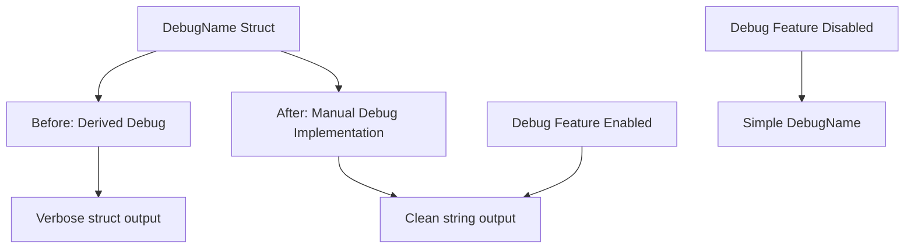

+++
title = "#21870 Simplify `Debug` display of `DebugName`"
date = "2025-11-26T00:00:00"
draft = false
template = "pull_request_page.html"
in_search_index = false

[extra]
current_language = "zh-cn"
available_languages = {"en" = { name = "English", url = "/pull_request/bevy/2025-11/pr-21870-en-20251126" }, "zh-cn" = { name = "中文", url = "/pull_request/bevy/2025-11/pr-21870-zh-cn-20251126" }}
labels = ["C-Usability", "A-Utils"]
+++

# Simplify `Debug` display of `DebugName`

## Basic Information
- **Title**: Simplify `Debug` display of `DebugName`
- **PR Link**: https://github.com/bevyengine/bevy/pull/21870
- **Author**: chescock
- **Status**: MERGED
- **Labels**: C-Usability, S-Ready-For-Final-Review, A-Utils
- **Created**: 2025-11-17T15:29:59Z
- **Merged**: 2025-11-26T09:15:24Z
- **Merged By**: mockersf

## Description Translation
# 目标

如 #21856 中所述，`DebugName` 的 `Debug` 输出过于冗长。它本应是一个围绕字符串的薄包装器，但却渲染为一个 `struct`。

## 解决方案

手动为 `DebugName` 实现 `impl Debug` 并直接写入字符串。

## 展示

以下代码

```rust
#[derive(Debug)]
struct TestStruct {
    debug_name: DebugName,
}
let test_struct = TestStruct {
    debug_name: DebugName::type_name::<TestStruct>(),
};
println!("{test_struct:#?}");
```

在此更改之前打印以下内容

```
TestStruct {
    debug_name: DebugName {
        name: "crate_name::TestStruct",
    },
}
```

在此更改之后打印以下内容

```
TestStruct {
    debug_name: "crate_name::TestStruct",
}
```

当 `debug` 功能被禁用时，在更改前后都打印以下内容

```
TestStruct {
    debug_name: DebugName,
}
```

## The Story of This Pull Request

这个 PR 解决了一个简单的用户体验问题：`DebugName` 结构体的调试输出过于冗长，影响了日志的可读性。

`DebugName` 是一个围绕字符串的薄包装器，用于在启用 `debug` 功能时存储类型名称，在禁用时提供一个占位符字符串。问题在于当使用 `#[derive(Debug)]` 时，Rust 会自动生成包含结构体字段的调试输出，这导致输出包含了不必要的嵌套结构。

开发者识别到这个问题后，采取了直接的解决方案：移除自动派生的 `Debug` 实现，改为手动实现。这个实现利用了 `DebugName` 已有的 `Deref` 特性（指向 `str`），通过 `&**self` 来访问底层的字符串。

关键的实现细节包括：
- 移除了 `#[derive(Debug)]` 中的 `Debug`
- 添加了手动的 `fmt::Debug` 实现
- 同时优化了 `fmt::Display` 实现，使其与新的调试实现保持一致

这种改变带来了明显的用户体验改进。在启用 `debug` 功能时，调试输出现在直接显示字符串内容而不是结构体格式，使得日志更加简洁易读。在禁用 `debug` 功能时，行为保持不变，仍然显示简单的 `DebugName` 占位符。

这个解决方案展示了 Rust 中手动实现 trait 的价值，特别是当自动派生无法提供所需的输出格式时。它也体现了良好的 API 设计原则：包装器类型应该尽可能透明地行为，避免在输出中暴露不必要的实现细节。

## Visual Representation



## Key Files Changed

### `crates/bevy_utils/src/debug_info.rs` (+9/-6)

这个文件包含了 `DebugName` 结构体的定义和实现。主要变化是移除了自动派生的 `Debug` 实现，改为手动实现，以获得更清晰的调试输出。

```rust
// Before:
#[derive(Clone, Debug, PartialEq, Eq)]
pub struct DebugName {
    #[cfg(feature = "debug")]
    name: Cow<'static, str>,
}

impl fmt::Display for DebugName {
    fn fmt(&self, f: &mut core::fmt::Formatter<'_>) -> core::fmt::Result {
        #[cfg(feature = "debug")]
        f.write_str(self.name.as_ref())?;
        #[cfg(not(feature = "debug"))]
        f.write_str(FEATURE_DISABLED)?;

        Ok(())
    }
}

// After:
#[derive(Clone, PartialEq, Eq)]
pub struct DebugName {
    #[cfg(feature = "debug")]
    name: Cow<'static, str>,
}

impl fmt::Display for DebugName {
    fn fmt(&self, f: &mut core::fmt::Formatter<'_>) -> core::fmt::Result {
        // Deref to `str`, which will use `FEATURE_DISABLED` if necessary
        write!(f, "{}", &**self)
    }
}

impl fmt::Debug for DebugName {
    fn fmt(&self, f: &mut core::fmt::Formatter<'_>) -> core::fmt::Result {
        // Deref to `str`, which will use `FEATURE_DISABLED` if necessary
        write!(f, "{:?}", &**self)
    }
}
```

这些更改通过统一的实现简化了代码，同时改善了调试输出的可读性。`Display` 和 `Debug` 实现现在都委托给底层的字符串表示，确保行为的一致性。

## Further Reading

- [Rust std::fmt::Debug trait documentation](https://doc.rust-lang.org/std/fmt/trait.Debug.html)
- [Rust Derive vs Manual Debug Implementation](https://doc.rust-lang.org/rust-by-example/hello/print/print_debug.html)
- [Bevy Debug Utils Documentation](https://docs.rs/bevy_utils/latest/bevy_utils/)

# Full Code Diff
```diff
diff --git a/crates/bevy_utils/src/debug_info.rs b/crates/bevy_utils/src/debug_info.rs
index 3aad20dfc2ed5..5f1f1aefd4391 100644
--- a/crates/bevy_utils/src/debug_info.rs
+++ b/crates/bevy_utils/src/debug_info.rs
@@ -14,7 +14,7 @@ const FEATURE_DISABLED: &str = "Enable the debug feature to see the name";
 ///
 /// * If the `debug` feature is enabled, the actual name will be used
 /// * If it is disabled, a string mentioning the disabled feature will be used
-#[derive(Clone, Debug, PartialEq, Eq)]
+#[derive(Clone, PartialEq, Eq)]
 pub struct DebugName {
     #[cfg(feature = "debug")]
     name: Cow<'static, str>,
@@ -23,12 +23,15 @@ pub struct DebugName {
 cfg::alloc! {
     impl fmt::Display for DebugName {
         fn fmt(&self, f: &mut core::fmt::Formatter<'_>) -> core::fmt::Result {
-            #[cfg(feature = "debug")]
-            f.write_str(self.name.as_ref())?;
-            #[cfg(not(feature = "debug"))]
-            f.write_str(FEATURE_DISABLED)?;
+            // Deref to `str`, which will use `FEATURE_DISABLED` if necessary
+            write!(f, "{}", &**self)
+        }
+    }
 
-            Ok(())
+    impl fmt::Debug for DebugName {
+        fn fmt(&self, f: &mut core::fmt::Formatter<'_>) -> core::fmt::Result {
+            // Deref to `str`, which will use `FEATURE_DISABLED` if necessary
+            write!(f, "{:?}", &**self)
         }
     }
 }
```