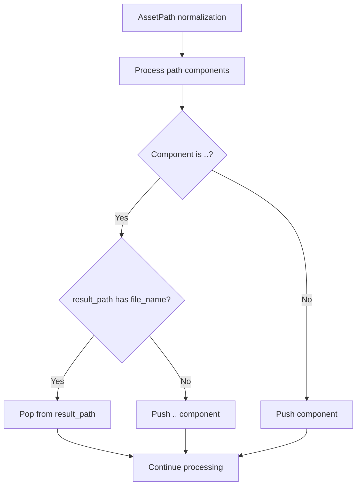

+++
title = "#21876 Fix `..` collapsing with other `..` during AssetPath normalization."
date = "2025-11-26T00:00:00"
draft = false
template = "pull_request_page.html"
in_search_index = true

[taxonomies]
list_display = ["show"]

[extra]
current_language = "en"
available_languages = {"en" = { name = "English", url = "/pull_request/bevy/2025-11/pr-21876-en-20251126" }, "zh-cn" = { name = "中文", url = "/pull_request/bevy/2025-11/pr-21876-zh-cn-20251126" }}
labels = ["C-Bug", "D-Trivial", "A-Assets"]
+++

# Title
Fix `..` collapsing with other `..` during AssetPath normalization

## Basic Information
- **Title**: Fix `..` collapsing with other `..` during AssetPath normalization.
- **PR Link**: https://github.com/bevyengine/bevy/pull/21876
- **Author**: andriyDev
- **Status**: MERGED
- **Labels**: C-Bug, D-Trivial, A-Assets, S-Ready-For-Final-Review
- **Created**: 2025-11-18T02:51:32Z
- **Merged**: 2025-11-26T21:52:56Z
- **Merged By**: mockersf

## Description Translation
# Objective

- Fixes #21875.

## Solution

- Make sure that we're not collapsing `..` with itself!

## Testing

- Added a test for this. It failed but after the fix it passes!

## The Story of This Pull Request

This PR addresses a subtle bug in Bevy's asset path normalization logic where consecutive parent directory references (`..`) were being incorrectly collapsed. The issue occurred when normalizing paths that contained multiple `..` components in sequence, which could lead to incorrect path resolution and asset loading failures.

The core problem was in the `normalize_path` function, which handles path normalization for asset paths. When processing path components, the function needed to properly handle cases where `..` components should be preserved rather than collapsed with each other. The original implementation was too aggressive in collapsing `..` components, treating them as if they should always cancel out, even when they represented legitimate parent directory traversals that couldn't be simplified further.

The fix introduces a more precise check by examining whether the current result path actually has a file name component that can be popped. When a `..` component is encountered, the code now checks if `result_path.file_name().is_some()`. If there is a file name (meaning we have a component that can be removed), we pop it. If there's no file name (meaning we're already at the root or have consecutive `..`), we preserve the `..` component.

This approach aligns with RFC 1808 path normalization rules, where `..` components should be preserved when there are insufficient directory components to cancel them out. The implementation uses Rust's standard library behavior - when the path ends in `..`, `Path::file_name()` returns `None`, naturally preventing the unwanted collapse.

The fix is minimal and surgical, changing only the specific condition that was causing the incorrect behavior. The added assertion serves as a sanity check to ensure the code logic remains correct - if we know there's a file name, we should always be able to pop a component from the path.

Two new test cases were added to verify the fix:
- `resolve_embed_relative_to_external_path`: Tests embedding a relative path when the base contains `..` components
- `resolve_relative_to_external_path`: Tests regular path resolution with `..` components

These tests ensure that paths like `../../a/b.gltf` correctly resolve relative paths without incorrectly collapsing the `..` components, preventing regressions in the future.

## Visual Representation



## Key Files Changed

### `crates/bevy_asset/src/path.rs` (+25/-1)

This file contains the core asset path handling logic in Bevy. The changes fix a path normalization bug and add test coverage.

**Key changes:**

1. **Fixed path normalization logic:**
```rust
// Before:
} else if elt == ".." {
    if !result_path.pop() {
        // Preserve ".." if insufficient matches (per RFC 1808).
        result_path.push(elt);
    }

// After:
} else if elt == ".." {
    // Note: If the result_path ends in `..`, Path::file_name returns None, so we'll end up
    // preserving it.
    if result_path.file_name().is_some() {
        // This assert is just a sanity check - we already know the path has a file_name, so
        // we know there is something to pop.
        assert!(result_path.pop());
    } else {
        // Preserve ".." if insufficient matches (per RFC 1808).
        result_path.push(elt);
    }
```

2. **Added test cases:**
```rust
#[test]
fn resolve_embed_relative_to_external_path() {
    let base = AssetPath::from("../../a/b.gltf");
    assert_eq!(
        base.resolve_embed("c.bin").unwrap(),
        AssetPath::from("../../a/c.bin")
    );
}

#[test]
fn resolve_relative_to_external_path() {
    let base = AssetPath::from("../../a/b.gltf");
    assert_eq!(
        base.resolve("c.bin").unwrap(),
        AssetPath::from("../../a/b.gltf/c.bin")
    );
}
```

These changes ensure that asset paths with multiple parent directory references are normalized correctly, preventing asset loading failures in complex directory structures.

## Further Reading

- [RFC 1808: Relative Uniform Resource Locators](https://tools.ietf.org/html/rfc1808) - The specification that defines path normalization rules
- [Rust std::path::Path documentation](https://doc.rust-lang.org/std/path/struct.Path.html) - For understanding Rust's path handling capabilities
- [Bevy Asset System documentation](https://bevyengine.org/learn/quick-start/assets/) - For context on how asset paths are used in Bevy

# Full Code Diff
```
diff --git a/crates/bevy_asset/src/path.rs b/crates/bevy_asset/src/path.rs
index de9dfa5ca583a..4d8d647940000 100644
--- a/crates/bevy_asset/src/path.rs
+++ b/crates/bevy_asset/src/path.rs
@@ -648,7 +648,13 @@ pub(crate) fn normalize_path(path: &Path) -> PathBuf {
         if elt == "." {
             // Skip
         } else if elt == ".." {
-            if !result_path.pop() {
+            // Note: If the result_path ends in `..`, Path::file_name returns None, so we'll end up
+            // preserving it.
+            if result_path.file_name().is_some() {
+                // This assert is just a sanity check - we already know the path has a file_name, so
+                // we know there is something to pop.
+                assert!(result_path.pop());
+            } else {
                 // Preserve ".." if insufficient matches (per RFC 1808).
                 result_path.push(elt);
             }
@@ -996,6 +1002,24 @@ mod tests {
         );
     }
 
+    #[test]
+    fn resolve_embed_relative_to_external_path() {
+        let base = AssetPath::from("../../a/b.gltf");
+        assert_eq!(
+            base.resolve_embed("c.bin").unwrap(),
+            AssetPath::from("../../a/c.bin")
+        );
+    }
+
+    #[test]
+    fn resolve_relative_to_external_path() {
+        let base = AssetPath::from("../../a/b.gltf");
+        assert_eq!(
+            base.resolve("c.bin").unwrap(),
+            AssetPath::from("../../a/b.gltf/c.bin")
+        );
+    }
+
     #[test]
     fn test_get_extension() {
         let result = AssetPath::from("http://a.tar.gz#Foo");
```