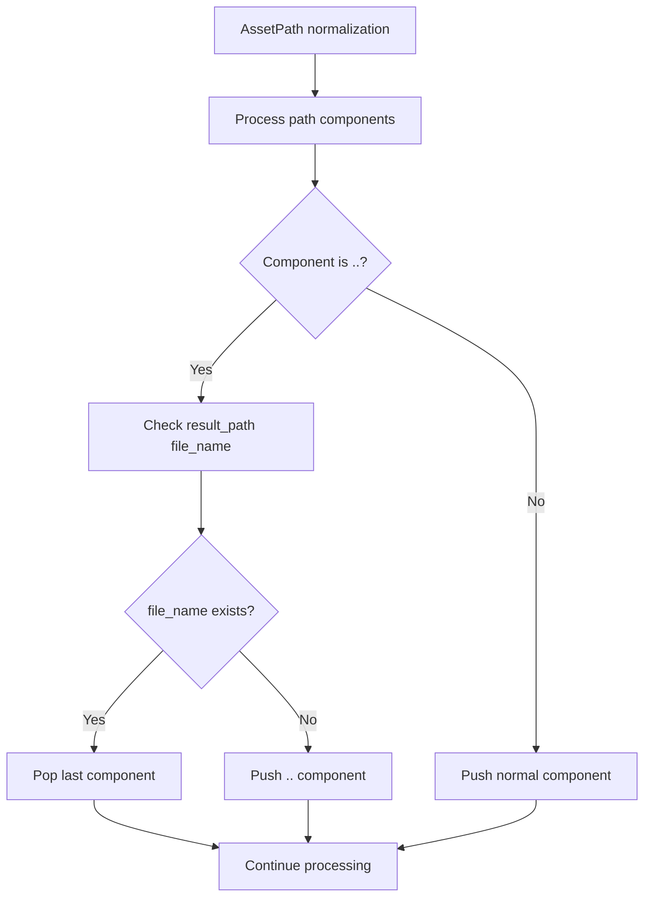

+++
title = "#21876 Fix `..` collapsing with other `..` during AssetPath normalization."
date = "2025-11-26T00:00:00"
draft = false
template = "pull_request_page.html"
in_search_index = false

[extra]
current_language = "zh-cn"
available_languages = {"en" = { name = "English", url = "/pull_request/bevy/2025-11/pr-21876-en-20251126" }, "zh-cn" = { name = "中文", url = "/pull_request/bevy/2025-11/pr-21876-zh-cn-20251126" }}
labels = ["C-Bug", "D-Trivial", "A-Assets"]
+++

# Title

## Basic Information
- **Title**: Fix `..` collapsing with other `..` during AssetPath normalization.
- **PR Link**: https://github.com/bevyengine/bevy/pull/21876
- **Author**: andriyDev
- **Status**: MERGED
- **Labels**: C-Bug, D-Trivial, A-Assets, S-Ready-For-Final-Review
- **Created**: 2025-11-18T02:51:32Z
- **Merged**: 2025-11-26T21:52:56Z
- **Merged By**: mockersf

## Description Translation
**目标**

- 修复 #21875。

**解决方案**

- 确保我们不会将 `..` 与自身折叠！

**测试**

- 为此添加了一个测试。修复前测试失败，修复后测试通过！

## The Story of This Pull Request

这个PR解决了一个在AssetPath规范化过程中出现的路径解析问题。问题的核心在于当路径中包含多个连续的`..`（父目录引用）时，规范化逻辑会错误地将它们相互抵消，导致路径解析不正确。

在AssetPath系统中，路径规范化是一个关键功能，它负责将包含相对路径组件的路径转换为标准化的绝对路径形式。问题出现在`normalize_path`函数处理`..`组件时。原来的实现会在遇到`..`时无条件地尝试从结果路径中弹出一个组件，但没有考虑当前结果路径末尾是否已经是`..`的情况。

具体来说，当规范化类似`../../a/b.gltf`这样的路径时，第一个`..`会被保留（因为此时结果路径为空），但第二个`..`会被错误地与前一个`..`抵消，导致最终路径变成`../a/b.gltf`而不是正确的`../../a/b.gltf`。

开发者通过分析发现，问题的根源在于`result_path.pop()`的逻辑。原来的代码：

```rust
if elt == ".." {
    if !result_path.pop() {
        result_path.push(elt);
    }
}
```

这里的问题是`pop()`方法会移除路径的最后一个组件，但当路径末尾已经是`..`时，这会导致错误的抵消。正确的逻辑应该是只有当结果路径的最后一个组件不是`..`时才执行`pop()`操作。

修复方案引入了更精确的条件判断：

```rust
if elt == ".." {
    // Note: If the result_path ends in `..`, Path::file_name returns None, so we'll end up
    // preserving it.
    if result_path.file_name().is_some() {
        // This assert is just a sanity check - we already know the path has a file_name, so
        // we know there is something to pop.
        assert!(result_path.pop());
    } else {
        // Preserve ".." if insufficient matches (per RFC 1808).
        result_path.push(elt);
    }
}
```

这个修复的关键洞察是使用`file_name()`方法来判断路径末尾是否已经是一个`..`组件。当路径以`..`结尾时，`file_name()`会返回`None`，这样我们就知道不应该执行`pop()`操作，而是应该保留当前的`..`。

为了验证修复的有效性，开发者添加了两个测试用例：

1. `resolve_embed_relative_to_external_path` - 测试嵌入路径解析
2. `resolve_relative_to_external_path` - 测试相对路径解析

这两个测试都使用`../../a/b.gltf`作为基础路径，验证在解析相对路径`c.bin`时的正确行为。修复前这些测试会失败，因为路径规范化会错误地折叠`..`组件；修复后测试通过，证明问题已解决。

这个修复虽然代码改动很小（只有几行），但解决了AssetPath系统中的一个重要边界情况。它确保了路径规范化遵循RFC 1808规范，正确处理连续的父目录引用，避免了路径解析错误导致的资源加载问题。

## Visual Representation



## Key Files Changed

### `crates/bevy_asset/src/path.rs` (+25/-1)

这个文件包含了AssetPath相关的核心逻辑，特别是路径规范化的实现。

**主要修改：**

1. **修复路径规范化逻辑**：
```rust
// 修改前：
if elt == ".." {
    if !result_path.pop() {
        result_path.push(elt);
    }
}

// 修改后：
if elt == ".." {
    // Note: If the result_path ends in `..`, Path::file_name returns None, so we'll end up
    // preserving it.
    if result_path.file_name().is_some() {
        // This assert is just a sanity check - we already know the path has a file_name, so
        // we know there is something to pop.
        assert!(result_path.pop());
    } else {
        // Preserve ".." if insufficient matches (per RFC 1808).
        result_path.push(elt);
    }
}
```

2. **添加测试用例**：
```rust
#[test]
fn resolve_embed_relative_to_external_path() {
    let base = AssetPath::from("../../a/b.gltf");
    assert_eq!(
        base.resolve_embed("c.bin").unwrap(),
        AssetPath::from("../../a/c.bin")
    );
}

#[test]
fn resolve_relative_to_external_path() {
    let base = AssetPath::from("../../a/b.gltf");
    assert_eq!(
        base.resolve("c.bin").unwrap(),
        AssetPath::from("../../a/b.gltf/c.bin")
    );
}
```

这些修改确保了AssetPath系统能够正确处理包含多个连续`..`组件的路径，遵循了标准的路径规范化规则。

## Further Reading

- [RFC 1808 - Relative Uniform Resource Locators](https://tools.ietf.org/html/rfc1808) - 定义了相对URL的解析规则
- [std::path::Path documentation](https://doc.rust-lang.org/std/path/struct.Path.html) - Rust标准库中Path类型的文档
- [Bevy Asset System](https://bevyengine.org/learn/book/getting-started/assets/) - Bevy引擎资产系统的官方文档

# Full Code Diff
diff --git a/crates/bevy_asset/src/path.rs b/crates/bevy_asset/src/path.rs
index de9dfa5ca583a..4d8d647940000 100644
--- a/crates/bevy_asset/src/path.rs
+++ b/crates/bevy_asset/src/path.rs
@@ -648,7 +648,13 @@ pub(crate) fn normalize_path(path: &Path) -> PathBuf {
         if elt == "." {
             // Skip
         } else if elt == ".." {
-            if !result_path.pop() {
+            // Note: If the result_path ends in `..`, Path::file_name returns None, so we'll end up
+            // preserving it.
+            if result_path.file_name().is_some() {
+                // This assert is just a sanity check - we already know the path has a file_name, so
+                // we know there is something to pop.
+                assert!(result_path.pop());
+            } else {
                 // Preserve ".." if insufficient matches (per RFC 1808).
                 result_path.push(elt);
             }
@@ -996,6 +1002,24 @@ mod tests {
         );
     }
 
+    #[test]
+    fn resolve_embed_relative_to_external_path() {
+        let base = AssetPath::from("../../a/b.gltf");
+        assert_eq!(
+            base.resolve_embed("c.bin").unwrap(),
+            AssetPath::from("../../a/c.bin")
+        );
+    }
+
+    #[test]
+    fn resolve_relative_to_external_path() {
+        let base = AssetPath::from("../../a/b.gltf");
+        assert_eq!(
+            base.resolve("c.bin").unwrap(),
+            AssetPath::from("../../a/b.gltf/c.bin")
+        );
+    }
+
     #[test]
     fn test_get_extension() {
         let result = AssetPath::from("http://a.tar.gz#Foo");