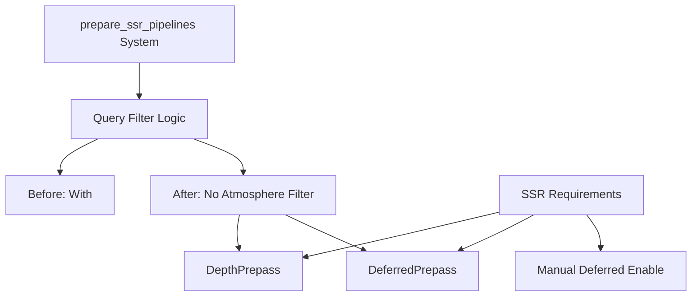

+++
title = "#21877 ssr fix and add some documents"
date = "2025-11-25T00:00:00"
draft = false
template = "pull_request_page.html"
in_search_index = true

[taxonomies]
list_display = ["show"]

[extra]
current_language = "en"
available_languages = {"en" = { name = "English", url = "/pull_request/bevy/2025-11/pr-21877-en-20251125" }, "zh-cn" = { name = "中文", url = "/pull_request/bevy/2025-11/pr-21877-zh-cn-20251125" }}
labels = ["C-Bug", "A-Rendering", "D-Straightforward"]
+++

# Title
SSR Fix and Documentation Enhancement

## Basic Information
- **Title**: ssr fix and add some documents
- **PR Link**: https://github.com/bevyengine/bevy/pull/21877
- **Author**: newDINO
- **Status**: MERGED
- **Labels**: C-Bug, A-Rendering, S-Ready-For-Final-Review, D-Straightforward
- **Created**: 2025-11-18T06:21:14Z
- **Merged**: 2025-11-25T02:24:08Z
- **Merged By**: alice-i-cecile

## Description Translation
# Objective
Screen space reflection didn't work for my program, so I tried cloning bevy repo and running the ssr example to see whether it works or not, and it didn't. I figured out that the problem is that `prepare_ssr_pipelines` system only runs for views with `ExtractedAtmosphere`. So I removed this filter because it already uses `Has<ExtractedAtmosphere>`. And the example works afterwards.

I later found that the `With<ExtractedAtmosphere>` filter is not added to bevy 0.17, so the problem in my own program is not the same as the ssr example. I compared the ssr example and my program and found that I didn't add `DefaultOpaqueRendererMethod::deferred()` resource. So I added a few docs to state that deferred rendering is not automatically enabled when ssr is added.


## Solution
1. remove `With<ExtractedAtmosphere>` filter in `prepare_ssr_pipelines`.
2. add more documentation.

## Testing
I tested the ssr example and atmosphere example and both look fine.

## The Story of This Pull Request

This PR addresses two distinct but related issues with Bevy's Screen Space Reflections (SSR) implementation. The developer encountered SSR not working in their program and began a systematic debugging process that revealed both a bug in the current codebase and a documentation gap that could confuse other users.

The investigation started when the developer noticed that SSR wasn't functioning in their application. To isolate the problem, they cloned the Bevy repository and ran the official SSR example, expecting it to work correctly. Surprisingly, the example also failed, indicating a deeper issue in the SSR implementation itself.

Through code analysis, the developer identified the root cause: the `prepare_ssr_pipelines` system was using an overly restrictive filter. The system query included `With<ExtractedAtmosphere>`, which meant it would only process views that had an atmosphere component. This was problematic because SSR should work independently of atmospheric effects. The system already used `Has<ExtractedAtmosphere>` internally, making the additional filter redundant and incorrect.

After fixing this issue, the developer discovered that their original program still had problems. By comparing their code with the working SSR example, they identified a second issue: deferred rendering wasn't automatically enabled when SSR was added. This revealed a documentation gap - while the existing documentation mentioned that SSR requires deferred rendering, it didn't explicitly state that users need to manually enable it.

The solution implemented two key changes. First, the unnecessary `With<ExtractedAtmosphere>` filter was removed from the system query, allowing SSR to work correctly regardless of atmospheric effects. Second, the documentation was updated to clearly state that deferred rendering must be explicitly enabled, preventing other developers from encountering the same confusion.

The technical insight here is about system query design in Bevy's ECS. When designing systems, it's important to ensure that filters accurately reflect the actual requirements of the system logic. Overly restrictive filters can prevent systems from running when they should, leading to subtle bugs. In this case, the system internally handled the presence or absence of atmosphere data, so the filter was both unnecessary and incorrect.

## Visual Representation



## Key Files Changed

**File: `crates/bevy_pbr/src/ssr/mod.rs`**

1. **Documentation Enhancement**: Added clarification that deferred rendering must be manually enabled
```rust
// Before:
/// Screen-space reflections currently require deferred rendering in order to
/// appear. Therefore, they also need the [`DepthPrepass`] and [`DeferredPrepass`]
/// components, which are inserted automatically.

// After:
/// Screen-space reflections currently require deferred rendering in order to
/// appear. Therefore, they also need the [`DepthPrepass`] and [`DeferredPrepass`]
/// components, which are inserted automatically,
/// but deferred rendering itself is not automatically enabled.
```

2. **System Query Fix**: Removed unnecessary atmosphere filter
```rust
// Before:
    mut views: Query<
        (
            &ViewTarget,
            &ScreenSpaceReflectionsSettings,
            &ScreenSpaceReflectionsUniform,
        ),
        (
            With<ScreenSpaceReflectionsUniform>,
            With<DepthPrepass>,
            With<DeferredPrepass>,
            With<ExtractedAtmosphere>,
        ),
    >,

// After:
    mut views: Query<
        (
            &ViewTarget,
            &ScreenSpaceReflectionsSettings,
            &ScreenSpaceReflectionsUniform,
        ),
        (
            With<ScreenSpaceReflectionsUniform>,
            With<DepthPrepass>,
            With<DeferredPrepass>,
        ),
    >,
```

The changes are minimal but impactful. The documentation update addresses user confusion by explicitly stating that deferred rendering must be manually configured. The system query fix removes an incorrect filter that was preventing SSR from working in scenes without atmospheric effects.

## Further Reading

- [Bevy ECS System Queries Documentation](https://bevyengine.org/learn/quick-start/ecs/#queries)
- [Screen Space Reflections in Computer Graphics](https://en.wikipedia.org/wiki/Screen_space_reflection)
- [Bevy Deferred Rendering Guide](https://bevyengine.org/learn/quick-start/deferred-rendering/)