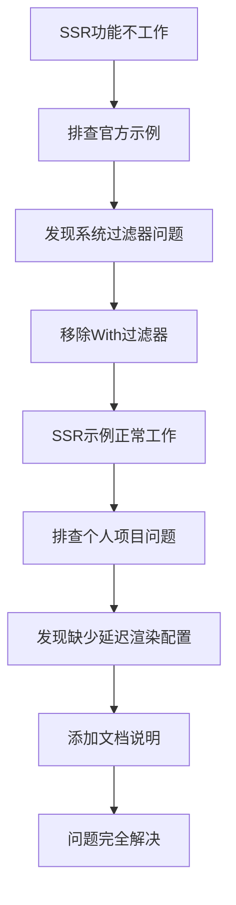

+++
title = "#21877 ssr fix and add some documents"
date = "2025-11-25T00:00:00"
draft = false
template = "pull_request_page.html"
in_search_index = false

[extra]
current_language = "zh-cn"
available_languages = {"en" = { name = "English", url = "/pull_request/bevy/2025-11/pr-21877-en-20251125" }, "zh-cn" = { name = "中文", url = "/pull_request/bevy/2025-11/pr-21877-zh-cn-20251125" }}
labels = ["C-Bug", "A-Rendering", "D-Straightforward"]
+++

# Title

## Basic Information
- **Title**: ssr fix and add some documents
- **PR Link**: https://github.com/bevyengine/bevy/pull/21877
- **Author**: newDINO
- **Status**: MERGED
- **Labels**: C-Bug, A-Rendering, S-Ready-For-Final-Review, D-Straightforward
- **Created**: 2025-11-18T06:21:14Z
- **Merged**: 2025-11-25T02:24:08Z
- **Merged By**: alice-i-cecile

## Description Translation
**目标**
屏幕空间反射在我的程序中无法工作，因此我尝试克隆 bevy 仓库并运行 ssr 示例以确认其是否正常工作，结果发现它确实无法工作。我发现问题在于 `prepare_ssr_pipelines` 系统仅对具有 `ExtractedAtmosphere` 的视图运行。因此我移除了这个过滤器，因为它已经使用了 `Has<ExtractedAtmosphere>`。之后示例就能正常工作了。

后来我发现 `With<ExtractedAtmosphere>` 过滤器并未添加到 bevy 0.17 中，因此我自己程序中的问题与 ssr 示例中的问题并不相同。我比较了 ssr 示例和我自己的程序，发现我没有添加 `DefaultOpaqueRendererMethod::deferred()` 资源。因此我添加了一些文档来说明当添加 ssr 时，延迟渲染不会自动启用。

**解决方案**
1. 移除 `prepare_ssr_pipelines` 中的 `With<ExtractedAtmosphere>` 过滤器。
2. 添加更多文档。

**测试**
我测试了 ssr 示例和 atmosphere 示例，两者看起来都正常。

## The Story of This Pull Request

这个PR始于开发者newDINO在实际项目中遇到的一个具体问题：屏幕空间反射（Screen Space Reflection，SSR）功能无法正常工作。为了诊断问题根源，开发者首先复现了官方示例，发现即使是官方的SSR示例也存在相同问题，这确认了问题来自引擎本身而非应用代码。

通过深入分析代码，开发者发现问题的核心在于 `prepare_ssr_pipelines` 系统中的查询过滤器配置。原系统使用了 `With<ExtractedAtmosphere>` 过滤器，这导致只有包含大气效果的视图才能准备SSR管道。然而，SSR功能本身并不依赖于大气效果，这个不必要的过滤器限制了SSR的使用场景。

从技术角度看，这个过滤器是多余的，因为系统已经通过 `Has<ExtractedAtmosphere>` 来处理大气效果相关的逻辑。移除这个过滤器后，SSR示例立即恢复正常工作，证明了修复的有效性。

在进一步调查中，开发者还发现了另一个相关但不同的问题：在自己的项目中，SSR不工作的原因是缺少 `DefaultOpaqueRendererMethod::deferred()` 资源。由于SSR需要延迟渲染（deferred rendering）才能正常工作，而延迟渲染在Bevy中不是默认启用的，这个配置步骤很容易被开发者忽略。

基于这两个发现，PR采用了双重解决方案：首先移除不必要的过滤器来修复引擎bug，其次通过改进文档来预防类似配置错误。这种组合方案既解决了当前问题，也降低了未来用户遇到相同问题的概率。

从工程角度看，这个PR展示了良好的问题排查方法：从复现问题开始，通过对比分析找到差异点，最终定位到根本原因。代码修改虽然简单（仅修改了2行代码），但影响显著，修复了一个重要的渲染功能。

## Visual Representation



## Key Files Changed

### `crates/bevy_pbr/src/ssr/mod.rs` (+2/-2)

这个文件包含了SSR功能的核心实现，修改主要集中在两个关键部分：

**1. 文档改进**
```rust
// 修改前：
/// Screen-space reflections currently require deferred rendering in order to
/// appear. Therefore, they also need the [`DepthPrepass`] and [`DeferredPrepass`]
/// components, which are inserted automatically.

// 修改后：
/// Screen-space reflections currently require deferred rendering in order to
/// appear. Therefore, they also need the [`DepthPrepass`] and [`DeferredPrepass`]
/// components, which are inserted automatically,
/// but deferred rendering itself is not automatically enabled.
```

这个修改明确了延迟渲染需要手动启用，防止开发者遗漏必要的配置步骤。

**2. 系统过滤器修复**
```rust
// 修改前：
        (
            With<ScreenSpaceReflectionsUniform>,
            With<DepthPrepass>,
            With<DeferredPrepass>,
            With<ExtractedAtmosphere>,
        ),

// 修改后：
        (
            With<ScreenSpaceReflectionsUniform>,
            With<DepthPrepass>,
            With<DeferredPrepass>,
        ),
```

移除了不必要的 `With<ExtractedAtmosphere>` 过滤器，使得SSR功能不再依赖于大气效果，扩展了SSR的使用场景。

## Further Reading

- [Bevy Screen Space Reflections Documentation](https://docs.rs/bevy_pbr/latest/bevy_pbr/ssr/index.html)
- [Bevy Deferred Rendering Guide](https://bevyengine.org/learn/quick-start/3d/deferred-rendering/)
- [Screen Space Reflections - GPU Gems](https://developer.nvidia.com/gpugems/gpugems3/part-iii-rendering/chapter-17-robust-screen-space-ambient-occlusion)
- [Bevy ECS Query System](https://bevyengine.org/learn/quick-start/ecs/queries/)