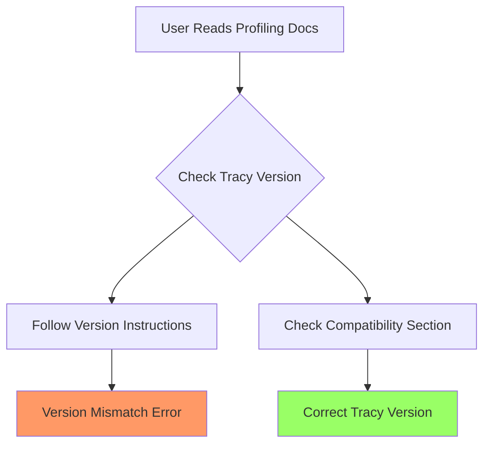

+++
title = "#21881 Remove mention of tracy version from profiling docs"
date = "2025-11-22T00:00:00"
draft = false
template = "pull_request_page.html"
in_search_index = true

[taxonomies]
list_display = ["show"]

[extra]
current_language = "en"
available_languages = {"en" = { name = "English", url = "/pull_request/bevy/2025-11/pr-21881-en-20251122" }, "zh-cn" = { name = "中文", url = "/pull_request/bevy/2025-11/pr-21881-zh-cn-20251122" }}
labels = ["C-Docs", "A-Diagnostics"]
+++

# Remove mention of tracy version from profiling docs

## Basic Information
- **Title**: Remove mention of tracy version from profiling docs
- **PR Link**: https://github.com/bevyengine/bevy/pull/21881
- **Author**: laundmo
- **Status**: MERGED
- **Labels**: C-Docs, S-Ready-For-Final-Review, A-Diagnostics
- **Created**: 2025-11-18T20:16:25Z
- **Merged**: 2025-11-22T12:54:03Z
- **Merged By**: mockersf

## Description Translation
The original description is in English, so it is included exactly as-is:

# Objective

In
- #21565 
i added a note to the profiling docs that the correct tracy version for bevy 0.17 is tracy 0.12.2
But in a recent patch release, the version of the tracy libraries was bumped and now requires tracy 0.13. While this is a breaking change i dont think should happen on path releases, it shows that my mentioning of the version was way too optimistic, and its [already caused some frustration](https://discord.com/channels/691052431525675048/691052431974465548/1440429953232535623)

## Solution

- remove the mention of any specific version from the docs

## The Story of This Pull Request

This pull request addresses a documentation issue that arose from version coupling between Bevy and the Tracy profiling tool. The problem started when PR #21565 added specific version guidance to the profiling documentation, explicitly stating that Tracy 0.12.2 was required for Bevy 0.17. 

The approach taken in the original documentation update was reasonable at the time - providing users with clear, specific version requirements to ensure compatibility. However, this created a maintenance burden when Bevy's Tracy dependency was updated in a patch release to require Tracy 0.13. The documentation became immediately outdated and misleading, causing user frustration as evidenced by the Discord conversation referenced in the PR description.

The solution implemented here is straightforward but important: remove the specific version reference entirely. This eliminates the maintenance burden and prevents the documentation from becoming incorrect when dependency versions change. The documentation now directs users to the "Finding the correct Tracy version" section without prescribing a specific version number.

This change reflects a common pattern in software documentation - avoiding hard-coded version numbers that can quickly become outdated. Instead, the documentation focuses on guiding users to the method for determining compatibility rather than providing specific versions that may change.

The implementation is minimal but effective - a single line change that removes the parenthetical version specification while maintaining the overall structure and utility of the documentation. This approach balances the need for accurate information with the practical reality of rapidly evolving dependencies in a game engine ecosystem.

## Visual Representation



## Key Files Changed

**File: `docs/profiling.md`** (+1/-1)

This file contains the primary documentation for profiling in Bevy. The change removes a specific version reference that was causing confusion when dependencies updated.

**Before:**
```markdown
1. Install the [correct Tracy version](#finding-the-correct-tracy-version) (0.12.2 for Bevy 0.17)
```

**After:**
```markdown
1. Install the [correct Tracy version](#finding-the-correct-tracy-version)
```

The change eliminates the hard-coded version reference "(0.12.2 for Bevy 0.17)" while preserving the link to the section that explains how to find the correct version. This makes the documentation more maintainable and less likely to become outdated.

## Further Reading

- [Tracy Profiling Tool GitHub Repository](https://github.com/wolfpld/tracy)
- [Bevy Documentation Guidelines](https://github.com/bevyengine/bevy/blob/main/docs/README.md)
- [Semantic Versioning Best Practices](https://semver.org/)