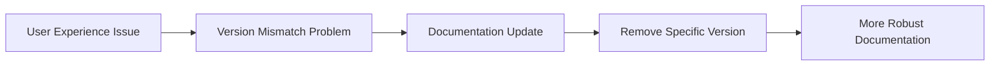

+++
title = "#21881 Remove mention of tracy version from profiling docs"
date = "2025-11-22T00:00:00"
draft = false
template = "pull_request_page.html"
in_search_index = false

[extra]
current_language = "zh-cn"
available_languages = {"en" = { name = "English", url = "/pull_request/bevy/2025-11/pr-21881-en-20251122" }, "zh-cn" = { name = "中文", url = "/pull_request/bevy/2025-11/pr-21881-zh-cn-20251122" }}
labels = ["C-Docs", "A-Diagnostics"]
+++

# Title

## Basic Information
- **Title**: Remove mention of tracy version from profiling docs
- **PR Link**: https://github.com/bevyengine/bevy/pull/21881
- **Author**: laundmo
- **Status**: MERGED
- **Labels**: C-Docs, S-Ready-For-Final-Review, A-Diagnostics
- **Created**: 2025-11-18T20:16:25Z
- **Merged**: 2025-11-22T12:54:03Z
- **Merged By**: mockersf

## Description Translation
**目标**

在 #21565 中，我在性能分析文档中添加了一条说明，指出 Bevy 0.17 对应的正确 Tracy 版本是 0.12.2。但在最近的补丁版本中，Tracy 库的版本被提升，现在需要 Tracy 0.13。虽然我认为这不应该在补丁版本中发生破坏性变更，但这表明我提及版本号的做法过于乐观，并且已经引起了一些用户的困扰。

**解决方案**

- 从文档中移除任何特定版本的提及

## The Story of This Pull Request

这个PR的故事始于一个看似简单的文档更新，但反映了软件依赖管理中的一个常见挑战。开发者laundmo在之前的PR #21565中，为Bevy的性能分析文档添加了具体的Tracy版本要求，明确指出Bevy 0.17需要Tracy 0.12.2。

然而，这个看似有用的版本说明很快遇到了现实问题。在Bevy的一个补丁版本中，Tracy库的版本要求被提升到了0.13。虽然从语义化版本控制的角度来看，这种破坏性变更不应该发生在补丁版本中，但实际情况是版本依赖确实发生了变化。

这个具体版本号的说明已经导致了用户的实际问题。在Discord讨论中，有用户表达了因此产生的困扰，因为按照文档安装指定版本后无法正常工作。这暴露了一个关键问题：在快速发展的开源生态系统中，硬编码具体的版本号容易导致文档过时，反而会给用户带来更多困惑。

从技术角度看，这个问题的核心在于文档维护策略。开发者意识到，与其试图在文档中维护一个可能随时变化的精确版本号，不如提供更通用的指导原则。这样即使底层依赖版本发生变化，文档仍然保持有效。

解决方案很简单但很有效：完全移除对特定Tracy版本的提及。这样用户只需要关注安装"正确的Tracy版本"，而具体的版本号可以通过项目的实际依赖配置或其他更可靠的渠道来获取。

这种改变体现了软件工程中的一个重要原则：当某个信息容易过时且维护成本高时，有时最好的解决方案是移除该信息，而不是不断更新它。这减少了文档维护的负担，也避免了给用户提供可能已经过时的指导。

从架构角度看，这个变更反映了Bevy项目对用户体验的持续改进。虽然只是一个单行的文档修改，但它解决了真实用户遇到的问题，体现了项目对文档质量的重视。

## Visual Representation



## Key Files Changed

**File: `docs/profiling.md`**

这个文件包含了Bevy性能分析工具的文档说明。修改的部分涉及Tracy性能分析工具的安装指南。

**变更详情：**

```markdown
# Before:
1. Install the [correct Tracy version](#finding-the-correct-tracy-version) (0.12.2 for Bevy 0.17)

# After:
1. Install the [correct Tracy version](#finding-the-correct-tracy-version)
```

这个修改移除了硬编码的Tracy版本号"0.12.2 for Bevy 0.17"，使文档更加通用和持久。用户现在被引导到"finding-the-correct-tracy-version"部分来获取版本信息，这个部分可能包含更动态或更通用的版本确定方法。

## Further Reading

- [Semantic Versioning Specification](https://semver.org/) - 理解语义化版本控制的原则
- [Bevy's Dependency Management](https://bevyengine.org/learn/book/introduction/) - Bevy项目的依赖管理策略
- [Tracy Profiler Documentation](https://github.com/wolfpld/tracy) - Tracy性能分析工具的官方文档
- [Software Documentation Best Practices](https://documentation.divio.com/) - 软件文档编写的最佳实践