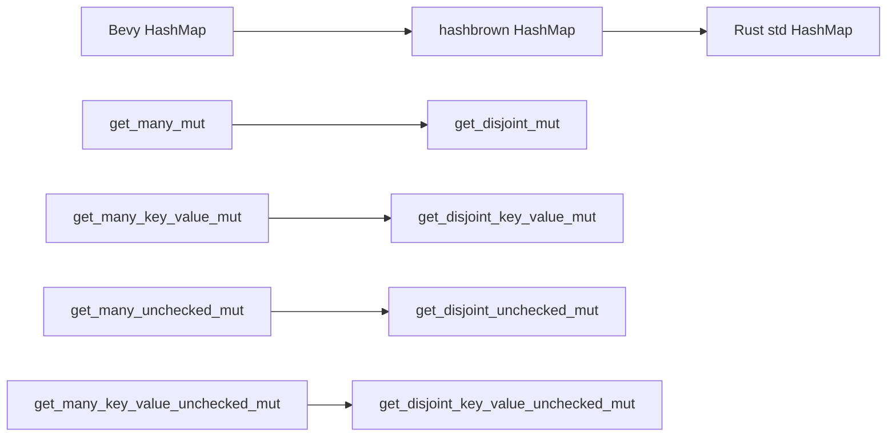

+++
title = "#21898 Replace get_many_* with get_disjoint_*."
date = "2025-11-21T00:00:00"
draft = false
template = "pull_request_page.html"
in_search_index = true

[taxonomies]
list_display = ["show"]

[extra]
current_language = "en"
available_languages = {"en" = { name = "English", url = "/pull_request/bevy/2025-11/pr-21898-en-20251121" }, "zh-cn" = { name = "中文", url = "/pull_request/bevy/2025-11/pr-21898-zh-cn-20251121" }}
labels = ["C-Bug", "D-Trivial", "M-Migration-Guide", "A-Utils"]
+++

# Title
Replace get_many_* with get_disjoint_*.

## Basic Information
- **Title**: Replace get_many_* with get_disjoint_*.
- **PR Link**: https://github.com/bevyengine/bevy/pull/21898
- **Author**: andriyDev
- **Status**: MERGED
- **Labels**: C-Bug, D-Trivial, S-Ready-For-Final-Review, M-Migration-Guide, A-Utils
- **Created**: 2025-11-21T05:17:10Z
- **Merged**: 2025-11-21T07:45:20Z
- **Merged By**: alice-i-cecile

## Description Translation
# Objective

- Fixes CI after https://github.com/rust-lang/hashbrown/pull/648.

## Solution

- Match the naming in hashbrown, and in std!

## The Story of This Pull Request

This PR addresses a straightforward but important compatibility issue that arose from upstream changes in the hashbrown library. The problem started when hashbrown, which provides the underlying HashMap implementation for Bevy, renamed several methods from `get_many_*` to `get_disjoint_*` in their PR #648. This change was made to better reflect the methods' behavior - they specifically retrieve multiple disjoint (non-overlapping) mutable references to HashMap values.

When these changes landed in hashbrown, Bevy's CI started failing because Bevy's HashMap wrapper was still calling the old method names that no longer existed in the updated hashbrown version. The solution was simple but necessary: update Bevy's method names to match the new naming convention used by both hashbrown and the Rust standard library.

The implementation involved updating four related methods in Bevy's HashMap wrapper:

- `get_many_mut` → `get_disjoint_mut`
- `get_many_key_value_mut` → `get_disjoint_key_value_mut` 
- `get_many_unchecked_mut` → `get_disjoint_unchecked_mut`
- `get_many_key_value_unchecked_mut` → `get_disjoint_key_value_unchecked_mut`

Each method follows the same pattern: it accepts an array of keys and returns an array of optional mutable references to values. The key insight is that these methods enforce or assume that the returned references are disjoint - they don't alias the same memory location. The new naming makes this constraint more explicit.

The changes are purely syntactic - the underlying functionality remains identical. Each method simply forwards to the corresponding method in the underlying hashbrown HashMap implementation. The documentation was updated to reference the new method names while maintaining the same examples and behavior descriptions.

A migration guide was added to help users transition their code. This is particularly important because these method name changes break existing code that uses the old names. The guide provides a clear mapping from old to new method names, making it easy for developers to update their codebases.

From an engineering perspective, this PR demonstrates the importance of maintaining compatibility with upstream dependencies. When core dependencies like hashbrown make breaking changes, downstream projects like Bevy must adapt quickly to avoid build failures. The solution here is minimal and focused - it addresses the immediate compatibility issue without introducing any functional changes or new features.

## Visual Representation



## Key Files Changed

### `crates/bevy_platform/src/collections/hash_map.rs` (+16/-16)

This file contains Bevy's HashMap implementation that wraps hashbrown's HashMap. The changes update method names to match the new naming convention in hashbrown.

Key changes include:

```rust
// Before:
pub fn get_many_mut<Q, const N: usize>(&mut self, ks: [&Q; N]) -> [Option<&'_ mut V>; N]
{
    self.0.get_many_mut(ks)
}

// After:
pub fn get_disjoint_mut<Q, const N: usize>(&mut self, ks: [&Q; N]) -> [Option<&'_ mut V>; N]
{
    self.0.get_disjoint_mut(ks)
}
```

```rust
// Before:
pub fn get_many_key_value_mut<Q, const N: usize>(
    &mut self,
    ks: [&Q; N],
) -> [Option<(&'_ K, &'_ mut V)>; N]
{
    self.0.get_many_key_value_mut(ks)
}

// After:
pub fn get_disjoint_key_value_mut<Q, const N: usize>(
    &mut self,
    ks: [&Q; N],
) -> [Option<(&'_ K, &'_ mut V)>; N]
{
    self.0.get_disjoint_key_value_mut(ks)
}
```

### `release-content/migration-guides/get_many_renamed_to_get_disjoint.md` (+13/-0)

This new file provides a migration guide for users affected by the method name changes.

```markdown
---
title: Renamed `bevy_platform::HashMap::get_many_*` to `bevy_platform::HashMap::get_disjoint_*`
pull_requests: [21898]
---

Matching both [`hashbrown`](https://github.com/rust-lang/hashbrown/pull/648) and the `std` library,
we've renamed all the `get_many_*` methods on `bevy_platform::HashMap` to `get_disjoint_*`. So
rename:

- `get_many_mut` -> `get_disjoint_mut`
- `get_many_unchecked_mut` -> `get_disjoint_unchecked_mut`
- `get_many_key_value_mut` -> `get_disjoint_key_value_mut`
- `get_many_key_value_unchecked_mut` -> `get_disjoint_key_value_unchecked_mut`
```

## Further Reading

- [hashbrown PR #648](https://github.com/rust-lang/hashbrown/pull/648) - The upstream change that motivated this PR
- [Rust HashMap documentation](https://doc.rust-lang.org/std/collections/struct.HashMap.html) - Standard library HashMap reference
- [Bevy Migration Guides](https://bevyengine.org/learn/migration-guides/) - Other migration guides for Bevy updates