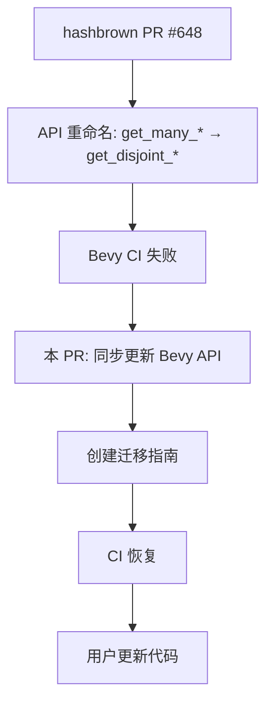

+++
title = "#21898 Replace get_many_* with get_disjoint_*."
date = "2025-11-21T00:00:00"
draft = false
template = "pull_request_page.html"
in_search_index = false

[extra]
current_language = "zh-cn"
available_languages = {"en" = { name = "English", url = "/pull_request/bevy/2025-11/pr-21898-en-20251121" }, "zh-cn" = { name = "中文", url = "/pull_request/bevy/2025-11/pr-21898-zh-cn-20251121" }}
labels = ["C-Bug", "D-Trivial", "M-Migration-Guide", "A-Utils"]
+++

# Replace get_many_* with get_disjoint_*

## Basic Information
- **Title**: Replace get_many_* with get_disjoint_*.
- **PR Link**: https://github.com/bevyengine/bevy/pull/21898
- **Author**: andriyDev
- **Status**: MERGED
- **Labels**: C-Bug, D-Trivial, S-Ready-For-Final-Review, M-Migration-Guide, A-Utils
- **Created**: 2025-11-21T05:17:10Z
- **Merged**: 2025-11-21T07:45:20Z
- **Merged By**: alice-i-cecile

## Description Translation
# Objective

- 修复在 https://github.com/rust-lang/hashbrown/pull/648 之后的 CI。

## Solution

- 匹配 hashbrown 和 std 中的命名！

## The Story of This Pull Request

这个 PR 解决了一个由上游依赖变更引起的构建中断问题。问题的根源在于 hashbrown 库（Rust 标准库 HashMap 的基础实现）进行了一次 API 重命名，将 `get_many_*` 系列方法更名为 `get_disjoint_*`。

### 问题背景

hashbrown 库在 PR #648 中进行了方法重命名，这是为了更准确地反映这些方法的行为语义。`get_disjoint_*` 这个名称更好地传达了这些方法的核心特性：它们获取的是互不相交的（disjoint）引用，确保不会返回指向同一个值的多个可变引用，从而维护 Rust 的借用规则。

当 hashbrown 完成这次重命名后，Bevy 的代码库出现了编译错误，因为 Bevy 的 `bevy_platform::HashMap` 包装了 hashbrown 的 HashMap，并重新导出了这些方法。

### 解决方案

开发者采取了最直接的解决方案：同步更新 Bevy 中的方法命名以匹配上游变更。这个方案有几个关键优势：

1. **保持一致性**：与 hashbrown 和 Rust 标准库保持一致，减少认知负担
2. **语义准确性**：`disjoint` 比 `many` 更能准确描述方法的行为特性
3. **最小化变更**：只涉及方法重命名，不改变任何功能逻辑

### 实现细节

这次变更影响了四个相关方法：

- `get_many_mut` → `get_disjoint_mut`
- `get_many_unchecked_mut` → `get_disjoint_unchecked_mut` 
- `get_many_key_value_mut` → `get_disjoint_key_value_mut`
- `get_many_key_value_unchecked_mut` → `get_disjoint_key_value_unchecked_mut`

每个方法的变更模式都相同：更新方法签名、更新文档注释中的引用、更新示例代码。例如：

```rust
// 之前：
pub fn get_many_mut<Q, const N: usize>(&mut self, ks: [&Q; N]) -> [Option<&'_ mut V>; N]
    where Q: Hash + Equivalent<K> + ?Sized
{
    self.0.get_many_mut(ks)
}

// 之后：
pub fn get_disjoint_mut<Q, const N: usize>(&mut self, ks: [&Q; N]) -> [Option<&'_ mut V>; N]
    where Q: Hash + Equivalent<K> + ?Sized
{
    self.0.get_disjoint_mut(ks)
}
```

值得注意的是，所有的方法签名和功能都保持不变，只是名称和相关的文档引用被更新了。

### 迁移策略

考虑到这是一个破坏性变更，PR 还包含了迁移指南 (`get_many_renamed_to_get_disjoint.md`)，为现有用户提供清晰的升级路径。迁移指南明确指出：

- 变更影响的范围是 `bevy_platform::HashMap`
- 需要将四个特定方法重命名
- 这次变更是为了与 hashbrown 和 std 库保持一致

这种处理方式体现了良好的软件工程实践：在引入破坏性变更时提供清晰的迁移指导。

### 技术洞察

这次变更展示了 Rust 生态系统中库依赖管理的现实挑战。当底层依赖库进行 API 变更时，上层库必须及时跟进以保持兼容性。`get_disjoint_*` 这个命名实际上比原来的 `get_many_*` 更具描述性，因为它强调了这些方法返回的是互不相交的引用，这是 Rust 所有权系统的核心概念。

## Visual Representation



## Key Files Changed

### `crates/bevy_platform/src/collections/hash_map.rs` (+16/-16)

这个文件包含了所有的方法重命名变更。主要修改包括：

1. **方法签名更新**：四个公共方法的名称从 `get_many_*` 改为 `get_disjoint_*`
2. **文档更新**：所有相关的文档注释中的方法引用都被更新
3. **示例代码更新**：方法调用示例同步更新

关键代码变更示例：

```rust
// 之前的方法签名和文档
/// Refer to [`get_many_mut`](hb::HashMap::get_many_mut) for further details.
pub fn get_many_mut<Q, const N: usize>(&mut self, ks: [&Q; N]) -> [Option<&'_ mut V>; N] {
    self.0.get_many_mut(ks)
}

// 之后的方法签名和文档  
/// Refer to [`get_disjoint_mut`](hb::HashMap::get_disjoint_mut) for further details.
pub fn get_disjoint_mut<Q, const N: usize>(&mut self, ks: [&Q; N]) -> [Option<&'_ mut V>; N] {
    self.0.get_disjoint_mut(ks)
}
```

### `release-content/migration-guides/get_many_renamed_to_get_disjoint.md` (+13/-0)

这个新文件提供了清晰的迁移指导：

```markdown
---
title: Renamed `bevy_platform::HashMap::get_many_*` to `bevy_platform::HashMap::get_disjoint_*`
pull_requests: [21898]
---

Matching both [`hashbrown`](https://github.com/rust-lang/hashbrown/pull/648) and the `std` library,
we've renamed all the `get_many_*` methods on `bevy_platform::HashMap` to `get_disjoint_*`. So
rename:

- `get_many_mut` -> `get_disjoint_mut`
- `get_many_unchecked_mut` -> `get_disjoint_unchecked_mut`
- `get_many_key_value_mut` -> `get_disjoint_key_value_mut`
- `get_many_key_value_unchecked_mut` -> `get_disjoint_key_value_unchecked_mut`
```

## Further Reading

- [hashbrown PR #648](https://github.com/rust-lang/hashbrown/pull/648) - 上游库的原始变更
- [Rust HashMap 文档](https://doc.rust-lang.org/std/collections/struct.HashMap.html) - 标准库 HashMap 的 API 参考
- [Bevy 迁移指南](https://bevyengine.org/learn/migration-guides/) - 其他破坏性变更的迁移指导