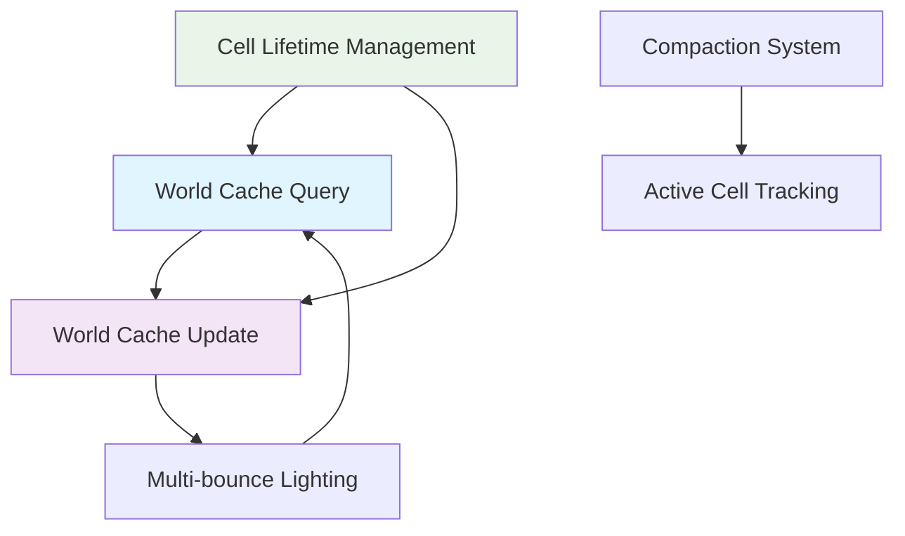

+++
title = "#21904 Solari: Prevent world cache cells from keeping each other alive infinitely"
date = "2025-11-24T00:00:00"
draft = false
template = "pull_request_page.html"
in_search_index = true

[taxonomies]
list_display = ["show"]

[extra]
current_language = "en"
available_languages = {"en" = { name = "English", url = "/pull_request/bevy/2025-11/pr-21904-en-20251124" }, "zh-cn" = { name = "中文", url = "/pull_request/bevy/2025-11/pr-21904-zh-cn-20251124" }}
labels = ["A-Rendering", "C-Refinement"]
+++

# Title

## Basic Information
- **Title**: Solari: Prevent world cache cells from keeping each other alive infinitely
- **PR Link**: https://github.com/bevyengine/bevy/pull/21904
- **Author**: JMS55
- **Status**: MERGED
- **Labels**: A-Rendering, S-Ready-For-Review, C-Refinement
- **Created**: 2025-11-21T16:25:08Z
- **Merged**: 2025-11-24T19:42:35Z
- **Merged By**: alice-i-cecile

## Description Translation

# Objective
- Prevent world cache cells from querying each other and keeping each other alive infinitely
- Now when you leave an area of your game, you're no longer paying performance cost for the out-of-view cells.
- Also fix a long-standing off-by-1 bug in the world cache compaction code

## Solution

- Instead of always resetting cell lifetimes to the max lifetime during a cell query, for world cache update, we now set it to the max of the current cell lifetime and it's existing lifetime (max prevents a lower-lifetime cell overwriting a higher-lifetime cell).
- Credit to IsaacSM and @NthTensor for the idea!

## Testing

Video showing the current number of live world cache cells, before and after this PR.

https://github.com/user-attachments/assets/7639c62c-9bdb-41d7-aebb-b2494c03c042

## The Story of This Pull Request

This PR addresses a fundamental issue in Bevy's Solari global illumination system where world cache cells were creating circular dependencies that prevented proper cleanup. The problem manifested as a memory leak where cells would keep each other alive indefinitely, causing performance degradation over time as the cache grew without bounds.

The core issue was in the lifetime management of world cache cells. When cells queried each other during multi-bounce indirect lighting calculations, they would reset each other's lifetimes to the maximum value, creating a feedback loop. This meant that even when players moved away from an area, the cache cells in that region would continue to consume resources because they were constantly refreshing each other's lifetimes.

The solution implements a more intelligent lifetime management strategy. Instead of unconditionally resetting lifetimes to `WORLD_CACHE_CELL_LIFETIME` during queries, the system now uses atomic maximum operations to ensure that only higher lifetime values can overwrite existing ones. This prevents lower-lifetime cells from artificially extending the lifespan of cells they query.

```wgsl
// Before:
if existing_checksum == checksum {
    atomicStore(&world_cache_life[key], WORLD_CACHE_CELL_LIFETIME);
    return world_cache_radiance[key].rgb;
}

// After:
if existing_checksum == checksum || existing_checksum == WORLD_CACHE_EMPTY_CELL {
#ifdef WORLD_CACHE_QUERY_ATOMIC_MAX_LIFETIME
    atomicMax(&world_cache_life[key], cell_lifetime);
#endif
}
```

The implementation required changes across multiple shader stages to ensure consistent lifetime propagation. In `world_cache_update.wgsl`, when querying other cells for multi-bounce lighting, the system now passes the current cell's lifetime rather than the maximum lifetime:

```wgsl
// Before:
new_radiance += ray_hit.material.base_color * query_world_cache(ray_hit.world_position, ray_hit.geometric_world_normal, view.world_position, &rng);

// After:
let cell_life = atomicLoad(&world_cache_life[cell_index]);
new_radiance += ray_hit.material.base_color * query_world_cache(ray_hit.world_position, ray_hit.geometric_world_normal, view.world_position, cell_life, &rng);
```

This change ensures that when Cell A queries Cell B during multi-bounce calculations, it only extends Cell B's lifetime to match its own current lifetime, rather than resetting it to the maximum. This breaks the circular dependency chain.

Additionally, the PR fixes a long-standing off-by-one bug in the world cache compaction system. The bug was in the calculation of the active cell count during compaction:

```wgsl
// Before (buggy):
world_cache_active_cells_count = compacted_index + 1u;

// After (fixed):
world_cache_active_cells_count = compacted_index + u32(cell_active);
```

The original code would always add 1 to the count, even when there were zero active cells, which could lead to incorrect buffer sizing and dispatch calculations.

The changes also include some housekeeping improvements, such as moving configuration constants like `WORLD_CACHE_DIRECT_LIGHT_SAMPLE_COUNT` and `WORLD_CACHE_MAX_GI_RAY_DISTANCE` from local constants in `world_cache_update.wgsl` to shared constants in `world_cache_query.wgsl`, promoting better consistency across the system.

The impact of these changes is significant for long-running applications. Previously, the world cache would grow continuously as cells kept each other alive. Now, cells naturally expire when they're no longer being actively used by the camera or nearby cells, allowing the system to reclaim resources and maintain consistent performance.

## Visual Representation



## Key Files Changed

### `crates/bevy_solari/src/realtime/world_cache_query.wgsl` (+20/-7)

This file contains the core world cache query logic. The key change is the introduction of atomic maximum operations for lifetime management and the new function signature that accepts a `cell_lifetime` parameter.

```wgsl
// Key changes:
fn query_world_cache(world_position: vec3<f32>, world_normal: vec3<f32>, view_position: vec3<f32>, cell_lifetime: u32, rng: ptr<function, u32>) -> vec3<f32> {

// Lifetime management logic:
if existing_checksum == checksum || existing_checksum == WORLD_CACHE_EMPTY_CELL {
#ifndef WORLD_CACHE_QUERY_ATOMIC_MAX_LIFETIME
    atomicStore(&world_cache_life[key], cell_lifetime);
#else
    atomicMax(&world_cache_life[key], cell_lifetime);
#endif
}
```

### `crates/bevy_solari/src/realtime/world_cache_update.wgsl` (+8/-7)

This file handles updating world cache cells with new lighting samples. The main change is propagating the current cell's lifetime when querying other cells.

```wgsl
// Before multi-bounce query:
let cell_life = atomicLoad(&world_cache_life[cell_index]);
new_radiance += ray_hit.material.base_color * query_world_cache(ray_hit.world_position, ray_hit.geometric_world_normal, view.world_position, cell_life, &rng);
```

### `crates/bevy_solari/src/realtime/world_cache_compact.wgsl` (+4/-2)

This file contains the world cache compaction logic. The fix addresses the off-by-one bug in active cell counting.

```wgsl
// Fixed active cell counting:
if thread_index == 1023u && workgroup_id.x == 1023u {
    world_cache_active_cells_count = compacted_index + u32(cell_active);
    world_cache_active_cells_dispatch = vec3((world_cache_active_cells_count + 63u) / 64u, 1u, 1u);
}
```

### `crates/bevy_solari/src/realtime/restir_gi.wgsl` and `crates/bevy_solari/src/realtime/specular_gi.wgsl`

These files were updated to use the new `query_world_cache` function signature, passing `WORLD_CACHE_CELL_LIFETIME` as the lifetime parameter.

### `crates/bevy_solari/src/realtime/node.rs`

Enabled the `WORLD_CACHE_QUERY_ATOMIC_MAX_LIFETIME` feature flag for the world cache update pipeline.

## Further Reading

- [WGSL Atomic Operations](https://gpuweb.github.io/gpuweb/wgsl/#atomic-ops) - Documentation on WebGPU Shading Language atomic operations
- [Global Illumination Techniques](https://advances.realtimerendering.com/s2021/index.html) - Real-time rendering advancements in GI
- [Bevy Solari Documentation](https://github.com/bevyengine/bevy/tree/main/crates/bevy_solari) - Bevy's global illumination system