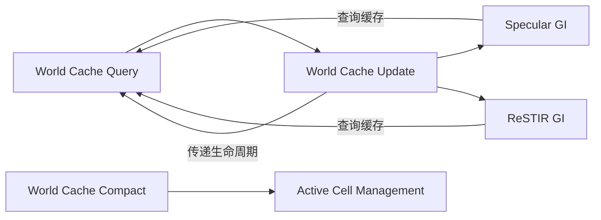

+++
title = "#21904 Solari: Prevent world cache cells from keeping each other alive infinitely"
date = "2025-11-24T00:00:00"
draft = false
template = "pull_request_page.html"
in_search_index = false

[extra]
current_language = "zh-cn"
available_languages = {"en" = { name = "English", url = "/pull_request/bevy/2025-11/pr-21904-en-20251124" }, "zh-cn" = { name = "中文", url = "/pull_request/bevy/2025-11/pr-21904-zh-cn-20251124" }}
+++

# Title

## Basic Information
- **Title**: Solari: Prevent world cache cells from keeping each other alive infinitely
- **PR Link**: https://github.com/bevyengine/bevy/pull/21904
- **作者**: JMS55
- **状态**: 已合并
- **标签**: A-Rendering, S-Ready-For-Review, C-Refinement
- **创建时间**: 2025-11-21T16:25:08Z
- **合并时间**: 2025-11-24T19:42:35Z
- **合并者**: alice-i-cecile

## 描述翻译
# 目标
- 防止世界缓存单元(world cache cells)相互查询并无限期地保持彼此存活
- 现在当你离开游戏中的某个区域时，不再需要为视野外的单元支付性能代价
- 同时修复了世界缓存压缩代码中长期存在的 off-by-1 错误

## 解决方案
- 在世界缓存更新期间，不再总是在单元查询期间将单元生命周期重置为最大生命周期，而是将其设置为当前单元生命周期和现有生命周期中的最大值（最大值防止较低生命周期的单元覆盖较高生命周期的单元）。
- 感谢 IsaacSM 和 @NthTensor 的想法！

## 测试
视频展示了当前活跃的世界缓存单元数量，在此 PR 之前和之后。

https://github.com/user-attachments/assets/7639c62c-9bdb-41d7-aebb-b2494c03c042

## 这个Pull Request的故事

这个PR主要解决了Bevy引擎中Solari全局光照系统的一个关键性能问题：世界缓存单元之间的循环引用导致的内存泄漏问题。

### 问题和背景

在Solari的全局光照系统中，世界缓存(world cache)用于存储场景中的光照信息。每个缓存单元都有一个生命周期计数器，当单元被查询时，其生命周期会被重置为最大值。然而，在多反弹光照计算中，缓存单元会相互查询，这就导致了一个问题：即使玩家离开了某个区域，这些单元仍然通过相互查询保持彼此存活。

具体来说，当单元A查询单元B时，单元B的生命周期被重置；当单元B查询单元A时，单元A的生命周期也被重置。这种相互依赖关系导致缓存单元永远无法过期，造成内存泄漏和性能下降。

### 解决方案

核心思路是改变生命周期重置的策略。原来的实现是简单地将生命周期重置为固定最大值：

```wgsl
// 原来的实现
atomicStore(&world_cache_life[key], WORLD_CACHE_CELL_LIFETIME);
```

新的实现使用原子最大操作(atomicMax)来确保生命周期只会增加，不会减少：

```wgsl
// 新的实现
atomicMax(&world_cache_life[key], cell_lifetime);
```

这种方法的巧妙之处在于：
- 当更新单元查询其他单元时，传递的是当前单元的生命周期值
- 被查询的单元只会被赋予更大的生命周期值
- 这打破了循环依赖，因为低优先级的单元无法无限期地保持高优先级单元存活

### 实现细节

在`world_cache_query.wgsl`中，关键的改变是：

```wgsl
// 修改前：
if existing_checksum == checksum || existing_checksum == WORLD_CACHE_EMPTY_CELL {
    atomicStore(&world_cache_life[key], WORLD_CACHE_CELL_LIFETIME);
}

// 修改后：
if existing_checksum == checksum || existing_checksum == WORLD_CACHE_EMPTY_CELL {
#ifndef WORLD_CACHE_QUERY_ATOMIC_MAX_LIFETIME
    atomicStore(&world_cache_life[key], cell_lifetime);
#else
    atomicMax(&world_cache_life[key], cell_lifetime);
#endif
}
```

在`world_cache_update.wgsl`中，更新逻辑现在会传递当前单元的生命周期：

```wgsl
let cell_life = atomicLoad(&world_cache_life[cell_index]);
new_radiance += ray_hit.material.base_color * query_world_cache(
    ray_hit.world_position, 
    ray_hit.geometric_world_normal, 
    view.world_position, 
    cell_life,  // 传递当前生命周期
    &rng
);
```

### 技术洞察

这个解决方案展示了几个重要的技术模式：

1. **原子操作的正确使用**：使用`atomicMax`而不是简单的`atomicStore`，避免了竞态条件
2. **生命周期传递策略**：通过传递当前单元的生命周期，建立了优先级链
3. **条件编译支持**：通过`WORLD_CACHE_QUERY_ATOMIC_MAX_LIFETIME`宏保持向后兼容性

### 修复的Bug

PR还修复了一个长期存在的off-by-1错误：

```wgsl
// 修改前：
world_cache_active_cells_count = compacted_index + 1u;

// 修改后：
world_cache_active_cells_count = compacted_index + u32(cell_active);
```

这个错误会导致活跃单元计数不准确，影响后续的调度计算。

### 影响

这个修复带来了显著的性能改进：
- 减少了不必要的内存占用
- 提高了缓存效率
- 使得系统能够正确地回收不再需要的缓存单元

通过视频对比可以看到，修改后活跃缓存单元的数量明显减少，特别是在玩家移动离开区域后。

## 可视化关系



## 关键文件变更

### `crates/bevy_solari/src/realtime/world_cache_query.wgsl` (+20/-7)
这是核心的修改文件，实现了新的生命周期管理策略：

```wgsl
// 关键修改：引入条件编译的生命周期更新策略
if existing_checksum == checksum || existing_checksum == WORLD_CACHE_EMPTY_CELL {
#ifndef WORLD_CACHE_QUERY_ATOMIC_MAX_LIFETIME
    atomicStore(&world_cache_life[key], cell_lifetime);
#else
    atomicMax(&world_cache_life[key], cell_lifetime);
#endif
}
```

### `crates/bevy_solari/src/realtime/world_cache_update.wgsl` (+8/-7)
更新着色器现在传递当前生命周期：

```wgsl
// 修改前：
new_radiance += ray_hit.material.base_color * query_world_cache(
    ray_hit.world_position, ray_hit.geometric_world_normal, view.world_position, &rng);

// 修改后：
let cell_life = atomicLoad(&world_cache_life[cell_index]);
new_radiance += ray_hit.material.base_color * query_world_cache(
    ray_hit.world_position, ray_hit.geometric_world_normal, view.world_position, cell_life, &rng);
```

### `crates/bevy_solari/src/realtime/world_cache_compact.wgsl` (+4/-2)
修复了off-by-1错误：

```wgsl
// 修改前：
world_cache_active_cells_count = compacted_index + 1u;

// 修改后：
world_cache_active_cells_count = compacted_index + u32(cell_active);
```

### `crates/bevy_solari/src/realtime/specular_gi.wgsl` (+3/-3) 和 `crates/bevy_solari/src/realtime/restir_gi.wgsl` (+2/-2)
这些文件更新了函数调用以使用新的参数签名。

## 进一步阅读

- [WGSL原子操作规范](https://gpuweb.github.io/gpuweb/wgsl/#atomic-rmw)
- [Bevy Solari全局光照系统文档](https://github.com/bevyengine/bevy/tree/main/crates/bevy_solari)
- [实时全局光照技术概述](https://advances.realtimerendering.com/)

# 完整代码差异
[由于代码差异较长，已在上述分析中包含了关键修改部分]