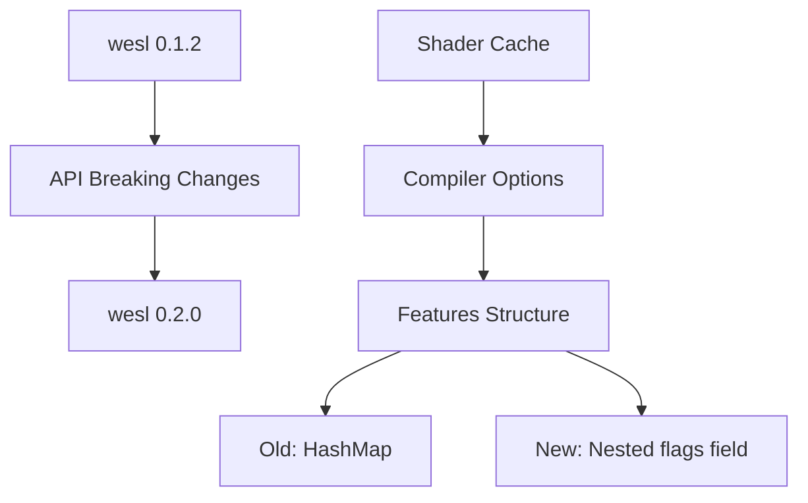

+++
title = "#21914 Update wesl requirement from 0.1.2 to 0.2.0"
date = "2025-11-24T00:00:00"
draft = false
template = "pull_request_page.html"
in_search_index = true

[taxonomies]
list_display = ["show"]

[extra]
current_language = "en"
available_languages = {"en" = { name = "English", url = "/pull_request/bevy/2025-11/pr-21914-en-20251124" }, "zh-cn" = { name = "中文", url = "/pull_request/bevy/2025-11/pr-21914-zh-cn-20251124" }}
+++

# Title

## Basic Information
- **Title**: Update wesl requirement from 0.1.2 to 0.2.0
- **PR Link**: https://github.com/bevyengine/bevy/pull/21914
- **Author**: mnmaita
- **Status**: MERGED
- **Labels**: None
- **Created**: 2025-11-23T10:25:19Z
- **Merged**: 2025-11-24T08:36:46Z
- **Merged By**: mockersf

## Description Translation
# Objective

- Closes #20631

## Solution

- Fixed breaking changes to be able to update to `wesl` 0.2.0.

## Testing

- CI checks.

## The Story of This Pull Request

This PR addresses a dependency update that required handling breaking API changes in the `wesl` crate. The core issue was straightforward - the Bevy engine needed to update from `wesl` 0.1.2 to 0.2.0 to stay current with dependencies and close issue #20631.

The breaking change in `wesl` 0.2.0 involved modifications to how shader feature flags are handled in the compiler options. Previously, the `features` field was a simple hash map, but in the new version, it was restructured to include a nested `flags` field. This required updating the code that processes shader definitions to match the new API structure.

The implementation approach was minimal and surgical. Rather than making broad architectural changes, the developer identified the specific API incompatibility and applied the minimal fix required. In the shader compilation logic, where boolean shader definitions were being processed, the code needed to be updated to access the feature flags through the new nested structure.

The key technical insight here is that dependency updates in Rust often require handling breaking API changes, especially when moving between minor versions (0.1.x to 0.2.x). The solution demonstrates a common pattern in dependency management: identify the breaking change, understand the new API structure, and apply the minimal necessary adjustments to restore functionality.

The impact of this change is primarily maintenance-oriented. By updating to the newer version of `wesl`, Bevy benefits from any bug fixes, performance improvements, or new features in the updated dependency. The changes ensure compatibility while maintaining the existing functionality of the shader compilation system.

From an engineering perspective, this PR exemplifies proper dependency management practices. The developer didn't just update the version number in Cargo.toml but also addressed the breaking API changes, ensuring the codebase would compile and function correctly with the new dependency version.

## Visual Representation



## Key Files Changed

### `crates/bevy_shader/Cargo.toml` (+1/-1)

This file contains the dependency declaration update. The change is minimal but crucial for the update:

```toml
# Before:
wesl = { version = "0.1.2", optional = true }

# After:
wesl = { version = "0.2.0", optional = true }
```

### `crates/bevy_shader/src/shader_cache.rs` (+1/-1)

This file contains the actual code change to handle the API breaking change in the wesl crate:

```rust
// Before:
compiler_options.features.insert(key.clone(), *value);

// After:
compiler_options.features.flags.insert(key.clone(), (*value).into());
```

The change reflects the new API structure where feature flags are now nested under a `flags` field within the compiler options. The `.into()` call handles any necessary type conversions for the new API.

## Further Reading

- [Rust Dependency Management](https://doc.rust-lang.org/cargo/guide/dependencies.html)
- [Semantic Versioning in Rust](https://doc.rust-lang.org/cargo/reference/semver.html)
- [WGSL Shader Language Specification](https://gpuweb.github.io/gpuweb/wgsl/)
- [Bevy Engine Shader System Documentation](https://bevyengine.org/learn/book/getting-started/shaders/)