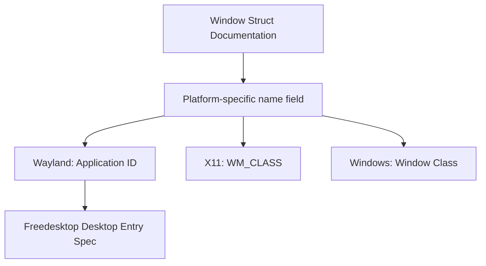

+++
title = "#21918 Fix dead freedesktop desktop-entry spec link."
date = "2025-11-24T00:00:00"
draft = false
template = "pull_request_page.html"
in_search_index = true

[taxonomies]
list_display = ["show"]

[extra]
current_language = "en"
available_languages = {"en" = { name = "English", url = "/pull_request/bevy/2025-11/pr-21918-en-20251124" }, "zh-cn" = { name = "中文", url = "/pull_request/bevy/2025-11/pr-21918-zh-cn-20251124" }}
+++

# Fix dead freedesktop desktop-entry spec link

## Basic Information
- **Title**: Fix dead freedesktop desktop-entry spec link.
- **PR Link**: https://github.com/bevyengine/bevy/pull/21918
- **Author**: raldone01
- **Status**: MERGED
- **Labels**: None
- **Created**: 2025-11-23T20:07:17Z
- **Merged**: 2025-11-24T13:57:03Z
- **Merged By**: mockersf

## Description Translation
# Objective

Fixes a dead link in the docs.

## Solution

Updated the link to the new address.

## Testing

- Following the link seems to lead to the correct place.

## The Story of This Pull Request

This PR addresses a straightforward but important documentation issue in the Bevy game engine. The problem was a broken link in the documentation for the `Window` struct's `name` field. Specifically, the link pointing to the Freedesktop Desktop Entry Specification had become outdated and was no longer functional.

The issue was identified in the `crates/bevy_window/src/window.rs` file, where the documentation for the `name` field references external specifications for different platforms. The original link to the Freedesktop Desktop Entry Specification had become invalid, likely due to reorganization or updates on the Freedesktop website.

The solution was simple and direct: replace the dead URL with the correct, current location of the specification. The developer verified that the new link correctly resolves to the intended documentation by testing it directly.

This type of documentation maintenance is crucial for open-source projects like Bevy, as it ensures that developers can easily access relevant external specifications and understand the platform-specific behaviors of the `name` field. The `name` field itself is important because it controls how the application appears to the window manager on different platforms:

- On Wayland, it sets the application ID
- On X11, it controls the `WM_CLASS` property  
- On Windows, it defines the window class name

The fix demonstrates good documentation hygiene - keeping external references up-to-date ensures that developers can efficiently understand and use the API without hitting dead ends when trying to research platform-specific behaviors.

## Visual Representation



## Key Files Changed

### `crates/bevy_window/src/window.rs` (+1/-1)

This file contains the definition of the `Window` struct and its documentation. The change updates a broken link in the documentation for the `name` field.

**Before:**
```rust
/// For details about application ID conventions, see the [Desktop Entry Spec](https://specifications.freedesktop.org/desktop-entry-spec/desktop-entry-spec-latest.html#desktop-file-id).
```

**After:**
```rust
/// For details about application ID conventions, see the [Desktop Entry Spec](https://specifications.freedesktop.org/desktop-entry/latest/file-naming.html#desktop-file-id).
```

The change replaces the outdated URL with the current location of the Desktop Entry Specification documentation. The rest of the documentation structure and other external references remain unchanged.

## Further Reading

- [Freedesktop Desktop Entry Specification](https://specifications.freedesktop.org/desktop-entry/latest/) - The current specification for desktop entries on Linux and other Unix-like systems
- [Bevy Window Documentation](https://docs.rs/bevy_window/latest/bevy_window/) - Official documentation for Bevy's window management
- [Cross-platform Window Management](https://bevy-cheatbook.github.io/window.html) - Bevy cheatbook section on window configuration

# Full Code Diff
```diff
diff --git a/crates/bevy_window/src/window.rs b/crates/bevy_window/src/window.rs
index b3a306cb8c3b2..98c9973e2f7ce 100644
--- a/crates/bevy_window/src/window.rs
+++ b/crates/bevy_window/src/window.rs
@@ -174,7 +174,7 @@ pub struct Window {
     pub title: String,
     /// Stores the application ID (on **`Wayland`**), `WM_CLASS` (on **`X11`**) or window class name (on **`Windows`**) of the window.
     ///
-    /// For details about application ID conventions, see the [Desktop Entry Spec](https://specifications.freedesktop.org/desktop-entry-spec/desktop-entry-spec-latest.html#desktop-file-id).
+    /// For details about application ID conventions, see the [Desktop Entry Spec](https://specifications.freedesktop.org/desktop-entry/latest/file-naming.html#desktop-file-id).
     /// For details about `WM_CLASS`, see the [X11 Manual Pages](https://www.x.org/releases/current/doc/man/man3/XAllocClassHint.3.xhtml).
     /// For details about **`Windows`**'s window class names, see [About Window Classes](https://learn.microsoft.com/en-us/windows/win32/winmsg/about-window-classes).
     ///
```