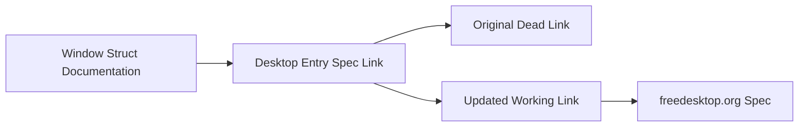

+++
title = "#21918 Fix dead freedesktop desktop-entry spec link."
date = "2025-11-24T00:00:00"
draft = false
template = "pull_request_page.html"
in_search_index = false

[extra]
current_language = "zh-cn"
available_languages = {"en" = { name = "English", url = "/pull_request/bevy/2025-11/pr-21918-en-20251124" }, "zh-cn" = { name = "中文", url = "/pull_request/bevy/2025-11/pr-21918-zh-cn-20251124" }}
+++

# Fix dead freedesktop desktop-entry spec link

## Basic Information
- **Title**: Fix dead freedesktop desktop-entry spec link.
- **PR Link**: https://github.com/bevyengine/bevy/pull/21918
- **Author**: raldone01
- **Status**: MERGED
- **Labels**: None
- **Created**: 2025-11-23T20:07:17Z
- **Merged**: 2025-11-24T13:57:03Z
- **Merged By**: mockersf

## Description Translation
修复文档中的死链接。

更新链接到新地址。

测试
- 跟踪链接似乎能导向正确的位置。

## The Story of This Pull Request

这个拉取请求解决了一个简单的但重要的文档问题。在 Bevy 游戏引擎的窗口模块中，有一处文档链接指向了 freedesktop.org 的桌面条目规范，但这个链接已经失效，返回 404 错误。

问题的核心在于 `Window` 结构体的 `name` 字段文档中引用了外部规范。这个字段在不同平台上有着不同的用途：在 Wayland 上用作应用程序 ID，在 X11 上用作 WM_CLASS，在 Windows 上用作窗口类名。为了帮助开发者理解这些标识符的命名约定，文档链接到了 freedesktop.org 的桌面条目规范。

开发者 raldone01 发现原始链接 `https://specifications.freedesktop.org/desktop-entry-spec/desktop-entry-spec-latest.html#desktop-file-id` 已经无法访问。经过调查，他们找到了规范的新位置，并将链接更新为 `https://specifications.freedesktop.org/desktop-entry/latest/file-naming.html#desktop-file-id`。

从技术角度来看，这个修复虽然简单，但体现了良好的工程实践。保持文档链接的有效性对于开源项目至关重要，因为它直接影响开发者的学习体验和项目的可用性。失效的链接会阻碍新贡献者理解代码库，特别是在涉及跨平台开发时，这些规范文档尤为重要。

这个变更采用了最直接的解决方案 - 更新链接到新的有效地址。开发者测试了新的链接，确认它能正确导向目标文档。这种验证步骤很重要，确保修复真正解决了问题，而不是仅仅改变了链接文本。

## Visual Representation



## Key Files Changed

### `crates/bevy_window/src/window.rs` (+1/-1)

这个文件包含了窗口相关的核心定义，特别是 `Window` 结构体。变更涉及更新文档注释中的一个外部链接。

**变更前:**
```rust
/// For details about application ID conventions, see the [Desktop Entry Spec](https://specifications.freedesktop.org/desktop-entry-spec/desktop-entry-spec-latest.html#desktop-file-id).
```

**变更后:**
```rust
/// For details about application ID conventions, see the [Desktop Entry Spec](https://specifications.freedesktop.org/desktop-entry/latest/file-naming.html#desktop-file-id).
```

这个变更保持了文档的完整性和准确性，确保开发者能够访问相关的规范文档。新的链接路径反映了 freedesktop.org 网站结构调整后的规范位置。

## Further Reading

- [freedesktop.org Desktop Entry Specification](https://specifications.freedesktop.org/desktop-entry/latest/) - 完整的桌面条目规范
- [Bevy Window Documentation](https://docs.rs/bevy_window/latest/bevy_window/) - Bevy 窗口模块的官方文档
- [Cross-platform Window Management](https://bevy-cheatbook.github.io/window.html) - Bevy 窗口管理的实用指南

# Full Code Diff
```diff
diff --git a/crates/bevy_window/src/window.rs b/crates/bevy_window/src/window.rs
index b3a306cb8c3b2..98c9973e2f7ce 100644
--- a/crates/bevy_window/src/window.rs
+++ b/crates/bevy_window/src/window.rs
@@ -174,7 +174,7 @@ pub struct Window {
     pub title: String,
     /// Stores the application ID (on **`Wayland`**), `WM_CLASS` (on **`X11`**) or window class name (on **`Windows`**) of the window.
     ///
-    /// For details about application ID conventions, see the [Desktop Entry Spec](https://specifications.freedesktop.org/desktop-entry-spec/desktop-entry-spec-latest.html#desktop-file-id).
+    /// For details about application ID conventions, see the [Desktop Entry Spec](https://specifications.freedesktop.org/desktop-entry/latest/file-naming.html#desktop-file-id).
     /// For details about `WM_CLASS`, see the [X11 Manual Pages](https://www.x.org/releases/current/doc/man/man3/XAllocClassHint.3.xhtml).
     /// For details about **`Windows`**'s window class names, see [About Window Classes](https://learn.microsoft.com/en-us/windows/win32/winmsg/about-window-classes).
     ///
```