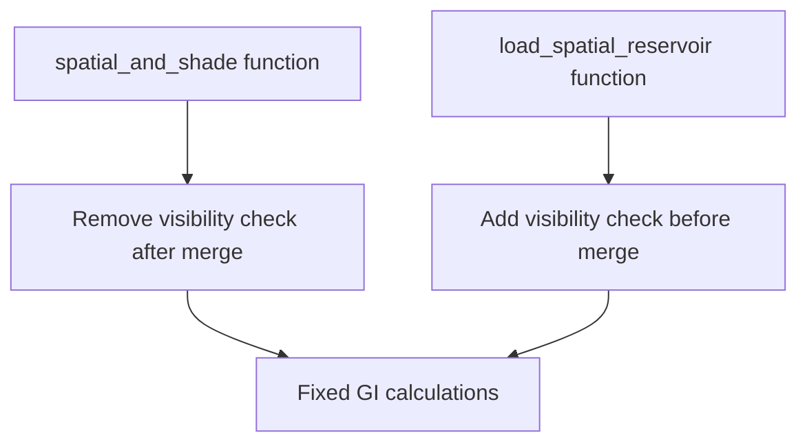

+++
title = "#21919 Fix solari GI shadow regression"
date = "2025-11-29T00:00:00"
draft = false
template = "pull_request_page.html"
in_search_index = true

[taxonomies]
list_display = ["show"]

[extra]
current_language = "en"
available_languages = {"en" = { name = "English", url = "/pull_request/bevy/2025-11/pr-21919-en-20251129" }, "zh-cn" = { name = "中文", url = "/pull_request/bevy/2025-11/pr-21919-zh-cn-20251129" }}
labels = ["A-Rendering", "P-Regression"]
+++

# Title
Fix solari GI shadow regression

## Basic Information
- **Title**: Fix solari GI shadow regression
- **PR Link**: https://github.com/bevyengine/bevy/pull/21919
- **Author**: JMS55
- **Status**: MERGED
- **Labels**: A-Rendering, S-Ready-For-Final-Review, P-Regression
- **Created**: 2025-11-23T21:20:39Z
- **Merged**: 2025-11-29T02:34:28Z
- **Merged By**: james7132

## Description Translation
In https://github.com/bevyengine/bevy/pull/21649, I switched where visibility rays get traced, and while it improved DI, it regressed GI. I'm reverting the GI change to fix.

Before:


After:


## The Story of This Pull Request

This PR addresses a regression in Global Illumination (GI) shadows that was introduced by a previous optimization. The core issue revolves around the timing and placement of visibility ray tracing in the ReSTIR GI implementation.

The problem originated from PR #21649, where the author changed the location where visibility rays were traced. While this change improved Direct Illumination (DI) performance, it inadvertently caused a regression in GI quality. The regression manifested as incorrect shadowing in GI calculations, which is clearly visible in the before/after comparison images.

The technical issue was that visibility ray tracing was being applied at the wrong stage in the GI pipeline. In the previous implementation, visibility was being checked after reservoir merging in the `spatial_and_shade` function. This meant that the combined reservoir's radiance was being multiplied by the visibility factor after the merge operation, which disrupted the correct GI calculations.

The solution implemented here is a targeted revert of the GI-specific visibility ray tracing changes. The key insight is that for GI to work correctly, visibility checks need to be applied earlier in the pipeline - specifically when loading spatial reservoirs rather than after merging them.

In the `spatial_and_shade` function, the code was modified to remove the post-merge visibility check:

```wgsl
// Before:
var combined_reservoir = merge_result.merged_reservoir;
combined_reservoir.radiance *= trace_point_visibility(surface.world_position, combined_reservoir.sample_point_world_position);

// After: 
let combined_reservoir = merge_result.merged_reservoir;
```

This change alone would break visibility checking entirely, so the visibility check was moved to the `load_spatial_reservoir` function:

```wgsl
// Before:
let spatial_reservoir = gi_reservoirs_b[spatial_pixel_index];

// After:
var spatial_reservoir = gi_reservoirs_b[spatial_pixel_index];
spatial_reservoir.radiance *= trace_point_visibility(world_position, spatial_reservoir.sample_point_world_position);
```

The engineering decision here reflects a fundamental understanding of how ReSTIR GI works. By applying visibility checks when loading spatial reservoirs, we ensure that each neighboring reservoir's contribution is properly validated for visibility before being considered for merging. This maintains the statistical correctness of the reservoir sampling while ensuring that occluded samples don't contribute to the final illumination.

The change also required switching from `let` to `var` for the spatial reservoir declaration, since the reservoir's radiance field now needs to be modified in-place to apply the visibility factor.

This fix demonstrates an important principle in graphics programming: optimizations that work well for one lighting component (DI) may have unintended consequences for another (GI). The solution maintains the DI improvements from the original change while restoring correct GI behavior through targeted adjustments to the visibility checking logic.

## Visual Representation



## Key Files Changed

### `crates/bevy_solari/src/realtime/restir_gi.wgsl`

This file contains the WebGPU Shading Language code for the ReSTIR GI implementation. The changes involve moving visibility ray tracing from after reservoir merging to before spatial reservoir loading.

**Key changes in `spatial_and_shade` function:**
```wgsl
// Before:
var combined_reservoir = merge_result.merged_reservoir;
combined_reservoir.radiance *= trace_point_visibility(surface.world_position, combined_reservoir.sample_point_world_position);

// After:
let combined_reservoir = merge_result.merged_reservoir;
```

**Key changes in `load_spatial_reservoir` function:**
```wgsl
// Before:
let spatial_reservoir = gi_reservoirs_b[spatial_pixel_index];

// After:
var spatial_reservoir = gi_reservoirs_b[spatial_pixel_index];
spatial_reservoir.radiance *= trace_point_visibility(world_position, spatial_reservoir.sample_point_world_position);
```

These changes ensure that visibility checks are performed at the appropriate stage in the GI pipeline, fixing the shadow regression while maintaining the DI improvements from the previous optimization.

## Further Reading

- [ReSTIR GI Paper](https://research.nvidia.com/publication/2021-06_restir-gi-path-resampling-real-time-path-tracing) - The original paper on Resampled Importance Sampling for Global Illumination
- [Bevy Rendering Documentation](https://bevyengine.org/learn/quick-start/rendering/) - Bevy's rendering system documentation
- [WebGPU Shading Language Specification](https://www.w3.org/TR/WGSL/) - Official WGSL specification for understanding the shader code changes