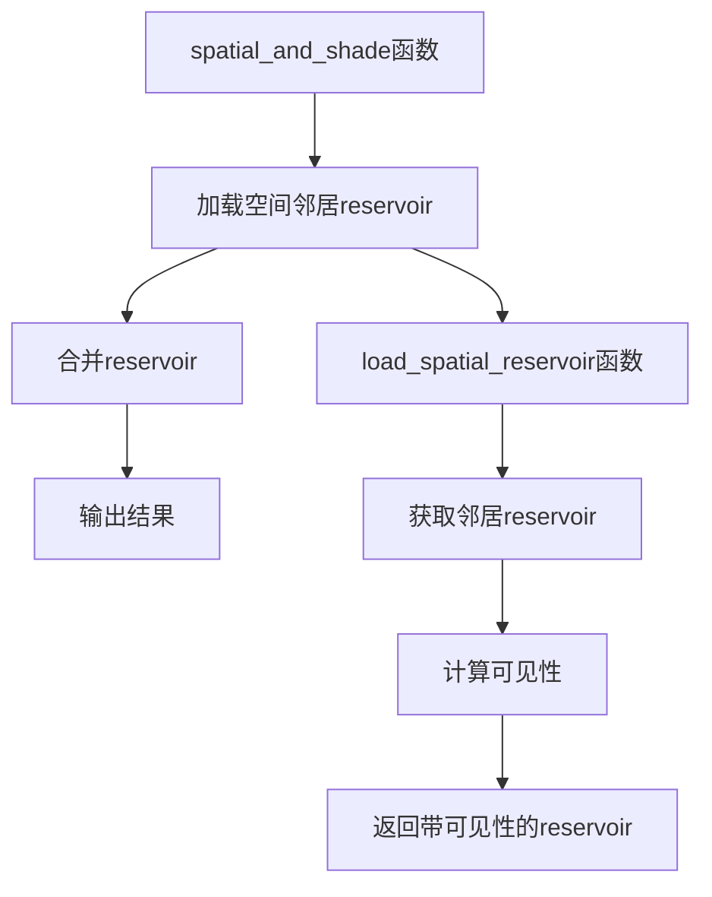

+++
title = "#21919 Fix solari GI shadow regression"
date = "2025-11-29T00:00:00"
draft = false
template = "pull_request_page.html"
in_search_index = false

[extra]
current_language = "zh-cn"
available_languages = {"en" = { name = "English", url = "/pull_request/bevy/2025-11/pr-21919-en-20251129" }, "zh-cn" = { name = "中文", url = "/pull_request/bevy/2025-11/pr-21919-zh-cn-20251129" }}
labels = ["A-Rendering", "P-Regression"]
+++

# Fix solari GI shadow regression

## Basic Information
- **Title**: Fix solari GI shadow regression
- **PR Link**: https://github.com/bevyengine/bevy/pull/21919
- **Author**: JMS55
- **Status**: MERGED
- **Labels**: A-Rendering, S-Ready-For-Final-Review, P-Regression
- **Created**: 2025-11-23T21:20:39Z
- **Merged**: 2025-11-29T02:34:28Z
- **Merged By**: james7132

## Description Translation
在 https://github.com/bevyengine/bevy/pull/21649 中，我切换了可见性光线追踪的位置，虽然改进了DI（直接光照），但导致了GI（全局光照）的回归。我正在撤销GI相关的更改来进行修复。

修复前：


修复后：


## The Story of This Pull Request

这个PR解决了一个在ReSTIR GI（Resampled Importance Sampling Temporal Irradiance Reservoir for Global Illumination）实现中出现的阴影回归问题。问题的根源在于PR #21649中可见性光线追踪位置的改变虽然改善了直接光照，但对全局光照产生了负面影响。

在之前的实现中，可见性计算被错误地放置在合并reservoir之后。具体来说，代码在`spatial_and_shade`函数中合并了输入reservoir和空间邻居reservoir之后，才对合并后的reservoir进行可见性计算：

```wgsl
// 之前的错误实现
var combined_reservoir = merge_result.merged_reservoir;
combined_reservoir.radiance *= trace_point_visibility(surface.world_position, combined_reservoir.sample_point_world_position);
```

这种实现方式的问题是，可见性计算应该在reservoir合并之前进行，而不是之后。当合并来自空间邻居的reservoir时，我们需要确保每个邻居reservoir的辐射度已经考虑了从当前表面点到其采样点的可见性。

修复方案将可见性计算从合并后移动到了加载空间邻居reservoir的阶段。具体来说，在`load_spatial_reservoir`函数中，现在在返回空间邻居信息之前就计算可见性：

```wgsl
// 修复后的正确实现
var spatial_reservoir = gi_reservoirs_b[spatial_pixel_index];
spatial_reservoir.radiance *= trace_point_visibility(world_position, spatial_reservoir.sample_point_world_position);
```

这个修复确保了在合并reservoir时，每个空间邻居的辐射度已经包含了正确的可见性信息。从技术角度来看，这是更符合ReSTIR算法原理的实现方式，因为reservoir合并应该基于已经考虑了可见性的样本权重。

从性能角度看，这个改变不会引入额外的计算开销，只是将相同的可见性计算移动到了不同的执行阶段。但从正确性角度看，它确保了全局光照计算中可见性处理的准确性。

这个修复展示了在实时渲染系统中，光照计算的执行顺序对最终结果有重要影响。即使是相同的数学运算，在不同的执行阶段进行也会产生显著不同的视觉效果。

## Visual Representation



## Key Files Changed

### `crates/bevy_solari/src/realtime/restir_gi.wgsl` (+4/-4)

这个WGSL着色器文件包含了ReSTIR GI算法的核心实现。主要修改涉及可见性计算的执行位置调整。

**关键修改1：移除合并后的可见性计算**
```wgsl
// 之前：
var combined_reservoir = merge_result.merged_reservoir;
combined_reservoir.radiance *= trace_point_visibility(surface.world_position, combined_reservoir.sample_point_world_position);

// 之后：
let combined_reservoir = merge_result.merged_reservoir;
```

**关键修改2：在加载空间邻居时计算可见性**
```wgsl
// 之前：
let spatial_reservoir = gi_reservoirs_b[spatial_pixel_index];

// 之后：
var spatial_reservoir = gi_reservoirs_b[spatial_pixel_index];
spatial_reservoir.radiance *= trace_point_visibility(world_position, spatial_reservoir.sample_point_world_position);
```

这些修改确保了在合并reservoir之前，每个空间邻居的辐射度已经包含了正确的可见性信息，从而修复了全局光照中的阴影计算问题。

## Further Reading

- [ReSTIR GI: Path Resampling for Real-Time Path Tracing](https://research.nvidia.com/publication/2021-06_restir-gi-path-resampling-real-time-path-tracing) - ReSTIR GI算法的原始论文
- [Bevy Engine Rendering Documentation](https://bevyengine.org/learn/book/getting-started/rendering/) - Bevy引擎渲染系统文档
- [WebGPU Shading Language (WGSL) Specification](https://www.w3.org/TR/WGSL/) - WGSL着色语言规范

# Full Code Diff
```diff
diff --git a/crates/bevy_solari/src/realtime/restir_gi.wgsl b/crates/bevy_solari/src/realtime/restir_gi.wgsl
index 320772d65edbb..b0bbfa90ba421 100644
--- a/crates/bevy_solari/src/realtime/restir_gi.wgsl
+++ b/crates/bevy_solari/src/realtime/restir_gi.wgsl
@@ -67,9 +67,7 @@ fn spatial_and_shade(@builtin(global_invocation_id) global_id: vec3<u32>) {
     let spatial = load_spatial_reservoir(global_id.xy, depth, surface.world_position, surface.world_normal, &rng);
     let merge_result = merge_reservoirs(input_reservoir, surface.world_position, surface.world_normal, surface.material.base_color / PI,
         spatial.reservoir, spatial.world_position, spatial.world_normal, spatial.diffuse_brdf, &rng);
-    var combined_reservoir = merge_result.merged_reservoir;
-
-    combined_reservoir.radiance *= trace_point_visibility(surface.world_position, combined_reservoir.sample_point_world_position);
+    let combined_reservoir = merge_result.merged_reservoir;
 
     gi_reservoirs_a[pixel_index] = combined_reservoir;
 
@@ -164,7 +162,9 @@ fn load_spatial_reservoir(pixel_id: vec2<u32>, depth: f32, world_position: vec3<
     }
 
     let spatial_pixel_index = spatial_pixel_id.x + spatial_pixel_id.y * u32(view.main_pass_viewport.z);
-    let spatial_reservoir = gi_reservoirs_b[spatial_pixel_index];
+    var spatial_reservoir = gi_reservoirs_b[spatial_pixel_index];
+
+    spatial_reservoir.radiance *= trace_point_visibility(world_position, spatial_reservoir.sample_point_world_position);
 
     return NeighborInfo(spatial_reservoir, spatial_surface.world_position, spatial_surface.world_normal, spatial_diffuse_brdf);
 }
```