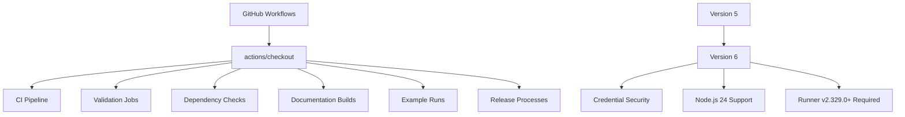

+++
title = "#21927 Bump actions/checkout from 5 to 6"
date = "2025-11-28T00:00:00"
draft = false
template = "pull_request_page.html"
in_search_index = true

[taxonomies]
list_display = ["show"]

[extra]
current_language = "en"
available_languages = {"en" = { name = "English", url = "/pull_request/bevy/2025-11/pr-21927-en-20251128" }, "zh-cn" = { name = "中文", url = "/pull_request/bevy/2025-11/pr-21927-zh-cn-20251128" }}
labels = ["C-Dependencies"]
+++

# Bump actions/checkout from 5 to 6

## Basic Information
- **Title**: Bump actions/checkout from 5 to 6
- **PR Link**: https://github.com/bevyengine/bevy/pull/21927
- **Author**: app/dependabot
- **Status**: MERGED
- **Labels**: C-Dependencies
- **Created**: 2025-11-24T06:01:08Z
- **Merged**: 2025-11-28T23:25:55Z
- **Merged By**: mockersf

## Description Translation
Bumps [actions/checkout](https://github.com/actions/checkout) from 5 to 6.
<details>
<summary>Release notes</summary>
<p><em>Sourced from <a href="https://github.com/actions/checkout/releases">actions/checkout's releases</a>.</em></p>
<blockquote>
<h2>v6.0.0</h2>
<h2>What's Changed</h2>
<ul>
<li>Update README to include Node.js 24 support details and requirements by <a href="https://github.com/salmanmkc"><code>@​salmanmkc</code></a> in <a href="https://redirect.github.com/actions/checkout/pull/2248">actions/checkout#2248</a></li>
<li>Persist creds to a separate file by <a href="https://github.com/ericsciple"><code>@​ericsciple</code></a> in <a href="https://redirect.github.com/actions/checkout/pull/2286">actions/checkout#2286</a></li>
<li>v6-beta by <a href="https://github.com/ericsciple"><code>@​ericsciple</code></a> in <a href="https://redirect.github.com/actions/checkout/pull/2298">actions/checkout#2298</a></li>
<li>update readme/changelog for v6 by <a href="https://github.com/ericsciple"><code>@​ericsciple</code></a> in <a href="https://redirect.github.com/actions/checkout/pull/2311">actions/checkout#2311</a></li>
</ul>
<p><strong>Full Changelog</strong>: <a href="https://github.com/actions/checkout/compare/v5.0.0...v6.0.0">https://github.com/actions/checkout/compare/v5.0.0...v6.0.0</a></p>
<h2>v6-beta</h2>
<h2>What's Changed</h2>
<p>Updated persist-credentials to store the credentials under <code>$RUNNER_TEMP</code> instead of directly in the local git config.</p>
<p>This requires a minimum Actions Runner version of <a href="https://github.com/actions/runner/releases/tag/v2.329.0">v2.329.0</a> to access the persisted credentials for <a href="https://docs.github.com/en/actions/tutorials/use-containerized-services/create-a-docker-container-action">Docker container action</a> scenarios.</p>
<h2>v5.0.1</h2>
<h2>What's Changed</h2>
<ul>
<li>Port v6 cleanup to v5 by <a href="https://github.com/ericsciple"><code>@​ericsciple</code></a> in <a href="https://redirect.github.com/actions/checkout/pull/2301">actions/checkout#2301</a></li>
</ul>
<p><strong>Full Changelog</strong>: <a href="https://github.com/actions/checkout/compare/v5...v5.0.1">https://github.com/actions/checkout/compare/v5...v5.0.1</a></p>
</blockquote>
</details>
<details>
<summary>Changelog</summary>
<p><em>Sourced from <a href="https://github.com/actions/checkout/blob/main/CHANGELOG.md">actions/checkout's changelog</a>.</em></p>
<blockquote>
<h1>Changelog</h1>
<h2>V6.0.0</h2>
<ul>
<li>Persist creds to a separate file by <a href="https://github.com/ericsciple"><code>@​ericsciple</code></a> in <a href="https://redirect.github.com/actions/checkout/pull/2286">actions/checkout#2286</a></li>
<li>Update README to include Node.js 24 support details and requirements by <a href="https://github.com/salmanmkc"><code>@​salmanmkc</code></a> in <a href="https://redirect.github.com/actions/checkout/pull/2248">actions/checkout#2248</a></li>
</ul>
<h2>V5.0.1</h2>
<ul>
<li>Port v6 cleanup to v5 by <a href="https://github.com/ericsciple"><code>@​ericsciple</code></a> in <a href="https://redirect.github.com/actions/checkout/pull/2301">actions/checkout#2301</a></li>
</ul>
<h2>V5.0.0</h2>
<ul>
<li>Update actions checkout to use node 24 by <a href="https://github.com/salmanmkc"><code>@​salmanmkc</code></a> in <a href="https://redirect.github.com/actions/checkout/pull/2226">actions/checkout#2226</a></li>
</ul>
<h2>V4.3.1</h2>
<ul>
<li>Port v6 cleanup to v4 by <a href="https://github.com/ericsciple"><code>@​ericsciple</code></a> in <a href="https://redirect.github.com/actions/checkout/pull/2305">actions/checkout#2305</a></li>
</ul>
<h2>V4.3.0</h2>
<ul>
<li>docs: update README.md by <a href="https://github.com/motss"><code>@​motss</code></a> in <a href="https://redirect.github.com/actions/checkout/pull/1971">actions/checkout#1971</a></li>
<li>Add internal repos for checking out multiple repositories by <a href="https://github.com/mouismail"><code>@​mouismail</code></a> in <a href="https://redirect.github.com/actions/checkout/pull/1977">actions/checkout#1977</a></li>
<li>Documentation update - add recommended permissions to Readme by <a href="https://github.com/benwells"><code>@​benwells</code></a> in <a href="https://redirect.github.com/actions/checkout/pull/2043">actions/checkout#2043</a></li>
<li>Adjust positioning of user email note and permissions heading by <a href="https://github.com/joshmgross"><code>@​joshmgross</code></a> in <a href="https://redirect.github.com/actions/checkout/pull/2044">actions/checkout#2044</a></li>
<li>Update README.md by <a href="https://github.com/nebuk89"><code>@​nebuk89</code></a> in <a href="https://redirect.github.com/actions/checkout/pull/2194">actions/checkout#2194</a></li>
<li>Update CODEOWNERS for actions by <a href="https://github.com/TingluoHuang"><code>@​TingluoHuang</code></a> in <a href="https://redirect.github.com/actions/checkout/pull/2224">actions/checkout#2224</a></li>
<li>Update package dependencies by <a href="https://github.com/salmanmkc"><code>@​salmanmkc</code></a> in <a href="https://redirect.github.com/actions/checkout/pull/2236">actions/checkout#2236</a></li>
</ul>
<h2>v4.2.2</h2>
<ul>
<li><code>url-helper.ts</code> now leverages well-known environment variables by <a href="https://github.com/jww3"><code>@​jww3</code></a> in <a href="https://redirect.github.com/actions/checkout/pull/1941">actions/checkout#1941</a></li>
<li>Expand unit test coverage for <code>isGhes</code> by <a href="https://github.com/jww3"><code>@​jww3</code></a> in <a href="https://redirect.github.com/actions/checkout/pull/1946">actions/checkout#1946</a></li>
</ul>
<h2>v4.2.1</h2>
<ul>
<li>Check out other refs/* by commit if provided, fall back to ref by <a href="https://github.com/orhantoy"><code>@​orhantoy</code></a> in <a href="https://redirect.github.com/actions/checkout/pull/1924">actions/checkout#1924</a></li>
</ul>
<h2>v4.2.0</h2>
<ul>
<li>Add Ref and Commit outputs by <a href="https://github.com/lucacome"><code>@​lucacome</code></a> in <a href="https://redirect.github.com/actions/checkout/pull/1180">actions/checkout#1180</a></li>
<li>Dependency updates by <a href="https://github.com/dependabot"><code>@​dependabot</code></a>- <a href="https://redirect.github.com/actions/checkout/pull/1777">actions/checkout#1777</a>, <a href="https://redirect.github.com/actions/checkout/pull/1872">actions/checkout#1872</a></li>
</ul>
<h2>v4.1.7</h2>
<ul>
<li>Bump the minor-npm-dependencies group across 1 directory with 4 updates by <a href="https://github.com/dependabot"><code>@​dependabot</code></a> in <a href="https://redirect.github.com/actions/checkout/pull/1739">actions/checkout#1739</a></li>
<li>Bump actions/checkout from 3 to 4 by <a href="https://github.com/dependabot"><code>@​dependabot</code></a> in <a href="https://redirect.github.com/actions/checkout/pull/1697">actions/checkout#1697</a></li>
<li>Check out other refs/* by commit by <a href="https://github.com/orhantoy"><code>@​orhantoy</code></a> in <a href="https://redirect.github.com/actions/checkout/pull/1774">actions/checkout#1774</a></li>
<li>Pin actions/checkout's own workflows to a known, good, stable version. by <a href="https://github.com/jww3"><code>@​jww3</code></a> in <a href="https://redirect.github.com/actions/checkout/pull/1776">actions/checkout#1776</a></li>
</ul>
<h2>v4.1.6</h2>
<ul>
<li>Check platform to set archive extension appropriately by <a href="https://github.com/cory-miller"><code>@​cory-miller</code></a> in <a href="https://redirect.github.com/actions/checkout/pull/1732">actions/checkout#1732</a></li>
</ul>
<h2>v4.1.5</h2>
<ul>
<li>Update NPM dependencies by <a href="https://github.com/cory-miller"><code>@​cory-miller</code></a> in <a href="https://redirect.github.com/actions/checkout/pull/1703">actions/checkout#1703</a></li>
<li>Bump github/codeql-action from 2 to 3 by <a href="https://github.com/dependabot"><code>@​dependabot</code></a> in <a href="https://redirect.github.com/actions/checkout/pull/1694">actions/checkout#1694</a></li>
<li>Bump actions/setup-node from 1 to 4 by <a href="https://github.com/dependabot"><code>@​dependabot</code></a> in <a href="https://redirect.github.com/actions/checkout/pull/1696">actions/checkout#1696</a></li>
<li>Bump actions/upload-artifact from 2 to 4 by <a href="https://github.com/dependabot"><code>@​dependabot</code></a> in <a href="https://redirect.github.com/actions/checkout/pull/1695">actions/checkout#1695</a></li>
</ul>
<!-- raw HTML omitted -->
</blockquote>
<p>... (truncated)</p>
</details>
<details>
<summary>Commits</summary>
<ul>
<li><a href="https://github.com/actions/checkout/commit/1af3b93b6815bc44a9784bd300feb67ff0d1eeb3"><code>1af3b93</code></a> update readme/changelog for v6 (<a href="https://redirect.github.com/actions/checkout/issues/2311">#2311</a>)</li>
<li><a href="https://github.com/actions/checkout/commit/71cf2267d89c5cb81562390fa70a37fa40b1305e"><code>71cf226</code></a> v6-beta (<a href="https://redirect.github.com/actions/checkout/issues/2298">#2298</a>)</li>
<li><a href="https://github.com/actions/checkout/commit/069c6959146423d11cd0184e6accf28f9d45f06e"><code>069c695</code></a> Persist creds to a separate file (<a href="https://redirect.github.com/actions/checkout/issues/2286">#2286</a>)</li>
<li><a href="https://github.com/actions/checkout/commit/ff7abcd0c3c05ccf6adc123a8cd1fd4fb30fb493"><code>ff7abcd</code></a> Update README to include Node.js 24 support details and requirements (<a href="https://redirect.github.com/actions/checkout/issues/2248">#2248</a>)</li>
<li>See full diff in <a href="https://github.com/actions/checkout/compare/v5...v6">compare view</a></li>
</ul>
</details>
<br />


[](https://docs.github.com/en/github/managing-security-vulnerabilities/about-dependabot-security-updates#about-compatibility-scores)

Dependabot will resolve any conflicts with this PR as long as you don't alter it yourself. You can also trigger a rebase manually by commenting `@dependabot rebase`.

[//]: # (dependabot-automerge-start)
[//]: # (dependabot-automerge-end)

---

<details>
<summary>Dependabot commands and options</summary>
<br />

You can trigger Dependabot actions by commenting on this PR:
- `@dependabot rebase` will rebase this PR
- `@dependabot recreate` will recreate this PR, overwriting any edits that have been made to it
- `@dependabot merge` will merge this PR after your CI passes on it
- `@dependabot squash and merge` will squash and merge this PR after your CI passes on it
- `@dependabot cancel merge` will cancel a previously requested merge and block automerging
- `@dependabot reopen` will reopen this PR if it is closed
- `@dependabot close` will close this PR and stop Dependabot recreating it. You can achieve the same result by closing it manually
- `@dependabot show <dependency name> ignore conditions` will show all of the ignore conditions of the specified dependency
- `@dependabot ignore this major version` will close this PR and stop Dependabot creating any more for this major version (unless you reopen the PR or upgrade to it yourself)
- `@dependabot ignore this minor version` will close this PR and stop Dependabot creating any more for this minor version (unless you reopen the PR or upgrade to it yourself)
- `@dependabot ignore this dependency` will close this PR and stop Dependabot creating any more for this dependency (unless you reopen the PR or upgrade to it yourself)


</details>

## The Story of This Pull Request

This PR represents a routine but important infrastructure maintenance task: updating a core GitHub Actions dependency across the entire Bevy project. The change is straightforward but touches a critical component of the CI/CD pipeline - the checkout action that handles repository cloning in all workflows.

The core problem being addressed is keeping dependencies current. Using outdated versions of GitHub Actions can lead to security vulnerabilities, missed performance improvements, and potential compatibility issues with newer GitHub runner versions. In this case, the actions/checkout dependency was being upgraded from version 5 to version 6, a major version bump that indicates breaking changes.

Looking at the release notes for actions/checkout v6.0.0, the key change is in how credentials are handled. Instead of storing credentials directly in the local git config, v6 now persists them to a separate file under `$RUNNER_TEMP`. This change requires a minimum Actions Runner version of v2.329.0 for Docker container action scenarios. The update also includes Node.js 24 support, which aligns with GitHub's runtime environment updates.

The implementation approach was systematic and comprehensive. The PR updated every single workflow file that used `actions/checkout@v5` to use `actions/checkout@v6` instead. This affected 11 different workflow files across various aspects of the project's automation:

- Continuous integration (CI) workflows
- Validation jobs
- Dependency management workflows
- Documentation builds
- Example execution workflows
- Release processes
- Weekly maintenance tasks

Each change followed the same pattern - a simple version bump from `v5` to `v6` in the `uses` directive. For example:

```yaml
# Before:
- uses: actions/checkout@v5

# After:  
- uses: actions/checkout@v6
```

This consistency makes the changes easy to review and understand. The fact that all 18 instances of `actions/checkout@v5` were updated to `v6` shows the thoroughness of the automated dependency management.

From a technical perspective, the most significant consideration was ensuring compatibility with the existing GitHub Actions runner infrastructure. The credential storage change in v6 requires runners to be at least version 2.329.0, which is a reasonable requirement given that GitHub maintains relatively current runner versions. The compatibility score badge in the PR description indicates that the upgrade should work without issues.

The impact of this change is primarily in security and maintainability. By moving credentials to a separate file rather than the git config, the checkout action improves security isolation. Additionally, staying current with dependency versions reduces the risk of running into deprecated features or security vulnerabilities in older versions.

This PR demonstrates the value of automated dependency management through Dependabot. The change was automatically generated, thoroughly tested with compatibility checks, and provides clear documentation of what changed and why. The maintainers were able to merge it with confidence, knowing that it had been vetted for compatibility and followed established patterns.

## Visual Representation



## Key Files Changed

The most significant files changed in this PR:

- `.github/workflows/ci.yml` (+18/-18) - Main CI pipeline
- `.github/workflows/validation-jobs.yml` (+6/-6) - Validation and testing workflows
- `.github/workflows/dependencies.yml` (+4/-4) - Dependency management workflows
- `.github/workflows/example-run.yml` (+3/-3) - Example execution workflows
- `.github/workflows/weekly.yml` (+3/-3) - Weekly maintenance tasks

For each file, the change was identical - updating the checkout action version:

```yaml
# File: .github/workflows/ci.yml
# Before:
- uses: actions/checkout@v5

# After:
- uses: actions/checkout@v6
```

```yaml
# File: .github/workflows/validation-jobs.yml  
# Before:
- uses: actions/checkout@v5

# After:
- uses: actions/checkout@v6
```

These changes ensure that all automated workflows use the latest version of the checkout action, providing security improvements and compatibility with current GitHub infrastructure.

## Further Reading

- [GitHub Actions checkout documentation](https://github.com/actions/checkout)
- [GitHub Actions security best practices](https://docs.github.com/en/actions/security-guides/security-hardening-for-github-actions)
- [Dependabot version updates](https://docs.github.com/en/code-security/dependabot/dependabot-version-updates/about-dependabot-version-updates)
- [GitHub Actions runners](https://docs.github.com/en/actions/using-github-hosted-runners/about-github-hosted-runners)