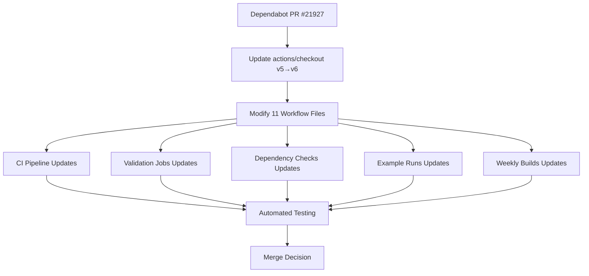

+++
title = "#21927 Bump actions/checkout from 5 to 6"
date = "2025-11-28T00:00:00"
draft = false
template = "pull_request_page.html"
in_search_index = false

[extra]
current_language = "zh-cn"
available_languages = {"en" = { name = "English", url = "/pull_request/bevy/2025-11/pr-21927-en-20251128" }, "zh-cn" = { name = "中文", url = "/pull_request/bevy/2025-11/pr-21927-zh-cn-20251128" }}
labels = ["C-Dependencies"]
+++

# Bump actions/checkout from 5 to 6

## Basic Information
- **Title**: Bump actions/checkout from 5 to 6
- **PR Link**: https://github.com/bevyengine/bevy/pull/21927
- **Author**: app/dependabot
- **Status**: MERGED
- **Labels**: C-Dependencies
- **Created**: 2025-11-24T06:01:08Z
- **Merged**: 2025-11-28T23:25:55Z
- **Merged By**: mockersf

## Description Translation
将 [actions/checkout](https://github.com/actions/checkout) 从版本 5 升级到 6。
<details>
<summary>Release notes</summary>
<p><em>Sourced from <a href="https://github.com/actions/checkout/releases">actions/checkout's releases</a>.</em></p>
<blockquote>
<h2>v6.0.0</h2>
<h2>What's Changed</h2>
<ul>
<li>Update README to include Node.js 24 support details and requirements by <a href="https://github.com/salmanmkc"><code>@​salmanmkc</code></a> in <a href="https://redirect.github.com/actions/checkout/pull/2248">actions/checkout#2248</a></li>
<li>Persist creds to a separate file by <a href="https://github.com/ericsciple"><code>@​ericsciple</code></a> in <a href="https://redirect.github.com/actions/checkout/pull/2286">actions/checkout#2286</a></li>
<li>v6-beta by <a href="https://github.com/ericsciple"><code>@​ericsciple</code></a> in <a href="https://redirect.github.com/actions/checkout/pull/2298">actions/checkout#2298</a></li>
<li>update readme/changelog for v6 by <a href="https://github.com/ericsciple"><code>@​ericsciple</code></a> in <a href="https://redirect.github.com/actions/checkout/pull/2311">actions/checkout#2311</a></li>
</ul>
<p><strong>Full Changelog</strong>: <a href="https://github.com/actions/checkout/compare/v5.0.0...v6.0.0">https://github.com/actions/checkout/compare/v5.0.0...v6.0.0</a></p>
<h2>v6-beta</h2>
<h2>What's Changed</h2>
<p>Updated persist-credentials to store the credentials under <code>$RUNNER_TEMP</code> instead of directly in the local git config.</p>
<p>This requires a minimum Actions Runner version of <a href="https://github.com/actions/runner/releases/tag/v2.329.0">v2.329.0</a> to access the persisted credentials for <a href="https://docs.github.com/en/actions/tutorials/use-containerized-services/create-a-docker-container-action">Docker container action</a> scenarios.</p>
<h2>v5.0.1</h2>
<h2>What's Changed</h2>
<ul>
<li>Port v6 cleanup to v5 by <a href="https://github.com/ericsciple"><code>@​ericsciple</code></a> in <a href="https://redirect.github.com/actions/checkout/pull/2301">actions/checkout#2301</a></li>
</ul>
<p><strong>Full Changelog</strong>: <a href="https://github.com/actions/checkout/compare/v5...v5.0.1">https://github.com/actions/checkout/compare/v5...v5.0.1</a></p>
</blockquote>
</details>
<details>
<summary>Changelog</summary>
<p><em>Sourced from <a href="https://github.com/actions/checkout/blob/main/CHANGELOG.md">actions/checkout's changelog</a>.</em></p>
<blockquote>
<h1>Changelog</h1>
<h2>V6.0.0</h2>
<ul>
<li>Persist creds to a separate file by <a href="https://github.com/ericsciple"><code>@​ericsciple</code></a> in <a href="https://redirect.github.com/actions/checkout/pull/2286">actions/checkout#2286</a></li>
<li>Update README to include Node.js 24 support details and requirements by <a href="https://github.com/salmanmkc"><code>@​salmanmkc</code></a> in <a href="https://redirect.github.com/actions/checkout/pull/2248">actions/checkout#2248</a></li>
</ul>
<h2>V5.0.1</h2>
<ul>
<li>Port v6 cleanup to v5 by <a href="https://github.com/ericsciple"><code>@​ericsciple</code></a> in <a href="https://redirect.github.com/actions/checkout/pull/2301">actions/checkout#2301</a></li>
</ul>
<h2>V5.0.0</h2>
<ul>
<li>Update actions checkout to use node 24 by <a href="https://github.com/salmanmkc"><code>@​salmanmkc</code></a> in <a href="https://redirect.github.com/actions/checkout/pull/2226">actions/checkout#2226</a></li>
</ul>
<h2>V4.3.1</h2>
<ul>
<li>Port v6 cleanup to v4 by <a href="https://github.com/ericsciple"><code>@​ericsciple</code></a> in <a href="https://redirect.github.com/actions/checkout/pull/2305">actions/checkout#2305</a></li>
</ul>
<h2>V4.3.0</h2>
<ul>
<li>docs: update README.md by <a href="https://github.com/motss"><code>@​motss</code></a> in <a href="https://redirect.github.com/actions/checkout/pull/1971">actions/checkout#1971</a></li>
<li>Add internal repos for checking out multiple repositories by <a href="https://github.com/mouismail"><code>@​mouismail</code></a> in <a href="https://redirect.github.com/actions/checkout/pull/1977">actions/checkout#1977</a></li>
<li>Documentation update - add recommended permissions to Readme by <a href="https://github.com/benwells"><code>@​benwells</code></a> in <a href="https://redirect.github.com/actions/checkout/pull/2043">actions/checkout#2043</a></li>
<li>Adjust positioning of user email note and permissions heading by <a href="https://github.com/joshmgross"><code>@​joshmgross</code></a> in <a href="https://redirect.github.com/actions/checkout/pull/2044">actions/checkout#2044</a></li>
<li>Update README.md by <a href="https://github.com/nebuk89"><code>@​nebuk89</code></a> in <a href="https://redirect.github.com/actions/checkout/pull/2194">actions/checkout#2194</a></li>
<li>Update CODEOWNERS for actions by <a href="https://github.com/TingluoHuang"><code>@​TingluoHuang</code></a> in <a href="https://redirect.github.com/actions/checkout/pull/2224">actions/checkout#2224</a></li>
<li>Update package dependencies by <a href="https://github.com/salmanmkc"><code>@​salmanmkc</code></a> in <a href="https://redirect.github.com/actions/checkout/pull/2236">actions/checkout#2236</a></li>
</ul>
<h2>v4.2.2</h2>
<ul>
<li><code>url-helper.ts</code> now leverages well-known environment variables by <a href="https://github.com/jww3"><code>@​jww3</code></a> in <a href="https://redirect.github.com/actions/checkout/pull/1941">actions/checkout#1941</a></li>
<li>Expand unit test coverage for <code>isGhes</code> by <a href="https://github.com/jww3"><code>@​jww3</code></a> in <a href="https://redirect.github.com/actions/checkout/pull/1946">actions/checkout#1946</a></li>
</ul>
<h2>v4.2.1</h2>
<ul>
<li>Check out other refs/* by commit if provided, fall back to ref by <a href="https://github.com/orhantoy"><code>@​orhantoy</code></a> in <a href="https://redirect.github.com/actions/checkout/pull/1924">actions/checkout#1924</a></li>
</ul>
<h2>v4.2.0</h2>
<ul>
<li>Add Ref and Commit outputs by <a href="https://github.com/lucacome"><code>@​lucacome</code></a> in <a href="https://redirect.github.com/actions/checkout/pull/1180">actions/checkout#1180</a></li>
<li>Dependency updates by <a href="https://github.com/dependabot"><code>@​dependabot</code></a>- <a href="https://redirect.github.com/actions/checkout/pull/1777">actions/checkout#1777</a>, <a href="https://redirect.github.com/actions/checkout/pull/1872">actions/checkout#1872</a></li>
</ul>
<h2>v4.1.7</h2>
<ul>
<li>Bump the minor-npm-dependencies group across 1 directory with 4 updates by <a href="https://github.com/dependabot"><code>@​dependabot</code></a> in <a href="https://redirect.github.com/actions/checkout/pull/1739">actions/checkout#1739</a></li>
<li>Bump actions/checkout from 3 to 4 by <a href="https://github.com/dependabot"><code>@​dependabot</code></a> in <a href="https://redirect.github.com/actions/checkout/pull/1697">actions/checkout#1697</a></li>
<li>Check out other refs/* by commit by <a href="https://github.com/orhantoy"><code>@​orhantoy</code></a> in <a href="https://redirect.github.com/actions/checkout/pull/1774">actions/checkout#1774</a></li>
<li>Pin actions/checkout's own workflows to a known, good, stable version. by <a href="https://github.com/jww3"><code>@​jww3</code></a> in <a href="https://redirect.github.com/actions/checkout/pull/1776">actions/checkout#1776</a></li>
</ul>
<h2>v4.1.6</h2>
<ul>
<li>Check platform to set archive extension appropriately by <a href="https://github.com/cory-miller"><code>@​cory-miller</code></a> in <a href="https://redirect.github.com/actions/checkout/pull/1732">actions/checkout#1732</a></li>
</ul>
<h2>v4.1.5</h2>
<ul>
<li>Update NPM dependencies by <a href="https://github.com/cory-miller"><code>@​cory-miller</code></a> in <a href="https://redirect.github.com/actions/checkout/pull/1703">actions/checkout#1703</a></li>
<li>Bump github/codeql-action from 2 to 3 by <a href="https://github.com/dependabot"><code>@​dependabot</code></a> in <a href="https://redirect.github.com/actions/checkout/pull/1694">actions/checkout#1694</a></li>
<li>Bump actions/setup-node from 1 to 4 by <a href="https://github.com/dependabot"><code>@​dependabot</code></a> in <a href="https://redirect.github.com/actions/checkout/pull/1696">actions/checkout#1696</a></li>
<li>Bump actions/upload-artifact from 2 to 4 by <a href="https://github.com/dependabot"><code>@​dependabot</code></a> in <a href="https://redirect.github.com/actions/checkout/pull/1695">actions/checkout#1695</a></li>
</ul>
<!-- raw HTML omitted -->
</blockquote>
<p>... (truncated)</p>
</details>
<details>
<summary>Commits</summary>
<ul>
<li><a href="https://github.com/actions/checkout/commit/1af3b93b6815bc44a9784bd300feb67ff0d1eeb3"><code>1af3b93</code></a> update readme/changelog for v6 (<a href="https://redirect.github.com/actions/checkout/issues/2311">#2311</a>)</li>
<li><a href="https://github.com/actions/checkout/commit/71cf2267d89c5cb81562390fa70a37fa40b1305e"><code>71cf226</code></a> v6-beta (<a href="https://redirect.github.com/actions/checkout/issues/2298">#2298</a>)</li>
<li><a href="https://github.com/actions/checkout/commit/069c6959146423d11cd0184e6accf28f9d45f06e"><code>069c695</code></a> Persist creds to a separate file (<a href="https://redirect.github.com/actions/checkout/issues/2286">#2286</a>)</li>
<li><a href="https://github.com/actions/checkout/commit/ff7abcd0c3c05ccf6adc123a8cd1fd4fb30fb493"><code>ff7abcd</code></a> Update README to include Node.js 24 support details and requirements (<a href="https://redirect.github.com/actions/checkout/issues/2248">#2248</a>)</li>
<li>See full diff in <a href="https://github.com/actions/checkout/compare/v5...v6">compare view</a></li>
</ul>
</details>
<br />


[](https://docs.github.com/en/github/managing-security-vulnerabilities/about-dependabot-security-updates#about-compatibility-scores)

Dependabot will resolve any conflicts with this PR as long as you don't alter it yourself. You can also trigger a rebase manually by commenting `@dependabot rebase`.

[//]: # (dependabot-automerge-start)
[//]: # (dependabot-automerge-end)

---

<details>
<summary>Dependabot commands and options</summary>
<br />

You can trigger Dependabot actions by commenting on this PR:
- `@dependabot rebase` will rebase this PR
- `@dependabot recreate` will recreate this PR, overwriting any edits that have been made to it
- `@dependabot merge` will merge this PR after your CI passes on it
- `@dependabot squash and merge` will squash and merge this PR after your CI passes on it
- `@dependabot cancel merge` will cancel a previously requested merge and block automerging
- `@dependabot reopen` will reopen this PR if it is closed
- `@dependabot close` will close this PR and stop Dependabot recreating it. You can achieve the same result by closing it manually
- `@dependabot show <dependency name> ignore conditions` will show all of the ignore conditions of the specified dependency
- `@dependabot ignore this major version` will close this PR and stop Dependabot creating any more for this major version (unless you reopen the PR or upgrade to it yourself)
- `@dependabot ignore this minor version` will close this PR and stop Dependabot creating any more for this minor version (unless you reopen the PR or upgrade to it yourself)
- `@dependabot ignore this dependency` will close this PR and stop Dependabot creating any more for this dependency (unless you reopen the PR or upgrade to it yourself)


</details>

## The Story of This Pull Request

这个PR是一个由Dependabot自动生成的依赖更新，将GitHub Actions中的`actions/checkout`从版本5升级到版本6。这是一个典型的维护性更新，主要目的是保持CI/CD流水线中依赖项的最新状态。

### 升级背景和必要性

在GitHub Actions生态系统中，`actions/checkout`是一个基础且关键的action，用于在CI工作流中检出代码仓库。随着时间推移，新版本通常会带来性能改进、安全修复和新功能支持。版本6的主要变化包括：

- **凭据存储改进**：将凭据持久化到单独的文件中，而不是直接存储在本地git配置中
- **Node.js 24支持**：更新对Node.js 24的支持细节和要求
- **最低Runner要求**：需要Actions Runner版本至少为v2.329.0才能在Docker容器action场景中访问持久化凭据

### 实施过程

这个升级涉及修改Bevy项目中11个GitHub Actions工作流文件。每个修改都很简单但一致：将`actions/checkout@v5`替换为`actions/checkout@v6`。这种模式化的变更表明这是一个机械化的更新，没有引入功能性的变化。

以`.github/workflows/ci.yml`为例，变更模式如下：

```yaml
# 修改前：
- uses: actions/checkout@v5

# 修改后：
- uses: actions/checkout@v6
```

同样的变更模式应用到了所有相关工作流文件中，包括：
- CI流水线（ci.yml）
- 验证作业（validation-jobs.yml）
- 依赖检查（dependencies.yml）
- 示例运行（example-run.yml）
- 周度构建（weekly.yml）
- 文档构建（docs.yml）
- 代码质量检查（codeql.yml）
- 发布后处理（post-release.yml）

### 技术考量

从版本5升级到版本6是一个主要版本升级，通常意味着可能包含破坏性变更。然而，在这个案例中：

1. **兼容性评估**：Dependabot的兼容性分数显示这次升级是兼容的
2. **变更影响**：主要的破坏性变更是凭据存储位置的改变，但这对于Bevy的CI工作流来说应该是透明的
3. **Runner要求**：新版本要求Actions Runner v2.329.0，这应该在现代GitHub Actions环境中已经满足

### 合并决策

PR在创建后4天内被合并，这表明：
- 自动化测试通过了新版本的验证
- 维护团队对新版本的稳定性有信心
- 没有发现回归问题或破坏性变更

## Visual Representation



## Key Files Changed

### 1. `.github/workflows/ci.yml` (+18/-18)
这是最主要的CI配置文件，包含了构建、测试和验证的核心工作流。

**关键变更：**
```yaml
# 在多个步骤中将v5升级到v6
# 修改前：
- uses: actions/checkout@v5

# 修改后：
- uses: actions/checkout@v6
```

### 2. `.github/workflows/validation-jobs.yml` (+6/-6)
包含各种验证任务，如格式检查、linting等。

**关键变更：**
```yaml
# 在多个验证作业中升级
# 修改前：
- uses: actions/checkout@v5

# 修改后：
- uses: actions/checkout@v6
```

### 3. `.github/workflows/dependencies.yml` (+4/-4)
负责依赖项安全检查的工作流。

**关键变更：**
```yaml
# 在安全检查作业中升级
# 修改前：
- uses: actions/checkout@v5

# 修改后：
- uses: actions/checkout@v6
```

### 4. `.github/workflows/example-run.yml` (+3/-3)
运行示例程序的工作流。

**关键变更：**
```yaml
# 在示例运行作业中升级
# 修改前：
- uses: actions/checkout@v5

# 修改后：
- uses: actions/checkout@v6
```

### 5. `.github/workflows/weekly.yml` (+3/-3)
周度构建和测试工作流。

**关键变更：**
```yaml
# 在周度测试作业中升级
# 修改前：
- uses: actions/checkout@v5

# 修改后：
- uses: actions/checkout@v6
```

## Further Reading

- [GitHub Actions Checkout v6 Release Notes](https://github.com/actions/checkout/releases/tag/v6.0.0)
- [GitHub Actions Documentation](https://docs.github.com/en/actions)
- [Dependabot Version Updates](https://docs.github.com/en/code-security/dependabot/dependabot-version-updates/about-dependabot-version-updates)
- [Semantic Versioning in GitHub Actions](https://docs.github.com/en/actions/creating-actions/about-actions#using-tags-for-release-management)

# Full Code Diff
diff --git a/.github/workflows/action-on-PR-labeled.yml b/.github/workflows/action-on-PR-labeled.yml
index be569aa5b4d53..4cd49bf3d40de 100644
--- a/.github/workflows/action-on-PR-labeled.yml
+++ b/.github/workflows/action-on-PR-labeled.yml
@@ -16,7 +16,7 @@ jobs:
     runs-on: ubuntu-latest
     if: github.event.label.name == 'M-Migration-Guide'
     steps:
-      - uses: actions/checkout@v5
+      - uses: actions/checkout@v6
         with:
           ref: ${{ github.event.pull_request.head.sha }}
           fetch-depth: 2
@@ -46,7 +46,7 @@ jobs:
     runs-on: ubuntu-latest
     if: github.event.label.name == 'M-Release-Note'
     steps:
-      - uses: actions/checkout@v5
+      - uses: actions/checkout@v6
         with:
           ref: ${{ github.event.pull_request.head.sha }}
           fetch-depth: 2
diff --git a/.github/workflows/ci.yml b/.github/workflows/ci.yml
index 0cd009817fa5f..4c6e26bc8ef45 100644
--- a/.github/workflows/ci.yml
+++ b/.github/workflows/ci.yml
@@ -32,7 +32,7 @@ jobs:
     runs-on: ${{ matrix.os }}
     timeout-minutes: 30
     steps:
-      - uses: actions/checkout@v5
+      - uses: actions/checkout@v6
       - uses: actions/cache/restore@v4
         with:
           # key won't match, will rely on restore-keys
@@ -60,7 +60,7 @@ jobs:
     runs-on: ubuntu-latest
     timeout-minutes: 30
     steps:
-      - uses: actions/checkout@v5
+      - uses: actions/checkout@v6
       - uses: actions/cache/restore@v4
         with:
           # key won't match, will rely on restore-keys
@@ -91,7 +91,7 @@ jobs:
     runs-on: macos-latest
     timeout-minutes: 60
     steps:
-      - uses: actions/checkout@v5
+      - uses: actions/checkout@v6
       - uses: actions/cache/restore@v4
         with:
           # key won't match, will rely on restore-keys
@@ -127,7 +127,7 @@ jobs:
     timeout-minutes: 30
     needs: ci
     steps:
-      - uses: actions/checkout@v5
+      - uses: actions/checkout@v6
       - uses: actions/cache/restore@v4
         with:
           # key won't match, will rely on restore-keys
@@ -156,7 +156,7 @@ jobs:
     timeout-minutes: 30
     needs: ci
     steps:
-      - uses: actions/checkout@v5
+      - uses: actions/checkout@v6
       - uses: actions/cache/restore@v4
         with:
           # key won't match, will rely on restore-keys
@@ -184,7 +184,7 @@ jobs:
     timeout-minutes: 30
     needs: ci
     steps:
-      - uses: actions/checkout@v5
+      - uses: actions/checkout@v6
       - uses: actions/cache/restore@v4
         with:
           # key won't match, will rely on restore-keys
@@ -212,7 +212,7 @@ jobs:
     timeout-minutes: 30
     needs: ci
     steps:
-      - uses: actions/checkout@v5
+      - uses: actions/checkout@v6
       - uses: actions/cache/restore@v4
         with:
           # key won't match, will rely on restore-keys
@@ -240,7 +240,7 @@ jobs:
     timeout-minutes: 30
     needs: build
     steps:
-      - uses: actions/checkout@v5
+      - uses: actions/checkout@v6
       - uses: actions/cache/restore@v4
         with:
           # key won't match, will rely on restore-keys
@@ -268,7 +268,7 @@ jobs:
     timeout-minutes: 30
     needs: build
     steps:
-      - uses: actions/checkout@v5
+      - uses: actions/checkout@v6
       - uses: actions/cache/restore@v4
         with:
           # key won't match, will rely on restore-keys
@@ -299,7 +299,7 @@ jobs:
     needs: check-missing-features-in-docs
     if: always()
     steps:
-      - uses: actions/checkout@v5
+      - uses: actions/checkout@v6
         with:
           # Full git history is needed to get a proper list of changed files within `super-linter`
           fetch-depth: 0
@@ -315,7 +315,7 @@ jobs:
     runs-on: ubuntu-latest
     timeout-minutes: 30
     steps:
-      - uses: actions/checkout@v5
+      - uses: actions/checkout@v6
       - name: Install taplo
         run: curl -fsSL https://github.com/tamasfe/taplo/releases/download/0.10.0/taplo-linux-x86_64.gz | gzip -d - | install -m 755 /dev/stdin /usr/local/bin/taplo
       - name: Run Taplo
@@ -334,7 +334,7 @@ jobs:
     runs-on: ubuntu-latest
     timeout-minutes: 30
     steps:
-      - uses: actions/checkout@v5
+      - uses: actions/checkout@v6
       - name: Check for typos
         uses: crate-ci/typos@v1.39.2
       - name: Typos info
@@ -350,7 +350,7 @@ jobs:
     runs-on: ubuntu-latest
     timeout-minutes: 30
     steps:
-      - uses: actions/checkout@v5
+      - uses: actions/checkout@v6
       - uses: actions/cache/restore@v4
         with:
           # key won't match, will rely on restore-keys
@@ -388,7 +388,7 @@ jobs:
     runs-on: ubuntu-latest
     timeout-minutes: 30
     steps:
-      - uses: actions/checkout@v5
+      - uses: actions/checkout@v6
       - uses: dtolnay/rust-toolchain@stable
       - name: check for missing metadata
         id: missing-metadata
@@ -423,7 +423,7 @@ jobs:
     timeout-minutes: 30
     needs: check-missing-examples-in-docs
     steps:
-      - uses: actions/checkout@v5
+      - uses: actions/checkout@v6
       - uses: dtolnay/rust-toolchain@stable
       - name: check for missing features
         id: missing-features
@@ -458,7 +458,7 @@ jobs:
     timeout-minutes: 30
     needs: build
     steps:
-      - uses: actions/checkout@v5
+      - uses: actions/checkout@v6
       - uses: dtolnay/rust-toolchain@stable
       - name: get MSRV
         id: msrv
@@ -502,7 +502,7 @@ jobs:
     runs-on: ubuntu-latest
     timeout-minutes: 30
     steps:
-      - uses: actions/checkout@v5
+      - uses: actions/checkout@v6
       - name: Check for internal Bevy imports
         shell: bash
         run: |
@@ -524,7 +524,7 @@ jobs:
     runs-on: ubuntu-latest
     timeout-minutes: 30
     steps:
-      - uses: actions/checkout@v5
+      - uses: actions/checkout@v6
       - uses: dtolnay/rust-toolchain@stable
       - name: Check Release Content
         shell: bash
diff --git a/.github/workflows/codeql.yml b/.github/workflows/codeql.yml
index 81fbf28972d6e..7da24599cb15d 100644
--- a/.github/workflows/codeql.yml
+++ b/.github/workflows/codeql.yml
@@ -36,7 +36,7 @@ jobs:
             build-mode: none
     steps:
       - name: Checkout repository
-        uses: actions/checkout@v5
+        uses: actions/checkout@v6
 
       # Initializes the CodeQL tools for scanning.
       - name: Initialize CodeQL
diff --git a/.github/workflows/dependencies.yml b/.github/workflows/dependencies.yml
index 53bceffaf99a8..6e8f5c8b1bd98 100644
--- a/.github/workflows/dependencies.yml
+++ b/.github/workflows/dependencies.yml
@@ -26,7 +26,7 @@ jobs:
   check-advisories:
     runs-on: ubuntu-latest
     steps:
-      - uses: actions/checkout@v5
+      - uses: actions/checkout@v6
       - uses: dtolnay/rust-toolchain@stable
       - name: Install cargo-deny
         run: cargo install cargo-deny
@@ -36,7 +36,7 @@ jobs:
   check-bans:
     runs-on: ubuntu-latest
     steps:
-      - uses: actions/checkout@v5
+      - uses: actions/checkout@v6
       - uses: dtolnay/rust-toolchain@stable
       - name: Install cargo-deny
         run: cargo install cargo-deny
@@ -46,7 +46,7 @@ jobs:
   check-licenses:
     runs-on: ubuntu-latest
     steps:
-      - uses: actions/checkout@v5
+      - uses: actions/checkout@v6
       - uses: dtolnay/rust-toolchain@stable
       - name: Install cargo-deny
         run: cargo install cargo-deny
@@ -56,7 +56,7 @@ jobs:
   check-sources:
     runs-on: ubuntu-latest
     steps:
-      - uses: actions/checkout@v5
+      - uses: actions/checkout@v6
       - uses: dtolnay/rust-toolchain@stable
       - name: Install cargo-deny
         run: cargo install cargo-deny
diff --git a/.github/workflows/docs.yml b/.github/workflows/docs.yml
index badb5c8e9650b..79391d9e674c1 100644
--- a/.github/workflows/docs.yml
+++ b/.github/workflows/docs.yml
@@ -35,7 +35,7 @@ jobs:
       url: ${{ steps.deployment.outputs.page_url }}
     steps:
       - name: Checkout
-        uses: actions/checkout@v5
+        uses: actions/checkout@v6
 
       - uses: dtolnay/rust-toolchain@master
         with:
diff --git a/.github/workflows/example-run-report.yml b/.github/workflows/example-run-report.yml
index d4a12a6af8838..733fb92b82502 100644
--- a/.github/workflows/example-run-report.yml
+++ b/.github/workflows/example-run-report.yml
@@ -86,7 +86,7 @@ jobs:
     needs: [make-macos-screenshots-available, compare-macos-screenshots]
     if: ${{ always() && needs.compare-macos-screenshots.result == 'failure' }}
     steps:
-      - uses: actions/checkout@v5
+      - uses: actions/checkout@v6
       - name: "Check if PR already has label"
         id: check-label
         env:
diff --git a/.github/workflows/example-run.yml b/.github/workflows/example-run.yml
index 57e29970dbc62..107da778429eb 100644
--- a/.github/workflows/example-run.yml
++