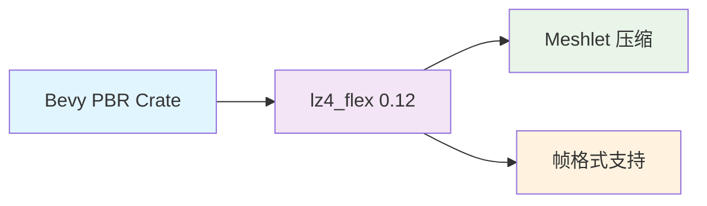

+++
title = "#21928 Update lz4_flex requirement from 0.11 to 0.12"
date = "2025-11-28T00:00:00"
draft = false
template = "pull_request_page.html"
in_search_index = false

[extra]
current_language = "zh-cn"
available_languages = {"en" = { name = "English", url = "/pull_request/bevy/2025-11/pr-21928-en-20251128" }, "zh-cn" = { name = "中文", url = "/pull_request/bevy/2025-11/pr-21928-zh-cn-20251128" }}
+++

# 依赖更新分析报告：lz4_flex 从 0.11 升级至 0.12

## 基本信息
- **标题**: Update lz4_flex requirement from 0.11 to 0.12
- **PR 链接**: https://github.com/bevyengine/bevy/pull/21928
- **作者**: app/dependabot
- **状态**: 已合并
- **标签**: C-Dependencies
- **创建时间**: 2025-11-24T06:12:11Z
- **合并时间**: 2025-11-28T22:31:36Z
- **合并者**: james7132

## 描述翻译
更新 [lz4_flex](https://github.com/pseitz/lz4_flex) 的要求以允许使用最新版本。
<details>
<summary>发布说明</summary>
<p><em>来源自 <a href="https://github.com/pseitz/lz4_flex/releases">lz4_flex 的发布</a>。</em></p>
<blockquote>
<h2>0.12.0</h2>
<h2>更新内容</h2>
<ul>
<li>修复解码大载荷时的整数溢出问题 by <a href="https://github.com/teh-cmc"><code>@​teh-cmc</code></a> in <a href="https://redirect.github.com/PSeitz/lz4_flex/pull/192">PSeitz/lz4_flex#192</a></li>
<li>chore(readme): 添加 Python 绑定实现 by <a href="https://github.com/LVivona"><code>@​LVivona</code></a> in <a href="https://redirect.github.com/PSeitz/lz4_flex/pull/190">PSeitz/lz4_flex#190</a></li>
</ul>
<h2>新贡献者</h2>
<ul>
<li><a href="https://github.com/teh-cmc"><code>@​teh-cmc</code></a> 在 <a href="https://redirect.github.com/PSeitz/lz4_flex/pull/192">PSeitz/lz4_flex#192</a> 中做出了首次贡献</li>
<li><a href="https://github.com/LVivona"><code>@​LVivona</code></a> 在 <a href="https://redirect.github.com/PSeitz/lz4_flex/pull/190">PSeitz/lz4_flex#190</a> 中做出了首次贡献</li>
</ul>
<p><strong>完整变更日志</strong>: <a href="https://github.com/PSeitz/lz4_flex/compare/0.11.5...0.12.0">https://github.com/PSeitz/lz4_flex/compare/0.11.5...0.12.0</a></p>
</blockquote>
</details>
<details>
<summary>变更日志</summary>
<p><em>来源自 <a href="https://github.com/PSeitz/lz4_flex/blob/main/CHANGELOG.md">lz4_flex 的变更日志</a>。</em></p>
<blockquote>
<h1>0.12.0 (2025-11-11)</h1>
<ul>
<li>修复解码大载荷时的整数溢出问题 <a href="https://redirect.github.com/PSeitz/lz4_flex/pull/192">#192</a> (感谢 <a href="https://github.com/teh-cmc"><code>@​teh-cmc</code></a>)</li>
</ul>
<pre><code>这修复了在块格式中解码大载荷时的 u32 整数溢出问题。
注意：块格式不适合如此大的载荷，因为它将所有内容都保留在内存中。对于大数据，请考虑使用帧格式。
<p>此更改还移除了 write_integer 的不安全快速路径以简化代码。
对不可压缩数据的性能影响是可以接受的，因为其已经足够快。
</code></pre></p>
<h1>0.11.5 (2025-06-19)</h1>
<ul>
<li>修复 Cargo.toml 中错误的 rust-version 字段名称 <a href="https://redirect.github.com/PSeitz/lz4_flex/pull/187">#187</a></li>
</ul>
<h1>0.11.4 (2025-06-14)</h1>
<ul>
<li>升级至 twox-hash 2.0<a href="https://redirect.github.com/PSeitz/lz4_flex/pull/175">#175</a></li>
<li>更好的 <code>no_std</code> 兼容性 <a href="https://redirect.github.com/PSeitz/lz4_flex/pull/180">#180</a></li>
</ul>
<h1>0.11.3 (2024-03-30)</h1>
<ul>
<li>修复对 <code>--deny=unsafe_code</code> 编译的支持 <a href="https://redirect.github.com/PSeitz/lz4_flex/pull/152">#152</a></li>
<li>使 <code>get_maximum_output_size</code> 为常量 <a href="https://redirect.github.com/PSeitz/lz4_flex/pull/153">#153</a></li>
</ul>
<h1>0.11.2 (2024-01-11)</h1>
<ul>
<li>在发布的 crate 中包含许可证文件</li>
</ul>
<h1>0.11.1 (2023-06-19)</h1>
<ul>
<li>[<strong>破坏性变更</strong>] 移除 <code>unchecked-decode</code>
移除 <code>unchecked-decode</code> 功能标志，因为功能统一：
<a href="https://doc.rust-lang.org/cargo/reference/features.html#feature-unification">https://doc.rust-lang.org/cargo/reference/features.html#feature-unification</a></li>
</ul>
<h1>0.11.0 (2023-06-18)</h1>
<h3>文档</h3>
<ul>
<li>文档：添加解压缩块示例</li>
</ul>
<h3>修复</h3>
<ul>
<li>在帧格式中处理空输入 <a href="https://redirect.github.com/PSeitz/lz4_flex/pull/120">#120</a></li>
</ul>
<pre><code>之前空输入被忽略且不写入任何内容。现在会写入一个空帧。这提高了与参考实现和一些边缘情况的兼容性。
</code></pre>
<!-- raw HTML omitted -->
</blockquote>
<p>... (截断)</p>
</details>
<details>
<summary>提交</summary>
<ul>
<li><a href="https://github.com/PSeitz/lz4_flex/commit/975bfa7ac9583da879b5d7578b423232d84f69fe"><code>975bfa7</code></a> 将版本提升至 0.12.0</li>
<li><a href="https://github.com/PSeitz/lz4_flex/commit/40d81107aba09e62b14a04938443d6edd885b540"><code>40d8110</code></a> 更新 readme</li>
<li><a href="https://github.com/PSeitz/lz4_flex/commit/642020e842cf4b9ba15173765fab4df40a8574fa"><code>642020e</code></a> 将版本提升至 0.12</li>
<li><a href="https://github.com/PSeitz/lz4_flex/commit/5295b1601ef27629f7cf6d7f157f50d51c1308ee"><code>5295b16</code></a> chore(readme): 添加 Python 绑定实现</li>
<li><a href="https://github.com/PSeitz/lz4_flex/commit/c1483c4db47d1086489b72337762db7b458b6132"><code>c1483c4</code></a> 修复问题</li>
<li><a href="https://github.com/PSeitz/lz4_flex/commit/b3c03bea751f25e58819724caab81d5856c895c7"><code>b3c03be</code></a> 实现演示问题的测试</li>
<li><a href="https://github.com/PSeitz/lz4_flex/commit/a61ee5f23f409641a8c8ab27cac784cdba57d708"><code>a61ee5f</code></a> 移除据我所知未被使用且已损坏的不安全 write_integer</li>
<li><a href="https://github.com/PSeitz/lz4_flex/commit/ad71a3103daa37f8ddd139f0c29b6e4ce8724ba3"><code>ad71a31</code></a> 修复非法的文档注释</li>
<li><a href="https://github.com/PSeitz/lz4_flex/commit/f1c070e987b7d056c4868b19e0b00149f4256653"><code>f1c070e</code></a> clippy</li>
<li><a href="https://github.com/PSeitz/lz4_flex/commit/1496be413a0a5236f1aa8d3b8f14169ef7ce42d2"><code>1496be4</code></a> 更新 binggan</li>
<li>其他提交可在 <a href="https://github.com/pseitz/lz4_flex/compare/0.11...0.12.0">比较视图</a> 中查看</li>
</ul>
</details>
<br />


Dependabot 将在您不自行修改的情况下解决与此 PR 的任何冲突。您也可以通过评论 `@dependabot rebase` 手动触发 rebase。

[//]: # (dependabot-automerge-start)
[//]: # (dependabot-automerge-end)

---

<details>
<summary>Dependabot 命令和选项</summary>
<br />

您可以通过在此 PR 上评论来触发 Dependabot 操作：
- `@dependabot rebase` 将 rebase 此 PR
- `@dependabot recreate` 将重新创建此 PR，覆盖对其进行的任何编辑
- `@dependabot merge` 将在 CI 通过后合并此 PR
- `@dependabot squash and merge` 将在 CI 通过后 squash 并合并此 PR
- `@dependabot cancel merge` 将取消先前请求的合并并阻止自动合并
- `@dependabot reopen` 将重新打开此 PR（如果已关闭）
- `@dependabot close` 将关闭此 PR 并停止 Dependabot 重新创建它。您可以通过手动关闭它来实现相同的结果
- `@dependabot show <dependency name> ignore conditions` 将显示指定依赖项的所有忽略条件
- `@dependabot ignore this major version` 将关闭此 PR 并停止 Dependabot 为此主要版本创建更多版本（除非您重新打开 PR 或自行升级）
- `@dependabot ignore this minor version` 将关闭此 PR 并停止 Dependabot 为此次要版本创建更多版本（除非您重新打开 PR 或自行升级）
- `@dependabot ignore this dependency` 将关闭此 PR 并停止 Dependabot 为此依赖项创建更多版本（除非您重新打开 PR 或自行升级）


</details>

## PR 的技术分析

这是一个由 Dependabot 自动生成的依赖更新 PR，将 lz4_flex 压缩库从 0.11 版本升级到 0.12 版本。虽然变更看似简单，但背后涉及重要的安全修复和性能改进。

### 问题背景与上下文

lz4_flex 是 Bevy 引擎中用于 meshlet 功能的压缩库。在 0.11 版本中，库在处理大载荷解码时存在整数溢出漏洞，这在处理恶意或损坏的压缩数据时可能导致安全问题。具体来说，在块格式（block format）解码过程中，当处理超过 u32 整数范围的大数据时会发生溢出。

### 解决方案的技术细节

新版本 0.12.0 主要修复了以下关键问题：

1. **整数溢出修复**：解决了在块格式中解码大载荷时的 u32 整数溢出问题
2. **代码简化**：移除了 `write_integer` 的不安全快速路径，减少了潜在的错误源
3. **性能权衡**：虽然移除了不安全优化，但对不可压缩数据的性能影响在可接受范围内

### 实现的具体变更

这个 PR 只涉及一个文件的单行修改：

```toml
# 变更前:
lz4_flex = { version = "0.11", default-features = false, features = [
  "frame",
], optional = true }

# 变更后:
lz4_flex = { version = "0.12", default-features = false, features = [
  "frame",
], optional = true }
```

值得注意的是，Bevy 使用的是帧格式（frame feature）而非块格式，这意味着整数溢出漏洞可能不会直接影响当前实现，但升级仍然是必要的安全最佳实践。

### 技术洞察

1. **安全优先**：虽然性能很重要，但在这个案例中，代码安全性和正确性被放在了首位
2. **渐进式升级**：从 0.11 到 0.12 的升级路径相对平滑，没有破坏性变更影响 Bevy 的现有功能
3. **依赖管理**：Dependabot 自动化了依赖更新过程，确保了项目能够及时获得安全修复

### 影响评估

这次升级带来的主要好处：
- **安全性提升**：修复了潜在的整数溢出漏洞
- **代码质量改进**：移除了不安全代码路径
- **维护性增强**：保持依赖项处于最新状态

由于变更仅限于版本号更新，且功能配置保持不变，这个升级对 Bevy 的用户是透明的，不会引入任何行为变更。

## 组件关系图



## 关键文件变更

### `crates/bevy_pbr/Cargo.toml`

这是此 PR 中唯一修改的文件：

```toml
# 变更前:
lz4_flex = { version = "0.11", default-features = false, features = [
  "frame",
], optional = true }

# 变更后:  
lz4_flex = { version = "0.12", default-features = false, features = [
  "frame",
], optional = true }
```

**变更说明**：
- 将 lz4_flex 依赖版本从 0.11 更新到 0.12
- 保持所有其他配置不变：禁用默认功能，启用帧格式，保持可选依赖
- 这个变更确保了 Bevy 能够获得最新的安全修复和性能改进

## 进一步阅读

- [lz4_flex GitHub 仓库](https://github.com/pseitz/lz4_flex) - 了解该压缩库的完整功能
- [LZ4 压缩格式](https://github.com/lz4/lz4) - 理解底层压缩算法
- [Rust 依赖管理最佳实践](https://doc.rust-lang.org/cargo/guide/dependencies.html) - 学习 Cargo 依赖管理
- [整数溢出安全指南](https://doc.rust-lang.org/book/ch03-02-data-types.html#integer-overflow) - Rust 中的整数溢出处理