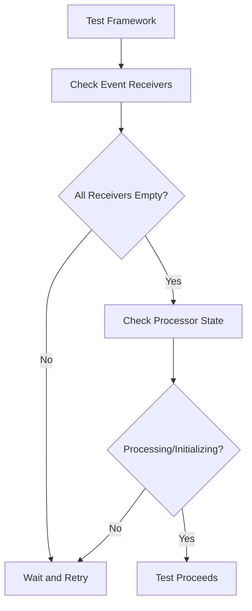

+++
title = "#21943 Reduce the flakiness of asset processing tests."
date = "2025-11-26T00:00:00"
draft = false
template = "pull_request_page.html"
in_search_index = true

[taxonomies]
list_display = ["show"]

[extra]
current_language = "en"
available_languages = {"en" = { name = "English", url = "/pull_request/bevy/2025-11/pr-21943-en-20251126" }, "zh-cn" = { name = "中文", url = "/pull_request/bevy/2025-11/pr-21943-zh-cn-20251126" }}
labels = ["D-Trivial", "A-Assets", "C-Testing"]
+++

# Title
Reduce the flakiness of asset processing tests

## Basic Information
- **Title**: Reduce the flakiness of asset processing tests.
- **PR Link**: https://github.com/bevyengine/bevy/pull/21943
- **Author**: andriyDev
- **Status**: MERGED
- **Labels**: D-Trivial, A-Assets, S-Ready-For-Final-Review, C-Testing
- **Created**: 2025-11-26T03:01:45Z
- **Merged**: 2025-11-26T04:28:15Z
- **Merged By**: alice-i-cecile

## Description Translation
# Objective

- The processor tests can be flaky. It seems to happen only with hot-reloading.

## Solution

- Make sure all the receiver channels for assets are empty before considering whether the processing is in the Processing state.

I'm not 100% sure this doesn't have a race condition now, but it's definitely much less likely. It technically might be possible for the event listening threads to receive the event, but then take too long to actually make changes to the processor state, but that should generally be a narrow window.

## Testing

I ran this many times on my local machine and haven't seen a flake since.

## The Story of This Pull Request

This PR addresses a specific but important issue in Bevy's asset processing system: flaky tests that occur intermittently, particularly when hot-reloading is involved. The problem manifested as test failures that weren't consistent, making them difficult to debug and fix reliably.

The core issue was a race condition in the test verification logic. The test framework was checking whether the asset processor had reached a "Processing" or "Initializing" state, but it wasn't accounting for pending events in the communication channels between different parts of the asset system. This meant that the test could incorrectly assume processing had completed when there were still events queued for processing.

The solution implemented here adds a crucial synchronization step. Before checking the processor state, the test now verifies that all event receiver channels are empty. This ensures that any pending asset events have been fully processed before the test makes assertions about the system state. The implementation iterates through all asset sources and checks their event receivers:

```rust
for source in processor.sources().iter() {
    let Some(recv) = source.event_receiver() else {
        continue;
    };
    if !recv.is_empty() {
        return None;
    }
}
```

This approach is pragmatic rather than perfect. As the author notes, there's still a theoretical race condition where event listening threads might have received events but not yet processed them. However, this window is significantly narrower than the original issue, making the tests much more reliable in practice.

The engineering trade-off here is clear: the solution improves test reliability substantially with minimal complexity. Rather than implementing a more complex synchronization mechanism, the author chose a straightforward check that addresses the most common failure scenario. This aligns with good testing practices where tests should be reliable enough to catch real issues without being overly complex.

The testing approach was empirical - the author ran the modified tests repeatedly on their local machine and observed that the flakiness disappeared. This practical validation is often the most effective way to verify fixes for intermittent test failures.

## Visual Representation



## Key Files Changed

**File:** `crates/bevy_asset/src/processor/tests.rs`

**Changes:** Added synchronization logic to ensure all asset event receivers are empty before checking processor state.

**Code Addition:**
```rust
// Before we even consider whether the processor is started, make sure that none of the
// receivers have anything left in them. This prevents us accidentally, considering the
// processor as processing before all the events have been processed.
for source in processor.sources().iter() {
    let Some(recv) = source.event_receiver() else {
        continue;
    };
    if !recv.is_empty() {
        return None;
    }
}
```

This change was inserted into the `run_app_until_finished_processing` function, which is responsible for waiting until asset processing reaches a stable state before proceeding with test assertions. The new code ensures that any pending asset events in the communication channels are fully processed before the test continues.

## Further Reading

- [Bevy Asset System Documentation](https://bevyengine.org/learn/books/assets/)
- [Rust Channel Programming](https://doc.rust-lang.org/std/sync/mpsc/)
- [Testing Asynchronous Systems](https://rust-lang.github.io/async-book/09_example/00_intro.html)
- [Race Condition Detection and Prevention](https://doc.rust-lang.org/nomicon/races.html)

# Full Code Diff
```diff
diff --git a/crates/bevy_asset/src/processor/tests.rs b/crates/bevy_asset/src/processor/tests.rs
index 68941836e7d7c..b31abb47bba02 100644
--- a/crates/bevy_asset/src/processor/tests.rs
+++ b/crates/bevy_asset/src/processor/tests.rs
@@ -267,6 +267,17 @@ fn run_app_until_finished_processing(app: &mut App, guard: RwLockWriteGuard<'_,
     // finished before, but now that something has changed, we may not have restarted processing
     // yet. So wait for processing to start, then finish.
     run_app_until(app, |_| {
+        // Before we even consider whether the processor is started, make sure that none of the
+        // receivers have anything left in them. This prevents us accidentally, considering the
+        // processor as processing before all the events have been processed.
+        for source in processor.sources().iter() {
+            let Some(recv) = source.event_receiver() else {
+                continue;
+            };
+            if !recv.is_empty() {
+                return None;
+            }
+        }
         let state = bevy_tasks::block_on(processor.get_state());
         (state == ProcessorState::Processing || state == ProcessorState::Initializing).then_some(())
     });
```