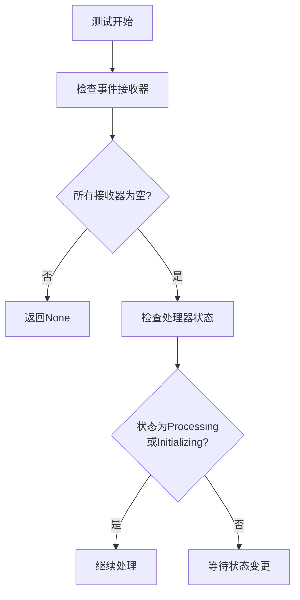

+++
title = "#21943 Reduce the flakiness of asset processing tests."
date = "2025-11-26T00:00:00"
draft = false
template = "pull_request_page.html"
in_search_index = false

[extra]
current_language = "zh-cn"
available_languages = {"en" = { name = "English", url = "/pull_request/bevy/2025-11/pr-21943-en-20251126" }, "zh-cn" = { name = "中文", url = "/pull_request/bevy/2025-11/pr-21943-zh-cn-20251126" }}
+++

# Title

## Basic Information
- **Title**: Reduce the flakiness of asset processing tests.
- **PR Link**: https://github.com/bevyengine/bevy/pull/21943
- **作者**: andriyDev
- **状态**: 已合并
- **标签**: D-Trivial, A-Assets, S-Ready-For-Final-Review, C-Testing
- **创建时间**: 2025-11-26T03:01:45Z
- **合并时间**: 2025-11-26T04:28:15Z
- **合并者**: alice-i-cecile

## 描述翻译

# 目标

- 处理器测试可能存在不稳定性。这种情况似乎只在使用热重载时发生。

## 解决方案

- 在考虑处理是否处于 Processing 状态之前，确保所有资产接收通道都是空的。

我不能 100% 确定这不会引入竞态条件，但可能性肯定小得多。从技术上讲，事件监听线程可能接收到事件，但需要太长时间才能实际对处理器状态进行更改，但这通常应该是一个很窄的时间窗口。

## 测试

我在本地机器上多次运行此测试，之后没有再看到不稳定的情况。

## 这个 Pull Request 的故事

这个 PR 解决了一个在 Bevy 资产处理测试中出现的间歇性测试失败问题。问题的核心在于测试代码在检查处理器状态时存在竞态条件。

**问题分析**

在资产处理系统中，多个组件通过事件通道进行通信。当测试代码检查处理器是否处于 `Processing` 或 `Initializing` 状态时，可能存在这样的情况：处理器已经发出了状态变更的信号，但相关的处理事件仍在通道中排队，尚未被完全处理。这导致了测试的不稳定性，特别是在使用热重载功能时，这种情况更加明显。

**解决方案设计**

开发者采取了一个直接而有效的方法：在检查处理器状态之前，先确保所有事件接收通道都是空的。这样可以避免在事件处理尚未完成时就误判处理器状态。

具体实现是在 `run_app_until_finished_processing` 函数中添加了一个检查循环：

```rust
// Before we even consider whether the processor is started, make sure that none of the
// receivers have anything left in them. This prevents us accidentally, considering the
// processor as processing before all the events have been processed.
for source in processor.sources().iter() {
    let Some(recv) = source.event_receiver() else {
        continue;
    };
    if !recv.is_empty() {
        return None;
    }
}
```

**技术实现细节**

这个解决方案的关键在于理解 Bevy 资产处理器的内部工作机制。资产处理器通过多个源(source)来管理不同类型的资产，每个源都有自己的事件接收器(event receiver)。测试代码需要等待所有源的事件都被处理完毕后，才能准确判断处理器的状态。

添加的代码执行以下操作：
1. 遍历处理器的所有源
2. 获取每个源的事件接收器
3. 检查接收器是否为空
4. 如果任何接收器不为空，就返回 `None`，表示条件尚未满足

这种方法的优势在于它直接解决了问题的根源——事件处理的时序问题，而不是通过增加固定的延迟或其他不可靠的等待机制。

**工程权衡**

开发者明确指出了这个解决方案的局限性：虽然大大减少了竞态条件的可能性，但不能完全消除。在极少数情况下，如果事件监听线程接收了事件但花费过长时间来更新处理器状态，仍然可能出现问题。不过，这个时间窗口非常窄，在实际测试中已经足够稳定。

**测试验证**

开发者通过反复运行测试来验证解决方案的有效性。在本地机器上进行多次测试后，没有再出现不稳定的测试失败，证明了这种方法的有效性。

## 可视化表示



## 关键文件变更

- `crates/bevy_asset/src/processor/tests.rs` (+11/-0)

这个文件包含了测试工具函数的改进。关键的变更是在 `run_app_until_finished_processing` 函数中添加了对事件接收器的检查逻辑。

```rust
// 新增的代码段：
// Before we even consider whether the processor is started, make sure that none of the
// receivers have anything left in them. This prevents us accidentally, considering the
// processor as processing before all the events have been processed.
for source in processor.sources().iter() {
    let Some(recv) = source.event_receiver() else {
        continue;
    };
    if !recv.is_empty() {
        return None;
    }
}
```

这个变更通过确保所有事件都被处理后再检查处理器状态，解决了测试中的竞态条件问题。

## 进一步阅读

- [Bevy 资产系统文档](https://bevyengine.org/learn/books/assets/)
- [Rust 并发编程指南](https://doc.rust-lang.org/book/ch16-00-concurrency.html)
- [软件测试中的竞态条件处理](https://en.wikipedia.org/wiki/Race_condition#In_software)

# Full Code Diff
```diff
diff --git a/crates/bevy_asset/src/processor/tests.rs b/crates/bevy_asset/src/processor/tests.rs
index 68941836e7d7c..b31abb47bba02 100644
--- a/crates/bevy_asset/src/processor/tests.rs
+++ b/crates/bevy_asset/src/processor/tests.rs
@@ -267,6 +267,17 @@ fn run_app_until_finished_processing(app: &mut App, guard: RwLockWriteGuard<'_,
     // finished before, but now that something has changed, we may not have restarted processing
     // yet. So wait for processing to start, then finish.
     run_app_until(app, |_| {
+        // Before we even consider whether the processor is started, make sure that none of the
+        // receivers have anything left in them. This prevents us accidentally, considering the
+        // processor as processing before all the events have been processed.
+        for source in processor.sources().iter() {
+            let Some(recv) = source.event_receiver() else {
+                continue;
+            };
+            if !recv.is_empty() {
+                return None;
+            }
+        }
         let state = bevy_tasks::block_on(processor.get_state());
         (state == ProcessorState::Processing || state == ProcessorState::Initializing).then_some(())
     });
```