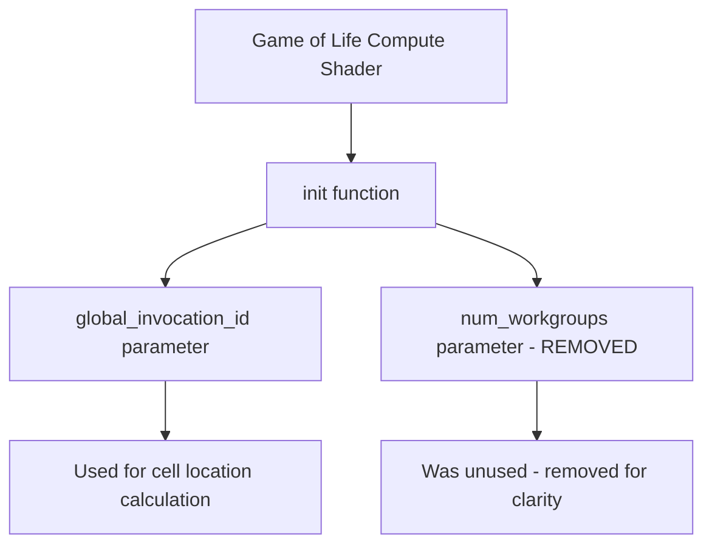

+++
title = "#21944 Remove unused `num_workgroups` from game_of_life shader"
date = "2025-11-26T00:00:00"
draft = false
template = "pull_request_page.html"
in_search_index = true

[taxonomies]
list_display = ["show"]

[extra]
current_language = "en"
available_languages = {"en" = { name = "English", url = "/pull_request/bevy/2025-11/pr-21944-en-20251126" }, "zh-cn" = { name = "中文", url = "/pull_request/bevy/2025-11/pr-21944-zh-cn-20251126" }}
labels = ["A-Rendering", "C-Code-Quality"]
+++

# Title

## Basic Information
- **Title**: Remove unused `num_workgroups` from game_of_life shader
- **PR Link**: https://github.com/bevyengine/bevy/pull/21944
- **Author**: shunkie
- **Status**: MERGED
- **Labels**: A-Rendering, C-Code-Quality, S-Ready-For-Final-Review
- **Created**: 2025-11-26T03:38:08Z
- **Merged**: 2025-11-26T04:28:15Z
- **Merged By**: alice-i-cecile

## Description Translation
# Objective

Remove unused `num_workgroups`.

## Testing

```
cargo run --example compute_shader_game_of_life
```

## The Story of This Pull Request

This PR addresses a straightforward code quality issue in Bevy's compute shader implementation for the Game of Life example. The problem was an unused parameter in the shader code that served no functional purpose but could potentially confuse developers reading or maintaining the code.

The core issue was in the `game_of_life.wgsl` shader file, where the `init` function declared a `num_workgroups` parameter but never actually used it in the function body. This is a common type of code quality issue that occurs when parameters are added during development but later become obsolete as the implementation evolves.

The solution approach was minimal and surgical: simply remove the unused parameter declaration from the function signature. This type of cleanup is important for several reasons. First, it eliminates potential confusion for developers who might wonder why the parameter exists and whether it serves some hidden purpose. Second, it follows the principle of keeping interfaces minimal and only including what's actually needed. Third, it prevents potential compiler warnings or static analysis tool alerts about unused variables.

Looking at the implementation details, the change was made to the compute shader's entry point:

```wgsl
// Before:
fn init(@builtin(global_invocation_id) invocation_id: vec3<u32>, @builtin(num_workgroups) num_workgroups: vec3<u32>)

// After:
fn init(@builtin(global_invocation_id) invocation_id: vec3<u32>)
```

The `@builtin(num_workgroups)` attribute was fetching the number of workgroups in the dispatch, but since this information wasn't being used in the initialization logic, it was safe to remove. The function continued to use only the `global_invocation_id` to determine which cell to initialize.

From a technical perspective, this change demonstrates good shader programming practices. In WGSL (WebGPU Shading Language), unnecessary parameters can potentially impact performance by consuming additional resources or complicating the shader interface. While the performance impact in this specific case was likely minimal, maintaining clean shader code is particularly important because shaders run on specialized hardware where resource constraints are more significant than on CPUs.

The testing approach was appropriate for this type of change. Running the `compute_shader_game_of_life` example verified that the shader still compiled and executed correctly without the unused parameter. Since this was a pure removal of dead code, no behavioral changes were expected, and the existing test coverage was sufficient to validate the change.

This PR serves as a good example of proactive code maintenance. Even though the unused parameter wasn't causing any functional issues, removing it improves code clarity and follows established software engineering best practices. It also demonstrates the value of periodic code reviews and static analysis to identify and eliminate dead code.

## Visual Representation



## Key Files Changed

### `assets/shaders/game_of_life.wgsl` (+1/-1)

This is the compute shader for the Game of Life example. The change removed an unused parameter from the `init` function.

**Key modifications:**
```wgsl
// Before:
fn init(@builtin(global_invocation_id) invocation_id: vec3<u32>, @builtin(num_workgroups) num_workgroups: vec3<u32>) {

// After:
fn init(@builtin(global_invocation_id) invocation_id: vec3<u32>) {
```

The `num_workgroups` parameter was declared with the `@builtin` attribute but was never used in the function body. The function only needed the `global_invocation_id` to calculate cell positions for initialization. This change simplifies the function interface and removes dead code.

## Further Reading

- [WGSL Specification - Built-in Values](https://www.w3.org/TR/WGSL/#builtin-values) - Documentation on built-in variables like `global_invocation_id` and `num_workgroups`
- [Bevy Compute Shaders Guide](https://bevyengine.org/learn/quick-start/next-steps/compute/) - Official Bevy documentation on compute shaders
- [WebGPU Shading Language (WGSL)](https://gpuweb.github.io/gpuweb/wgsl/) - Complete WGSL language specification
- [Code Quality Best Practices](https://google.github.io/eng-practices/review/reviewer/looking-for.html#unused-code) - Guidelines on identifying and removing unused code