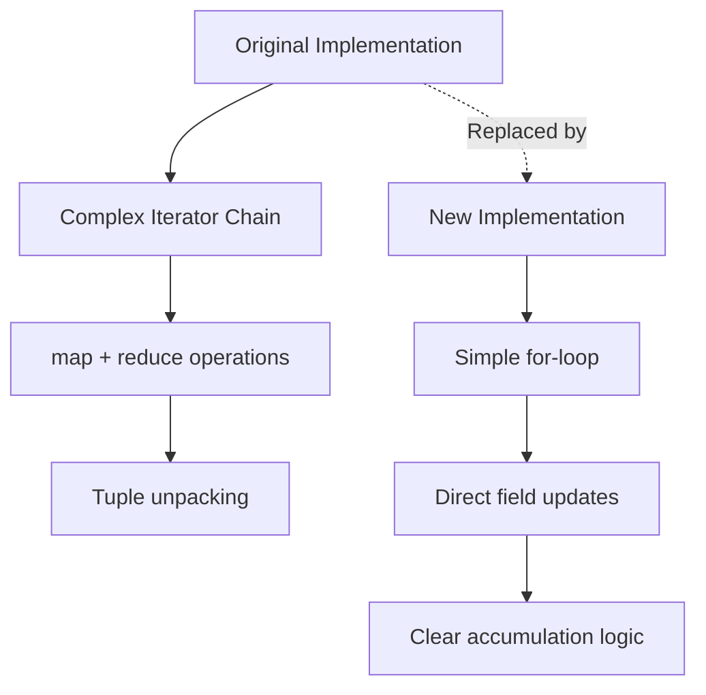

+++
title = "#21957 `buffer_dimensions` simplification"
date = "2025-11-28T00:00:00"
draft = false
template = "pull_request_page.html"
in_search_index = true

[taxonomies]
list_display = ["show"]

[extra]
current_language = "en"
available_languages = {"en" = { name = "English", url = "/pull_request/bevy/2025-11/pr-21957-en-20251128" }, "zh-cn" = { name = "中文", url = "/pull_request/bevy/2025-11/pr-21957-zh-cn-20251128" }}
labels = ["D-Trivial", "C-Code-Quality", "A-Text"]
+++

# Title
`buffer_dimensions` simplification

## Basic Information
- **Title**: `buffer_dimensions` simplification
- **PR Link**: https://github.com/bevyengine/bevy/pull/21957
- **Author**: ickshonpe
- **Status**: MERGED
- **Labels**: D-Trivial, C-Code-Quality, A-Text, S-Needs-Review
- **Created**: 2025-11-27T11:29:38Z
- **Merged**: 2025-11-28T08:06:19Z
- **Merged By**: mockersf

## Description Translation
# Objective

```rust
/// Calculate the size of the text area for the given buffer.
fn buffer_dimensions(buffer: &Buffer) -> Vec2 {
    let (width, height) = buffer
        .layout_runs()
        .map(|run| (run.line_w, run.line_height))
        .reduce(|(w1, h1), (w2, h2)| (w1.max(w2), h1 + h2))
        .unwrap_or((0.0, 0.0));

    Vec2::new(width, height).ceil()
}
```

This function is unnecessarily complicated, there's no need to map and then reduce, it could just use a fold.

## Solution

A for-loop seems like the most straightforward solution:

```rust
/// Calculate the size of the text area for the given buffer.
fn buffer_dimensions(buffer: &Buffer) -> Vec2 {
    let mut size = Vec2::ZERO;
    for run in buffer.layout_runs() {
        size.x = size.x.max(run.line_w);
        size.y += run.line_height;
    }
    size.ceil()
}
```

Naive benchmarks suggest this is a bit more efficient as well, but the difference is quite small.

## Testing

`testbed_ui`'s output remaining unchanged should be enough to verify that this is correct.

## The Story of This Pull Request

This PR addresses a code quality improvement in Bevy's text rendering pipeline. The core issue was a `buffer_dimensions` function that used a complex functional programming approach when a simpler imperative solution would be more readable and slightly more efficient.

The original implementation used a chain of iterator operations - `map` followed by `reduce` - to calculate the dimensions of a text buffer. While functional in style, this approach required understanding multiple iterator transformations and a reduction operation that combined width and height calculations in a non-obvious way. The `reduce` operation was particularly complex because it had to handle both finding the maximum width across all lines while summing the heights.

The solution replaces this with a straightforward for-loop that iterates through each layout run in the buffer. For each run, it updates the maximum width and accumulates the total height. This approach is more immediately understandable because it follows conventional imperative programming patterns that most Rust developers are familiar with.

From a performance perspective, the author mentions that naive benchmarks showed a slight improvement, though the difference was minimal. This makes sense because the for-loop eliminates the intermediate iterator transformations and tuple allocations that occurred in the functional approach.

The testing approach was pragmatic - verifying that the `testbed_ui` output remained unchanged was sufficient to confirm the correctness of the refactor. This demonstrates that the change was purely an internal implementation improvement with no behavioral changes.

This refactor exemplifies good software engineering practices: simplifying complex code, choosing clarity over cleverness, and maintaining the same external behavior while improving internal implementation. The change makes the code more maintainable and easier for other developers to understand without sacrificing performance.

## Visual Representation



## Key Files Changed

**File**: `crates/bevy_text/src/pipeline.rs` (+6/-7)

This file contains the text rendering pipeline for Bevy. The change focuses on the `buffer_dimensions` function which calculates the bounding dimensions of text buffers.

**Before:**
```rust
/// Calculate the size of the text area for the given buffer.
fn buffer_dimensions(buffer: &Buffer) -> Vec2 {
    let (width, height) = buffer
        .layout_runs()
        .map(|run| (run.line_w, run.line_height))
        .reduce(|(w1, h1), (w2, h2)| (w1.max(w2), h1 + h2))
        .unwrap_or((0.0, 0.0));

    Vec2::new(width, height).ceil()
}
```

**After:**
```rust
/// Calculate the size of the text area for the given buffer.
fn buffer_dimensions(buffer: &Buffer) -> Vec2 {
    let mut size = Vec2::ZERO;
    for run in buffer.layout_runs() {
        size.x = size.x.max(run.line_w);
        size.y += run.line_height;
    }
    size.ceil()
}
```

The key changes:
- Replaced iterator chain with a simple for-loop
- Eliminated tuple unpacking and intermediate transformations
- Used direct field updates on a `Vec2` struct
- Maintained the same ceiling operation for final dimensions

## Further Reading

- [Rust Iterator Documentation](https://doc.rust-lang.org/std/iter/trait.Iterator.html) - Understanding iterator methods like `map` and `reduce`
- [Bevy Text Rendering](https://bevyengine.org/learn/quick-start/2d/text/) - Bevy's text rendering system
- [Rust Performance Guide](https://nnethercote.github.io/perf-book/) - Performance considerations in Rust code
- [Code Clarity Principles](https://rust-lang.github.io/api-guidelines/understandability.html) - Rust API guidelines on writing clear, understandable code

# Full Code Diff
```diff
diff --git a/crates/bevy_text/src/pipeline.rs b/crates/bevy_text/src/pipeline.rs
index cd40cdab2a011..0289b78dcdfa9 100644
--- a/crates/bevy_text/src/pipeline.rs
+++ b/crates/bevy_text/src/pipeline.rs
@@ -678,13 +678,12 @@ fn get_attrs<'a>(
 
 /// Calculate the size of the text area for the given buffer.
 fn buffer_dimensions(buffer: &Buffer) -> Vec2 {
-    let (width, height) = buffer
-        .layout_runs()
-        .map(|run| (run.line_w, run.line_height))
-        .reduce(|(w1, h1), (w2, h2)| (w1.max(w2), h1 + h2))
-        .unwrap_or((0.0, 0.0));
-
-    Vec2::new(width, height).ceil()
+    let mut size = Vec2::ZERO;
+    for run in buffer.layout_runs() {
+        size.x = size.x.max(run.line_w);
+        size.y += run.line_height;
+    }
+    size.ceil()
 }
 
 /// Discards stale data cached in `FontSystem`.
```