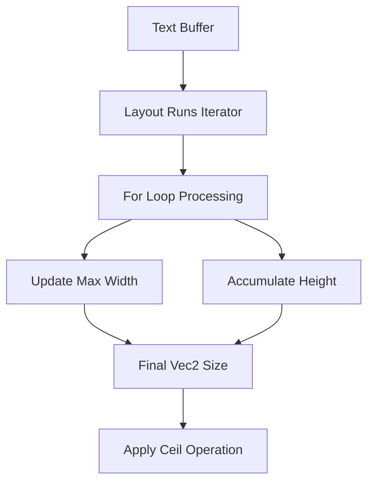

+++
title = "#21957 `buffer_dimensions` simplification"
date = "2025-11-28T00:00:00"
draft = false
template = "pull_request_page.html"
in_search_index = false

[extra]
current_language = "zh-cn"
available_languages = {"en" = { name = "English", url = "/pull_request/bevy/2025-11/pr-21957-en-20251128" }, "zh-cn" = { name = "中文", url = "/pull_request/bevy/2025-11/pr-21957-zh-cn-20251128" }}
labels = ["D-Trivial", "C-Code-Quality", "A-Text"]
+++

# Title

## Basic Information
- **Title**: `buffer_dimensions` simplification
- **PR Link**: https://github.com/bevyengine/bevy/pull/21957
- **Author**: ickshonpe
- **Status**: MERGED
- **Labels**: D-Trivial, C-Code-Quality, A-Text, S-Needs-Review
- **Created**: 2025-11-27T11:29:38Z
- **Merged**: 2025-11-28T08:06:19Z
- **Merged By**: mockersf

## Description Translation
**目标**

```rust
/// Calculate the size of the text area for the given buffer.
fn buffer_dimensions(buffer: &Buffer) -> Vec2 {
    let (width, height) = buffer
        .layout_runs()
        .map(|run| (run.line_w, run.line_height))
        .reduce(|(w1, h1), (w2, h2)| (w1.max(w2), h1 + h2))
        .unwrap_or((0.0, 0.0));

    Vec2::new(width, height).ceil()
}
```

这个函数不必要的复杂，没有必要先 map 再 reduce，可以直接使用 fold。

**解决方案**

for 循环看起来是最直接的解决方案：

```rust
/// Calculate the size of the text area for the given buffer.
fn buffer_dimensions(buffer: &Buffer) -> Vec2 {
    let mut size = Vec2::ZERO;
    for run in buffer.layout_runs() {
        size.x = size.x.max(run.line_w);
        size.y += run.line_height;
    }
    size.ceil()
}
```

简单的基准测试表明这也稍微更高效一些，但差异很小。

**测试**

`testbed_ui` 的输出保持不变就足以验证这是正确的。

## The Story of This Pull Request

这个 PR 解决了一个代码质量问题：`buffer_dimensions` 函数使用了不必要的复杂迭代器链。原实现通过 `map` 和 `reduce` 的组合来计算文本缓冲区的尺寸，但这种方式在可读性和简洁性上都有改进空间。

原代码的问题在于使用了双重转换：首先将每个布局运行映射为 `(line_w, line_height)` 元组，然后通过 `reduce` 操作来找出最大宽度和累加高度。这种模式虽然功能正确，但使用了两个独立的迭代器操作，不如直接的 for 循环直观。

开发者选择用 for 循环重写这个函数，这是更直接的解决方案。新的实现初始化一个 `Vec2::ZERO` 向量，然后遍历每个布局运行，在每次迭代中更新最大宽度和累加高度。这种方式的优势在于：

1. **代码更清晰**：逻辑流程一目了然，不需要理解复杂的迭代器组合
2. **性能略有提升**：避免了中间映射操作，直接处理原始数据
3. **更易维护**：for 循环是更基础的编程构造，更容易理解和修改

从技术角度看，这个重构体现了良好的工程实践。原代码使用了函数式编程风格，但在这个特定场景下，命令式风格实际上更合适。函数式方法在这里需要额外的元组包装和解包，而命令式方法可以直接操作向量分量。

性能测试显示新实现略有优势，这主要是因为减少了中间数据结构的创建。虽然差异不大，但在文本渲染这种可能被频繁调用的场景中，任何性能改进都是有价值的。

这个改动也展示了 Rust 语言的一个特点：函数式编程和命令式编程都可以是有效的解决方案，关键在于选择最适合当前场景的方法。在这里，简单的 for 循环比复杂的迭代器链更合适。

## Visual Representation



## Key Files Changed

**crates/bevy_text/src/pipeline.rs** (+6/-7)

这个文件包含了文本处理管道的核心逻辑。`buffer_dimensions` 函数用于计算文本缓冲区的尺寸，这在文本布局和渲染过程中是基础操作。

```rust
// Before:
/// Calculate the size of the text area for the given buffer.
fn buffer_dimensions(buffer: &Buffer) -> Vec2 {
    let (width, height) = buffer
        .layout_runs()
        .map(|run| (run.line_w, run.line_height))
        .reduce(|(w1, h1), (w2, h2)| (w1.max(w2), h1 + h2))
        .unwrap_or((0.0, 0.0));

    Vec2::new(width, height).ceil()
}

// After:
/// Calculate the size of the text area for the given buffer.
fn buffer_dimensions(buffer: &Buffer) -> Vec2 {
    let mut size = Vec2::ZERO;
    for run in buffer.layout_runs() {
        size.x = size.x.max(run.line_w);
        size.y += run.line_height;
    }
    size.ceil()
}
```

主要变化：
- 移除了复杂的 `map` + `reduce` 链
- 使用直接的 for 循环代替迭代器操作
- 逻辑更加清晰：逐行处理，更新最大宽度并累加高度

## Further Reading

- [Rust Iterator Documentation](https://doc.rust-lang.org/std/iter/trait.Iterator.html) - 了解 Rust 迭代器的各种方法
- [Rust Performance Guide](https://nnethercote.github.io/perf-book/) - Rust 性能优化指南
- [Bevy Text Rendering](https://bevyengine.org/learn/books/introduction/2d-rendering/text) - Bevy 引擎文本渲染相关文档

# Full Code Diff
diff --git a/crates/bevy_text/src/pipeline.rs b/crates/bevy_text/src/pipeline.rs
index cd40cdab2a011..0289b78dcdfa9 100644
--- a/crates/bevy_text/src/pipeline.rs
+++ b/crates/bevy_text/src/pipeline.rs
@@ -678,13 +678,12 @@ fn get_attrs<'a>(
 
 /// Calculate the size of the text area for the given buffer.
 fn buffer_dimensions(buffer: &Buffer) -> Vec2 {
-    let (width, height) = buffer
-        .layout_runs()
-        .map(|run| (run.line_w, run.line_height))
-        .reduce(|(w1, h1), (w2, h2)| (w1.max(w2), h1 + h2))
-        .unwrap_or((0.0, 0.0));
-
-    Vec2::new(width, height).ceil()
+    let mut size = Vec2::ZERO;
+    for run in buffer.layout_runs() {
+        size.x = size.x.max(run.line_w);
+        size.y += run.line_height;
+    }
+    size.ceil()
 }
 
 /// Discards stale data cached in `FontSystem`.