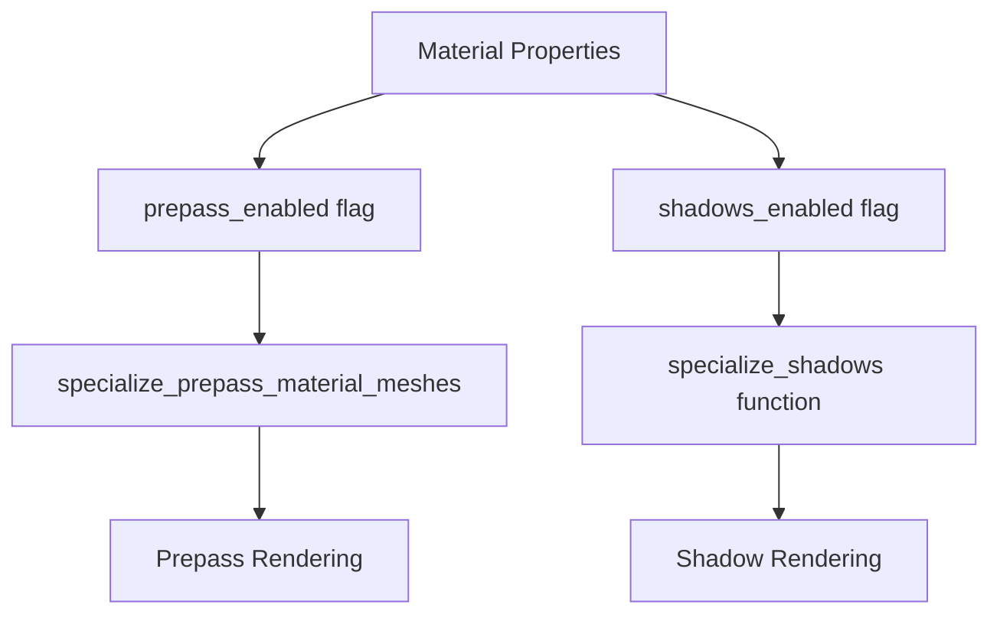

+++
title = "#21961 Don't render meshes that have prepass disabled to the prepass, even if they have shadows enabled."
date = "2025-11-28T00:00:00"
draft = false
template = "pull_request_page.html"
in_search_index = true

[taxonomies]
list_display = ["show"]

[extra]
current_language = "en"
available_languages = {"en" = { name = "English", url = "/pull_request/bevy/2025-11/pr-21961-en-20251128" }, "zh-cn" = { name = "中文", url = "/pull_request/bevy/2025-11/pr-21961-zh-cn-20251128" }}
labels = ["C-Bug", "A-Rendering", "D-Straightforward"]
+++

# Title

## Basic Information
- **Title**: Don't render meshes that have prepass disabled to the prepass, even if they have shadows enabled.
- **PR Link**: https://github.com/bevyengine/bevy/pull/21961
- **Author**: pcwalton
- **Status**: MERGED
- **Labels**: C-Bug, A-Rendering, D-Straightforward, S-Needs-Review
- **Created**: 2025-11-28T00:28:47Z
- **Merged**: 2025-11-28T08:04:14Z
- **Merged By**: mockersf

## Description Translation
Currently, the `specialize_prepass_material_meshes` function adds meshes to the prepass unless both `prepass_enabled` *and* `shadows_enabled` are false for that material. This seems incorrect, as (1) the flags are separate for a reason and (2) meshes are added to the shadow pass not in `specialize_prepass_material_meshes` but in `specialize_shadows`.

This patch changes `specialize_prepass_material_meshes` to skip adding meshes to the prepass if `prepass_enabled` is false, even if `shadows_enabled` is true.

## The Story of This Pull Request

This PR addresses a logical inconsistency in Bevy's rendering pipeline where material flags were being interpreted incorrectly during the prepass specialization phase. The core issue stemmed from how the `specialize_prepass_material_meshes` function was making decisions about which meshes to include in the prepass render pipeline.

In the original implementation, the function used a compound condition that checked both `prepass_enabled` AND `shadows_enabled` flags:

```rust
if !material.properties.prepass_enabled && !material.properties.shadows_enabled {
    // Skip this mesh for prepass
}
```

This logic was problematic because it meant that a mesh with `prepass_enabled: false` but `shadows_enabled: true` would still be included in the prepass. This didn't align with the intended separation of concerns between the two rendering passes.

The fix was straightforward but important - changing the condition to only check the `prepass_enabled` flag:

```rust
if !material.properties.prepass_enabled {
    // Skip this mesh for prepass
}
```

This change makes logical sense because the prepass specialization function should only care about whether prepass is enabled for a material. The shadow rendering logic is handled separately in the `specialize_shadows` function, which correctly uses the `shadows_enabled` flag to determine which meshes to include in shadow passes.

The bug had performance implications because it caused unnecessary rendering work. Meshes that didn't need prepass rendering were still being processed through the prepass pipeline, wasting GPU resources and potentially affecting frame times. This was particularly problematic for scenes with many objects where the prepass overhead could become significant.

The fix demonstrates good separation of concerns in rendering systems - each specialization function should focus on its specific rendering pass and use only the relevant flags for decision making. This aligns with Bevy's modular architecture where different rendering features can be enabled or disabled independently.

## Visual Representation



## Key Files Changed

- `crates/bevy_pbr/src/prepass/mod.rs` (+1/-1)

This file contains the core change that fixes the logical inconsistency in prepass material specialization.

```rust
// File: crates/bevy_pbr/src/prepass/mod.rs
// Before:
if !material.properties.prepass_enabled && !material.properties.shadows_enabled {
    // If the material was previously specialized for prepass, remove it
    view_specialized_material_pipeline_cache.remove(visible_entity);
    continue;
}

// After:
if !material.properties.prepass_enabled {
    // If the material was previously specialized for prepass, remove it
    view_specialized_material_pipeline_cache.remove(visible_entity);
    continue;
}
```

The change is minimal but significant - it removes the unnecessary check for `shadows_enabled` in the prepass specialization logic. This ensures that meshes are only included in the prepass if they explicitly have prepass enabled, regardless of their shadow configuration.

## Further Reading

- [Bevy Rendering Documentation](https://bevyengine.org/learn/book/rendering/)
- [Prepass Rendering in Bevy](https://bevyengine.org/learn/book/rendering/prepass/)
- [Material Properties in Bevy PBR](https://github.com/bevyengine/bevy/blob/main/crates/bevy_pbr/src/material.rs)