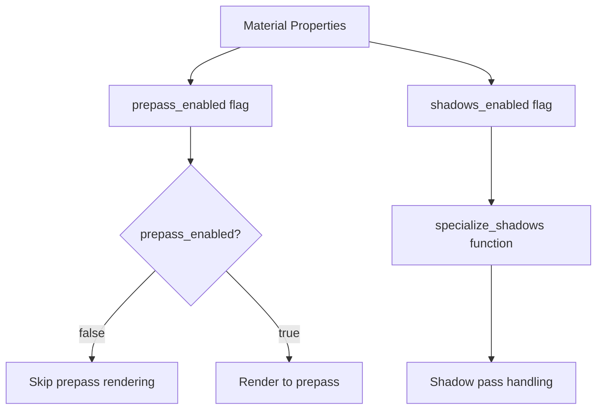

+++
title = "#21961 Don't render meshes that have prepass disabled to the prepass, even if they have shadows enabled."
date = "2025-11-28T00:00:00"
draft = false
template = "pull_request_page.html"
in_search_index = false

[extra]
current_language = "zh-cn"
available_languages = {"en" = { name = "English", url = "/pull_request/bevy/2025-11/pr-21961-en-20251128" }, "zh-cn" = { name = "中文", url = "/pull_request/bevy/2025-11/pr-21961-zh-cn-20251128" }}
labels = ["C-Bug", "A-Rendering", "D-Straightforward"]
+++

# Title

## Basic Information
- **Title**: Don't render meshes that have prepass disabled to the prepass, even if they have shadows enabled.
- **PR Link**: https://github.com/bevyengine/bevy/pull/21961
- **Author**: pcwalton
- **Status**: MERGED
- **Labels**: C-Bug, A-Rendering, D-Straightforward, S-Needs-Review
- **Created**: 2025-11-28T00:28:47Z
- **Merged**: 2025-11-28T08:04:14Z
- **Merged By**: mockersf

## Description Translation
当前，`specialize_prepass_material_meshes` 函数会将网格添加到预通道（prepass），除非该材质的 `prepass_enabled` *和* `shadows_enabled` 同时为 false。这看起来是不正确的，因为 (1) 这些标志是分开设置的，有各自的原因；(2) 网格被添加到阴影通道（shadow pass）不是在 `specialize_prepass_material_meshes` 中处理的，而是在 `specialize_shadows` 中。

本补丁修改了 `specialize_prepass_material_meshes`，使其在 `prepass_enabled` 为 false 时跳过将网格添加到预通道，即使 `shadows_enabled` 为 true。

## The Story of This Pull Request

这个 PR 解决了一个 Bevy 渲染系统中关于预通道（prepass）和阴影处理逻辑分离的问题。问题的核心在于两个独立的渲染功能标志被错误地耦合在一起。

在 Bevy 的 PBR 渲染管线中，预通道和阴影通道是两个不同的渲染阶段。预通道用于生成各种中间纹理（如法线、深度、运动矢量等），而阴影通道专门处理阴影计算。这两个通道有各自独立的启用标志：`prepass_enabled` 和 `shadows_enabled`。

问题的根源在于 `specialize_prepass_material_meshes` 函数中的条件判断逻辑。原来的代码使用了错误的逻辑组合：

```rust
// 原来的错误逻辑
if !material.properties.prepass_enabled && !material.properties.shadows_enabled {
    // 跳过预通道处理
    continue;
}
```

这个条件意味着只有当材质的预通道和阴影都禁用时，才会跳过预通道处理。如果材质禁用了预通道但启用了阴影，网格仍然会被添加到预通道中，这是不正确的。

从架构设计的角度看，预通道专门化函数应该只关心预通道相关的标志。阴影的处理应该在专门的阴影专门化函数中处理，这正是 `specialize_shadows` 函数的作用。

修复方案很简单但很关键：

```rust
// 修复后的正确逻辑
if !material.properties.prepass_enabled {
    // 跳过预通道处理
    continue;
}
```

现在，逻辑变得清晰：如果材质禁用了预通道，无论阴影设置如何，都不应该参与预通道渲染。阴影的启用状态只影响阴影通道的处理，这由 `specialize_shadows` 函数单独处理。

这种分离符合单一职责原则（Single Responsibility Principle）。预通道专门化函数只负责预通道相关的决策，阴影专门化函数只负责阴影相关的决策。两个系统通过各自的标志独立控制，互不干扰。

从性能角度来看，这个修复避免了不必要的渲染工作。如果一个材质禁用了预通道但启用了阴影，现在它不会在预通道阶段进行任何处理，减少了 GPU 的工作负载。这虽然可能不是巨大的性能提升，但遵循了"不做不必要的工作"的优化原则。

这个修复也体现了良好的 API 设计原则。当开发者设置 `prepass_enabled = false` 时，他们期望网格确实不会出现在预通道中，无论其他设置如何。之前的实现违背了这个期望，现在修复后行为与 API 设计意图保持一致。

## Visual Representation



## Key Files Changed

### `crates/bevy_pbr/src/prepass/mod.rs` (+1/-1)

这个文件包含了修复预通道专门化逻辑的关键修改。修改位于 `specialize_prepass_material_meshes` 函数中，该函数负责决定哪些网格应该参与预通道渲染。

**修改前：**
```rust
if !material.properties.prepass_enabled && !material.properties.shadows_enabled {
    // If the material was previously specialized for prepass, remove it
    view_specialized_material_pipeline_cache.remove(visible_entity);
    continue;
}
```

**修改后：**
```rust
if !material.properties.prepass_enabled {
    // If the material was previously specialized for prepass, remove it
    view_specialized_material_pipeline_cache.remove(visible_entity);
    continue;
}
```

这个修改移除了对 `shadows_enabled` 标志的不必要检查，使预通道专门化逻辑只关注预通道相关的标志。这确保了当材质禁用预通道时，网格确实不会出现在预通道渲染中，无论阴影设置如何。

## Further Reading

- [Bevy Rendering Documentation](https://bevyengine.org/learn/book/rendering/) - Bevy 官方渲染文档
- [Deferred Rendering and Prepass Techniques](https://learnopengl.com/Advanced-Lighting/Deferred-Shading) - 延迟渲染和预通道技术详解
- [Single Responsibility Principle in Game Engines](https://gameprogrammingpatterns.com/component.html) - 游戏引擎中的单一职责原则