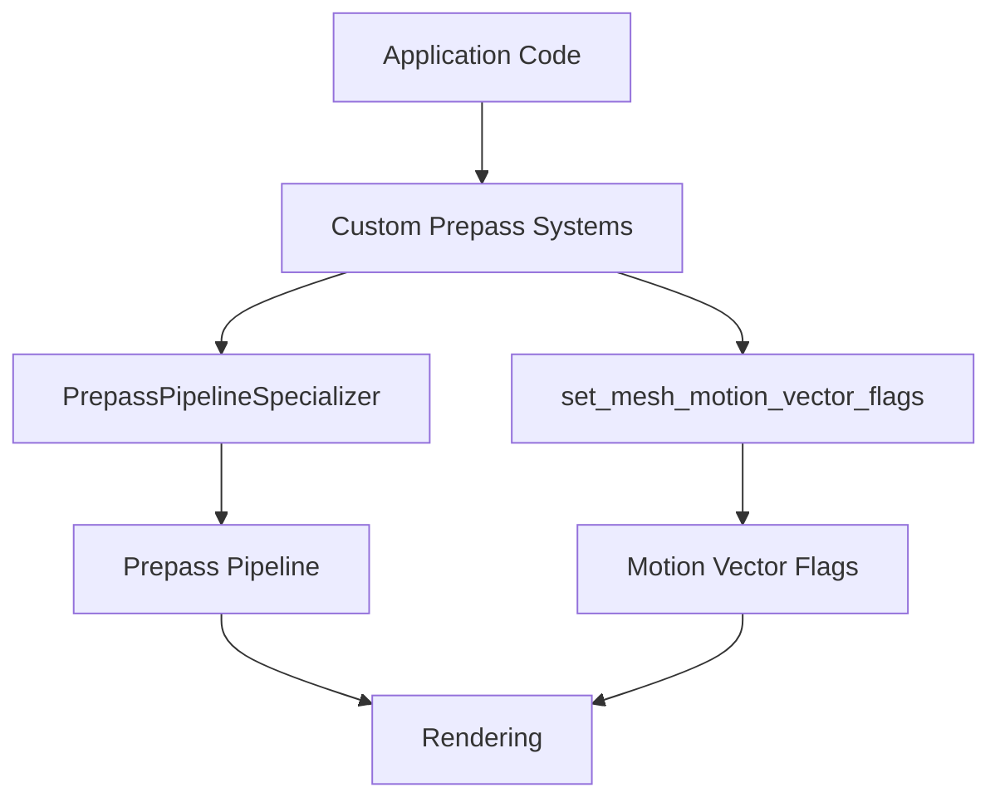

+++
title = "#21962 Make items public that are necessary to add custom prepasses in application code"
date = "2025-11-28T00:00:00"
draft = false
template = "pull_request_page.html"
in_search_index = true

[taxonomies]
list_display = ["show"]

[extra]
current_language = "en"
available_languages = {"en" = { name = "English", url = "/pull_request/bevy/2025-11/pr-21962-en-20251128" }, "zh-cn" = { name = "中文", url = "/pull_request/bevy/2025-11/pr-21962-zh-cn-20251128" }}
labels = ["A-Rendering"]
+++

# Title: Make items public that are necessary to add custom prepasses in application code

## Basic Information
- **Title**: Make items public that are necessary to add custom prepasses in application code
- **PR Link**: https://github.com/bevyengine/bevy/pull/21962
- **Author**: pcwalton
- **Status**: MERGED
- **Labels**: A-Rendering, S-Ready-For-Final-Review
- **Created**: 2025-11-28T00:31:23Z
- **Merged**: 2025-11-28T08:03:37Z
- **Merged By**: mockersf

## Description Translation
Currently, custom prepasses can't be easily added outside the `bevy_pbr` crate for two reasons:

1. The fields in `PrepassSpecializer` are private to the `bevy_pbr` crate, so a `PrepassSpecializer` can't be constructed. Furthermore, the `PrepassSpecializer::specialize` method itself calls private APIs, so a developer can't even copy and paste the `PrepassSpecializer` into application code.

2. The `set_mesh_motion_vector_flags` system is private, meaning that specialization systems for custom prepasses can't be ordered after it. This is a problem because those specialization systems may need to read the motion vector flags that that system sets.

This commit changes the fields in `PrepassSpecializer` to be public and also changes the `set_mesh_motion_vector_flags` system to be public.

## The Story of This Pull Request

This PR addresses a straightforward but important limitation in Bevy's prepass system architecture. The core issue was that developers working outside the `bevy_pbr` crate couldn't implement custom prepasses due to overly restrictive visibility modifiers on key components.

The problem manifested in two specific areas. First, the `PrepassPipelineSpecializer` struct had its fields marked as `pub(crate)`, making them inaccessible to application code. This meant external developers couldn't instantiate this struct, which is essential for creating custom prepass pipelines. Even if someone attempted to copy the implementation, they would hit further roadblocks because the `specialize` method relied on additional private APIs.

Second, the `set_mesh_motion_vector_flags` system function was also marked as `pub(crate)`. This created ordering constraints for custom prepass systems that needed to read motion vector flags set by this system. Without public access, developers couldn't properly sequence their custom systems in relation to this core functionality.

The solution implemented here is minimal and surgical - it simply changes visibility modifiers from `pub(crate)` to `pub` in two locations. This approach maintains all existing functionality while opening up the necessary extension points for external development. The changes don't alter any logic or behavior; they only adjust access control to enable broader usage.

From an architectural perspective, this change aligns with Bevy's philosophy of being extensible and modular. By making these components public, the engine acknowledges that prepass functionality shouldn't be locked within the core rendering crate. This allows for experimentation and customization at the application level without requiring modifications to the engine itself.

The implementation required no complex refactoring or architectural changes. The modifications are purely about API surface area, demonstrating how thoughtful visibility design can significantly impact a framework's extensibility. This pattern of identifying and exposing necessary extension points is common in well-designed engine architectures.

## Visual Representation



## Key Files Changed

### `crates/bevy_pbr/src/prepass/mod.rs`
This file contains the core prepass pipeline specialization logic. The change makes the `PrepassPipelineSpecializer` struct's fields publicly accessible.

```rust
// Before:
pub struct PrepassPipelineSpecializer {
    pub(crate) pipeline: PrepassPipeline,
    pub(crate) properties: Arc<MaterialProperties>,
}

// After:
pub struct PrepassPipelineSpecializer {
    pub pipeline: PrepassPipeline,
    pub properties: Arc<MaterialProperties>,
}
```

### `crates/bevy_pbr/src/render/mesh.rs`
This file handles mesh rendering functionality. The change makes the motion vector flag system publicly accessible.

```rust
// Before:
pub(crate) fn set_mesh_motion_vector_flags(
    mut render_mesh_instances: ResMut<RenderMeshInstances>,
    skin_uniforms: Res<SkinUniforms>,
    morph_indices: Res<MorphIndices>,

// After:
pub fn set_mesh_motion_vector_flags(
    mut render_mesh_instances: ResMut<RenderMeshInstances>,
    skin_uniforms: Res<SkinUniforms>,
    morph_indices: Res<MorphIndices>,
```

## Further Reading

- [Bevy Prepass Documentation](https://docs.rs/bevy/latest/bevy/core/prepass/index.html)
- [Rust Visibility and Privacy](https://doc.rust-lang.org/reference/visibility-and-privacy.html)
- [Bevy ECS System Ordering](https://bevy-cheatbook.github.io/programming/system-order.html)