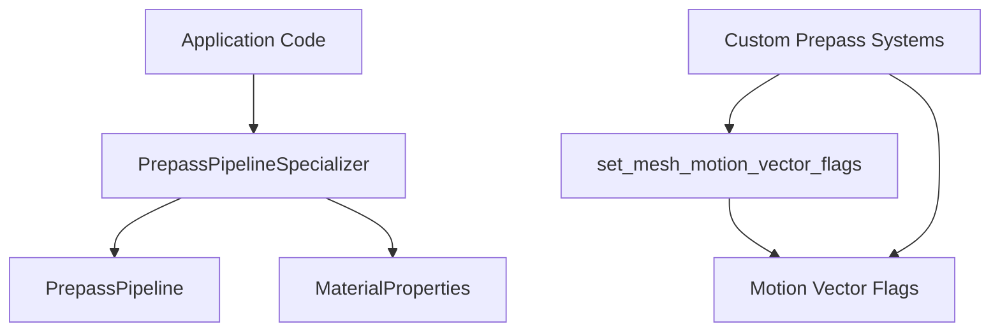

+++
title = "#21962 Make items public that are necessary to add custom prepasses in application code."
date = "2025-11-28T00:00:00"
draft = false
template = "pull_request_page.html"
in_search_index = false

[extra]
current_language = "zh-cn"
available_languages = {"en" = { name = "English", url = "/pull_request/bevy/2025-11/pr-21962-en-20251128" }, "zh-cn" = { name = "中文", url = "/pull_request/bevy/2025-11/pr-21962-zh-cn-20251128" }}
labels = ["A-Rendering"]
+++

# Make items public that are necessary to add custom prepasses in application code.

## Basic Information
- **Title**: Make items public that are necessary to add custom prepasses in application code.
- **PR Link**: https://github.com/bevyengine/bevy/pull/21962
- **Author**: pcwalton
- **Status**: MERGED
- **Labels**: A-Rendering, S-Ready-For-Final-Review
- **Created**: 2025-11-28T00:31:23Z
- **Merged**: 2025-11-28T08:03:37Z
- **Merged By**: mockersf

## Description Translation
目前，在 `bevy_pbr` crate 外部无法轻松添加自定义预通道，原因有二：

1. `PrepassSpecializer` 中的字段对 `bevy_pbr` crate 是私有的，因此无法构造 `PrepassSpecializer`。此外，`PrepassSpecializer::specialize` 方法本身调用了私有 API，因此开发者甚至无法将 `PrepassSpecializer` 复制粘贴到应用程序代码中。

2. `set_mesh_motion_vector_flags` 系统是私有的，这意味着自定义预通道的 specialization 系统无法在其之后排序。这是一个问题，因为这些 specialization 系统可能需要读取该系统设置的运动向量标志。

此提交将 `PrepassSpecializer` 中的字段改为公开，并将 `set_mesh_motion_vector_flags` 系统改为公开。

## The Story of This Pull Request

这个PR解决了一个在Bevy渲染系统中阻碍开发者扩展性的实际问题。问题的核心在于预通道系统的可扩展性受到限制，具体表现为两个技术障碍。

第一个问题是 `PrepassPipelineSpecializer` 结构体的访问权限限制。在修改前，该结构体的两个关键字段 `pipeline` 和 `properties` 都使用了 `pub(crate)` 可见性修饰符，这意味着它们只能在 `bevy_pbr` crate 内部访问。这种设计阻止了外部代码实例化这个结构体，即使开发者想要复制整个实现到自己的应用程序中，也会因为 `specialize` 方法调用了其他私有API而无法工作。

第二个问题涉及系统排序的约束。`set_mesh_motion_vector_flags` 系统负责设置网格的运动向量标志，这些标志对于后续的预通道处理至关重要。由于该系统是私有的，外部开发者无法在自定义的预通道系统中正确地排序依赖关系，导致无法访问这些必要的运动向量数据。

解决方案采用了直接而实用的方法：通过修改可见性修饰符来开放必要的接口。将 `PrepassPipelineSpecializer` 的字段从 `pub(crate)` 改为 `pub` 允许外部代码构造这个结构体。同时，将 `set_mesh_motion_vector_flags` 系统从 `pub(crate)` 改为 `pub` 使得外部系统可以依赖这个系统并正确排序。

从技术架构的角度看，这种修改遵循了最小权限原则的合理扩展。它没有改变任何现有的API行为，只是放宽了访问控制，为外部开发者提供了必要的构建模块。这种修改对于渲染管线的可扩展性至关重要，因为它允许开发者在不修改Bevy核心代码的情况下实现自定义的预通道效果。

这个修改的影响是显著的。现在，开发者可以在自己的应用程序中创建自定义的预通道管线，利用Bevy现有的预通道基础设施，同时添加特定于自己需求的渲染效果。这为高级渲染技术的实现打开了大门，比如自定义的后处理效果、特殊的材质处理，或者其他需要访问运动向量数据的渲染算法。

## Visual Representation



## Key Files Changed

### `crates/bevy_pbr/src/prepass/mod.rs`
这个文件修改了 `PrepassPipelineSpecializer` 结构体的可见性，使其字段对外部crate可用。

```rust
// Before:
pub struct PrepassPipelineSpecializer {
    pub(crate) pipeline: PrepassPipeline,
    pub(crate) properties: Arc<MaterialProperties>,
}

// After:
pub struct PrepassPipelineSpecializer {
    pub pipeline: PrepassPipeline,
    pub properties: Arc<MaterialProperties>,
}
```

### `crates/bevy_pbr/src/render/mesh.rs`
这个文件修改了 `set_mesh_motion_vector_flags` 系统的可见性，使其可以被外部系统使用和排序。

```rust
// Before:
pub(crate) fn set_mesh_motion_vector_flags(
    mut render_mesh_instances: ResMut<RenderMeshInstances>,
    skin_uniforms: Res<SkinUniforms>,
    morph_indices: Res<MorphIndices>,

// After:
pub fn set_mesh_motion_vector_flags(
    mut render_mesh_instances: ResMut<RenderMeshInstances>,
    skin_uniforms: Res<SkinUniforms>,
    morph_indices: Res<MorphIndices>,
```

## Further Reading

- [Bevy Prepass Rendering Documentation](https://bevyengine.org/learn/advanced-topics/prepass/)
- [Rust Visibility and Privacy](https://doc.rust-lang.org/reference/visibility-and-privacy.html)
- [Bevy ECS System Ordering](https://bevyengine.org/learn/advanced-topics/system-order/)
- [Motion Vectors in Computer Graphics](https://en.wikipedia.org/wiki/Motion_vector)