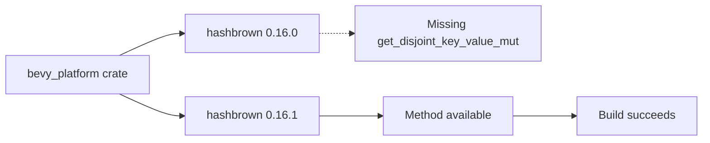

+++
title = "#21963 Update hashbrown to 0.16.1"
date = "2025-11-28T00:00:00"
draft = false
template = "pull_request_page.html"
in_search_index = true

[taxonomies]
list_display = ["show"]

[extra]
current_language = "en"
available_languages = {"en" = { name = "English", url = "/pull_request/bevy/2025-11/pr-21963-en-20251128" }, "zh-cn" = { name = "中文", url = "/pull_request/bevy/2025-11/pr-21963-zh-cn-20251128" }}
labels = ["D-Trivial", "C-Dependencies"]
+++

# Title
Update hashbrown to 0.16.1

## Basic Information
- **Title**: Update hashbrown to 0.16.1
- **PR Link**: https://github.com/bevyengine/bevy/pull/21963
- **Author**: Breakdown-Dog
- **Status**: MERGED
- **Labels**: D-Trivial, C-Dependencies
- **Created**: 2025-11-28T01:18:13Z
- **Merged**: 2025-11-28T08:02:30Z
- **Merged By**: mockersf

## Description Translation
# Objective

- `hashbrown` 0.16.0 does not provide `get_disjoint_key_value_mut()`, which is used in `crates\bevy_platform\src\collections\hash_map.rs`, We must update to hashbrown 0.16.1, which includes this method.

## Testing

- CI

---

## The Story of This Pull Request

This PR addresses a straightforward but critical dependency version mismatch issue in the Bevy engine. The problem emerged when the codebase began using the `get_disjoint_key_value_mut()` method from the hashbrown crate, but the declared dependency version (0.16.0) didn't actually contain this method.

The core issue was a build failure scenario: any developer or CI system trying to build Bevy would encounter compilation errors because the required API method wasn't available in the specified hashbrown version. This method provides safe concurrent access to multiple disjoint key-value pairs in a hash map, which is essential for certain performance-critical operations in the engine.

The solution approach was direct and minimal - simply updating the dependency version from 0.16.0 to 0.16.1. This version bump specifically includes the missing `get_disjoint_key_value_mut()` method that the codebase depends on. The fix required no code changes beyond the version specification, demonstrating how dependency management issues can sometimes be resolved with minimal intervention.

From a technical perspective, the `get_disjoint_key_value_mut()` method is particularly valuable because it allows safe mutable access to multiple entries in a hash map simultaneously, provided the keys are distinct. This eliminates the need for multiple separate lookups and provides compile-time safety guarantees against aliasing violations.

The impact of this change is immediate and practical: it restores build functionality without introducing any breaking changes or performance regressions. The fix is backward-compatible and maintains the same API surface while gaining access to the required functionality.

## Visual Representation



## Key Files Changed

### `crates/bevy_platform/Cargo.toml`

This file contains the dependency specification for the bevy_platform crate. The change updates the hashbrown dependency from version 0.16.0 to 0.16.1 to resolve a missing method dependency.

**Key modification:**
```toml
# Before:
hashbrown = { version = "0.16.0", features = [
  "equivalent",
  "raw-entry",
], optional = true, default-features = false }

# After:
hashbrown = { version = "0.16.1", features = [
  "equivalent",
  "raw-entry",
], optional = true, default-features = false }
```

The change is minimal - only the version string was updated from "0.16.0" to "0.16.1". All feature flags and optional specifications remain unchanged, ensuring consistent behavior while gaining access to the required API method.

## Further Reading

- [hashbrown crate documentation](https://docs.rs/hashbrown/latest/hashbrown/) - Official documentation for the hashbrown hash map implementation
- [hashbrown changelog](https://github.com/rust-lang/hashbrown/blob/master/CHANGELOG.md) - Details changes between versions 0.16.0 and 0.16.1
- [Rust HashMap API](https://doc.rust-lang.org/std/collections/struct.HashMap.html) - Standard library hash map documentation for comparison
- [Cargo dependencies guide](https://doc.rust-lang.org/cargo/reference/specifying-dependencies.html) - How to specify dependencies in Rust projects

# Full Code Diff
```diff
diff --git a/crates/bevy_platform/Cargo.toml b/crates/bevy_platform/Cargo.toml
index 2196c8d6adad4..c428a6bf7b79d 100644
--- a/crates/bevy_platform/Cargo.toml
+++ b/crates/bevy_platform/Cargo.toml
@@ -67,7 +67,7 @@ spin = { version = "0.10.0", default-features = false, features = [
   "barrier",
 ] }
 foldhash = { version = "0.2.0", default-features = false }
-hashbrown = { version = "0.16.0", features = [
+hashbrown = { version = "0.16.1", features = [
   "equivalent",
   "raw-entry",
 ], optional = true, default-features = false }
```