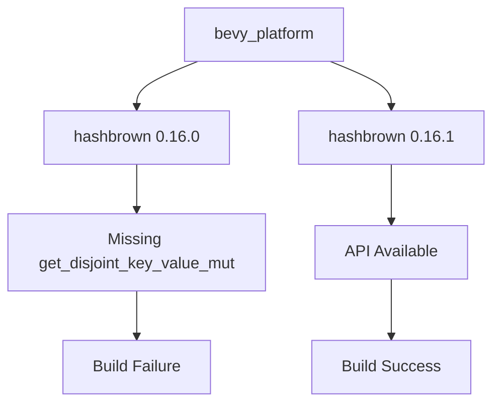

+++
title = "#21963 Update hashbrown to 0.16.1"
date = "2025-11-28T00:00:00"
draft = false
template = "pull_request_page.html"
in_search_index = false

[extra]
current_language = "zh-cn"
available_languages = {"en" = { name = "English", url = "/pull_request/bevy/2025-11/pr-21963-en-20251128" }, "zh-cn" = { name = "中文", url = "/pull_request/bevy/2025-11/pr-21963-zh-cn-20251128" }}
labels = ["D-Trivial", "C-Dependencies"]
+++

# Update hashbrown to 0.16.1

## Basic Information
- **Title**: Update hashbrown to 0.16.1
- **PR Link**: https://github.com/bevyengine/bevy/pull/21963
- **Author**: Breakdown-Dog
- **Status**: MERGED
- **Labels**: D-Trivial, C-Dependencies
- **Created**: 2025-11-28T01:18:13Z
- **Merged**: 2025-11-28T08:02:30Z
- **Merged By**: mockersf

## Description Translation
目标

- `hashbrown` 0.16.0 不提供 `get_disjoint_key_value_mut()` 方法，该方法在 `crates\bevy_platform\src\collections\hash_map.rs` 中被使用。我们必须更新到 hashbrown 0.16.1，该版本包含此方法。

测试

- CI

---

## The Story of This Pull Request

这是一个关于依赖管理问题的简单但重要的修复。问题的根源在于 Bevy 引擎的一个核心依赖库 hashbrown 的版本不匹配。

**问题发现**

在开发过程中，开发者发现构建失败，原因是 `crates/bevy_platform/src/collections/hash_map.rs` 文件中使用了 `get_disjoint_key_value_mut()` 方法，但当前依赖的 hashbrown 0.16.0 版本中并不包含这个方法。这是一个典型的 API 不匹配问题 - 代码依赖了某个版本中存在的 API，但实际安装的依赖版本中这个 API 不存在。

**技术背景**

`get_disjoint_key_value_mut()` 是 hashbrown 库中的一个重要方法，它允许安全地同时获取 HashMap 中两个不同键对应的可变引用。这在并发操作和性能优化场景中非常有用，因为它避免了不必要的克隆或额外的查找操作。

**解决方案**

解决方案直接明了：将 hashbrown 的版本从 0.16.0 更新到 0.16.1。这个微版本更新包含了缺失的 API 方法，同时保持了向后兼容性。根据语义化版本控制规范，0.16.1 版本应该只包含错误修复和新功能添加，不会引入破坏性变更。

**实现细节**

这个 PR 只涉及一个文件的修改，即 `crates/bevy_platform/Cargo.toml`。修改将 hashbrown 的版本号从 "0.16.0" 更新为 "0.16.1"。值得注意的是，这个更新保持了所有现有的功能标志不变：

- `equivalent` 功能：提供键等价性比较
- `raw-entry` 功能：提供原始条目 API 访问

**工程考虑**

虽然这个变更看起来很简单，但它体现了依赖管理中的几个重要原则：

1. **精确依赖版本控制**：确保代码使用的 API 与依赖库版本匹配
2. **最小化变更**：只更新必要的版本号，不修改其他配置
3. **保持功能一致性**：维持所有现有的功能标志不变

**验证策略**

由于这是一个依赖版本更新，主要的验证方式是通过 CI（持续集成）测试。如果所有现有测试都能通过，说明新版本保持了向后兼容性，没有引入破坏性变更。

## Visual Representation



## Key Files Changed

### `crates/bevy_platform/Cargo.toml`

这个文件包含了 Bevy 平台层的依赖配置。修改将 hashbrown 依赖从 0.16.0 版本更新到 0.16.1 版本。

```toml
# File: crates/bevy_platform/Cargo.toml
# Before:
hashbrown = { version = "0.16.0", features = [
  "equivalent",
  "raw-entry",
], optional = true, default-features = false }

# After:
hashbrown = { version = "0.16.1", features = [
  "equivalent",
  "raw-entry",
], optional = true, default-features = false }
```

这个变更确保了 `get_disjoint_key_value_mut()` 方法在 `crates/bevy_platform/src/collections/hash_map.rs` 中的使用能够正常编译。

## Further Reading

- [hashbrown crate documentation](https://docs.rs/hashbrown/) - hashbrown 库的官方文档
- [Semantic Versioning](https://semver.org/) - 语义化版本控制规范
- [Cargo.toml format](https://doc.rust-lang.org/cargo/reference/manifest.html) - Cargo 清单文件格式说明
- [Rust dependency management](https://doc.rust-lang.org/cargo/guide/dependencies.html) - Rust 依赖管理指南

# Full Code Diff

```diff
diff --git a/crates/bevy_platform/Cargo.toml b/crates/bevy_platform/Cargo.toml
index 2196c8d6adad4..c428a6bf7b79d 100644
--- a/crates/bevy_platform/Cargo.toml
+++ b/crates/bevy_platform/Cargo.toml
@@ -67,7 +67,7 @@ spin = { version = "0.10.0", default-features = false, features = [
   "barrier",
 ] }
 foldhash = { version = "0.2.0", default-features = false }
-hashbrown = { version = "0.16.0", features = [
+hashbrown = { version = "0.16.1", features = [
   "equivalent",
   "raw-entry",
 ], optional = true, default-features = false }
```